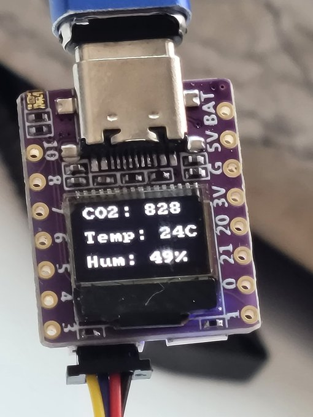

.. _esp32c3_042_oled:

01space ESP32C3 0.42 OLED
#########################

Overview
********

01space ESP32C3 0.42 OLED is a mini development board based on the
`Espressif ESP32-C3`_ RISC-V WiFi/Bluetooth dual-mode chip.

For more details see the `01space ESP32C3 0.42 OLED`_ Github repo.



   01space ESP32C3 0.42 OLED

Hardware
********

This board is based on the ESP32-C3-FH4 with WiFi and BLE support.
It features:

* RISC-V SoC @ 160MHz with 4MB flash and 400kB RAM
* WS2812B RGB serial LED
* 0.42-inch OLED over I2C
* Qwiic I2C connector
* One pushbutton
* Onboard ceramic chip antenna
* On-chip USB-UART converter

.. note::

   The RGB led is not supported on this Zephyr board yet.

.. note::

   Note that the ESP32-C3 does not have native USB, it has a USB-serial
   converter on-die instead.

Supported Features
==================

The 01space ESP32C3 0.42 OLED board configuration supports the following hardware features:

+-----------+------------+------------------+
| Interface | Controller | Driver/Component |
+===========+============+==================+
| PMP       | on-chip    | arch/riscv       |
+-----------+------------+------------------+
| INTMTRX   | on-chip    | intc_esp32c3     |
+-----------+------------+------------------+
| PINMUX    | on-chip    | pinctrl_esp32    |
+-----------+------------+------------------+
| USB UART  | on-chip    | serial_esp32_usb |
+-----------+------------+------------------+
| GPIO      | on-chip    | gpio_esp32       |
+-----------+------------+------------------+
| UART      | on-chip    | uart_esp32       |
+-----------+------------+------------------+
| I2C       | on-chip    | i2c_esp32        |
+-----------+------------+------------------+
| SPI       | on-chip    | spi_esp32_spim   |
+-----------+------------+------------------+
| RADIO     | on-chip    | Bluetooth        |
+-----------+------------+------------------+
| DISPLAY   | off-chip   | display          |
+-----------+------------+------------------+

Pinout
======

See the following image:


   01space ESP32C3 0.42 OLED Pinout

It also features a 0.42 inch OLED display, driven by a SSD1306-compatible chip.
It is connected over I2C: SDA on GPIO5, SCL on GPIO6.

Prerequisites
=============

Espressif HAL requires WiFi and Bluetooth binary blobs in order work. Run the command
below to retrieve those files.

.. code-block:: console

   west blobs fetch hal_espressif

.. note::

   It is recommended running the command above after :file:`west update`.

Building & Flashing
*******************

Simple boot
===========

The board could be loaded using the single binary image, without 2nd stage bootloader.
It is the default option when building the application without additional configuration.

.. note::

   Simple boot does not provide any security features nor OTA updates.

MCUboot bootloader
==================

User may choose to use MCUboot bootloader instead. In that case the bootloader
must be build (and flash) at least once.

There are two options to be used when building an application:

1. Sysbuild
2. Manual build

.. note::

   User can select the MCUboot bootloader by adding the following line
   to the board default configuration file.
   ```
   CONFIG_BOOTLOADER_MCUBOOT=y
   ```

Sysbuild
========

The sysbuild makes possible to build and flash all necessary images needed to
bootstrap the board with the ESP32 SoC.

To build the sample application using sysbuild use the command:

.. zephyr-app-commands::
   :tool: west
   :app: samples/hello_world
   :board: esp32c3_042_oled
   :goals: build
   :west-args: --sysbuild
   :compact:

By default, the ESP32 sysbuild creates bootloader (MCUboot) and application
images. But it can be configured to create other kind of images.

Build directory structure created by Sysbuild is different from traditional
Zephyr build. Output is structured by the domain subdirectories:

.. code-block::

  build/
  ├── hello_world
  │   └── zephyr
  │       ├── zephyr.elf
  │       └── zephyr.bin
  ├── mcuboot
  │    └── zephyr
  │       ├── zephyr.elf
  │       └── zephyr.bin
  └── domains.yaml

.. note::

   With ``--sysbuild`` option the bootloader will be re-build and re-flash
   every time the pristine build is used.

For more information about the system build please read the :ref:`sysbuild` documentation.

Manual build
============

During the development cycle, it is intended to build & flash as quickly possible.
For that reason, images can be build one at a time using traditional build.

The instructions following are relevant for both manual build and sysbuild.
The only difference is the structure of the build directory.

.. note::

   Remember that bootloader (MCUboot) needs to be flashed at least once.

For the :code:`Hello, world!` application, follow the instructions below. Assuming the board is connected to `/dev/ttyACM0` on Linux.

.. zephyr-app-commands::
   :zephyr-app: samples/hello_world
   :board: esp32c3_042_oled
   :goals: build flash
   :flash-args: -b /dev/ttyACM0

Since the Zephyr console is by default on the `usb_serial` device, we use
the espressif monitor to view.

.. code-block:: console

   $ west espressif monitor -p /dev/ttyACM0

After the board has automatically reset and booted, you should see the following
message in the monitor:

.. code-block:: console

   ***** Booting Zephyr OS vx.x.x-xxx-gxxxxxxxxxxxx *****
   Hello World! esp32c3_042_oled

Debugging
*********

As with much custom hardware, the ESP32 modules require patches to
OpenOCD that are not upstreamed yet. Espressif maintains their own fork of
the project. The custom OpenOCD can be obtained at `OpenOCD ESP32`_

The Zephyr SDK uses a bundled version of OpenOCD by default. You can overwrite that behavior by adding the
``-DOPENOCD=<path/to/bin/openocd> -DOPENOCD_DEFAULT_PATH=<path/to/openocd/share/openocd/scripts>``
parameter when building.

Here is an example for building the :ref:`hello_world` application.

.. zephyr-app-commands::
   :zephyr-app: samples/hello_world
   :board: esp32c3_042_oled
   :goals: build flash
   :gen-args: -DOPENOCD=<path/to/bin/openocd> -DOPENOCD_DEFAULT_PATH=<path/to/openocd/share/openocd/scripts>

You can debug an application in the usual way. Here is an example for the :ref:`hello_world` application.

.. zephyr-app-commands::
   :zephyr-app: samples/hello_world
   :board: esp32c3_042_oled
   :goals: debug

References
**********

.. target-notes::

.. _`Espressif ESP32-C3`: https://www.espressif.com/en/products/socs/esp32-c3
.. _`01space ESP32C3 0.42 OLED`: https://github.com/01Space/ESP32-C3-0.42LCD
.. _`OpenOCD ESP32`: https://github.com/espressif/openocd-esp32/releases
