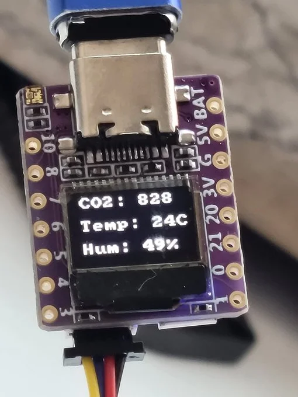
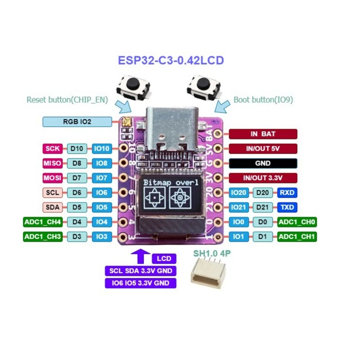

.. _01space_esp32c3_042_oled:

ESP32C3 0.42 OLED
#################

Overview
********

ESP32C3 0.42 OLED is a mini development board based on the `Espressif ESP32-C3`_
RISC-V WiFi/Bluetooth dual-mode chip.

For more details see the `01space ESP32C3 0.42 OLED`_ Github repo.

   01space ESP32C3 0.42 OLED

Hardware
********

This board is based on the ESP32-C3-FH4 with WiFi and BLE support.
It features:

* RISC-V SoC @ 160MHz with 4MB flash and 400kB RAM
* WS2812B RGB serial LED
* 0.42-inch OLED over I2C
* Qwiic I2C connector
* One pushbutton
* Onboard ceramic chip antenna
* On-chip USB-UART converter

.. note::

   The RGB led is not supported on this Zephyr board yet.

.. note::

   The ESP32-C3 does not have native USB, it has an on-chip USB-serial converter
   instead.

Supported Features
==================

The 01space ESP32C3 0.42 OLED board configuration supports the following hardware features:

+-----------+------------+------------------+
| Interface | Controller | Driver/Component |
+===========+============+==================+
| PMP       | on-chip    | arch/riscv       |
+-----------+------------+------------------+
| INTMTRX   | on-chip    | intc_esp32c3     |
+-----------+------------+------------------+
| PINMUX    | on-chip    | pinctrl_esp32    |
+-----------+------------+------------------+
| USB UART  | on-chip    | serial_esp32_usb |
+-----------+------------+------------------+
| GPIO      | on-chip    | gpio_esp32       |
+-----------+------------+------------------+
| UART      | on-chip    | uart_esp32       |
+-----------+------------+------------------+
| I2C       | on-chip    | i2c_esp32        |
+-----------+------------+------------------+
| SPI       | on-chip    | spi_esp32_spim   |
+-----------+------------+------------------+
| RADIO     | on-chip    | Bluetooth        |
+-----------+------------+------------------+
| DISPLAY   | off-chip   | display          |
+-----------+------------+------------------+

Connections and IOs
===================

See the following image:

   01space ESP32C3 0.42 OLED Pinout

It also features a 0.42 inch OLED display, driven by a SSD1306-compatible chip.
It is connected over I2C: SDA on GPIO5, SCL on GPIO6.

Prerequisites
=============

Espressif HAL requires WiFi and Bluetooth binary blobs. Run the command below to
retrieve those files.

.. code-block:: console

   west blobs fetch hal_espressif

.. note::

   It is recommended running the command above after :file:`west update`.

Programming and Debugging
*************************

Standalone application
======================

The board can be loaded using a single binary image, without 2nd stage bootloader.
It is the default option when building the application without additional configuration.

.. note::

   This mode does not provide any security features nor OTA updates.

Use the following command to build a sample hello_world application:

.. zephyr-app-commands::
   :zephyr-app: samples/hello_world
   :board: esp32c3_042_oled
   :goals: build

Sysbuild
========

:ref:`sysbuild` makes it possible to build and flash all necessary images needed to
bootstrap the board.

By default, the ESP32 sysbuild configuration creates bootloader (MCUboot) and
application images.

To build the sample application using sysbuild, use this command:

.. zephyr-app-commands::
   :tool: west
   :zephyr-app: samples/hello_world
   :board: esp32c3_042_oled
   :goals: build
   :west-args: --sysbuild
   :compact:

Flashing
========

For the :code:`Hello, world!` application, follow the instructions below.
Assuming the board is connected to ``/dev/ttyACM0`` on Linux.

.. zephyr-app-commands::
   :zephyr-app: samples/hello_world
   :board: esp32c3_042_oled
   :goals: flash
   :flash-args: --esp-device /dev/ttyACM0

Since the Zephyr console is by default on the ``usb_serial`` device, we use
the espressif monitor utility to connect to the console.

.. code-block:: console

   $ west espressif monitor -p /dev/ttyACM0

After the board has automatically reset and booted, you should see the following
message in the monitor:

.. code-block:: console

   ***** Booting Zephyr OS vx.x.x-xxx-gxxxxxxxxxxxx *****
   Hello World! esp32c3_042_oled

References
**********

.. target-notes::

.. _`Espressif ESP32-C3`: https://www.espressif.com/en/products/socs/esp32-c3
.. _`01space ESP32C3 0.42 OLED`: https://github.com/01Space/ESP32-C3-0.42LCD
