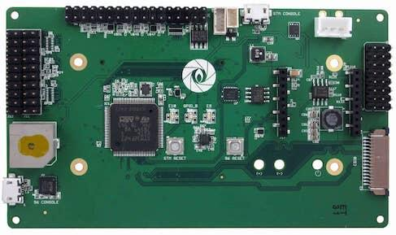

.. _96b_aerocore2_board:

96Boards Aerocore2
##################

Overview
********

The 96Boards Aerocore2 Mezzanine is based on the STMicroelectronics
STM32F427VIT6 Cortex-M4 CPU primarily designed for use in drones.
This board acts as a mezzanine platform for all 96Boards CE compliant
boards. It can also be used as a standalone board.

     96Boards Aerocore2

Hardware
********

96Boards Aerocore2 provides the following hardware components:

- STM32F427VIT6 in LQFP100 package
- ARM |reg| 32-bit Cortex |reg|-M4 CPU with FPU
- 168 MHz max CPU frequency
- VDD from 1.7 V to 3.6 V
- 2048 KB Flash
- 256 KB SRAM
- GPIO with external interrupt capability
- 12-bit ADC with 16 channels
- RTC
- Advanced-control Timers (2)
- General Purpose Timers (10)
- Watchdog Timers (2)
- USART/UART (4)
- I2C (3)
- SPI (3)
- SDIO
- USB 2.0 OTG FS
- DMA Controller

More information about STM32F427VIT6 can be found here:
       - `STM32F427 on www.st.com`_

Supported Features
==================

The Zephyr 96b_aerocore2 board configuration supports the following hardware
features:

+------------+------------+-------------------------------------+
| Interface  | Controller | Driver/Component                    |
+============+============+=====================================+
| NVIC       | on-chip    | nested vector interrupt controller  |
+------------+------------+-------------------------------------+
| SYSTICK    | on-chip    | system clock                        |
+------------+------------+-------------------------------------+
| UART       | on-chip    | serial port                         |
+------------+------------+-------------------------------------+
| GPIO       | on-chip    | gpio                                |
+------------+------------+-------------------------------------+
| PINMUX     | on-chip    | pinmux                              |
+------------+------------+-------------------------------------+
| FLASH      | on-chip    | flash                               |
+------------+------------+-------------------------------------+
| SPI        | on-chip    | spi                                 |
+------------+------------+-------------------------------------+
| I2C        | on-chip    | i2c                                 |
+------------+------------+-------------------------------------+
| PWM        | on-chip    | timers / pwm                        |
+------------+------------+-------------------------------------+
| USB OTG FS | on-chip    | USB device                          |
+------------+------------+-------------------------------------+
| ADC        | on-chip    | adc                                 |
+------------+------------+-------------------------------------+

More details about the board can be found at `96Boards website`_.

The default configuration can be found in
:zephyr_file:`boards/96boards/aerocore2/96b_aerocore2_defconfig`

Connections and IOs
===================

LED
---

- LED1 / User1 LED = PE10
- LED2 / User2 LED = PE9

External Connectors
-------------------

Octal PWM Header (J1)

+-------+-------------+-------------------------+-------+-------------+-------+-------------+
| PIN # | Signal Name | STM32F427 Functions Pin | PIN # | Signal Name | Pin # | Signal Name |
+=======+=============+=========================+=======+=============+=======+=============+
| 1     | PWM4_CH1    | PD12                    | 2     | 5.0v        | 3     | GND         |
+-------+-------------+-------------------------+-------+-------------+-------+-------------+
| 4     | PWM4_CH2    | PD13                    | 5     | 5.0v        | 6     | GND         |
+-------+-------------+-------------------------+-------+-------------+-------+-------------+
| 7     | PWM4_CH3    | PD14                    | 8     | 5.0v        | 9     | GND         |
+-------+-------------+-------------------------+-------+-------------+-------+-------------+
| 10    | PWM4_CH4    | PD15                    | 11    | 5.0v        | 12    | GND         |
+-------+-------------+-------------------------+-------+-------------+-------+-------------+
| 13    | PWM5_CH1    | PA0                     | 14    | 5.0v        | 15    | GND         |
+-------+-------------+-------------------------+-------+-------------+-------+-------------+
| 16    | PWM5_CH2    | PA1                     | 17    | 5.0v        | 18    | GND         |
+-------+-------------+-------------------------+-------+-------------+-------+-------------+
| 19    | PWM5_CH3    | PA2                     | 20    | 5.0v        | 21    | GND         |
+-------+-------------+-------------------------+-------+-------------+-------+-------------+
| 22    | PWM5_CH4    | PA3                     | 23    | 5.0v        | 24    | GND         |
+-------+-------------+-------------------------+-------+-------------+-------+-------------+

IO Header J11

+-------+-------------+-------+-------------+
| PIN # | Signal Name | PIN # | Signal Name |
+=======+=============+=======+=============+
| 1     | PB9         | 2     | PB8*        |
+-------+-------------+-------+-------------+
| 3     | PC9         | 4     | PB0         |
+-------+-------------+-------+-------------+
| 5     | PE5         | 6     | NA          |
+-------+-------------+-------+-------------+
| 7     | PE6         | 8     | NA          |
+-------+-------------+-------+-------------+
| 9     | PC6         | 10    | NA          |
+-------+-------------+-------+-------------+
| 11    | PC7         | 12    | NA          |
+-------+-------------+-------+-------------+
| 13    | PC8         | 14    | NA          |
+-------+-------------+-------+-------------+
| 15    | PA8         | 16    | GND         |
+-------+-------------+-------+-------------+
| 17    | PA9         | 18    | 3v3         |
+-------+-------------+-------+-------------+
| 19    | PA10        | 20    | GND         |
+-------+-------------+-------+-------------+

* PB8 is connected to a watchdog buzzer, It needs to be pulsed every 10 seconds to keep the buzzer silent.

IO Header J5

+-------+-------------+-------------------------+-------+-------------+-------------------------+
| PIN # | Signal Name | STM32F427 Functions Pin | PIN # | Signal Name | STM32F427 Functions Pin |
+=======+=============+=========================+=======+=============+=========================+
| 1     | AGND        | AGND                    | 2     | ADC1_13     | PC3                     |
+-------+-------------+-------------------------+-------+-------------+-------------------------+
| 3     | ADC1_12     | PC2                     | 4     | ADC1_11     | PC1                     |
+-------+-------------+-------------------------+-------+-------------+-------------------------+
| 5     | I2C_SDA     | PB11                    | 6     | GND         | GND                     |
+-------+-------------+-------------------------+-------+-------------+-------------------------+
| 7     | I2C_SCL     | PB10                    | 8     | VCC 3v3     | VCC 3v3                 |
+-------+-------------+-------------------------+-------+-------------+-------------------------+
| 9     | NC          | NC                      | 10    | NC          | NC                      |
+-------+-------------+-------------------------+-------+-------------+-------------------------+
| 11    | NC          | NC                      | 12    | NC          | NC                      |
+-------+-------------+-------------------------+-------+-------------+-------------------------+
| 13    | UART_TX 7   | PE8                     | 14    | GND         | GND                     |
+-------+-------------+-------------------------+-------+-------------+-------------------------+
| 15    | UART_RX 7   | PE7                     | 16    | GND         | GND                     |
+-------+-------------+-------------------------+-------+-------------+-------------------------+
| 17    | UART_TX 2   | PD5                     | 18    | GND         | GND                     |
+-------+-------------+-------------------------+-------+-------------+-------------------------+
| 19    | UART_TX 2   | PD6                     | 20    | GND         | GND                     |
+-------+-------------+-------------------------+-------+-------------+-------------------------+
| 21    | NC          | NC                      | 10    | NC          | NC                      |
+-------+-------------+-------------------------+-------+-------------+-------------------------+
| 23    | NC          | NC                      | 10    | NC          | NC                      |
+-------+-------------+-------------------------+-------+-------------+-------------------------+
| 25    | SPI1_NIRQ   | PC5                     | 26    | GND         | GND                     |
+-------+-------------+-------------------------+-------+-------------+-------------------------+
| 27    | SPI1_CLK    | PA5                     | 28    | SPI1_MISO   | PA6                     |
+-------+-------------+-------------------------+-------+-------------+-------------------------+
| 29    | SPI1_CS0    | PA4                     | 30    | SPI1_MOSI   | PA7                     |
+-------+-------------+-------------------------+-------+-------------+-------------------------+
| 31    | CAN_TX      | PD1                     | 32    | CANH        | NC                      |
+-------+-------------+-------------------------+-------+-------------+-------------------------+
| 33    | CAN_RX      | PD0                     | 34    | CANL        | NC                      |
+-------+-------------+-------------------------+-------+-------------+-------------------------+

GPS connector J15

+-------+-------------+-------------------------+
| PIN # | Signal Name | STM32F427 Functions Pin |
+=======+=============+=========================+
| 1     | V_OUT 5v    | NC                      |
+-------+-------------+-------------------------+
| 2     | UART1_TX    | PB6                     |
+-------+-------------+-------------------------+
| 3     | UART1_RX    | PB7                     |
+-------+-------------+-------------------------+
| 4     | VCC 3v3     | NC                      |
+-------+-------------+-------------------------+
| 5     | GND         | GND                     |
+-------+-------------+-------------------------+

Spektrum connector J3

+-------+-------------+-------------------------+
| PIN # | Signal Name | STM32F427 Functions Pin |
+=======+=============+=========================+
| 1     | VCC 3v3     | NC                      |
+-------+-------------+-------------------------+
| 2     | GND         | GND                     |
+-------+-------------+-------------------------+
| 3     | UART8_RX    | PE0                     |
+-------+-------------+-------------------------+

External Clock Sources
----------------------

STM32F4 has one external oscillator. The frequency of the clock is
32.768 kHz. The internal 16MHz clock is used as the main clock.

Serial Port
-----------

96Boards Aerocore2 board has up to 4 U(S)ARTs. The Zephyr console output is
assigned to USART7. Default settings are 115200 8N1.

I2C
---

96Boards Aerocore2 board has 1 I2C port. The default I2C mapping for Zephyr is:

- I2C1_SCL : PB10
- I2C1_SDA : PB11

SPI
---

96Boards Aerocore2 board has 1 SPI port. The default SPI mapping for Zephyr is:

- SPI1_CS0  : PA4
- SPI1_SCK  : PA5
- SPI1_MISO : PA6
- SPI1_MOSI : PA7

USB
===

96Boards Aerocore2 board has a USB OTG dual-role device (DRD) controller that
supports both device and host functions through its mini "OTG" USB connector.
Only USB device functions are supported in Zephyr at the moment.

Programming and Debugging
*************************

There are 2 main entry points for flashing STM32F4X SoCs, one using the ROM
bootloader, and another by using the SWD debug port (which requires additional
hardware). Flashing using the ROM bootloader requires a special activation
pattern, which can be triggered by using the BOOT0 pin. The ROM bootloader
supports flashing via USB (DFU), UART, I2C and SPI. You can read more about
how to enable and use the ROM bootloader by checking the application
note `AN2606`_, page 109.

Flashing
========

Installing dfu-util
-------------------

It is recommended to use at least v0.8 of `dfu-util`_. The package available in
debian/ubuntu can be quite old, so you might have to build dfu-util from source.

Flashing an Application to 96Boards Aerocore2
---------------------------------------------

Connect the micro-USB cable to the USB OTG/STM_CONSOLE Aerocore2 port and to your computer.
The board should power ON. Force the board into DFU mode by keeping the BOOT0
switch pressed while pressing and releasing the RST switch.

The BOOT button is located at the back-side of the PCB.

Confirm that the board is in DFU mode:

.. code-block:: console

   $ sudo dfu-util -l
   dfu-util 0.8
   Copyright 2005-2009 Weston Schmidt, Harald Welte and OpenMoko Inc.
   Copyright 2010-2014 Tormod Volden and Stefan Schmidt
   This program is Free Software and has ABSOLUTELY NO WARRANTY
   Please report bugs to dfu-util@lists.gnumonks.org
   Found DFU: [0483:df11] ver=2200, devnum=15, cfg=1, intf=0, alt=3, name="@Device Feature/0xFFFF0000/01*004 e", serial="3574364C3034"
   Found DFU: [0483:df11] ver=2200, devnum=15, cfg=1, intf=0, alt=2, name="@OTP Memory /0x1FFF7800/01*512 e,01*016 e", serial="3574364C3034"
   Found DFU: [0483:df11] ver=2200, devnum=15, cfg=1, intf=0, alt=1, name="@Option Bytes /0x1FFFC000/01*016 e", serial="3574364C3034"
   Found DFU: [0483:df11] ver=2200, devnum=15, cfg=1, intf=0, alt=0, name="@Internal Flash /0x08000000/04*016Kg,01*064Kg,03*128Kg", serial="3574364C3034"
   Found Runtime: [05ac:8290] ver=0104, devnum=2, cfg=1, intf=5, alt=0, name="UNKNOWN", serial="UNKNOWN"

You should see following confirmation on your Linux host:

.. code-block:: console

   $ dmesg
   usb 1-2.1: new full-speed USB device number 14 using xhci_hcd
   usb 1-2.1: New USB device found, idVendor=0483, idProduct=df11
   usb 1-2.1: New USB device strings: Mfr=1, Product=2, SerialNumber=3
   usb 1-2.1: Product: STM32 BOOTLOADER
   usb 1-2.1: Manufacturer: STMicroelectronics
   usb 1-2.1: SerialNumber: 3574364C3034

Then build and flash an application. Here is an example for the
:ref:`hello_world` application.

.. zephyr-app-commands::
   :zephyr-app: samples/hello_world
   :board: 96b_aerocore2
   :goals: build flash

Connect a USB-TTL dongle to the UART_7 header port and to your computer.
Run your favorite terminal program to listen for output.

.. code-block:: console

   $ minicom -D <tty_device> -b 115200

Replace :code:`<tty_device>` with the port where the board 96Boards Aerocore2
can be found. For example, under Linux, :code:`/dev/ttyUSB0`.
The ``-b`` option sets baud rate ignoring the value from config.

Press the Reset button and you should see the following message in your
terminal:

.. code-block:: console

   Hello World! arm

.. _96Boards website:
   https://www.96boards.org/product/aerocore2/

.. _STM32F427 on www.st.com:
   https://www.st.com/en/microcontrollers-microprocessors/stm32f427vi.html

.. _dfu-util:
   http://dfu-util.sourceforge.net/build.html

.. _AN2606:
   https://www.st.com/content/ccc/resource/technical/document/application_note/b9/9b/16/3a/12/1e/40/0c/CD00167594.pdf/files/CD00167594.pdf/jcr:content/translations/en.CD00167594.pdf
