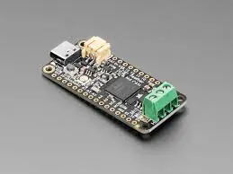

.. zephyr:board:: adafruit_feather_m4_can_express

Overview
********

The Adafruit Feather M4 CAN Express is a compact, lightweight
ARM development board based on the Microchip ATSAME51J19A. In
addition to the features of the Feather M4 Express, it adds a
built-in CAN bus controller, an on-board CAN transceiver with a
5 V boost converter (so the transceiver works even when running
from a battery), and a 3-pin 3.5 mm terminal block for the CAN
signals.

Hardware
********

- ATSAME51J19A ARM Cortex-M4F processor at 120 MHz
- 512 KiB of flash memory and 192 KiB of RAM
- 2 MiB of SPI flash
- CAN bus controller with on-board transceiver and 5 V boost converter
- A user LED
- An RGB NeoPixel LED
- Native USB port
- One reset button

Supported Features
==================

.. zephyr:board-supported-hw::

Zephyr can use the default Cortex-M SYSTICK timer or the SAM0 specific RTC.
To use the RTC, set :code:`CONFIG_CORTEX_M_SYSTICK=n` and set
:code:`CONFIG_SYS_CLOCK_TICKS_PER_SEC` to no more than 32 kHZ divided by 7,
i.e. no more than 4500.

Connections and IOs
===================

The `Adafruit Learning System`_ has detailed information about
the board including `pinouts`_ and the `schematic`_.

System Clock
============

The SAME51 MCU is configured to use the 32 kHz internal oscillator
with the on-chip PLL generating the 120 MHz system clock.

Serial Port
===========

The SAME51 MCU has 6 SERCOM based USARTs.  On the Feather, SERCOM5 is
the Zephyr console and is available on pins 0 (RX) and 1 (TX).

SPI Port
========

The SAME51 MCU has 6 SERCOM based SPIs. On the Feather, SERCOM1 can be put
into SPI mode and used to connect to devices over the SCK (SCLK), MO (MOSI),
and MI (MISO) pins.

I2C Port
========

On the Feather, SERCOM2 is configured as an I2C controller and is available
on the SDA and SCL pins, which are also routed to the STEMMA QT connector.

CAN Bus
=======

The SAME51 MCU has two CAN controllers. On the Feather, CAN1 is wired to the
on-board transceiver. The transceiver's 5 V supply (``BOOST_ENABLE``) and
standby (``CAN_STANDBY``) lines are modeled as a ``can-transceiver-gpio`` PHY,
so the transceiver is automatically powered and taken out of standby when the
CAN controller is started.  See the :zephyr:code-sample:`can-counter` sample
for an example.

USB Device Port
===============

The SAME51 MCU has a USB device port that can be used to communicate
with a host PC.  See the :ref:`usb` sample applications for
more, such as the :zephyr:code-sample:`usb-cdc-acm` sample which sets up a
virtual serial port that echos characters back to the host PC.

Programming and Debugging
*************************

.. zephyr:board-supported-runners::

The Feather ships with a BOSSA compatible UF2 bootloader.  The
bootloader can be entered by quickly tapping the reset button twice.

Additionally, if :kconfig:option:`CONFIG_USB_CDC_ACM` is enabled then the
bootloader will be entered automatically when you run :code:`west flash`.

Flashing
========

#. Build the Zephyr kernel and the :zephyr:code-sample:`hello_world` sample application:

   .. zephyr-app-commands::
      :zephyr-app: samples/hello_world
      :board: adafruit_feather_m4_can_express
      :goals: build
      :compact:

#. Connect the feather to your host computer using USB

#. Connect a 3.3 V USB to serial adapter to the board and to the
   host.  See the `Serial Port`_ section above for the board's pin
   connections.

#. Run your favorite terminal program to listen for output. Under Linux the
   terminal should be :code:`/dev/ttyUSB0`. For example:

   .. code-block:: console

      $ minicom -D /dev/ttyUSB0 -o

   The -o option tells minicom not to send the modem initialization
   string. Connection should be configured as follows:

   - Speed: 115200
   - Data: 8 bits
   - Parity: None
   - Stop bits: 1

#. Tap the reset button twice quickly to enter bootloader mode

#. Flash the image:

   .. zephyr-app-commands::
      :zephyr-app: samples/hello_world
      :board: adafruit_feather_m4_can_express
      :goals: flash
      :compact:

   You should see "Hello World! adafruit_feather_m4_can_express" in your terminal.

Debugging
=========

In addition to the built-in bootloader, the Feather can be flashed and
debugged using a SWD probe such as the Segger J-Link.

#. Connect the board to the probe by connecting the :code:`SWCLK`,
   :code:`SWDIO`, :code:`RESET`, :code:`GND`, and :code:`3V3` pins on the
   Feather to the :code:`SWCLK`, :code:`SWDIO`, :code:`RESET`, :code:`GND`,
   and :code:`VTref` pins on the `J-Link`_.

#. Flash the image:

   .. zephyr-app-commands::
      :zephyr-app: samples/hello_world
      :board: adafruit_feather_m4_can_express
      :goals: flash
      :flash-args: -r openocd
      :compact:

#. Start debugging:

   .. zephyr-app-commands::
      :zephyr-app: samples/hello_world
      :board: adafruit_feather_m4_can_express
      :goals: debug
      :compact:

References
**********

.. target-notes::

.. _Adafruit Learning System:
    https://learn.adafruit.com/adafruit-feather-m4-can-express

.. _pinouts:
    https://learn.adafruit.com/adafruit-feather-m4-can-express/pinouts

.. _schematic:
    https://learn.adafruit.com/adafruit-feather-m4-can-express/downloads

.. _J-Link:
    https://www.segger.com/products/debug-probes/j-link/technology/interface-description/
