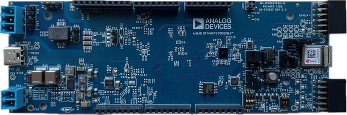

.. _ad_apard32690_sl:

AD-APARD32690-SL
################

Overview
********
The AD-APARD32690-SL is a platform for prototyping intelligent, secure, and connected field devices.
It has an Arduino Mega-compatible form factor and two Pmod-compatible connectors.
The system includes the MAX32690 ARM Cortex-M4 with FPU-Based Microcontroller and Bluetooth LE 5.2.
The MCU is coupled with external RAM (2 x 512 Mb) and Flash (64 Mb) memories to meet the requirements
of the most demanding applications. The MAXQ1065 security coprocessor enables state of the art
security features such as for root-of-trust, mutual authentication, data confidentiality and
integrity, secure boot, and secure communications.
A 10 Mbps single-pair Ethernet link using the ADIN1110 10BASE-T1L MAC/PHY, enables remote
data acquisition and system configuration. The 10BASE-T1L interface also supports Single-pair
Power over Ethernet (SPoE) and be used for powering the system via an Arduino shield implementing
the required power circuitry.

The Zephyr port is running on the MAX32690 MCU.

Hardware
********

- MAX32690 MCU:

    - Ultra-Efficient Microcontroller for Battery-Powered Applications

      - 120MHz Arm Cortex-M4 Processor with FPU
      - 7.3728MHz and 60MHz Low-Power Oscillators
      - External Crystal Support (32MHz required for BLE)
      - 32.768kHz RTC Clock (Requires External Crystal)
      - 8kHz Always-On Ultra-Low Power Oscillator
      - 3MB Internal Flash, 1MB Internal SRAM (832kB ECC ON)
      - TBDμW/MHz Executing from Cache at 1.1V
      - 1.8V and 3.3V I/O with No Level Translators
      - External Flash & SRAM Expansion Interfaces

    - Bluetooth 5.2 LE Radio

      - Dedicated, Ultra-Low-Power, 32-Bit RISC-V Coprocessor to Offload Timing-Critical Bluetooth Processing
      - Fully Open-Source Bluetooth 5.2 Stack Available
      - Supports AoA, AoD, LE Audio, and Mesh
      - High-Throughput (2Mbps) Mode
      - Long-Range (125kbps and 500kbps) Modes
      - Rx Sensitivity: -97.5dBm; Tx Power: +4.5dBm
      - Single-Ended Antenna Connection (50Ω)

    - Multiple Peripherals for System Control

      - 16-Channel DMA
      - Up To Five Quad SPI Master (60MHz)/Slave (48MHz)
      - Up To Four 1Mbaud UARTs with Flow Control
      - Up To Two 1MHz I2C Master/Slave
      - I2S Master/Slave
      - Eight External Channel, 12-bit 1MSPS SAR ADC w/ on-die temperature sensor
      - USB 2.0 Hi-Speed Device
      - 16 Pulse Train Engines
      - Up To Six 32-Bit Timers with 8mA High Drive
      - Up To Two CAN 2.0 Controllers
      - Up To Four Micro-Power Comparators
      - 1-Wire Master

    - Security and Integrity

      - ChipDNA Physically Un-clonable Function (PUF)
      - Modular Arithmetic Accelerator (MAA), True Random Number Generator (TRNG)
      - Secure Nonvolatile Key Storage, SHA-256, AES-128/192/256
      - Secure Boot ROM

- External devices connected to the APARD32690:

  - On-Board HyperRAM
  - On-Board SPI Flash
  - USB 2.0 Type-C interface to the MAX32690
  - SPI PMOD connector
  - I2C PMOD connector
  - SWD 10-Pin Header
  - On-Board Bluetooth 5.2 LE Radio antenna
  - MAXQ1065 Ultralow Power Cryptographic Controller with ChipDNA
  - ADIN1110 Robust, Industrial, Low Power 10BASE-T1L Ethernet MAC-PHY
  - U-Blox NINA-W102 802.11b/g/n module with dual-mode Bluetooth v4.2
  - On-Board 5V, 3.3V, 1.8V, and 1.1V voltage regulators
  - 2-Pin external power supply terminal block (5V - 28V DC)
  - Board Power Provided by either the USB Port or the 2-Pin connector
  - Arduino Mega compatible header.
  - Two general-purpose LEDs and one general purpose push button.

Supported Features
==================

Below interfaces are supported by Zephyr on APARD32690.

+-----------+------------+------------------------------------+
| Interface | Controller | Driver/Component                   |
+===========+============+====================================+
| NVIC      | on-chip    | nested vector interrupt controller |
+-----------+------------+------------------------------------+
| SYSTICK   | on-chip    | systick                            |
+-----------+------------+------------------------------------+
| CLOCK     | on-chip    | clock and reset control            |
+-----------+------------+------------------------------------+
| GPIO      | on-chip    | gpio                               |
+-----------+------------+------------------------------------+
| UART      | on-chip    | serial                             |
+-----------+------------+------------------------------------+
| SPI       | on-chip    | spi                                |
+-----------+------------+------------------------------------+
| ADIN1110  | spi        | ADIN1110 10BASE-T1L mac/phy        |
+-----------+------------+------------------------------------+

Connections and IOs
===================

+-----------+---------------+---------------+--------------------------------------------------------------------------------------------------+
| Name      | Name          | Settings      | Description                                                                                      |
+===========+===============+===============+==================================================================================================+
| P55       | SWD TX        |               |                                                                                                  |
|           |               | +-----------+ |  +-------------------------------------------------------------------------------+               |
|           |               | | 1-2       | |  | Connects the SWD UART TX to the (UART) RX port of the U-Blox Nina W102.       |               |
|           |               | +-----------+ |  +-------------------------------------------------------------------------------+               |
|           |               | | 2-3       | |  | Connects the SWD UART TX to the UART0 TX pin of the MAX32690.                 |               |
|           |               | +-----------+ |  +-------------------------------------------------------------------------------+               |
|           |               |               |                                                                                                  |
+-----------+---------------+---------------+--------------------------------------------------------------------------------------------------+
| P50       | SWD RX        | +-----------+ |  +-------------------------------------------------------------------------------+               |
|           |               | | 1-2       | |  | Connects the SWD UART RX to the (UART) TX port of the U-Blox Nina W102.       |               |
|           |               | +-----------+ |  +-------------------------------------------------------------------------------+               |
|           |               | | 2-3       | |  | Connects the SWD UART RX to the UART0 RX pin of the MAX32690.                 |               |
|           |               | +-----------+ |  +-------------------------------------------------------------------------------+               |
|           |               |               |                                                                                                  |
+-----------+---------------+---------------+--------------------------------------------------------------------------------------------------+
| P51       | SWD POW       | +-----------+ |  +-------------------------------------------------------------------------------+               |
|           |               | | 1-2       | |  | Connects the SWD Vcc pin to 3.3V.                                             |               |
|           |               | +-----------+ |  +-------------------------------------------------------------------------------+               |
|           |               | | 2-3       | |  | Connects the SWD Vcc pin to 1.8V.                                             |               |
|           |               | +-----------+ |  +-------------------------------------------------------------------------------+               |
|           |               |               |                                                                                                  |
+-----------+---------------+---------------+--------------------------------------------------------------------------------------------------+
| P38       | UART RX WIFI  | +-----------+ |  +-------------------------------------------------------------------------------+               |
|           |               | | 1-2       | |  | Connect the U-Blox Nina W102 UART RX to the UART2A TX pin of the MAX32690     |               |
|           |               | +-----------+ |  +-------------------------------------------------------------------------------+               |
|           |               | | Open      | |  | Disconnects the U-Blox Nina W102 UART RX from the UART2A TX pin               |               |
|           |               | +-----------+ |  +-------------------------------------------------------------------------------+               |
|           |               |               |                                                                                                  |
+-----------+---------------+---------------+--------------------------------------------------------------------------------------------------+
| P58       | UART TX WIFI  | +-----------+ |  +-------------------------------------------------------------------------------+               |
|           |               | | 1-2       | |  | Connect the U-Blox Nina W102 UART TX to the UART2A RX pin of the MAX32690.    |               |
|           |               | +-----------+ |  +-------------------------------------------------------------------------------+               |
|           |               | | Open      | |  | Disconnects the U-Blox Nina W102 UART TX from the UART2A RX pin.              |               |
|           |               | +-----------+ |  +-------------------------------------------------------------------------------+               |
|           |               |               |                                                                                                  |
+-----------+---------------+---------------+--------------------------------------------------------------------------------------------------+
| S4        | SW1           | +-----------+ |  +-------------------------------------------------------------------------------+               |
|           |               | | On        | |  | Pulls the ADIN1110's SWPD_EN pin to 3.3V through a resistor.                  |               |
|           |               | +-----------+ |  +-------------------------------------------------------------------------------+               |
|           |               | | Off       | |  | Leaves the ADIN1110's SWPD_EN pin floating.                                   |               |
|           |               | +-----------+ |  +-------------------------------------------------------------------------------+               |
|           |               |               |                                                                                                  |
+-----------+---------------+---------------+--------------------------------------------------------------------------------------------------+
| S4        | SW2           | +-----------+ |  +-------------------------------------------------------------------------------+               |
|           |               | | On        | |  | Pulls the ADIN1110's CFG0 pin to 3.3V through a resistor.                     |               |
|           |               | +-----------+ |  +-------------------------------------------------------------------------------+               |
|           |               | | Off       | |  | Leaves the ADIN1110's CFG0 pin floating.                                      |               |
|           |               | +-----------+ |  +-------------------------------------------------------------------------------+               |
|           |               |               |                                                                                                  |
+-----------+---------------+---------------+--------------------------------------------------------------------------------------------------+
| S4        | SW3           | +-----------+ |  +-------------------------------------------------------------------------------+               |
|           |               | | On        | |  | Pulls the ADIN1110's CFG1 pin to 3.3V through a resistor.                     |               |
|           |               | +-----------+ |  +-------------------------------------------------------------------------------+               |
|           |               | | Off       | |  | Leaves the ADIN1110's CFG1 pin floating.                                      |               |
|           |               | +-----------+ |  +-------------------------------------------------------------------------------+               |
|           |               |               |                                                                                                  |
+-----------+---------------+---------------+--------------------------------------------------------------------------------------------------+

Programming and Debugging
*************************

Flashing
========

The MAX32690 MCU can be flashed by connecting an external debug probe to the
SWD port. SWD debug can be accessed through the Cortex 10-pin connector, P9.
Logic levels are either 1.8V or 3.3V (based on P51 selection).

Once the debug probe is connected to your host computer, then you can simply run the
``west flash`` command to write a firmware image into flash.

.. note::

   This board uses OpenOCD as the default debug interface. You can also use
   a Segger J-Link with Segger's native tooling by overriding the runner,
   appending ``--runner jlink`` to your ``west`` command(s). The J-Link should
   be connected to the standard 2*5 pin debug connector (P9) using an
   appropriate adapter board and cable.

Debugging
=========

Please refer to the `Flashing`_ section and run the ``west debug`` command
instead of ``west flash``.

References
**********

- `AD-APARD32690-SL web page`_

.. _AD-APARD32690-SL web page:
   https://www.analog.com/en/resources/evaluation-hardware-and-software/evaluation-boards-kits/ad-apard32690-sl.html
