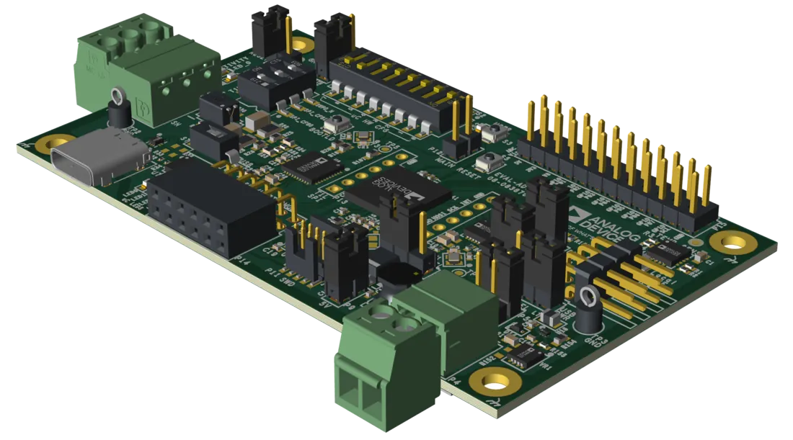

.. zephyr:board:: adi_eval_adin1140d1z

Overview
********

The EVAL-ADIN1140D1Z is an evaluation platform for the ADIN1140
10BASE-T1S MAC-PHY. It integrates an on-board Arm Cortex-M4 MAX32690
microcontroller as the host and enables evaluation of a USB to
10BASE-T1S bridge.

Hardware
********

- MAX32690 Arm Cortex-M4 host microcontroller
- ADIN1140 10BASE-T1S MAC-PHY (connected via SPI)
- ADIN1110 10BASE-T1L MAC-PHY (connected via SPI)

The ADIN1140 provides a 10BASE-T1S multidrop interface, while the ADIN1110
provides a 10BASE-T1L point-to-point interface. Both are robust, low power
Ethernet MAC-PHYs that connect to the MAX32690 host over SPI using the
Open Alliance TC6 (10BASE-T1x MAC-PHY Serial Interface) protocol. Together
they enable the board to perform 10BASE-T1S to 10BASE-T1L media conversion,
which will be supported in a future dedicated Zephyr sample.

Supported Features
==================

.. zephyr:board-supported-hw::

Connections and IOs
===================

The MAX32690 host peripherals are connected to the on-board components as
described below. Pin names use the MAX32690 ``P<port>_<pin>`` notation.

Programming and Debugging
*************************

.. zephyr:board-supported-runners::

Flashing
========

The MAX32690 MCU can be flashed by connecting an external debug probe to the
SWD port. SWD debug can be accessed through the Cortex 10-pin connector, P9.
Logic levels are either 1.8V or 3.3V (based on P3 selection).

Once the debug probe is connected to your host computer, then you can simply run the
``west flash`` command to write a firmware image into flash.

.. note::

   This board uses OpenOCD as the default debug interface. You can also use
   a Segger J-Link with Segger's native tooling by overriding the runner,
   appending ``--runner jlink`` to your ``west`` command(s). The J-Link should
   be connected to the standard 2*5 pin debug connector (P9) using an
   appropriate adapter board and cable.

Debugging
=========

Please refer to the `Flashing`_ section and run the ``west debug`` command
instead of ``west flash``.

Running the zperf Sample
************************

The :zephyr:code-sample:`zperf` network throughput sample can be used to
benchmark both Ethernet interfaces on this board: the 10BASE-T1S link
(ADIN1140) and the 10BASE-T1L link (ADIN1110).

Building and Flashing
=====================

Build and flash the sample for this board target:

.. zephyr-app-commands::
   :zephyr-app: samples/net/zperf
   :board: adi_eval_adin1140d1z/max32690/m4
   :goals: build flash
   :west-args: -p always

Network Interfaces and Addressing
=================================

The board exposes two Ethernet interfaces. Each must be placed on a
**separate IPv4 subnet**, otherwise the IPv4 stack cannot determine which
interface to route a given packet through.

+-------------------+-----------------+-------------------+------------------+
| Interface         | Media           | Board address     | Peer address     |
+===================+=================+===================+==================+
| ADIN1140 (T1S)    | 10BASE-T1S      | 192.0.2.2/24      | 192.0.2.1/24     |
+-------------------+-----------------+-------------------+------------------+
| ADIN1110 (T1L)    | 10BASE-T1L      | 192.0.3.2/24      | 192.0.3.1/24     |
+-------------------+-----------------+-------------------+------------------+

The sample configures the default interface automatically from
``CONFIG_NET_CONFIG_MY_IPV4_ADDR``. The second interface can be assigned an
address at runtime from the shell (``<index>`` is the interface number shown
by ``net iface``):

.. code-block:: console

   net ipv4 add <index> 192.0.3.2 255.255.255.0
   net iface

.. note::

   Only one zperf UDP (or TCP) server instance can run at a time. To test each
   link, bind the server to the address of the interface under test, stop it,
   then rebind to the other interface's address.

Testing the 10BASE-T1S Interface (ADIN1140)
===========================================

On the board, start the zperf UDP server bound to the ADIN1140 address:

.. code-block:: console

   zperf udp download 5001 192.0.2.2

On the host connected to the 10BASE-T1S link:

.. code-block:: console

   iperf -c 192.0.2.2 -u -p 5001 -b 10M -t 10 -l 1000

Testing the 10BASE-T1L Interface (ADIN1110)
===========================================

Stop the previous server and rebind to the ADIN1110 address:

.. code-block:: console

   zperf udp download stop
   zperf udp download 5001 192.0.3.2

On the host connected to the 10BASE-T1L link:

.. code-block:: console

   iperf -c 192.0.3.2 -u -p 5001 -b 10M -t 10 -l 1000

References
**********

- `EVAL-ADIN1140D1Z product page
  <https://www.analog.com/en/resources/evaluation-hardware-and-software/evaluation-boards-kits/eval-adin1140d1z.html>`_
- `ADIN1140 product page
  <https://www.analog.com/en/products/adin1140.html>`_
- `ADIN1110 product page
  <https://www.analog.com/en/products/adin1110.html>`_
