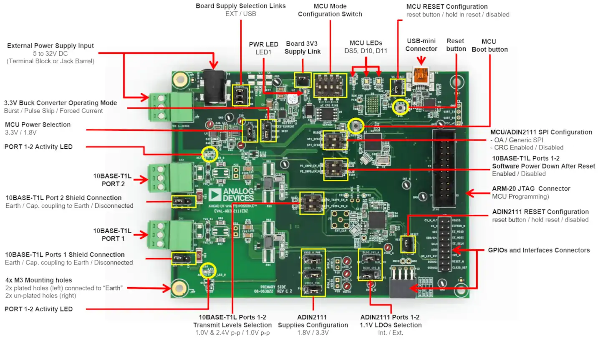

.. _adi_eval_adin2111ebz:

ADI EVAL-ADIN2111EVB Evaluation board
#####################################

Overview
********

The EVAL-ADIN2111EBZ is a flexible platform enabling quick evaluation of the ADIN2111, robust,
low power 10BASE-T1L 2-Port Ethernet switch. The evaluation board provides 2 10BASE-T1L channels
with 10Mbit per second Single Pair Ethernet (SPE) connections reaching up to 1.7km of link distance.

The ADIN2111 internal switch can be configured in store and forward mode between the two 10BASE-T1L
channels and the SPI host. Cut through mode is also available between Port 1 and Port 2 and can
be used without the need of the SPI host (unmanaged configuration).

The evaluation board offers two modes of operation for maximum flexibility: Connected to a PC
via USB port, the full set of ADIN2111 register settings and features such as link quality
monitoring and diagnostics can be accessed over the USB using the serial command interface
implemented in the evaluation firmware.

Alternatively, the board can operate in cut-through mode between Port 1 and Port 2 (unmanaged
configuration without firmware) where the EVAL-ADIN2111EBZ acts as a network switch forwarding
packets between the 2x 10BASE-T1L ports. The 2x links are configured by setting the ADIN2111
hardware configuration pins jumper and switches. The 2x On-board Activity LEDs provide Link
activity status indication for each port.

Custom firmware can also be developed and the ADIN2111 driver support package includes simple
project examples to start a custom implementation.

The SPI interface provides access to the management registers required for the switch configuration,
the 2 PHYs configuration and data exchange between SPI host and ports.

.. important::

   S1 DIP switches are shipped in Open Alliance SPI mode. The current Zephyr
   default board configuration is set to work as "Generic SPI, CRC enabled",
   so the S1 DIP switches must be set as ``SPI_CFG0 OFF and SPI_CFG1 OFF``.
   An inconsistent S1 DIP switches configuration will halt the boot.

   ADI EVAL-ADIN2111EBZ (Credit: Analog Devices, Inc.)

Hardware
********

The ADI EVAL-ADIN2111EBZ hardware features list is available here:

https://wiki.analog.com/resources/eval/user-guides/eval-adin2111ebz-user-guide

Supported Features
==================

The ADI adi_eval_adin2111ebz board configuration supports the
following hardware features:

+--------------+------------+-------------------------------------+
| Interface    | Controller | Driver/Component                    |
+==============+============+=====================================+
| NVIC         | on-chip    | nested vector interrupt controller  |
+--------------+------------+-------------------------------------+
| UART         | on-chip    | serial port-polling;                |
|              |            | serial port-interrupt               |
+--------------+------------+-------------------------------------+
| PINMUX       | on-chip    | pinmux                              |
+--------------+------------+-------------------------------------+
| GPIO         | on-chip    | gpio                                |
+--------------+------------+-------------------------------------+
| I2C          | on-chip    | i2c                                 |
+--------------+------------+-------------------------------------+
| SPI          | on-chip    | spi                                 |
+--------------+------------+-------------------------------------+
| PWM          | on-chip    | pwm                                 |
+--------------+------------+-------------------------------------+
| WATCHDOG     | on-chip    | independent watchdog                |
+--------------+------------+-------------------------------------+
| ADIN2111     | spi        | adin2111 10BASE-T1L mac/phy         |
+--------------+------------+-------------------------------------+
| FT232        | uart       | usb-uart                            |
+--------------+------------+-------------------------------------+

The default configuration can be found in the defconfig file:

	:zephyr_file:`boards/adi/eval_adin2111ebz/adi_eval_adin2111ebz_defconfig`

Connections and IOs
===================

ADI ADIN2111EBZ evaluation board has 7 GPIO controllers (from A to G).
These controllers are responsible for pin muxing, input/output, pull-up, etc.

For mode details please refer to `EVAL-ADIN2111EBZ User Guide <https://wiki.analog.com/resources/eval/user-guides/eval-adin2111ebz-user-guide>`_.

Default Zephyr Peripheral Mapping:
----------------------------------

- UART_1 TX/RX : PA9/PA10 (UART to FT232, console)
- SPI1 SCK/MISO/MOSI : PA5/PA6/PA7 (SPI to external nor flash IS25LP128)
- SPI2 SCK/MISO/MOSI : PB13/PB14/PB15 (SPI to external ADIN2111)
- LED1 : POWER (Green LED)
- UC_LED1 : PB6 (Blue LED)
- MOD LED1 : PE2 (SR LED)
- MOD LED2 : PE6 (BG LED)
- NET LED1 : PB10 (SR LED)
- NET LED2 : PB11 (BG LED)

System Clock
------------

EVAL-ADIN2111EBZ System Clock could be driven by an internal or external oscillator, as well as the
main PLL clock. By default the System clock is driven by the PLL clock at 80MHz, driven by the
16MHz high speed internal oscillator.

Serial Port
-----------

EVAL-ADIN2111EBZ has 1 U(S)ART. The Zephyr console output is assigned to UART1 that is connected
to a FT232, available through Micro USB connector. Default settings are 115200 8N1.
Same UART1 TX and RX cmos signals are available before the FT232, at P9 connector.

Programming and Debugging
*************************

Flashing
========

EVAL-ADIN2111EBZ includes an ST-LINK/V2-1 JTAG/SWD 10 or 20 pin connector. This interface is
supported by the openocd version included in Zephyr SDK.

Flashing an application to  Discovery kit
-----------------------------------------

Connect the EVAL-ADIN2111EBZ to your host computer using the USB port, then run a serial host
program to connect with your ADI board. For example:

.. code-block:: console

   $ minicom -D /dev/serial/by-id/usb-ADI_EVAL-ADIN2111EBZ_XXXXXX-12-if00-port0

where XXXXXX is the serial number of the connected device.
Then, build and flash in the usual way. Here is an example for the :ref:`hello_world` application.

.. zephyr-app-commands::
   :zephyr-app: samples/hello_world
   :board: adi_eval_adin2111ebz
   :goals: build flash

You should see the following message on the console:

.. code-block:: console

   Hello World! adi_eval_adin2111ebz

Debugging
=========

You can debug an application in the usual way.  Here is an example for the :ref:`hello_world`
application.

.. zephyr-app-commands::
   :zephyr-app: samples/hello_world
   :board: adi_eval_adin2111ebz
   :maybe-skip-config:
   :goals: debug

.. _EVAL-ADIN2111EBZ evaluation board website:
   https://www.analog.com/en/design-center/evaluation-hardware-and-software/evaluation-boards-kits/eval-adin2111.html

.. _EVAL-ADIN2111EBZ board User Guide:
   https://wiki.analog.com/resources/eval/user-guides/eval-adin2111ebz-user-guide

.. _ADIN2111 Datasheet:
   https://www.analog.com/media/en/technical-documentation/data-sheets/adin2111.pdf

.. _STM32L4S5QII3P reference manual:
   https://www.st.com/resource/en/reference_manual/rm0432-stm32l4-series-advanced-armbased-32bit-mcus-stmicroelectronics.pdf
