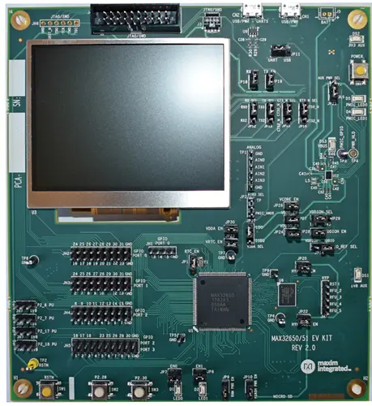

.. zephyr:board:: max32650evkit

Overview
********
The MAX32650 evaluation kit (EV kit) provides a platform for evaluating the
capabilities of the MAX32650 ultra-low power memory-scalable microcontroller
designed specifically for high performance battery powered applications.

The Zephyr port is running on the MAX32650 MCU.

Hardware
********

- MAX32650 MCU:

  - Ultra Efficient Microcontroller for Battery-Powered Applications

    - 120MHz Arm Cortex-M4 with FPU
    - SmartDMA Provides Background Memory Transfers with Programmable Data Processing
    - 120MHz High-Speed and 50MHz Low-Power Oscillators
    - 7.3728MHz Low Power Oscillators
    - 32.768kHz and RTC Clock (Requires External Crystal)
    - 8kHz, Always-on, Ultra-Low-Power Oscillator
    - 3MB Internal Flash, 1MB Internal SRAM
    - 104µW/MHz Executing from Cache at 1.1V
    - Five Low-Power Modes: Active, Sleep, Background, Deep-Sleep, and Backup
    - 1.8V and 3.3V I/O with No Level Translators
    - Programming and Debugging

  - Scalable Cached External Memory Interfaces

    - 120MB/s HyperBus/Xccela DDR Interface
    - SPIXF/SPIXR for External Flash/RAM Expansion
    - 240Mbps SDHC/eMMC/SDIO/microSD Interface

  - Optimal Peripheral Mix Provides Platform Scalability

    - 16-Channel DMA
    - Three SPI Master (60MHz)/Slave (48MHz)
    - One QuadSPI Master (60MHz)/Slave (48MHz)
    - Up to Three 4Mbaud UARTs with Flow Control
    - Two 1MHz I2C Master/Slave
    - I2S Slave
    - Four-Channel, 7.8ksps, 10-bit Delta-Sigma ADC
    - USB 2.0 Hi-Speed Device Interface with PHY
    - 16 Pulse Train Generators
    - Six 32-bit Timers with 8mA Hi-Drive
    - 1-Wire® Master

  - Trust Protection Unit (TPU) for IP/Data and Security

    - Modular Arithmetic Accelerator (MAA), True Random Number Generator (TRNG)
    - Secure Nonvolatile Key Storage, SHA-256, AES-128/192/256
    - Memory Decryption Integrity Unit, Secure Boot ROM

- External devices connected to the MAX32650EVKIT:

  - 3.5in 320 x 240 Color TFT Display
  - 64MB HyperRAM
  - 64MB XIP Flash
  - 1MB XIP RAM
  - USB 2.0 Micro B
  - Two General-Purpose LEDs and Two GeneralPurpose Pushbutton Switches

Supported Features
==================

The ``max32650evkit`` board supports the following interfaces:

+-----------+------------+-------------------------------------+
| Interface | Controller | Driver/Component                    |
+===========+============+=====================================+
| NVIC      | on-chip    | nested vector interrupt controller  |
+-----------+------------+-------------------------------------+
| SYSTICK   | on-chip    | systick                             |
+-----------+------------+-------------------------------------+
| CLOCK     | on-chip    | clock and reset control             |
+-----------+------------+-------------------------------------+
| GPIO      | on-chip    | gpio                                |
+-----------+------------+-------------------------------------+
| UART      | on-chip    | serial                              |
+-----------+------------+-------------------------------------+

Programming and Debugging
*************************

Flashing
========
The MAX32650 MCU can be flashed by connecting an external debug probe to the
SWD port. SWD debug can be accessed through the Cortex 10-pin connector, J3.
Logic levels are fixed to VDDIO (1.8V).

Once the debug probe is connected to your host computer, then you can simply run the
``west flash`` command to write a firmware image into flash.

.. note::

   This board uses OpenOCD as the default debug interface. You can also use
   a Segger J-Link with Segger's native tooling by overriding the runner,
   appending ``--runner jlink`` to your ``west`` command(s). The J-Link should
   be connected to the standard 2*5 pin debug connector (J3) using an
   appropriate adapter board and cable

Debugging
=========
Please refer to the `Flashing`_ section and run the ``west debug`` command
instead of ``west flash``.

References
**********

- `MAX32650EVKIT web page`_

.. _MAX32650EVKIT web page:
   https://www.analog.com/en/resources/evaluation-hardware-and-software/evaluation-boards-kits/max32650-evkit.html
