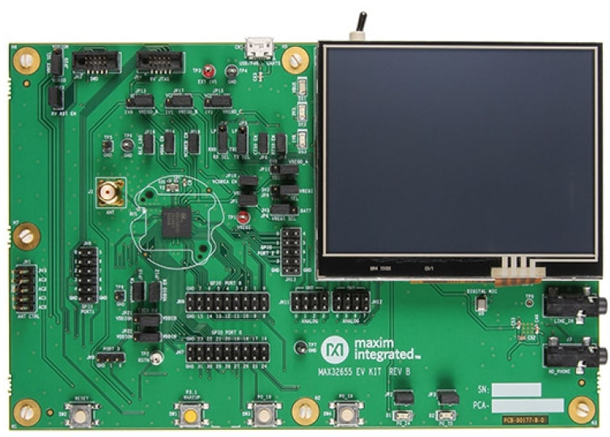
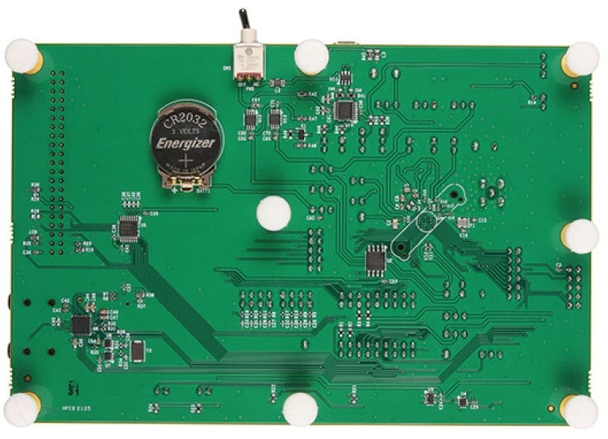

.. _max32655_evkit:

MAX32655EVKIT
#############

Overview
********
The MAX32655 evaluation kit (EV kit) provides a platform for evaluation capabilities
of the MAX32655 microcontroller, which is an advanced system-on-chip (SoC).
It features an Arm® Cortex®-M4F CPU for efficient computation of complex functions and
algorithms, integrated power management (SIMO), and the newest generation
Bluetooth® 5.0 Low Energy (Bluetooth LE), long-range radio for wearable and hearable device applications.

The Zephyr port is running on the MAX32655 MCU.

Hardware
********

- MAX32655 MCU:

  - Ultra-Low-Power Wireless Microcontroller
    - Internal 100MHz Oscillator
    - Flexible Low-Power Modes with 7.3728MHz System Clock Option
    - 512KB Flash and 128KB SRAM (Optional ECC on One 32KB SRAM Bank)
    - 16KB Instruction Cache
  - Bluetooth 5.2 LE Radio
    - Dedicated, Ultra-Low-Power, 32-Bit RISC-V Coprocessor to Offload Timing-Critical Bluetooth Processing
    - Fully Open-Source Bluetooth 5.2 Stack Available
    - Supports AoA, AoD, LE Audio, and Mesh
    - High-Throughput (2Mbps) Mode
    - Long-Range (125kbps and 500kbps) Modes
    - Rx Sensitivity: -97.5dBm; Tx Power: +4.5dBm
    - Single-Ended Antenna Connection (50Ω)
  - Power Management Maximizes Battery Life
    - 2.0V to 3.6V Supply Voltage Range
    - Integrated SIMO Power Regulator
    - Dynamic Voltage Scaling (DVS)
    - 23.8μA/MHz Active Current at 3.0V
    - 4.4μA at 3.0V Retention Current for 32KB
    - Selectable SRAM Retention + RTC in Low-Power Modes
  - Multiple Peripherals for System Control
    - Up to Two High-Speed SPI Master/Slave
    - Up to Three High-Speed I2C Master/Slave (3.4Mbps)
    - Up to Four UART, One I2S Master/Slave
    - Up to 8-Input, 10-Bit Sigma-Delta ADC 7.8ksps
    - Up to Four Micro-Power Comparators
    - Timers: Up to Two Four 32-Bit, Two LP, TwoWatchdog Timers
    - 1-Wire® Master
    - Up to Four Pulse Train (PWM) Engines
    - RTC with Wake-Up Timer
    - Up to 52 GPIOs
  - Security and Integrity​
    - Available Secure Boot
    - TRNG Seed Generator
    - AES 128/192/256 Hardware Acceleration Engine

- External devices connected to the MAX32655 EVKIT:

  - Color TFT Display
  - Audio Stereo Codec Interface
  - Digital Microphone
  - A 128Mb QSPI flash

Supported Features
==================

Below are the interfaces supported by Zephyr on MAX32655EVKIT.

+-----------+------------+-------------------------------------+
| Interface | Controller | Driver/Component                    |
+===========+============+=====================================+
| NVIC      | on-chip    | nested vector interrupt controller  |
+-----------+------------+-------------------------------------+
| SYSTICK   | on-chip    | systick                             |
+-----------+------------+-------------------------------------+
| CLOCK     | on-chip    | clock and reset control             |
+-----------+------------+-------------------------------------+
| GPIO      | on-chip    | gpio                                |
+-----------+------------+-------------------------------------+
| UART      | on-chip    | serial                              |
+-----------+------------+-------------------------------------+
| TRNG      | on-chip    | entropy                             |
+-----------+------------+-------------------------------------+
| I2C       | on-chip    | i2c                                 |
+-----------+------------+-------------------------------------+
| DMA       | on-chip    | dma controller                      |
+-----------+------------+-------------------------------------+
| Watchdog  | on-chip    | watchdog                            |
+-----------+------------+-------------------------------------+
| SPI       | on-chip    | spi                                 |
+-----------+------------+-------------------------------------+
| ADC       | on-chip    | adc                                 |
+-----------+------------+-------------------------------------+

Connections and IOs
===================

+-----------+---------------+-----------------------------------------------------------------------+
| Name      | Signal        | Usage                                                                 |
+===========+===============+=======================================================================+
| JP1       | VREGI         | Connect/Disconnect VREGIO power                                       |
+-----------+---------------+-----------------------------------------------------------------------+
| JP2       | P0_24         | Enable/Disable LED1                                                   |
+-----------+---------------+-----------------------------------------------------------------------+
| JP3       | P0_25         | Enable/Disable LED2                                                   |
+-----------+---------------+-----------------------------------------------------------------------+
| JP4       | P2_6/ P2_7    |  Connect/Disconnect the USB to serial UART to GPIO P2_6 (LPUART_RX)   |
+-----------+---------------+-----------------------------------------------------------------------+
| JP5       | P2_7/ P0_1    | Connect/Disconnect  the USB to serial UART to GPIO P2_7 (LPUART_TX)   |
+-----------+---------------+-----------------------------------------------------------------------+
| JP6       | P0_2          | Connect/Disconnect the USB to serial UART to GPIO P0_2 (UART0_CTS)    |
+-----------+---------------+-----------------------------------------------------------------------+
| JP7       | P0_3          | Connect/Disconnect he USB to serial UART to GPIO P0_3 (UART0_RTS)     |
+-----------+---------------+-----------------------------------------------------------------------+
| JP8       | VREGI         | Select VDDIO_EN power source (3V3 or coin cell)                       |
+-----------+---------------+-----------------------------------------------------------------------+
| JP9       | VDDIOH_EN     | Select VDDIOH_EN power source 3V3/VREGI                               |
+-----------+---------------+-----------------------------------------------------------------------+
| JP10      | VDDIOH        | Connect/Disconnect VDDIOH power                                       |
+-----------+---------------+-----------------------------------------------------------------------+
| JP11      | VDDIO_EN      | Select VDDIO_EN power source 1V8/VREGO_A                              |
+-----------+---------------+-----------------------------------------------------------------------+
| JP12      | VDDIO         | Connect/Disconnect VDDIO power                                        |
+-----------+---------------+-----------------------------------------------------------------------+
| JP13      | VDDA_EN       | Select VDDA_EN power source 1V8/VREGO_A                               |
+-----------+---------------+-----------------------------------------------------------------------+
| JP14      | VDDA          | Connect/Disconnect VDDA power                                         |
+-----------+---------------+-----------------------------------------------------------------------+
| JP15      | VCOREA_EN     | Select VCOREA_EN power source 1V1/VREGO_C                             |
+-----------+---------------+-----------------------------------------------------------------------+
| JP16      | VCOREA        |  Connect/Disconnect VCOREA power                                      |
+-----------+---------------+-----------------------------------------------------------------------+
| JP17      | VCOREB_EN     | Select VCOREB_EN power source 1V1/VREGO_B                             |
+-----------+---------------+-----------------------------------------------------------------------+
| JP18      | VCOREB        | Connect/Disconnect VCOREB power                                       |
+-----------+---------------+-----------------------------------------------------------------------+
| JP19      | BLE_LDO       | Connect/Disconnect BLE_LDO power                                      |
+-----------+---------------+-----------------------------------------------------------------------+
| JP20      | VREF          | Select VREF power source VDDIO/VDDIOH                                 |
+-----------+---------------+-----------------------------------------------------------------------+
| JP21      | I2C0_PU       | Select I2C0_PU power source VDDIO/VDDIOH                              |
+-----------+---------------+-----------------------------------------------------------------------+
| JP22      | I2C1_PU       | Select I2C1_PU power source VDDIO/VDDIOH                              |
+-----------+---------------+-----------------------------------------------------------------------+
| JP23      | BOARD RESET   | Connect/Disconnect RV JTAG NRESET from the BOARD RESET circuitry      |
+-----------+---------------+-----------------------------------------------------------------------+

Programming and Debugging
*************************

Flashing
========

The MAX32655 MCU can be flashed by connecting an external debug probe to the
SWD port. SWD debug can be accessed through the Cortex 10-pin connector, JH3.
Logic levels are fixed to VDDIO (1.8V).

Once the debug probe is connected to your host computer, then you can simply run the
``west flash`` command to write a firmware image into flash.

.. note::

   This board uses OpenOCD as the default debug interface. You can also use
   a Segger J-Link with Segger's native tooling by overriding the runner,
   appending ``--runner jlink`` to your ``west`` command(s). The J-Link should
   be connected to the standard 2*5 pin debug connector (JW3) using an
   appropriate adapter board and cable.

Debugging
=========

Please refer to the `Flashing`_ section and run the ``west debug`` command
instead of ``west flash``.

References
**********

- `MAX32655EVKIT web page`_

.. _MAX32655EVKIT web page:
   https://www.analog.com/en/design-center/evaluation-hardware-and-software/evaluation-boards-kits/max32655evkit.html#eb-overview
