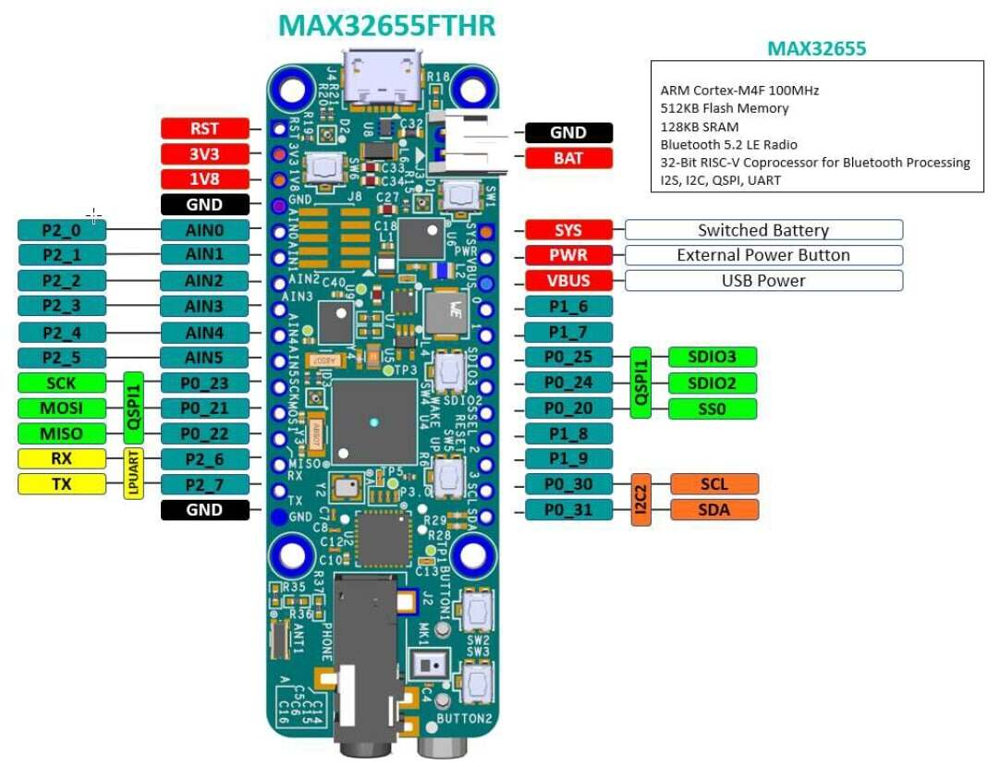
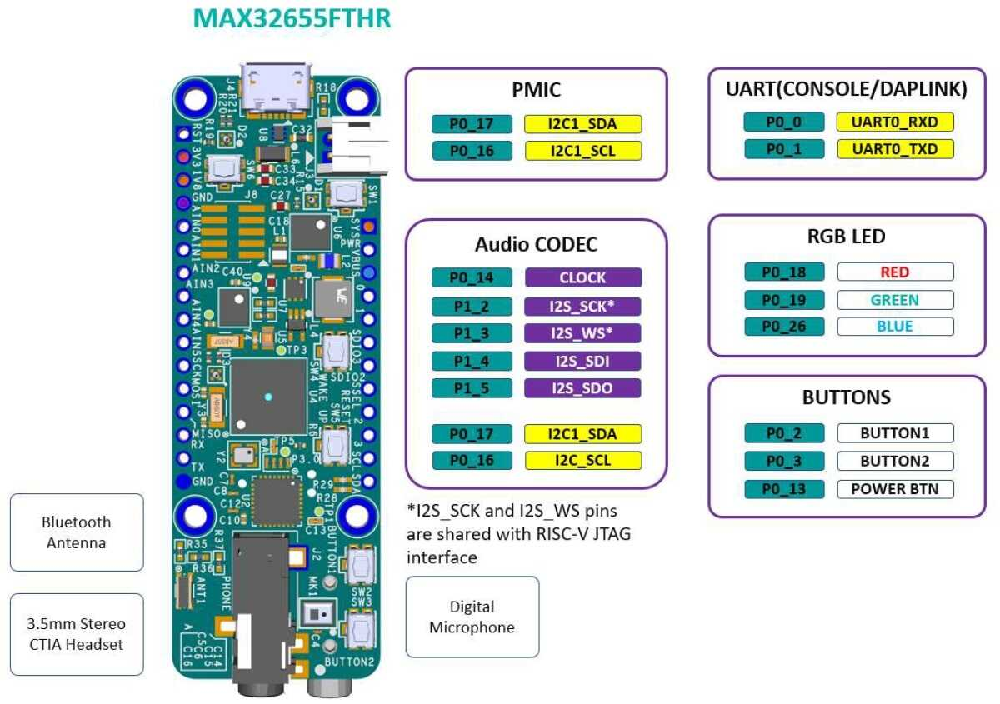
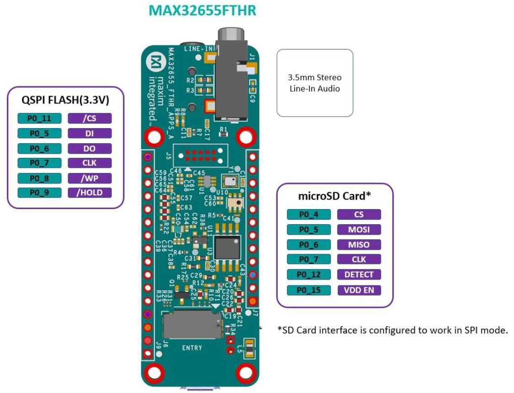

.. zephyr:board:: max32655fthr

Overview
********
The MAX32655FTHR is a rapid development platform to help engineers quickly implement
ultra low-power wireless solutions using MAX32655 Arm© Cortex®-M4F and Bluetooth® 5.2 Low Energy (LE).
The board also includes the MAX20303 PMIC for battery and power management.
The form factor is a small 0.9in x 2.6in dual-row header footprint that is compatible
with Adafruit Feather Wing peripheral expansion boards. The board includes a variety of peripherals,
such as a digital microphone, lowpower stereo audio CODEC, 128MB QSPI Flash, micro SD card connector,
RGB indicator LED, and pushbutton.
The MAX32655FTHR provides a power-optimized flexible platform for quick proof-of-concepts and
early software development to enhance time to market. Go to
https://www.analog.com/MAX32655FTHR to get started developing with this board.

The Zephyr port is running on the MAX32655 MCU.

Hardware
********

- MAX32655 MCU:

  - Ultra-Low-Power Wireless Microcontroller
    - Internal 100MHz Oscillator
    - Flexible Low-Power Modes with 7.3728MHz System Clock Option
    - 512KB Flash and 128KB SRAM (Optional ECC on One 32KB SRAM Bank)
    - 16KB Instruction Cache
  - Bluetooth 5.2 LE Radio
    - Dedicated, Ultra-Low-Power, 32-Bit RISC-V Coprocessor to Offload Timing-Critical Bluetooth Processing
    - Fully Open-Source Bluetooth 5.2 Stack Available
    - Supports AoA, AoD, LE Audio, and Mesh
    - High-Throughput (2Mbps) Mode
    - Long-Range (125kbps and 500kbps) Modes
    - Rx Sensitivity: -97.5dBm; Tx Power: +4.5dBm
    - Single-Ended Antenna Connection (50Ω)
  - Power Management Maximizes Battery Life
    - 2.0V to 3.6V Supply Voltage Range
    - Integrated SIMO Power Regulator
    - Dynamic Voltage Scaling (DVS)
    - 23.8μA/MHz Active Current at 3.0V
    - 4.4μA at 3.0V Retention Current for 32KB
    - Selectable SRAM Retention + RTC in Low-Power Modes
  - Multiple Peripherals for System Control
    - Up to Two High-Speed SPI Master/Slave
    - Up to Three High-Speed I2C Master/Slave (3.4Mbps)
    - Up to Four UART, One I2S Master/Slave
    - Up to 8-Input, 10-Bit Sigma-Delta ADC 7.8ksps
    - Up to Four Micro-Power Comparators
    - Timers: Up to Two Four 32-Bit, Two LP, TwoWatchdog Timers
    - 1-Wire® Master
    - Up to Four Pulse Train (PWM) Engines
    - RTC with Wake-Up Timer
    - Up to 52 GPIOs
  - Security and Integrity​
    - Available Secure Boot
    - TRNG Seed Generator
    - AES 128/192/256 Hardware Acceleration Engine

- External devices connected to the MAX32655FTHR:

  - Audio Stereo Codec Interface
  - Digital Microphone
  - PMIC and Battery Charger
  - A 128Mb QSPI flash
  - Micro SDCard Interface
  - RGB LEDs
  - Push Buttons

Supported Features
==================

Below are the interfaces supported by Zephyr on MAX32655FTHR.

+-----------+------------+-------------------------------------+
| Interface | Controller | Driver/Component                    |
+===========+============+=====================================+
| NVIC      | on-chip    | nested vector interrupt controller  |
+-----------+------------+-------------------------------------+
| SYSTICK   | on-chip    | systick                             |
+-----------+------------+-------------------------------------+
| CLOCK     | on-chip    | clock and reset control             |
+-----------+------------+-------------------------------------+
| GPIO      | on-chip    | gpio                                |
+-----------+------------+-------------------------------------+
| UART      | on-chip    | serial                              |
+-----------+------------+-------------------------------------+
| TRNG      | on-chip    | entropy                             |
+-----------+------------+-------------------------------------+
| I2C       | on-chip    | i2c                                 |
+-----------+------------+-------------------------------------+
| DMA       | on-chip    | dma controller                      |
+-----------+------------+-------------------------------------+
| Watchdog  | on-chip    | watchdog                            |
+-----------+------------+-------------------------------------+
| SPI       | on-chip    | spi                                 |
+-----------+------------+-------------------------------------+
| ADC       | on-chip    | adc                                 |
+-----------+------------+-------------------------------------+
| Timer     | on-chip    | counter                             |
+-----------+------------+-------------------------------------+
| PWM       | on-chip    | pwm                                 |
+-----------+------------+-------------------------------------+
| Flash     | on-chip    | flash                               |
+-----------+------------+-------------------------------------+

Push Buttons
************
There are six pushbuttons on the MAX32655FTHR board

SW1
===
PMIC Power Button, when the board is powered on state, pressing
this button for 12 seconds performs a hard powerdown.
When the board is in a powered-off state, pressing this button powers on the board.
This button can also be read by MAX32655 firmware, PMIC_PFN2 signal connected to Port 0.13
is a buffered input of the button status. When the button is pressed, this signal goes to a logic-low
state.

SW2
===
User-programmable function button connected to
MAX32655 Port 0.2 through a debouncer IC.

SW3
===
User-programmable function button connected to
MAX32655 Port 0.3 through a debouncer IC.

SW4
===
Wake-up button connected to MAX32655 Port 3.1.

SW5
===
Resets the MAX32655 through RSTN input of the MAX32655.

SW6
===
DAPLink adapter button. Keep this button
pressed while applying power to the board to
put the MAX32625 DAPLink adapter on board
to MAINTENANCE mode for DAPLink firmware
updates.

LEDs
****
There are three RGB LEDs on the MAX32655FTHR board

LED1 (D1)
=========
Connected to the MAX32655FTHR GPIO ports.
This LED can be controlled by user firmware.
Port 0.18: Red color
Port 0.19: Green color
Port 0.26: Blue color

LED2 (D2)
=========
Connected to MAX20303 PMIC LEDx outputs.
These LEDs can be controlled through I2C commands.
They also can be configured as charge
status indicators by issuing I2C commands.

LED3 (D3)
=========
DAPLink adapter MAX32625 status LED.
Controlled by the DAPLink adapter and cannot be
used as a user LED.

Programming and Debugging
*************************

Flashing
========

The MAX32625 microcontroller on the board is flashed with DAPLink firmware at the factory.
It allows debugging and flashing the MAX32655 Arm Core over USB.

Once the USB cable is connected to your host computer, then you can simply run the
``west flash`` command to write a firmware image into flash. To perform a full erase,
pass the ``--erase`` option when executing ``west flash``.

Debugging
=========

Please refer to the `Flashing`_ section and run the ``west debug`` command
instead of ``west flash``.

References
**********

- `MAX32655FTHR web page`_

.. _MAX32655FTHR web page:
   https://www.analog.com/en/design-center/evaluation-hardware-and-software/evaluation-boards-kits/max32655fthr.html
