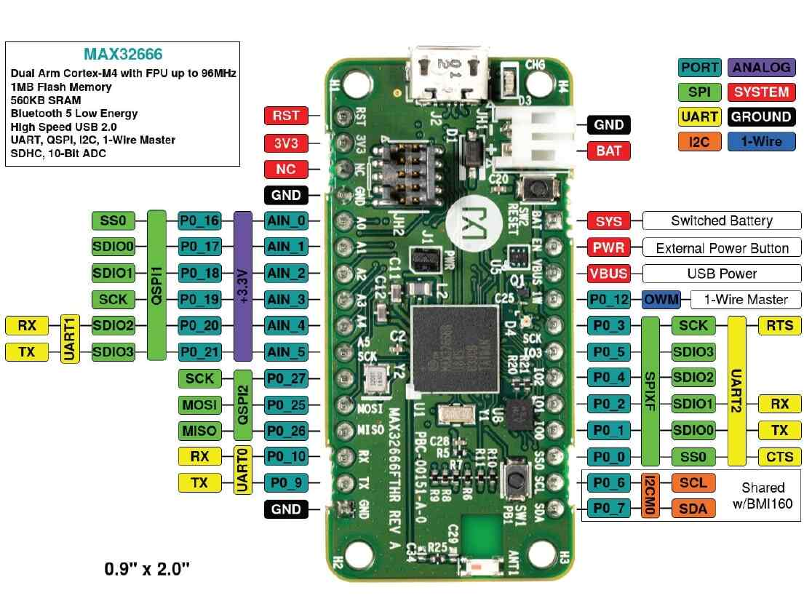
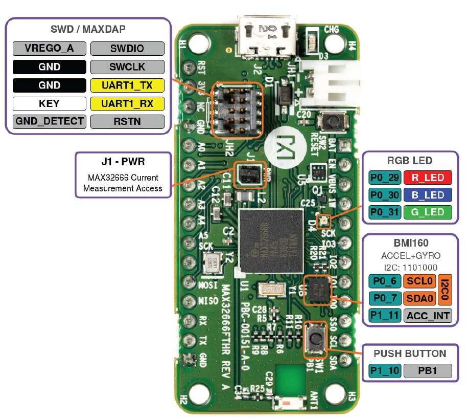

.. zephyr:board:: max32666fthr

Overview
********
The MAX32666FTHR board is a rapid development platform to help engineers quickly implement battery
optimized Bluetooth® 5 solutions with the MAX32666 Arm® Cortex®-M4 processor with FPU. The board
also includes the MAX1555 1-Cell Li+ battery charger for battery management. The form factor is
a small 0.9in by 2.0in dualrow header footprint that is compatible with breadboards and
off-the-shelf peripheral expansion boards. The board also includes a variety of peripherals,
such as a micro SD card connector, 6-axis accelerometer/gyro, RGB indicator LED, and pushbutton.
This platform provides poweroptimized flexible for quick proof-of-concepts and early software
development to enhance time to market.

The Zephyr port is running on the MAX32666 MCU.

Hardware
********

- MAX32666 MCU:

  - High-Efficiency Microcontroller and Audio DSP for Wearable and Hearable Devices

    - Arm Cortex-M4 with FPU Up to 96MHz
    - Optional Second Arm Cortex-M4 with FPU Optimized for Data Processing
    - Low-Power 7.3728MHz System Clock Option
    - 1MB Flash, Organized into Dual Banks 2 x 512KB
    - 560KB (448KB ECC) SRAM; 3 x 16KB Cache
    - Optional Error Correction Code (ECC-SEC-DED)for Cache, SRAM, and Internal Flash

  - Bluetooth 5 Low Energy Radio

    - 1Mbps and 2Mbps Data Throughput
    - Long Range (125kbps and 500kbps)
    - Advertising Extension
    - Rx Sensitivity: -95dbm; Tx Power Up to +4.5dbm
    - On-Chip Matching with Single-Ended Antenna Port

  - Power Management Maximizes Operating Time for Battery Applications

    - Integrated SIMO SMPS for Coin-Cell Operation
    - Dynamic Voltage Scaling Minimizes Active Core Power Consumption
    - 27.3μA/MHz at 3.3V Executing from Cache
    - Selectable SRAM Retention in Low Power Modes with RTC Enabled

  - Multiple Peripherals for System Control

    - Three QSPI Master/Slave with Three Chip Selects Each
    - Three 4-Wire UARTs
    - Three I2C Master/Slave
    - Up to 50 GPIO
    - QSPI (SPIXF) with Real-Time Flash Decryption
    - QSPI (SPIXR) RAM Interface Provides SRAMExpansion
    - 8-Input 10-Bit Delta-Sigma ADC 7.8ksps
    - USB 2.0 HS Engine with Internal Transceiver
    - PDM Interface Supports Two Digital Microphones
    - I2S with TDM
    - Six 32-Bit Timers
    - Two High-Speed Timers
    - 1-Wire Master
    - Sixteen Pulse Trains (PWM)
    - Secure Digital Interface Supports SD3.0/SDIO3.0/eMMC4.51

  - Secure Valuable IP/Data with Hardware Security

    - Trust Protection Unit (TPU) with MAA SupportsFast ECDSA and Modular Arithmetic
    - AES128/192/256, DES, 3DES, Hardware Accelerator
    - TRNG Seed Generator
    - SHA-2 Accelerator•Secure Bootloader

- External devices connected to the MAX32666FTHR:

  - MAX1555 1-Cell Li+ Battery Charger
  - Breadboard Compatible Headers
  - 10-Pin Cortex Debug Header
  - Micro USB Connector
  - Micro SD Card Connector
  - RGB Indicator LED and One General Purpose Push Button Switch
  - 6-Axis Accelerometer/Gyro
  - Bluetooth Surface Mount Antenna

Supported Features
==================

Below interfaces are supported by Zephyr on MAX32666FTHR.

+-----------+------------+-------------------------------------+
| Interface | Controller | Driver/Component                    |
+===========+============+=====================================+
| NVIC      | on-chip    | nested vector interrupt controller  |
+-----------+------------+-------------------------------------+
| SYSTICK   | on-chip    | systick                             |
+-----------+------------+-------------------------------------+
| CLOCK     | on-chip    | clock and reset control             |
+-----------+------------+-------------------------------------+
| GPIO      | on-chip    | gpio                                |
+-----------+------------+-------------------------------------+
| UART      | on-chip    | serial                              |
+-----------+------------+-------------------------------------+
| TRNG      | on-chip    | entropy                             |
+-----------+------------+-------------------------------------+
| Watchdog  | on-chip    | watchdog                            |
+-----------+------------+-------------------------------------+
| SPI       | on-chip    | spi                                 |
+-----------+------------+-------------------------------------+
| DMA       | on-chip    | dma controller                      |
+-----------+------------+-------------------------------------+
| I2C       | on-chip    | i2c                                 |
+-----------+------------+-------------------------------------+
| ADC       | on-chip    | adc                                 |
+-----------+------------+-------------------------------------+
| Timer     | on-chip    | counter                             |
+-----------+------------+-------------------------------------+
| PWM       | on-chip    | pwm                                 |
+-----------+------------+-------------------------------------+
| W1        | on-chip    | one wire master                     |
+-----------+------------+-------------------------------------+
| Flash     | on-chip    | flash                               |
+-----------+------------+-------------------------------------+

Connections and IOs
===================

JH3 Pinout
**********

+---------+----------+-------------------------------------------------------------------------------------------------+
| Pin     | Name     | Description                                                                                     |
+=========+==========+=================================================================================================+
| 1       | GND      | Ground                                                                                          |
+---------+----------+-------------------------------------------------------------------------------------------------+
| 2       | P0_9     | UART0 Tx                                                                                        |
+---------+----------+-------------------------------------------------------------------------------------------------+
| 3       | P0_10    | UART0 Rx                                                                                        |
+---------+----------+-------------------------------------------------------------------------------------------------+
| 4       | P0_26    | QSPI2 MISO                                                                                      |
+---------+----------+-------------------------------------------------------------------------------------------------+
| 5       | P0_25    | QSPI2 MOSI                                                                                      |
+---------+----------+-------------------------------------------------------------------------------------------------+
| 6       | P0_27    | QSPI2 SCK                                                                                       |
+---------+----------+-------------------------------------------------------------------------------------------------+
| 7       | AIN_5    | ADC Analog Input. Alternatively, AIN2N or P0_21                                                 |
+---------+----------+-------------------------------------------------------------------------------------------------+
| 8       | AIN_4    | ADC Analog Input. Alternatively, AIN2P or P0_20                                                 |
+---------+----------+-------------------------------------------------------------------------------------------------+
| 9       | AIN_3    | ADC Analog Input. Alternatively, AIN1N or P0_19                                                 |
+---------+----------+-------------------------------------------------------------------------------------------------+
| 10      | AIN_2    | ADC Analog Input. Alternatively, AIN1P or P0_18                                                 |
+---------+----------+-------------------------------------------------------------------------------------------------+
| 11      | AIN_1    | ADC Analog Input. Alternatively, AIN0N or P0_17                                                 |
+---------+----------+-------------------------------------------------------------------------------------------------+
| 12      | AIN_0    | ADC Analog Input. Alternatively, AIN0P or P0_16                                                 |
+---------+----------+-------------------------------------------------------------------------------------------------+
| 13      | GND      | Ground                                                                                          |
+---------+----------+-------------------------------------------------------------------------------------------------+
| 14      | NC       | No Connection                                                                                   |
+---------+----------+-------------------------------------------------------------------------------------------------+
| 15      | 3V3      | 3.3V Output. Typically used to provide 3.3V to peripherals connected to the expansion headers   |
+---------+----------+-------------------------------------------------------------------------------------------------+
| 16      | RSTN     | Master Reset Signal                                                                             |
+---------+----------+-------------------------------------------------------------------------------------------------+

JH4 Pinout
**********

+---------+----------+-----------------------------------------------------------------------------------------------------------+
| Pin     | Name     | Description                                                                                               |
+=========+==========+===========================================================================================================+
| 1       | SYS      | SYS switched connection to the Battery. This is the primary system power supply and                       |
|         |          | automatically switches between the battery voltage and the USB supply when available.                     |
+---------+----------+-----------------------------------------------------------------------------------------------------------+
| 2       | PWREN    | Power Enable. This is connected to the ON pin of the MAX4995 LDO. It turns off the LDO if shorted to GND. |
+---------+----------+-----------------------------------------------------------------------------------------------------------+
| 3       | VBUS     | USB VBUS Signal. This can be used as a 5V supply when connected to USB. This pin can also be used as      |
|         |          | an input to power the board, but this should only be done when not using the USB connector since there is |
|         |          | no circuitry to prevent current from flowing back into the USB connector.                                 |
+---------+----------+-----------------------------------------------------------------------------------------------------------+
| 4       | P0_12    | 1-Wire master signal                                                                                      |
+---------+----------+-----------------------------------------------------------------------------------------------------------+
| 5       | P0_3     | SPIXF SCK                                                                                                 |
+---------+----------+-----------------------------------------------------------------------------------------------------------+
| 6       | P0_5     | SPIXF SDIO3                                                                                               |
+---------+----------+-----------------------------------------------------------------------------------------------------------+
| 7       | P0_4     | SPIXF SDIO2                                                                                               |
+---------+----------+-----------------------------------------------------------------------------------------------------------+
| 8       | P0_2     | SPIXF SDIO1/MISO                                                                                          |
+---------+----------+-----------------------------------------------------------------------------------------------------------+
| 9       | P0_1     | SPIXF SDIO0/MOSI                                                                                          |
+---------+----------+-----------------------------------------------------------------------------------------------------------+
| 10      | P0_0     | SPIXF SS0                                                                                                 |
+---------+----------+-----------------------------------------------------------------------------------------------------------+
| 11      | P0_6     | I2CM0 SCL. Pulled to MAX32666 VDDIOH, connected to BMI160.                                                |
+---------+----------+-----------------------------------------------------------------------------------------------------------+
| 12      | P0_7     | I2CM0 SDA. Pulled to MAX32666 VDDIOH, connected to BMI160.                                                |
+---------+----------+-----------------------------------------------------------------------------------------------------------+

Programming and Debugging
*************************

Flashing
========

The MAX32666 MCU can be flashed by connecting an external debug probe to the SWD port.
SWD debug can be accessed through the Cortex 10-pin connector, JH2.
Logic levels are fixed to VDDIO (1.8V).

Once the debug probe is connected to your host computer, then you can simply run the
``west flash`` command to write a firmware image into flash.

.. note::

   This board uses OpenOCD as the default debug interface. You can also use
   a Segger J-Link with Segger's native tooling by overriding the runner,
   appending ``--runner jlink`` to your ``west`` command(s). The J-Link should
   be connected to the standard 2*5 pin debug connector (JH2) using an
   appropriate adapter board and cable.

Debugging
=========

Please refer to the `Flashing`_ section and run the ``west debug`` command
instead of ``west flash``.

References
**********

- `MAX32666FTHR web page`_

.. _MAX32666FTHR web page:
   https://www.analog.com/en/design-center/evaluation-hardware-and-software/evaluation-boards-kits/MAX32666FTHR.html
