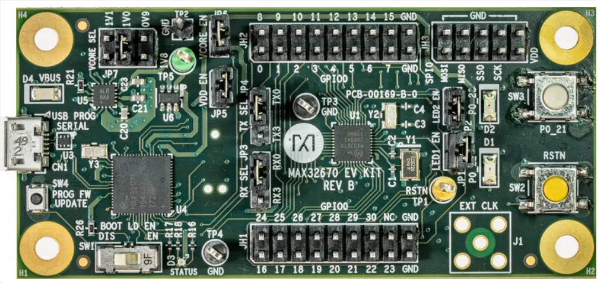

.. _max32670_evkit:

MAX32670EVKIT
#############

Overview
********
The MAX32670 evaluation kit (EV kit) provides a platform for evaluation capabilities
of the MAX32670. The MAX32670 is an ultra-low-power, cost-effective, highly reliable
32-bit microcontroller that enables designs with complex sensor processing without
compromising battery life. It combines a flexible and versatile power management unit
with the powerful Arm® Cortex®-M4 core with floating point unit (FPU).
The MAX32670 also offers legacy designs an easy and cost optimal upgradepath
from 8-bit or 16-bit microcontrollers.

The Zephyr port is running on the MAX32670 MCU.

Hardware
********

- MAX32670 MCU:

  - High-Efficiency Microcontroller for Low-Power, High-Reliability Devices

    - Arm Cortex-M4 Core with FPU up to 100MHz
    - 384KB Flash Memory with Error Correction
    - 160KB SRAM (128KB with ECC Enabled),Optionally Preserved in Lowest Power Modes
    - 16KB Unified Cache with ECC

    - UART Bootloader

        - Dual- or Single-Supply Operation
        - Ultra-Low 0.9V to 1.1V VCORE Supply Voltage
        - Internal LDO Operation from 1.7V to 3.6V SingleSupply

    - Wide Operating Temperature: -40°C to +105°C

  - Flexible Clocking Schemes

    - Internal High-Speed 100MHz Oscillator
    - Internal Low-Power 7.3728MHz and Ultra-Low-Power 80kHz Oscillators
    - 16MHz to 32MHz Oscillator (External CrystalRequired)
    - 32.768kHz Oscillator (External Crystal Required)
    - External Clock Input for the Core
    - External Clock Input for the LPUART and LPTMR

  - Power Management Maximizes Uptime for Battery Applications

    - 44μA/MHz Active at 0.9V up to 12MHz
    - 50μA/MHz Active at 1.1V up to 100MHz
    - 2.6μA Full Memory Retention Power in BACKUPMode at VDD = 1.8V
    - 350nA Ultra-Low-Power RTC at VDD = 1.8V
    - Wake from LPUART or LPTMR

  - Optimal Peripheral Mix Provides Platform Scalability

    - Up to 31 General-Purpose I/O Pins
    - Up to Three SPI Master/Slave (up to 50MHz)
    - Up to Three 4-Wire UART
    - One Low-Power UART (LPUART)
    - Up to Three I2C Master/Slave 3.4Mbps High Speed
    - 8-Channel Standard DMA Controller
    - Up to Four 32-Bit Timers (TMR)
    - Up to Two Low-Power 32-Bit Timers (LPTMR)
    - Two Windowed Watchdog Timers
    - One I2S Slave for Digital Audio Interface

  - Security and Integrity

    - Available Secure Boot
    - AES 128/192/256 Hardware Acceleration Engine
    - 32-Bit CRC Acceleration Engine

- Benefits and Features of MAX32670EVKIT:

  - USB 2.0 Micro B to Serial UART Bridge
  - UART0 and UART3 Interface is Selectable Through On-Board Jumpers
  - On-Board MAX32625PICO-Based Debugger
  - Boot Load Enable Circuitry
  - SPI and I2C Signals Accessed Through 0.1in Headers
  - GPIOs and Miscellaneous Signals Accessed Through 0.1in Headers
  - Board Power Provided by USB Port
  - On-Board SIMO Regulator and LDO for IC and Peripherals
  - Individual Power Measurement on all IC Rails Through Jumpers
  - Two General-Purpose LED and One GeneralPurpose Pushbutton Switch

Supported Features
==================

Below interfaces are supported by Zephyr on MAX32670EVKIT.

+-----------+------------+-------------------------------------+
| Interface | Controller | Driver/Component                    |
+===========+============+=====================================+
| NVIC      | on-chip    | nested vector interrupt controller  |
+-----------+------------+-------------------------------------+
| SYSTICK   | on-chip    | systick                             |
+-----------+------------+-------------------------------------+
| CLOCK     | on-chip    | clock and reset control             |
+-----------+------------+-------------------------------------+
| GPIO      | on-chip    | gpio                                |
+-----------+------------+-------------------------------------+
| UART      | on-chip    | serial                              |
+-----------+------------+-------------------------------------+

Connections and IOs
===================

+-----------+---------------+---------------+--------------------------------------------------------------------------------------------------+
| Name      | Name          | Settings      | Description                                                                                      |
+===========+===============+===============+==================================================================================================+
| JP1       | P0_22         |               |                                                                                                  |
|           |               | +-----------+ |  +-------------------------------------------------------------------------------+               |
|           |               | | Open      | |  | Disconnects red LED from P0_22.                                               |               |
|           |               | +-----------+ |  +-------------------------------------------------------------------------------+               |
|           |               | | Close     | |  | Connects red to P0_22.                                                        |               |
|           |               | +-----------+ |  +-------------------------------------------------------------------------------+               |
|           |               |               |                                                                                                  |
+-----------+---------------+---------------+--------------------------------------------------------------------------------------------------+
| JP2       | P0_23         | +-----------+ |  +-------------------------------------------------------------------------------+               |
|           |               | | Open      | |  | Disconnects green LED from P0_23.                                             |               |
|           |               | +-----------+ |  +-------------------------------------------------------------------------------+               |
|           |               | | Close     | |  | Connects green LED to P0_23.                                                  |               |
|           |               | +-----------+ |  +-------------------------------------------------------------------------------+               |
|           |               |               |                                                                                                  |
+-----------+---------------+---------------+--------------------------------------------------------------------------------------------------+
| JP3       | P0_20         | +-----------+ |  +-------------------------------------------------------------------------------+               |
|           | P0_26         | | 2-1       | |  | Connects the USB to serial port P0_8 (UART0_RX).                              |               |
|           |               | +-----------+ |  +-------------------------------------------------------------------------------+               |
|           |               | | 2-3       | |  | Connects the USB to serial port P0_26 (LPUART0_RX).                           |               |
|           |               | +-----------+ |  +-------------------------------------------------------------------------------+               |
|           |               |               |                                                                                                  |
+-----------+---------------+---------------+--------------------------------------------------------------------------------------------------+
| JP4       | P0_9          | +-----------+ |  +-------------------------------------------------------------------------------+               |
|           | P0_27         | | 2-1       | |  | Connects the USB to serial port P0_9 (UART0_TX).                              |               |
|           |               | +-----------+ |  +-------------------------------------------------------------------------------+               |
|           |               | | 2-3       | |  | Connects the USB to serial port P0_27 (LPUART0_TX).                           |               |
|           |               | +-----------+ |  +-------------------------------------------------------------------------------+               |
|           |               |               |                                                                                                  |
+-----------+---------------+---------------+--------------------------------------------------------------------------------------------------+
| JP5       | VDD           | +-----------+ |  +-------------------------------------------------------------------------------+               |
|           |               | | Open      | |  | Disconnects power to VDD.                                                     |               |
|           |               | +-----------+ |  +-------------------------------------------------------------------------------+               |
|           |               | | Close     | |  | Connects power to VDD.                                                        |               |
|           |               | +-----------+ |  +-------------------------------------------------------------------------------+               |
|           |               |               |                                                                                                  |
+-----------+---------------+---------------+--------------------------------------------------------------------------------------------------+
| JP6       | VCORE         | +-----------+ |  +-------------------------------------------------------------------------------+               |
|           |               | | Open      | |  | Disconnects power to VCORE.                                                   |               |
|           |               | +-----------+ |  +-------------------------------------------------------------------------------+               |
|           |               | | Close     | |  | Connects power to VCORE.                                                      |               |
|           |               | +-----------+ |  +-------------------------------------------------------------------------------+               |
|           |               |               |                                                                                                  |
+-----------+---------------+---------------+--------------------------------------------------------------------------------------------------+
| JP7       | SIMO RSEL2    | +-----------+ |  +-------------------------------------------------------------------------------+               |
|           |               | | 1-2       | |  | Sets output 2 of the SIMO regulator to 0.9V.                                  |               |
|           |               | +-----------+ |  +-------------------------------------------------------------------------------+               |
|           |               | | 3-4       | |  | Sets output 2 of the SIMO regulator to 1.0V.                                  |               |
|           |               | +-----------+ |  +-------------------------------------------------------------------------------+               |
|           |               | | 5-6       | |  | Sets output 2 of the SIMO regulator to 1.1V.                                  |               |
|           |               | +-----------+ |  +-------------------------------------------------------------------------------+               |
|           |               |               |                                                                                                  |
+-----------+---------------+---------------+--------------------------------------------------------------------------------------------------+

Programming and Debugging
*************************

Flashing
========

The MAX32670 EVKIT integrates a MAX32625PICO based debugger for DAPLink functionality.

Once the debug probe is connected to your host computer, then you can simply run the
``west flash`` command to write a firmware image into flash.

Debugging
=========

Please refer to the `Flashing`_ section and run the ``west debug`` command
instead of ``west flash``.

References
**********

- `MAX32670EVKIT web page`_

.. _MAX32670EVKIT web page:
   https://www.analog.com/en/design-center/evaluation-hardware-and-software/evaluation-boards-kits/max32670evkit.html
