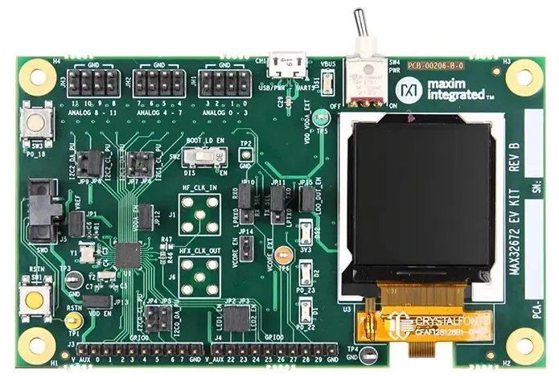

.. _max32672_evkit:

MAX32672EVKIT
#############

Overview
********
The MAX32672 evaluation kit (EV kit) provides a platform for evaluating the capabilities
of the MAX32672 microcontroller, which is a small, high-reliability, ultra-low power,
32-bit microcontroller. The MAX32672 is a secure and cost-effective solution
for motion/motor control, industrial sensors, and battery-powered medical devices and offers legacy
designs an easy, cost-optimal upgrade path from 8-bit or 16-bit microcontrollers.

The Zephyr port is running on the MAX32672 MCU.

Hardware
********

- MAX32672 MCU:

  - High-Efficiency Microcontroller for Low-Power High-Reliability Devices

    - Arm Cortex-M4 Processor with FPU up to 100MHz
    - 1MB Dual-Bank Flash with Error Correction
    - 200KB SRAM (160KB with ECC Enabled), Optionally Preserved in Lowest Power Modes
    - EEPROM Emulation on Flash
    - 16KB Unified Cache with ECC
    - Resource Protection Unit (RPU) and MemoryProtection Unit (MPU)
    - Dual- or Single-Supply Operation, 1.7V to 3.6V
    - Wide Operating Temperature: -40°C to +105°C

  - Flexible Clocking Schemes

    - Internal High-Speed 100MHz Oscillator
    - Internal Low-Power 7.3728MHz and Ultra-Low-Power 80kHz Oscillators
    - 16MHz–32MHz Oscillator, 32.768kHz Oscillator(External Crystal Required)
    - External Clock Input for CPU, LPUART, LPTMR

  - Power Management Maximizes Uptime for Battery Applications

    - 59.8μA/MHz ACTIVE at 0.9V up to 12MHz(CoreMark®)
    - 56.6μA/MHz ACTIVE at 1.1V up to 100MHz(While(1))
    - 3.09μA Full Memory Retention Power in BACKUPMode at VDD = 1.8V
    - 350nA Ultra-Low-Power RTC at
    - Wake from LPUART or LPTMR

  - Optimal Peripheral Mix Provides Platform Scalability

    - Up to 42 General-Purpose I/O Pins
    - Up to Three SPI Master/Slave (up to 50Mbps)
    - Up to Three 4-Wire UART
    - Up to Three I2C Master/Slave 3.4Mbps High Speed
    - Up to Four 32-Bit Timers (TMR)
    - Up to Two Low-Power 32-Bit Timers (LPTMR)
    - One I2S Master/Slave for Digital Audio Interface
    - 12-Channel, 12-Bit, 1Msps SAR ADC with On-DieTemperature Sensor

  - Security and Integrity

    - Optional ECDSA-Based Cryptographic SecureBootloader in ROM
    - Secure Cryptographic Accelerator for Elliptic Curve
    - AES-128/192/256 Hardware Acceleration Engine

- Benefits and Features of MAX32672EVKIT:

  - Selectable, On-Board, High-Precision Voltage Reference
  - 128 x 128 (1.45in) Color TFT Display with SPI Interface
  - Breadboard-Compatible Headers
  - USB 2.0 Micro B-to-Serial UARTs
  - UART0 and LPUART0 Interface Is Selectable through On-Board Jumpers
  - All GPIOs Signals Accessed through 0.1in Headers
  - 12 Analog Inputs Accessed through 0.1in Headers with Optional Filtering
  - 10-Pin Arm® Cortex® SWD Connector
  - Board Power Provided by USB Port
  - On-Board, 3.3V LDO Regulator
  - Test Loops Provided to Supply Optional VCORE Power Externally
  - Individual Power Measurement on All IC Rails through Jumpers
  - Two General-Purpose LEDs and One General-Purpose Pushbutton Switch

Supported Features
==================

Below interfaces are supported by Zephyr on MAX32672EVKIT.

+-----------+------------+-------------------------------------+
| Interface | Controller | Driver/Component                    |
+===========+============+=====================================+
| NVIC      | on-chip    | nested vector interrupt controller  |
+-----------+------------+-------------------------------------+
| SYSTICK   | on-chip    | systick                             |
+-----------+------------+-------------------------------------+
| CLOCK     | on-chip    | clock and reset control             |
+-----------+------------+-------------------------------------+
| GPIO      | on-chip    | gpio                                |
+-----------+------------+-------------------------------------+
| UART      | on-chip    | serial                              |
+-----------+------------+-------------------------------------+
| TRNG      | on-chip    | entropy                             |
+-----------+------------+-------------------------------------+
| I2C       | on-chip    | i2c                                 |
+-----------+------------+-------------------------------------+
| DMA       | on-chip    | dma controller                      |
+-----------+------------+-------------------------------------+
| Watchdog  | on-chip    | watchdog                            |
+-----------+------------+-------------------------------------+
| SPI       | on-chip    | spi                                 |
+-----------+------------+-------------------------------------+
| ADC       | on-chip    | adc                                 |
+-----------+------------+-------------------------------------+

Connections and IOs
===================

+-----------+---------------+---------------+--------------------------------------------------------------------------------------------------+
| Name      | Name          | Settings      | Description                                                                                      |
+===========+===============+===============+==================================================================================================+
| JP1       | VREF          |               |                                                                                                  |
|           |               | +-----------+ |  +-------------------------------------------------------------------------------+               |
|           |               | | Open      | |  | Disconnects on-board, high-precision voltage reference.                       |               |
|           |               | +-----------+ |  +-------------------------------------------------------------------------------+               |
|           |               | | Closed    | |  | Connects on-board, high-precision voltage reference.                          |               |
|           |               | +-----------+ |  +-------------------------------------------------------------------------------+               |
|           |               |               |                                                                                                  |
+-----------+---------------+---------------+--------------------------------------------------------------------------------------------------+
| JP2       | P0_22         | +-----------+ |  +-------------------------------------------------------------------------------+               |
|           |               | | Open      | |  | Disconnects red LED D1 from P0_22.                                            |               |
|           |               | +-----------+ |  +-------------------------------------------------------------------------------+               |
|           |               | | Closed    | |  | Connects red LED D1 to P0_22.                                                 |               |
|           |               | +-----------+ |  +-------------------------------------------------------------------------------+               |
|           |               |               |                                                                                                  |
+-----------+---------------+---------------+--------------------------------------------------------------------------------------------------+
| JP3       | P0_23         | +-----------+ |  +-------------------------------------------------------------------------------+               |
|           |               | | Open      | |  | Disconnects green LED D2 from P0_23.                                          |               |
|           |               | +-----------+ |  +-------------------------------------------------------------------------------+               |
|           |               | | Closed    | |  | Connects green LED D2 to P0_23.                                               |               |
|           |               | +-----------+ |  +-------------------------------------------------------------------------------+               |
|           |               |               |                                                                                                  |
+-----------+---------------+---------------+--------------------------------------------------------------------------------------------------+
| JP4       | I2C0_SCL      | +-----------+ |  +-------------------------------------------------------------------------------+               |
|           |               | | Open      | |  | Disconnects 2.2K pullup sourced by 3V3 from I2C0_SCL.                         |               |
|           |               | +-----------+ |  +-------------------------------------------------------------------------------+               |
|           |               | | Closed    | |  | Connects 2.2K pullup sourced by 3V3 to I2C0_SCL.                              |               |
|           |               | +-----------+ |  +-------------------------------------------------------------------------------+               |
|           |               |               |                                                                                                  |
+-----------+---------------+---------------+--------------------------------------------------------------------------------------------------+
| JP5       | I2C0_SDA      | +-----------+ |  +-------------------------------------------------------------------------------+               |
|           |               | | Open      | |  | Disconnects 2.2K pullup sourced by 3V3 from I2C0_SDA.                         |               |
|           |               | +-----------+ |  +-------------------------------------------------------------------------------+               |
|           |               | | Closed    | |  | Connects 2.2K pullup sourced by 3V3 to I2C0_SDA.                              |               |
|           |               | +-----------+ |  +-------------------------------------------------------------------------------+               |
|           |               |               |                                                                                                  |
+-----------+---------------+---------------+--------------------------------------------------------------------------------------------------+
| JP6       | I2C1_SCL      | +-----------+ |  +-------------------------------------------------------------------------------+               |
|           |               | | Open      | |  | Disconnects 2.2K pullup sourced by 3V3 from I2C1_SCL.                         |               |
|           |               | +-----------+ |  +-------------------------------------------------------------------------------+               |
|           |               | | Closed    | |  | Connects 2.2K pullup sourced by 3V3 to I2C1_SCL.                              |               |
|           |               | +-----------+ |  +-------------------------------------------------------------------------------+               |
|           |               |               |                                                                                                  |
+-----------+---------------+---------------+--------------------------------------------------------------------------------------------------+
| JP7       | I2C1_SDA      | +-----------+ |  +-------------------------------------------------------------------------------+               |
|           |               | | Open      | |  | Disconnects 2.2K pullup sourced by 3V3 from I2C1_SDA.                         |               |
|           |               | +-----------+ |  +-------------------------------------------------------------------------------+               |
|           |               | | Closed    | |  | Connects 2.2K pullup sourced by 3V3 to I2C1_SDA.                              |               |
|           |               | +-----------+ |  +-------------------------------------------------------------------------------+               |
|           |               |               |                                                                                                  |
+-----------+---------------+---------------+--------------------------------------------------------------------------------------------------+
| JP8       | I2C2_SCL      | +-----------+ |  +-------------------------------------------------------------------------------+               |
|           |               | | Open      | |  | Disconnects 2.2K pullup sourced by 3V3 from I2C2_SCL.                         |               |
|           |               | +-----------+ |  +-------------------------------------------------------------------------------+               |
|           |               | | Closed    | |  | Connects 2.2K pullup sourced by 3V3 to I2C2_SCL.                              |               |
|           |               | +-----------+ |  +-------------------------------------------------------------------------------+               |
|           |               |               |                                                                                                  |
+-----------+---------------+---------------+--------------------------------------------------------------------------------------------------+
| JP9       | I2C2_SDA      | +-----------+ |  +-------------------------------------------------------------------------------+               |
|           |               | | Open      | |  | Disconnects 2.2K pullup sourced by 3V3 from I2C2_SDA.                         |               |
|           |               | +-----------+ |  +-------------------------------------------------------------------------------+               |
|           |               | | Closed    | |  | Connects 2.2K pullup sourced by 3V3 to I2C2_SDA.                              |               |
|           |               | +-----------+ |  +-------------------------------------------------------------------------------+               |
|           |               |               |                                                                                                  |
+-----------+---------------+---------------+--------------------------------------------------------------------------------------------------+
| JP10      | UART_RX       | +-----------+ |  +-------------------------------------------------------------------------------+               |
|           |               | | 2-1       | |  | Connects the USB serial bridge to UART0_RX (P0.8).                            |               |
|           |               | +-----------+ |  +-------------------------------------------------------------------------------+               |
|           |               | | 2-3       | |  | Connects the USB serial bridge to LUART0_RX (P0.26).                          |               |
|           |               | +-----------+ |  +-------------------------------------------------------------------------------+               |
|           |               |               |                                                                                                  |
+-----------+---------------+---------------+--------------------------------------------------------------------------------------------------+
| JP11      | UART_TX       | +-----------+ |  +-------------------------------------------------------------------------------+               |
|           |               | | 2-1       | |  | Connects the USB serial bridge to UART0_TX (P0.9).                            |               |
|           |               | +-----------+ |  +-------------------------------------------------------------------------------+               |
|           |               | | 2-3       | |  | Connects the USB serial bridge to LUART0_TX (P0.27).                          |               |
|           |               | +-----------+ |  +-------------------------------------------------------------------------------+               |
|           |               |               |                                                                                                  |
+-----------+---------------+---------------+--------------------------------------------------------------------------------------------------+
| JP12      | VDDA          | +-----------+ |  +-------------------------------------------------------------------------------+               |
|           |               | | Open      | |  | Disconnects power from VDDA.                                                  |               |
|           |               | +-----------+ |  +-------------------------------------------------------------------------------+               |
|           |               | | Closed    | |  | Connects power to VDDA.                                                       |               |
|           |               | +-----------+ |  +-------------------------------------------------------------------------------+               |
|           |               |               |                                                                                                  |
+-----------+---------------+---------------+--------------------------------------------------------------------------------------------------+
| JP13      | VDD           | +-----------+ |  +-------------------------------------------------------------------------------+               |
|           |               | | Open      | |  | Disconnects power from VDD.                                                   |               |
|           |               | +-----------+ |  +-------------------------------------------------------------------------------+               |
|           |               | | Closed    | |  | Connects power to VDD.                                                        |               |
|           |               | +-----------+ |  +-------------------------------------------------------------------------------+               |
|           |               |               |                                                                                                  |
+-----------+---------------+---------------+--------------------------------------------------------------------------------------------------+
| JP14      | VCORE         | +-----------+ |  +----------------------------------------------------------------------------------+            |
|           |               | | Open      | |  | Disconnects power from VCORE from an external power supply through test loop TP6.|            |
|           |               | +-----------+ |  +----------------------------------------------------------------------------------+            |
|           |               | | Closed    | |  | Connects power to VCORE from an external power supply through test loop TP6.     |            |
|           |               | +-----------+ |  +----------------------------------------------------------------------------------+            |
|           |               |               |                                                                                                  |
+-----------+---------------+---------------+--------------------------------------------------------------------------------------------------+
| JP15      | LDO DUT       | +-----------+ |  +-------------------------------------------------------------------------------+               |
|           |               | | Open      | |  | Disconnects power from 3.3V LDO.                                              |               |
|           |               | +-----------+ |  +-------------------------------------------------------------------------------+               |
|           |               | | Closed    | |  | Connects power to 3.3V LDO.                                                   |               |
|           |               | +-----------+ |  +-------------------------------------------------------------------------------+               |
|           |               |               |                                                                                                  |
+-----------+---------------+---------------+--------------------------------------------------------------------------------------------------+

Detailed Description of Hardware
================================

Power Supply
************

The EV kit is powered by +5V, which is made available through VBUS on the Micro USB type-B
connector CN1. The blue VBUS LED (DS1) and the green 3.3V LED will illuminate
when the board is powered.

Single- or Dual-Supply Operation
********************************

The EV kit is configured for single-supply operation. For dual-supply operation,
install a jumper on JP14 and connect an external supply to TP6 (VCORE_EXT) and ground.
Refer to the MAX32672 data sheet for acceptable voltage values.

Current Monitoring
******************

Two pin headers provide convenient current monitoring points for VDDA EN (JP12), VDD EN (JP13),
and VCORE EN (JP14). JP14 is only used for current measurements when VCORE is supplied externally.

Low-Power Mode Current Measurements
***********************************

To accurately achieve the low-power current values, the EV kit must be configured such that
no outside influence (such as a pullup, external clock, or debugger connector) causes
a current source or sink on that GPIO. For these measurements, the board will be needed to be
configured as follows:

1. Remove jumpers JP2 through JP11.
2. Set SW2 to the DIS position and remove resistor R12.
3. Unplug the SWD connector.

Clocking
********

The MAX32672 clocking is provided by an external 16MHz crystal (Y1).

External Voltage Reference
**************************

The external voltage reference input VREF for the ADC can be sourced externally by a high-precision
external reference source (the MAX6071). VREF (JP1) allows the external reference
to be disconnected so that VREF can be sourced internally by VDDA.

UART Interface
**************

The EV kit provides a USB-to-UART bridge chip (the FTDI FT230XS-R). This bridge eliminates
the requirement for a physical RS-232 COM port. Instead, the IC’s UART access is through
the Micro USB type-B connector (CN1). The USB-to-UART bridge can be connected to the IC’s UART0 or
LPUART0 with jumpers JP10 (RX0) and JP11 (TX0). Virtual COM port drivers and guides for
installing Windows® drivers are available on the FTDI Chip website.

Boot Loader
***********

The boot loader is activated by the boot-load-enable slide switch (SW2).
This pulls P0_10 low and, upon a power cycle or reset, the device will enter boot loader mode.

GPIO and Alternate Function Headers
***********************************

GPIO and alternate function signals from the MAX32672
can be accessed through 0.1in-spaced headers J3 and J4.

Analog Headers
**************

The 12 analog inputs can be accessed through 0.1inspaced headers JH1, JH2, and JH3.

I2C Pullups
***********

The I2C ports can independently pulled up to V_AUX (3.3V default) through JP4 (I2C0_CL_PU) and JP5
(I2C0_DA_PU), JP6 (I2C1_CL_PU) and JP7 (I2C1_DA_PU), and JP8 (I2C2_CL_PU) and JP9 (I2C2_DA_PU).

Programming and Debugging
*************************

The IC can be reset by pushbutton SW1.

Programming and Debugging
*************************

Flashing
========

SWD debug can be accessed through an Arm Cortex 10-pin connector (J5).
Logic levels are set to 3V3 by default, but they can be set to 1.8V if TP5 (VDD_VDDA_EXT)
is supplied externally. Be sure to remove jumper JP15 (LDO_DUT_EN) to disconnect the 3.3V
LDO if supplying VDD and VDDA externally.

Once the debug probe is connected to your host computer, then you can simply run the
``west flash`` command to write a firmware image into flash.

.. note::

   This board uses OpenOCD as the default debug interface. You can also use
   a Segger J-Link with Segger's native tooling by overriding the runner,
   appending ``--runner jlink`` to your ``west`` command(s). The J-Link should
   be connected to the standard 2*5 pin debug connector (JH2) using an
   appropriate adapter board and cable.

Debugging
=========

Please refer to the `Flashing`_ section and run the ``west debug`` command
instead of ``west flash``.

References
**********

- `MAX32672EVKIT web page`_

.. _MAX32672EVKIT web page:
   https://www.analog.com/en/design-center/evaluation-hardware-and-software/evaluation-boards-kits/max32672evkit.html
