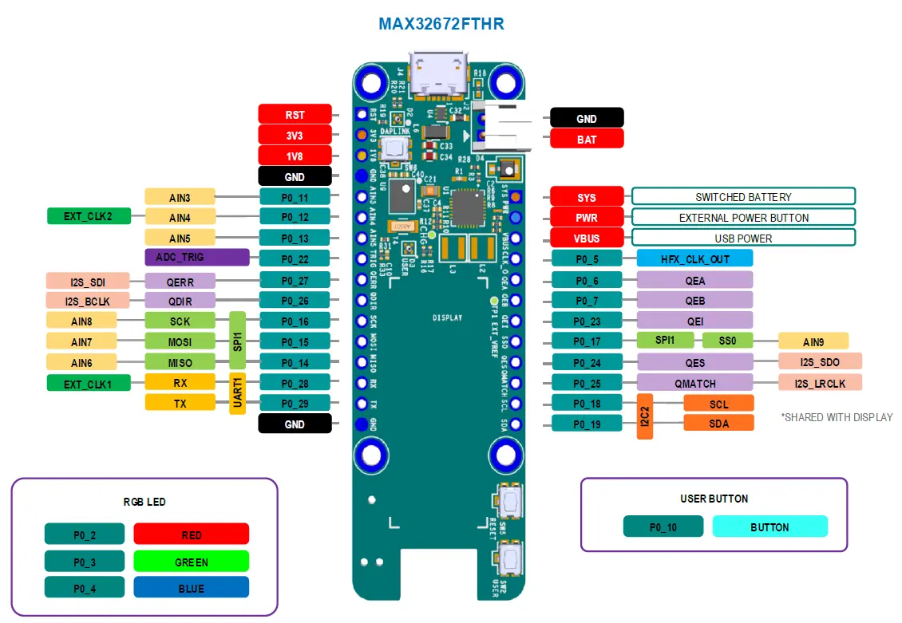
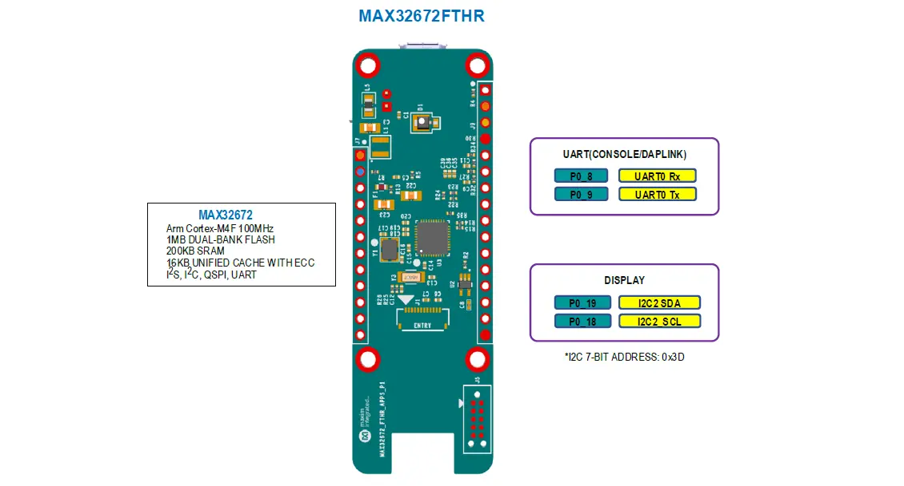

.. zephyr:board:: max32672fthr

Overview
********
The MAX32672FTHR is a rapid development platform that helps engineers quickly implement complex
sensor solutions using the MAX32672 Arm® Cortex®-M4. The board also includes the MAX8819 PMIC for
battery and power management. The form factor is a small, 0.9in by 2.6in, dual row header footprint
that is compatible with Adafruit® FeatherWing peripheral expansion boards. The board includes
an OLED display, a RGB indicator LED, and a user pushbutton. The MAX32672FTHR provides
a power-optimized flexible platform for quick proof-ofconcepts and early software development
to enhance time to market.

The Zephyr port is running on the MAX32672 MCU.

Hardware
********

- MAX32672 MCU:

  - High-Efficiency Microcontroller for Low-Power High-Reliability Devices

    - Arm Cortex-M4 Processor with FPU up to 100MHz
    - 1MB Dual-Bank Flash with Error Correction
    - 200KB SRAM (160KB with ECC Enabled), Optionally Preserved in Lowest Power Modes
    - EEPROM Emulation on Flash
    - 16KB Unified Cache with ECC
    - Resource Protection Unit (RPU) and MemoryProtection Unit (MPU)
    - Dual- or Single-Supply Operation, 1.7V to 3.6V
    - Wide Operating Temperature: -40°C to +105°C

  - Flexible Clocking Schemes

    - Internal High-Speed 100MHz Oscillator
    - Internal Low-Power 7.3728MHz and Ultra-Low-Power 80kHz Oscillators
    - 16MHz–32MHz Oscillator, 32.768kHz Oscillator(External Crystal Required)
    - External Clock Input for CPU, LPUART, LPTMR

  - Power Management Maximizes Uptime for Battery Applications

    - 59.8μA/MHz ACTIVE at 0.9V up to 12MHz(CoreMark®)
    - 56.6μA/MHz ACTIVE at 1.1V up to 100MHz(While(1))
    - 3.09μA Full Memory Retention Power in BACKUPMode at VDD = 1.8V
    - 350nA Ultra-Low-Power RTC at
    - Wake from LPUART or LPTMR

  - Optimal Peripheral Mix Provides Platform Scalability

    - Up to 42 General-Purpose I/O Pins
    - Up to Three SPI Master/Slave (up to 50Mbps)
    - Up to Three 4-Wire UART
    - Up to Three I2C Master/Slave 3.4Mbps High Speed
    - Up to Four 32-Bit Timers (TMR)
    - Up to Two Low-Power 32-Bit Timers (LPTMR)
    - One I2S Master/Slave for Digital Audio Interface
    - 12-Channel, 12-Bit, 1Msps SAR ADC with On-DieTemperature Sensor

  - Security and Integrity

    - Optional ECDSA-Based Cryptographic SecureBootloader in ROM
    - Secure Cryptographic Accelerator for Elliptic Curve
    - AES-128/192/256 Hardware Acceleration Engine

- Benefits and Features of MAX32672FTHR:

  - MAX8819 PMIC with Integrated Charger
  - On-Board DAPLink Debug and Programming Interface for Arm Cortex-M4
  - Breadboard-Compatible Headers
  - Micro USB Connector
  - RGB Indicator LED
  - User Pushbutton
  - OLED Display
  - SWD Debugger
  - Virtual UART Console

Supported Features
==================

Below interfaces are supported by Zephyr on MAX32672FTHR.

+-----------+------------+-------------------------------------+
| Interface | Controller | Driver/Component                    |
+===========+============+=====================================+
| NVIC      | on-chip    | nested vector interrupt controller  |
+-----------+------------+-------------------------------------+
| SYSTICK   | on-chip    | systick                             |
+-----------+------------+-------------------------------------+
| CLOCK     | on-chip    | clock and reset control             |
+-----------+------------+-------------------------------------+
| GPIO      | on-chip    | gpio                                |
+-----------+------------+-------------------------------------+
| UART      | on-chip    | serial                              |
+-----------+------------+-------------------------------------+
| TRNG      | on-chip    | entropy                             |
+-----------+------------+-------------------------------------+
| I2C       | on-chip    | i2c                                 |
+-----------+------------+-------------------------------------+
| DMA       | on-chip    | dma controller                      |
+-----------+------------+-------------------------------------+
| Watchdog  | on-chip    | watchdog                            |
+-----------+------------+-------------------------------------+
| SPI       | on-chip    | spi                                 |
+-----------+------------+-------------------------------------+
| ADC       | on-chip    | adc                                 |
+-----------+------------+-------------------------------------+
| Timer     | on-chip    | counter                             |
+-----------+------------+-------------------------------------+
| PWM       | on-chip    | pwm                                 |
+-----------+------------+-------------------------------------+
| Flash     | on-chip    | flash                               |
+-----------+------------+-------------------------------------+

Connections and IOs
===================

J9 Pinout
**********

+---------+----------+-------------------------------------------------------------------------------------------------+
| Pin     | Name     | Description                                                                                     |
+=========+==========+=================================================================================================+
| 1       | RST      | Master Reset Signal                                                                             |
+---------+----------+-------------------------------------------------------------------------------------------------+
| 2       | 3V3      | 3.3V Output. Typically used to provide 3.3V to peripherals connected to the expansion headers.  |
+---------+----------+-------------------------------------------------------------------------------------------------+
| 3       | 1V8      | 1.8V Output. Typically used to provide 1.8V to peripherals connected to the expansion headers.  |
+---------+----------+-------------------------------------------------------------------------------------------------+
| 4       | GND      | Ground                                                                                          |
+---------+----------+-------------------------------------------------------------------------------------------------+
| 5       | P0_11    | GPIO or Analog Input (AIN3 channel).                                                            |
+---------+----------+-------------------------------------------------------------------------------------------------+
| 6       | P0_12    | GPIO or Analog Input (AIN4 channel).                                                            |
+---------+----------+-------------------------------------------------------------------------------------------------+
| 7       | P0_13    | GPIO or Analog Input (AIN5 channel).                                                            |
+---------+----------+-------------------------------------------------------------------------------------------------+
| 8       | P0_22    | GPIO or ADC_TRIG signal.                                                                        |
+---------+----------+-------------------------------------------------------------------------------------------------+
| 9       | P0_27    | GPIO or QERR signal.                                                                            |
+---------+----------+-------------------------------------------------------------------------------------------------+
| 10      | P0_26    | GPIO or QDIR signal.                                                                            |
+---------+----------+-------------------------------------------------------------------------------------------------+
| 11      | P0_16    | GPIO or SPI1 clock signal.                                                                      |
+---------+----------+-------------------------------------------------------------------------------------------------+
| 12      | P0_15    | GPIO or SPI1 MOSI signal.                                                                       |
+---------+----------+-------------------------------------------------------------------------------------------------+
| 13      | P0_14    | GPIO or SPI1 MISO signal.                                                                       |
+---------+----------+-------------------------------------------------------------------------------------------------+
| 14      | P0_28    | GPIO or UART1 Rx signal.                                                                        |
+---------+----------+-------------------------------------------------------------------------------------------------+
| 15      | P0_29    | GPIO or UART1 Tx signal.                                                                        |
+---------+----------+-------------------------------------------------------------------------------------------------+
| 16      | GND      | Ground                                                                                          |
+---------+----------+-------------------------------------------------------------------------------------------------+

J7 Pinout
**********

+---------+----------+-----------------------------------------------------------------------------------------------------------+
| Pin     | Name     | Description                                                                                               |
+=========+==========+===========================================================================================================+
| 1       | SYS      | SYS Switched Connection to the Battery. This is the primary system power supply and automatically         |
|         |          | switches between the battery voltage and the USB supply when available.                                   |
+---------+----------+-----------------------------------------------------------------------------------------------------------+
| 2       | PWR      | In battery-powered mode, turns off the PMIC if shorted to ground.                                         |
+---------+----------+-----------------------------------------------------------------------------------------------------------+
| 3       | VBUS     | USB VBUS Signal. This can be used as a 5V supply when connected to USB. This pin can also be              |
|         |          | used as an input to power the board.                                                                      |
+---------+----------+-----------------------------------------------------------------------------------------------------------+
| 4       | P0_5     | GPIO or HFX_CLK_OUT signal.                                                                               |
+---------+----------+-----------------------------------------------------------------------------------------------------------+
| 5       | P0_6     | GPIO or QEA signal.                                                                                       |
+---------+----------+-----------------------------------------------------------------------------------------------------------+
| 6       | P0_7     | GPIO or QEB signal.                                                                                       |
+---------+----------+-----------------------------------------------------------------------------------------------------------+
| 7       | P0_23    | GPIO or QEI signal.                                                                                       |
+---------+----------+-----------------------------------------------------------------------------------------------------------+
| 8       | P0_17    | GPIO or SPI1 slave select signal.                                                                         |
+---------+----------+-----------------------------------------------------------------------------------------------------------+
| 9       | P0_24    | GPIO or QES signal.                                                                                       |
+---------+----------+-----------------------------------------------------------------------------------------------------------+
| 10      | P0_25    | GPIO or QMATCH signal.                                                                                    |
+---------+----------+-----------------------------------------------------------------------------------------------------------+
| 11      | P0_18    | GPIO or I2C2 SCL signal.                                                                                  |
+---------+----------+-----------------------------------------------------------------------------------------------------------+
| 12      | P0_19    | GPIO or I2C2 SDA signal.                                                                                  |
+---------+----------+-----------------------------------------------------------------------------------------------------------+

Programming and Debugging
*************************

Flashing
========

The MAX32625 microcontroller on the board is flashed with DAPLink firmware at the factory.
It allows debugging and flashing the MAX32672 Arm Core over USB.

Once the debug probe is connected to your host computer, then you can simply run the
``west flash`` command to write a firmware image into flash.

Debugging
=========

Please refer to the `Flashing`_ section and run the ``west debug`` command
instead of ``west flash``.

References
**********

- `MAX32672FTHR web page`_

.. _MAX32672FTHR web page:
   https://www.analog.com/en/design-center/evaluation-hardware-and-software/evaluation-boards-kits/max32672fthr.html
