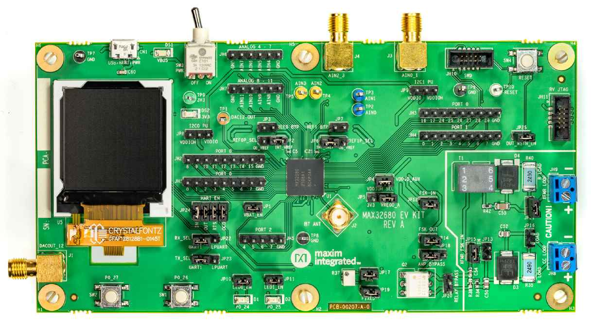

.. _max32680_evkit:

MAX32680EVKIT
#############

Overview
********

The MAX32680 evaluation kit (EV kit) provides a platform
for evaluation capabilities of the MAX32680 microcontroller,
which is an advanced system-on-chip (SoC)
designed for industrial and medical sensors. Power regulation
and management is provided by a single-inductor
multiple-output (SIMO) buck regulator system and contains
the latest generation Bluetooth® 5.2 Low Energy
(LE) radio.

The Zephyr port is running on the MAX32680 MCU.

Hardware
********

- MAX32680 MCU:

  - Ultra-Low-Power Wireless Microcontroller

    - Internal 100MHz Oscillator
    - 512KB Flash and 128KB SRAM, Optional ECC on One 32KB SRAM Bank

  - Bluetooth 5.2 LE Radio

    - Dedicated, Ultra-Low-Power, 32-Bit RISC-VCoprocessor to Offload

    Timing-Critical Bluetooth Processing

    - Fully Open-Source Bluetooth 5.2 Stack Available
    - Supports AoA, AoD, LE Audio, and Mesh
    - High-Throughput (2Mbps) Mode•Long-Range (125kbps and 500kbps) Modes
    - Rx Sensitivity: -97.5dBm; Tx Power: +4.5dBm
    - Single-Ended Antenna Connection (50Ω)

  - Smart Integration Reduces BOM, Cost, and PCB Size

    - Two 16-Bit to 24-Bit Sigma-Delta ADCs
    - 12 Channels, Assignable to Either ADC
    - Flexible Resolution and Sample Rates
    - 24-Bits at 0.4ksps, 16-Bits at 4ksps
    - Four External Input, 10-Bit Sigma-Delta ADC 7.8ksps
    - 12-Bit DAC
    - On-Die Temperature Sensor
    - Digital Peripherals: Two SPI, Two I2C, up to FourUART, and up to 36 GPIOs
    - Timers: Six 32-Bit Timers, Two Watchdog Timers,Two Pulse Trains, 1-Wire® Master

  - Power Management Maximizes Battery Life

    - 2.0V to 3.6V Supply Voltage Range
    - Integrated SIMO Power Regulator
    - Dynamic Voltage Scaling (DVS)
    - 23.8μA/MHz ACTIVE Mode Current at 3.0VCoremark®
    - 4.4μA at 3.0V Retention Current for 32KB SRAM
    - Selectable SRAM Retention in Low-Power Modes

  - Robust Security and Reliability

    - TRNG
    - Secure Nonvolatile Key Storage and AES-128/192/256
    - Secure Boot to Protect IP/Firmware
    - Wide, -40°C to +85°C Operating Temperature

- External devices connected to the MAX32680 EVKIT:

  - SMA Connector for Attaching an External Bluetooth Antenna
  - 128 x 128 (1.45in) Color TFT Display with SPI Interface
  - Two Selectable On-Board, High-Precision Voltage References
  - USB 2.0 Micro B to Serial UARTs
  - UART1 and LPUART0 Interface is Selectable Through On-Board Jumpers
  - All GPIOs Signals Accessed Through 0.1in Headers
  - Access to Four Analog Inputs Through SMA Connectors Configured as Differential
  - Access to Eight Analog Inputs Through 0.1in Headers Configured as Single-End
  - Optional Discrete Filter for the Twelve Analog Inputs
  - DAC Accessed Through SMA Connector or Test Point
  - 10-Pin SWD Connector
  - 10-Pin RV JTAG Connector
  - Board Power Provided by USB Port
  - On-Board 3.3V LDO Regulator to Power MAX32680 Internal SIMO
  - Test Loops Provided to Supply Optional VCORE Power Externally
  - Individual Power Measurement on All IC Rails Through Jumpers
  - Two General Purpose LEDs and Two General Purpose Pushbutton Switches

Supported Features
==================

Below interfaces are supported by Zephyr on MAX32680EVKIT.

+-----------+------------+-------------------------------------+
| Interface | Controller | Driver/Component                    |
+===========+============+=====================================+
| NVIC      | on-chip    | nested vector interrupt controller  |
+-----------+------------+-------------------------------------+
| SYSTICK   | on-chip    | systick                             |
+-----------+------------+-------------------------------------+
| CLOCK     | on-chip    | clock and reset control             |
+-----------+------------+-------------------------------------+
| GPIO      | on-chip    | gpio                                |
+-----------+------------+-------------------------------------+
| UART      | on-chip    | serial                              |
+-----------+------------+-------------------------------------+

Connections and IOs
===================

+-----------+---------------+---------------+--------------------------------------------------------------------------------------------------+
| Name      | Name          | Settings      | Description                                                                                      |
+===========+===============+===============+==================================================================================================+
| JP1       | VREGI         |               |                                                                                                  |
|           |               | +-----------+ |  +-------------------------------------------------------------------------------+               |
|           |               | | Open      | |  | Disconnects 3.3V power from the MAX32680 SIMO.                                |               |
|           |               | +-----------+ |  +-------------------------------------------------------------------------------+               |
|           |               | | Closed    | |  | Connects 3.3V power to the MAX32680 SIMO.                                     |               |
|           |               | +-----------+ |  +-------------------------------------------------------------------------------+               |
|           |               |               |                                                                                                  |
+-----------+---------------+---------------+--------------------------------------------------------------------------------------------------+
| JP2       | REF0P         | +-----------+ |  +-------------------------------------------------------------------------------+               |
|           |               | | 2-1       | |  | Connects the external high-precision voltage refernce to REF0P.               |               |
|           |               | +-----------+ |  +-------------------------------------------------------------------------------+               |
|           |               | | 2-3       | |  | Connects the internal voltage refernce to REF0P.                              |               |
|           |               | +-----------+ |  +-------------------------------------------------------------------------------+               |
|           |               |               |                                                                                                  |
+-----------+---------------+---------------+--------------------------------------------------------------------------------------------------+
| JP3       | REF0N         | +-----------+ |  +-------------------------------------------------------------------------------+               |
|           |               | | Open      | |  | Disconnects REF0N from ground.                                                |               |
|           |               | +-----------+ |  +-------------------------------------------------------------------------------+               |
|           |               | | Closed    | |  | Connects REF0N to ground.                                                     |               |
|           |               | +-----------+ |  +-------------------------------------------------------------------------------+               |
|           |               |               |                                                                                                  |
+-----------+---------------+---------------+--------------------------------------------------------------------------------------------------+
| JP4       | VDDIO_AUX     | +-----------+ |  +-------------------------------------------------------------------------------+               |
|           |               | | Open      | |  | Disconnects VDDIO_AUX from pull-ups and reference voltages.                   |               |
|           |               | +-----------+ |  +-------------------------------------------------------------------------------+               |
|           |               | | Closed    | |  | Connects VDDIO_AUX to pull-ups and reference voltages.                        |               |
|           |               | +-----------+ |  +-------------------------------------------------------------------------------+               |
|           |               |               |                                                                                                  |
+-----------+---------------+---------------+--------------------------------------------------------------------------------------------------+
| JP5       | VDDIOH        | +-----------+ |  +-------------------------------------------------------------------------------+               |
|           |               | | Open      | |  | Connects VREGO_A to VDDIOH.                                                   |               |
|           |               | +-----------+ |  +-------------------------------------------------------------------------------+               |
|           |               | | Closed    | |  | Connects the 3.3V from the estrenal LDO to VDDIOH.                            |               |
|           |               | +-----------+ |  +-------------------------------------------------------------------------------+               |
|           |               |               |                                                                                                  |
+-----------+---------------+---------------+--------------------------------------------------------------------------------------------------+
| JP6       | REF1P         | +-----------+ |  +-------------------------------------------------------------------------------+               |
|           |               | | 2-1       | |  | Connects the external high-precision voltage refernce to REF1P.               |               |
|           |               | +-----------+ |  +-------------------------------------------------------------------------------+               |
|           |               | | 2-3       | |  | Connects the internal voltage refernce to REF1P.                              |               |
|           |               | +-----------+ |  +-------------------------------------------------------------------------------+               |
|           |               |               |                                                                                                  |
+-----------+---------------+---------------+--------------------------------------------------------------------------------------------------+
| JP7       | REF1N         | +-----------+ |  +-------------------------------------------------------------------------------+               |
|           |               | | Open      | |  | Disconnects REF1N from ground.                                                |               |
|           |               | +-----------+ |  +-------------------------------------------------------------------------------+               |
|           |               | | Closed    | |  | Connects REF1N to ground.                                                     |               |
|           |               | +-----------+ |  +-------------------------------------------------------------------------------+               |
|           |               |               |                                                                                                  |
+-----------+---------------+---------------+--------------------------------------------------------------------------------------------------+
| JP8       | I2C0_SDA      | +-----------+ |  +-------------------------------------------------------------------------------+               |
|           | I2C0_SCL      | | 2-1       | |  | Connects I2C0 pullups to VDDIO_AUX (1.8V).                                    |               |
|           |               | +-----------+ |  +-------------------------------------------------------------------------------+               |
|           |               | | 2-3       | |  | Connects I2C0 pullups to 3.3V.                                                |               |
|           |               | +-----------+ |  +-------------------------------------------------------------------------------+               |
|           |               |               |                                                                                                  |
+-----------+---------------+---------------+--------------------------------------------------------------------------------------------------+
| JP9       | I2C1_SDA      | +-----------+ |  +-------------------------------------------------------------------------------+               |
|           | I2C1_SCL      | | 2-1       | |  | Connects I2C1 pullups to VDDIO_AUX (1.8V).                                    |               |
|           |               | +-----------+ |  +-------------------------------------------------------------------------------+               |
|           |               | | 2-3       | |  | Connects I2C1 pullups to 3.3V.                                                |               |
|           |               | +-----------+ |  +-------------------------------------------------------------------------------+               |
|           |               |               |                                                                                                  |
+-----------+---------------+---------------+--------------------------------------------------------------------------------------------------+
| JP10      | P0_24         | +-----------+ |  +-------------------------------------------------------------------------------+               |
|           |               | | Open      | |  | Disconnects red LED D1 from P0_24.                                            |               |
|           |               | +-----------+ |  +-------------------------------------------------------------------------------+               |
|           |               | | Closed    | |  | Connects red LED D1 to P0_24.                                                 |               |
|           |               | +-----------+ |  +-------------------------------------------------------------------------------+               |
|           |               |               |                                                                                                  |
+-----------+---------------+---------------+--------------------------------------------------------------------------------------------------+
| JP11      | P0_25         | +-----------+ |  +-------------------------------------------------------------------------------+               |
|           |               | | Open      | |  | Disconnects green LED D2 from P0_25.                                          |               |
|           |               | +-----------+ |  +-------------------------------------------------------------------------------+               |
|           |               | | Closed    | |  | Connects green LED D2 to P0_25.                                               |               |
|           |               | +-----------+ |  +-------------------------------------------------------------------------------+               |
|           |               |               |                                                                                                  |
+-----------+---------------+---------------+--------------------------------------------------------------------------------------------------+
| JP12      | FSK_IN        | +-----------+ |  +-------------------------------------------------------------------------------+               |
|           |               | | Open      | |  | Disconnects FSK_IN from HART analog circuitry.                                |               |
|           |               | +-----------+ |  +-------------------------------------------------------------------------------+               |
|           |               | | Closed    | |  | Connects FSK_IN to HART analog circuitry.                                     |               |
|           |               | +-----------+ |  +-------------------------------------------------------------------------------+               |
|           |               |               |                                                                                                  |
+-----------+---------------+---------------+--------------------------------------------------------------------------------------------------+
| JP13      | RCV_FSK       | +-----------+ |  +-------------------------------------------------------------------------------+               |
|           |               | | Open      | |  | Disconnects RCV_FSK from CC LOOP.                                             |               |
|           |               | +-----------+ |  +-------------------------------------------------------------------------------+               |
|           |               | | Closed    | |  | Connects RCV_FSK to CC LOOP.                                                  |               |
|           |               | +-----------+ |  +-------------------------------------------------------------------------------+               |
|           |               |               |                                                                                                  |
+-----------+---------------+---------------+--------------------------------------------------------------------------------------------------+
| JP14      | FSK_OUT       | +-----------+ |  +--------------------------------------------------------------------------------+              |
|           |               | | Open      | |  | Disconnects FSK_OUT from HART analog circuitry.                                |              |
|           |               | +-----------+ |  +--------------------------------------------------------------------------------+              |
|           |               | | Closed    | |  | Connects FSK_OUT to HART analog circuitry.                                     |              |
|           |               | +-----------+ |  +--------------------------------------------------------------------------------+              |
|           |               |               |                                                                                                  |
+-----------+---------------+---------------+--------------------------------------------------------------------------------------------------+
| JP15      | RCV_FSK       | +-----------+ |  +-------------------------------------------------------------------------------+               |
|           |               | | Open      | |  | Disconnects RCV_FSK from XFMR LOOP.                                           |               |
|           |               | +-----------+ |  +-------------------------------------------------------------------------------+               |
|           |               | | Closed    | |  | Connects RCV_FSK to XFMR LOOP.                                                |               |
|           |               | +-----------+ |  +-------------------------------------------------------------------------------+               |
|           |               |               |                                                                                                  |
+-----------+---------------+---------------+--------------------------------------------------------------------------------------------------+
| JP16      | RLOAD         | +-----------+ |  +-------------------------------------------------------------------------------+               |
|           |               | | Open      | |  | Disconnects 249 ohm resistor shunt from CC LOOP.                              |               |
|           |               | +-----------+ |  +-------------------------------------------------------------------------------+               |
|           |               | | Closed    | |  | Connects 249 ohm resistor shunt to CC LOOP.                                   |               |
|           |               | +-----------+ |  +-------------------------------------------------------------------------------+               |
|           |               |               |                                                                                                  |
+-----------+---------------+---------------+--------------------------------------------------------------------------------------------------+
| JP17      | FSK AMP GAIN  | +-----------+ |  +-------------------------------------------------------------------------------+               |
|           |               | | Open      | |  | Enables FSK variable amp gain.                                                |               |
|           |               | +-----------+ |  +-------------------------------------------------------------------------------+               |
|           |               | | Closed    | |  | Disables FSK variable amp gain.                                               |               |
|           |               | +-----------+ |  +-------------------------------------------------------------------------------+               |
|           |               |               |                                                                                                  |
+-----------+---------------+---------------+--------------------------------------------------------------------------------------------------+
| JP18      | AMP BYPASS    | +-----------+ |  +-------------------------------------------------------------------------------+               |
|           |               | | 2-1       | |  | Enables FSK amp.                                                              |               |
|           |               | +-----------+ |  +-------------------------------------------------------------------------------+               |
|           |               | | 2-3       | |  | Bypasses FSK amp.                                                             |               |
|           |               | +-----------+ |  +-------------------------------------------------------------------------------+               |
|           |               |               |                                                                                                  |
+-----------+---------------+---------------+--------------------------------------------------------------------------------------------------+
| JP19      | FSK AMP GAIN  | +-----------+ |  +-------------------------------------------------------------------------------+               |
|           |               | | Open      | |  | Enables FSK fixed amp gain.                                                   |               |
|           |               | +-----------+ |  +-------------------------------------------------------------------------------+               |
|           |               | | Closed    | |  | Disables FSK fixed amp gain.                                                  |               |
|           |               | +-----------+ |  +-------------------------------------------------------------------------------+               |
|           |               |               |                                                                                                  |
+-----------+---------------+---------------+--------------------------------------------------------------------------------------------------+
| JP20      | HART_RTS      | +-----------+ |  +-------------------------------------------------------------------------------+               |
|           |               | | Open      | |  | Enables HART_RTS optical transceiver.                                         |               |
|           |               | +-----------+ |  +-------------------------------------------------------------------------------+               |
|           |               | | Closed    | |  | Bypasses HART_RTS optical transceiver.                                        |               |
|           |               | +-----------+ |  +-------------------------------------------------------------------------------+               |
|           |               |               |                                                                                                  |
+-----------+---------------+---------------+--------------------------------------------------------------------------------------------------+
| JP21      | RLOAD         | +-----------+ |  +-------------------------------------------------------------------------------+               |
|           |               | | Open      | |  | Disconnects 249 ohm resistor shunt from XFMR LOOP.                            |               |
|           |               | +-----------+ |  +-------------------------------------------------------------------------------+               |
|           |               | | Closed    | |  | Connects 249 ohm resistor shunt to XFMR LOOP.                                 |               |
|           |               | +-----------+ |  +-------------------------------------------------------------------------------+               |
|           |               |               |                                                                                                  |
+-----------+---------------+---------------+--------------------------------------------------------------------------------------------------+
| JP22      | UART0_RX      | +-----------+ |  +-------------------------------------------------------------------------------+               |
|           |               | | 2-1       | |  | Disconnects the USB - serial bridge from UART1_RX (P0.12).                    |               |
|           |               | +-----------+ |  +-------------------------------------------------------------------------------+               |
|           |               | | 2-3       | |  | Connects the USB - serial bridge to LPUART_RX (P2.6).                         |               |
|           |               | +-----------+ |  +-------------------------------------------------------------------------------+               |
|           |               |               |                                                                                                  |
+-----------+---------------+---------------+--------------------------------------------------------------------------------------------------+
| JP23      | UART0_TX      | +-----------+ |  +-------------------------------------------------------------------------------+               |
|           |               | | 2-1       | |  | Disonnects the USB - serial bridge from UART1_TX (P0.13).                     |               |
|           |               | +-----------+ |  +-------------------------------------------------------------------------------+               |
|           |               | | 2-3       | |  | Connects the USB - serial bridge to LPUART_TX (P2.7).                         |               |
|           |               | +-----------+ |  +-------------------------------------------------------------------------------+               |
|           |               |               |                                                                                                  |
+-----------+---------------+---------------+--------------------------------------------------------------------------------------------------+
| JP24      | +-----------+ | +-----------+ |  +-------------------------------------------------------------------------------+               |
|           | | HART_IN   | | | Open      | |  | Disconnects TX of USB - serial bridge from HART_IN (P0.1)                     |               |
|           | +-----------+ | +-----------+ |  +-------------------------------------------------------------------------------+               |
|           | | HART_IN   | | | 1-2       | |  | Connects TX of USB - serial bridge to HART_IN (P0.1).                         |               |
|           | +-----------+ | +-----------+ |  +-------------------------------------------------------------------------------+               |
|           | | HART_OUT  | | | Open      | |  | Disconnects RX of USB - serial bridge from HART_OUT (P0.0).                   |               |
|           | +-----------+ | +-----------+ |  +-------------------------------------------------------------------------------+               |
|           | | HART_OUT  | | | 2-3       | |  | Connects RX of USB - serial bridge to HART_OUT (P0.0).                        |               |
|           | +-----------+ | +-----------+ |  +-------------------------------------------------------------------------------+               |
|           | | HART_RTS  | | | Open      | |  | Disconnects RTS of USB - serial bridge from HART_RTS (P0.3).                  |               |
|           | +-----------+ | +-----------+ |  +-------------------------------------------------------------------------------+               |
|           | | HART_RTS  | | | 3-4       | |  | Connects TX of USB - serial bridge to HART_RTS (P0.3).                        |               |
|           | +-----------+ | +-----------+ |  +-------------------------------------------------------------------------------+               |
|           | | HART_OCD  | | | Open      | |  | Disconnects RTS of USB - serial bridge from HART_OCD (P0.2).                  |               |
|           | +-----------+ | +-----------+ |  +-------------------------------------------------------------------------------+               |
|           | | HART_OCD  | | | 4-5       | |  | Connects TX of USB - serial bridge to HART_OCD (P0.2).                        |               |
|           | +-----------+ | +-----------+ |  +-------------------------------------------------------------------------------+               |
|           |               |               |                                                                                                  |
+-----------+---------------+---------------+--------------------------------------------------------------------------------------------------+
| JP25      | RSTN          | +-----------+ |  +-------------------------------------------------------------------------------+               |
|           |               | | Open      | |  | Disconnects DUT_3V3_RSTN from RSTN.                                           |               |
|           |               | +-----------+ |  +-------------------------------------------------------------------------------+               |
|           |               | | Close     | |  | Connects DUT_3V3_RSTN to RSTN.                                                |               |
|           |               | +-----------+ |  +-------------------------------------------------------------------------------+               |
|           |               |               |                                                                                                  |
+-----------+---------------+---------------+--------------------------------------------------------------------------------------------------+

Programming and Debugging
*************************

Flashing
========

The MAX32680 MCU can be flashed by connecting an external debug probe to the
SWD port. SWD debug can be accessed through the Cortex 10-pin connector, JH10.
Logic levels are set to 1.8V (VDDIO_AUX).

Once the debug probe is connected to your host computer, then you can simply run the
``west flash`` command to write a firmware image into flash.

Debugging
=========

Please refer to the `Flashing`_ section and run the ``west debug`` command
instead of ``west flash``.

References
**********

- `MAX32680EVKIT web page`_

.. _MAX32680EVKIT web page:
   https://www.analog.com/en/design-center/evaluation-hardware-and-software/evaluation-boards-kits/max32680evkit.html#eb-overview
