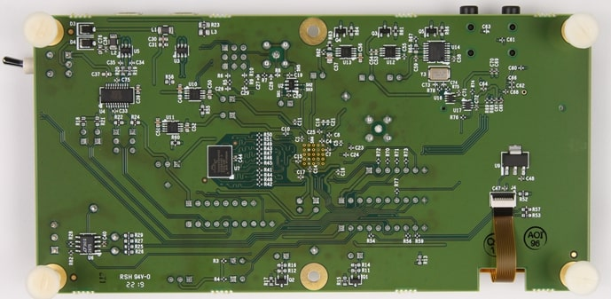

.. zephyr:board:: max32690evkit

Overview
********
The MAX32690 evaluation kit (EV kit) provides a platform for evaluating the capabilities
of the MAX32690 microcontroller, which is an advanced system-on-chip (SoC).
It features an Arm® Cortex®-M4F CPU for efficient computation of complex functions and
algorithms, and the latest generation Bluetooth® 5 Low Energy (Bluetooth LE) radio designed
for wearable and hearable fitness devices, portable and wearable wireless medical devices,
industrial sensors/networks, internet of things (IoT), and asset tracking.

The Zephyr port is running on the MAX32690 MCU.

.. image:: img/max32690evkit.jpg
   :align: center
   :alt: MAX32690 EVKIT Front

Hardware
********

- MAX32690 MCU:

    - Ultra-Efficient Microcontroller for Battery-Powered Applications

      - 120MHz Arm Cortex-M4 Processor with FPU
      - 7.3728MHz and 60MHz Low-Power Oscillators
      - External Crystal Support (32MHz required for BLE)
      - 32.768kHz RTC Clock (Requires External Crystal)
      - 8kHz Always-On Ultra-Low Power Oscillator
      - 3MB Internal Flash, 1MB Internal SRAM (832kB ECC ON)
      - TBDμW/MHz Executing from Cache at 1.1V
      - 1.8V and 3.3V I/O with No Level Translators
      - External Flash & SRAM Expansion Interfaces

    - Bluetooth 5.2 LE Radio

      - Dedicated, Ultra-Low-Power, 32-Bit RISC-V Coprocessor to Offload Timing-Critical Bluetooth Processing
      - Fully Open-Source Bluetooth 5.2 Stack Available
      - Supports AoA, AoD, LE Audio, and Mesh
      - High-Throughput (2Mbps) Mode
      - Long-Range (125kbps and 500kbps) Modes
      - Rx Sensitivity: -97.5dBm; Tx Power: +4.5dBm
      - Single-Ended Antenna Connection (50Ω)

    - Multiple Peripherals for System Control

      - 16-Channel DMA
      - Up To Five Quad SPI Master (60MHz)/Slave (48MHz)
      - Up To Four 1Mbaud UARTs with Flow Control
      - Up To Two 1MHz I2C Master/Slave
      - I2S Master/Slave
      - Eight External Channel, 12-bit 1MSPS SAR ADC w/ on-die temperature sensor
      - USB 2.0 Hi-Speed Device
      - 16 Pulse Train Engines
      - Up To Six 32-Bit Timers with 8mA High Drive
      - Up To Two CAN 2.0 Controllers
      - Up To Four Micro-Power Comparators
      - 1-Wire Master

    - Security and Integrity​

      - ChipDNA Physically Un-clonable Function (PUF)
      - Modular Arithmetic Accelerator (MAA), True Random Number Generator (TRNG)
      - Secure Nonvolatile Key Storage, SHA-256, AES-128/192/256
      - Secure Boot ROM

- External devices connected to the MAX32690EVKIT:

  - Bluetooth SMA Connector with a Hinged 2.4GHz Whip Antenna
  - 3-Pin Terminal Block for CAN Bus 2.0
  - Selectable On-Board High-Precision Voltage Reference
  - On-Board HyperRAM
  - Stereo Audio Codec with Line-In and Line-Out 3.5mm Jacks
  - 128 x 128 (1.45in) Color TFT Display
  - USB 2.0 Micro-B Interface to the MAX32690
  - USB 2.0 Micro-B to Serial UART
  - Board Power Provided by either USB Port
  - Jumpers to Enable Optional Pull-Up Resistors on I2C port
  - All GPIOs Signals Accessed through 0.1in Headers
  - Three Analog Inputs Accessed through 0.1in Headers with Optional Filtering
  - SWD 10-Pin Header
  - On-Board 3.3V, 1.8V, and 1.1V LDO Regulators
  - Individual Power Measurement on All IC Rails through Jumpers
  - Two General-Purpose LEDs and One GeneralPurpose Push Button Switch

Supported Features
==================

Below interfaces are supported by Zephyr on MAX32690EVKIT.

+-----------+------------+-------------------------------------+
| Interface | Controller | Driver/Component                    |
+===========+============+=====================================+
| NVIC      | on-chip    | nested vector interrupt controller  |
+-----------+------------+-------------------------------------+
| SYSTICK   | on-chip    | systick                             |
+-----------+------------+-------------------------------------+
| CLOCK     | on-chip    | clock and reset control             |
+-----------+------------+-------------------------------------+
| GPIO      | on-chip    | gpio                                |
+-----------+------------+-------------------------------------+
| UART      | on-chip    | serial                              |
+-----------+------------+-------------------------------------+
| SPI       | on-chip    | spi                                 |
+-----------+------------+-------------------------------------+
| I2C       | on-chip    | i2c                                 |
+-----------+------------+-------------------------------------+
| TRNG      | on-chip    | entropy                             |
+-----------+------------+-------------------------------------+
| DMA       | on-chip    | dma controller                      |
+-----------+------------+-------------------------------------+
| Watchdog  | on-chip    | watchdog                            |
+-----------+------------+-------------------------------------+
| ADC       | on-chip    | adc                                 |
+-----------+------------+-------------------------------------+
| Timer     | on-chip    | counter                             |
+-----------+------------+-------------------------------------+
| PWM       | on-chip    | pwm                                 |
+-----------+------------+-------------------------------------+
| W1        | on-chip    | one wire master                     |
+-----------+------------+-------------------------------------+
| Flash     | on-chip    | flash                               |
+-----------+------------+-------------------------------------+

Connections and IOs
===================

+-----------+---------------+---------------+--------------------------------------------------------------------------------------------------+
| Name      | Name          | Settings      | Description                                                                                      |
+===========+===============+===============+==================================================================================================+
| JP1       | VREF          |               |                                                                                                  |
|           |               | +-----------+ |  +-------------------------------------------------------------------------------+               |
|           |               | | 1-2       | |  | Connects external voltage reference to VREF pin, must be enabled in software. |               |
|           |               | +-----------+ |  +-------------------------------------------------------------------------------+               |
|           |               | | Open      | |  |  Disconnects external voltage reference.                                      |               |
|           |               | +-----------+ |  +-------------------------------------------------------------------------------+               |
|           |               |               |                                                                                                  |
+-----------+---------------+---------------+--------------------------------------------------------------------------------------------------+
| JP2       | I2C0 PU       | +-----------+ |  +-------------------------------------------------------------------------------+               |
|           |               | | 2-1       | |  | Connects VDDIO (1V8) to I2C0 pull-up resistors.                               |               |
|           |               | +-----------+ |  +-------------------------------------------------------------------------------+               |
|           |               | | 2-3       | |  | Connects VDDIOH (3V3) to I2C0 pull-up resistors.                              |               |
|           |               | +-----------+ |  +-------------------------------------------------------------------------------+               |
|           |               | | Open      | |  | Disconnects power from I2C0 pull-up resistors.                                |               |
|           |               | +-----------+ |  +-------------------------------------------------------------------------------+               |
|           |               |               |                                                                                                  |
+-----------+---------------+---------------+--------------------------------------------------------------------------------------------------+
| JP3       | I2C0_SDA_PU   | +-----------+ |  +-------------------------------------------------------------------------------+               |
|           |               | | 1-2       | |  | Connects pull-up to I2C0A_SDA (P2.7) sourced by I2C0 PU (JP2).                |               |
|           |               | +-----------+ |  +-------------------------------------------------------------------------------+               |
|           |               | | Open      | |  | Disconnects pull-up from I2C0A_SDA (P2.7) sourced by I2C0 PU (JP2).           |               |
|           |               | +-----------+ |  +-------------------------------------------------------------------------------+               |
|           |               |               |                                                                                                  |
+-----------+---------------+---------------+--------------------------------------------------------------------------------------------------+
| JP4       | I2C0_SCL_PU   | +-----------+ |  +-------------------------------------------------------------------------------+               |
|           |               | | 1-2       | |  | Connects pull-up to I2C0A_SCL (P2.8) sourced by I2C0 PU (JP2).                |               |
|           |               | +-----------+ |  +-------------------------------------------------------------------------------+               |
|           |               | | Open      | |  | Disconnects pull-up from I2C0A_SCL (P2.8) sourced by I2C0 PU (JP2).           |               |
|           |               | +-----------+ |  +-------------------------------------------------------------------------------+               |
|           |               |               |                                                                                                  |
+-----------+---------------+---------------+--------------------------------------------------------------------------------------------------+
| JP5       | LED0 EN       | +-----------+ |  +-------------------------------------------------------------------------------+               |
|           |               | | 1-2       | |  | Connects red LED D1 to P0.14.                                                 |               |
|           |               | +-----------+ |  +-------------------------------------------------------------------------------+               |
|           |               | | Open      | |  | Disconnects red LED D1 from P0.14.                                            |               |
|           |               | +-----------+ |  +-------------------------------------------------------------------------------+               |
|           |               |               |                                                                                                  |
+-----------+---------------+---------------+--------------------------------------------------------------------------------------------------+
| JP6       | LED1 EN       | +-----------+ |  +-------------------------------------------------------------------------------+               |
|           |               | | 1-2       | |  | Connects green LED D2 to P2.12.                                               |               |
|           |               | +-----------+ |  +-------------------------------------------------------------------------------+               |
|           |               | | Open      | |  | Disconnects green LED D2 from P2.12.                                          |               |
|           |               | +-----------+ |  +-------------------------------------------------------------------------------+               |
|           |               |               |                                                                                                  |
+-----------+---------------+---------------+--------------------------------------------------------------------------------------------------+
| JP7       | RX EN         | +-----------+ |  +-------------------------------------------------------------------------------+               |
|           |               | | 1-2       | |  | Connects the USB - serial  bridge to UART2A_RX (P1.9).                        |               |
|           |               | +-----------+ |  +-------------------------------------------------------------------------------+               |
|           |               | | Open      | |  | Disconnects the USB - serial  bridge from UART2A_RX (P1.9).                   |               |
|           |               | +-----------+ |  +-------------------------------------------------------------------------------+               |
|           |               |               |                                                                                                  |
+-----------+---------------+---------------+--------------------------------------------------------------------------------------------------+
| JP8       | TX EN         | +-----------+ |  +-------------------------------------------------------------------------------+               |
|           |               | | 1-2       | |  | Connects the USB - serial  bridge to UART2A_TX (P1.10).                       |               |
|           |               | +-----------+ |  +-------------------------------------------------------------------------------+               |
|           |               | | Open      | |  | Disconnects the USB - serial  bridge from UART2A_TX (P1.10).                  |               |
|           |               | +-----------+ |  +-------------------------------------------------------------------------------+               |
|           |               |               |                                                                                                  |
+-----------+---------------+---------------+--------------------------------------------------------------------------------------------------+
| JP9       | P1_7 SEL      | +-----------+ |  +-------------------------------------------------------------------------------+               |
|           |               | | 2-1       | |  | Connects the USB - serial  bridge to UART2A_CTS (P1.7).                       |               |
|           |               | +-----------+ |  +-------------------------------------------------------------------------------+               |
|           |               | | 2-3       | |  | Connects I2C2C_SDA (P1.7) to the codec.                                       |               |
|           |               | +-----------+ |  +-------------------------------------------------------------------------------+               |
|           |               |               |                                                                                                  |
+-----------+---------------+---------------+--------------------------------------------------------------------------------------------------+
| JP10      | P1_8 SEL      | +-----------+ |  +-------------------------------------------------------------------------------+               |
|           |               | | 2-1       | |  | Connects the USB - serial  bridge to UART2A_RTS (P1.8).                       |               |
|           |               | +-----------+ |  +-------------------------------------------------------------------------------+               |
|           |               | | 2-3       | |  | Connects I2C2C_SCL (P1.8) to the codec.                                       |               |
|           |               | +-----------+ |  +-------------------------------------------------------------------------------+               |
|           |               |               |                                                                                                  |
+-----------+---------------+---------------+--------------------------------------------------------------------------------------------------+
| JP11      | V_AUX SEL     | +-----------+ |  +-------------------------------------------------------------------------------+               |
|           |               | | 2-1       | |  | Connects V_AUX to 1V8.                                                        |               |
|           |               | +-----------+ |  +-------------------------------------------------------------------------------+               |
|           |               | | 2-3       | |  | Connects V_AUX to 3V3.                                                        |               |
|           |               | +-----------+ |  +-------------------------------------------------------------------------------+               |
|           |               |               |                                                                                                  |
+-----------+---------------+---------------+--------------------------------------------------------------------------------------------------+
| JP12      | VDD3A EN      | +-----------+ |  +-------------------------------------------------------------------------------+               |
|           |               | | 1-2       | |  | Connects 3V3 to VDD3A.                                                        |               |
|           |               | +-----------+ |  +-------------------------------------------------------------------------------+               |
|           |               | | Open      | |  | Disconnects 3V3 from VDD3A.                                                   |               |
|           |               | +-----------+ |  +-------------------------------------------------------------------------------+               |
|           |               |               |                                                                                                  |
+-----------+---------------+---------------+--------------------------------------------------------------------------------------------------+
| JP13      | VDDIOH EN     | +-----------+ |  +-------------------------------------------------------------------------------+               |
|           |               | | 1-2       | |  | Connects 3V3 to VDDIOH.                                                       |               |
|           |               | +-----------+ |  +-------------------------------------------------------------------------------+               |
|           |               | | Open      | |  | Disconnects 3V3 from VDDIOH.                                                  |               |
|           |               | +-----------+ |  +-------------------------------------------------------------------------------+               |
|           |               |               |                                                                                                  |
+-----------+---------------+---------------+--------------------------------------------------------------------------------------------------+
| JP14      | VDDB EN       | +-----------+ |  +-------------------------------------------------------------------------------+               |
|           |               | | 1-2       | |  | Connects a 3V3 LDO sourced by USB_VBUS (CN1) to VDDB.                         |               |
|           |               | +-----------+ |  +-------------------------------------------------------------------------------+               |
|           |               | | Open      | |  | Disconnects a 3V3 LDO sourced by USB_VBUS (CN1) from VDDB.                    |               |
|           |               | +-----------+ |  +-------------------------------------------------------------------------------+               |
|           |               |               |                                                                                                  |
+-----------+---------------+---------------+--------------------------------------------------------------------------------------------------+
| JP15      | VDDA EN       | +-----------+ |  +-------------------------------------------------------------------------------+               |
|           |               | | 1-2       | |  | Connects 1V8 to VDDA.                                                         |               |
|           |               | +-----------+ |  +-------------------------------------------------------------------------------+               |
|           |               | | Open      | |  | Disconnects 1V8 from VDDA.                                                    |               |
|           |               | +-----------+ |  +-------------------------------------------------------------------------------+               |
|           |               |               |                                                                                                  |
+-----------+---------------+---------------+--------------------------------------------------------------------------------------------------+
| JP16      | VDDIO EN      | +-----------+ |  +-------------------------------------------------------------------------------+               |
|           |               | | 1-2       | |  | Connects 1V8 to VDDIO.                                                        |               |
|           |               | +-----------+ |  +-------------------------------------------------------------------------------+               |
|           |               | | Open      | |  | Disconnects 1V8 from VDDIO.                                                   |               |
|           |               | +-----------+ |  +-------------------------------------------------------------------------------+               |
|           |               |               |                                                                                                  |
+-----------+---------------+---------------+--------------------------------------------------------------------------------------------------+
| JP17      | VCORE EN      | +-----------+ |  +-------------------------------------------------------------------------------+               |
|           |               | | 1-2       | |  | Connects 1V1 to VCORE.                                                        |               |
|           |               | +-----------+ |  +-------------------------------------------------------------------------------+               |
|           |               | | Open      | |  | Disconnects 1V1 from VCORE.                                                   |               |
|           |               | +-----------+ |  +-------------------------------------------------------------------------------+               |
|           |               |               |                                                                                                  |
+-----------+---------------+---------------+--------------------------------------------------------------------------------------------------+
| JP18      | BLE LDO EN    | +-----------+ |  +-------------------------------------------------------------------------------+               |
|           |               | | 1-2       | |  | Connects 1V4 to BLE_LDO.                                                      |               |
|           |               | +-----------+ |  +-------------------------------------------------------------------------------+               |
|           |               | | Open      | |  | Disconnects 1V4 from BLE_LDO.                                                 |               |
|           |               | +-----------+ |  +-------------------------------------------------------------------------------+               |
|           |               |               |                                                                                                  |
+-----------+---------------+---------------+--------------------------------------------------------------------------------------------------+
| JH6       | ANALOG PORT3  | +-----------+ |  +-------------------------------------------------------------------------------+               |
|           |               | | 1-2       | |  | Connects LPUART0B_RX (P3.0) to the SWD connector.                             |               |
|           |               | +-----------+ |  +-------------------------------------------------------------------------------+               |
|           |               | | 3-4       | |  | Connects LPUART0B_TX (P3.1) to the SWD connector.                             |               |
|           |               | +-----------+ |  +-------------------------------------------------------------------------------+               |
|           |               | | Open      | |  | Disconnects LPUART0B_RX (P3.0) and LPUART0B_TX (P3.1) from the SWD connector. |               |
|           |               | +-----------+ |  +-------------------------------------------------------------------------------+               |
|           |               |               |                                                                                                  |
+-----------+---------------+---------------+--------------------------------------------------------------------------------------------------+

Programming and Debugging
*************************

Flashing
========

The MAX32690 MCU can be flashed by connecting an external debug probe to the
SWD port. SWD debug can be accessed through the Cortex 10-pin connector, J3.
Logic levels are fixed to VDDIO (1.8V).

Once the debug probe is connected to your host computer, then you can simply run the
``west flash`` command to write a firmware image into flash.

.. note::

   This board uses OpenOCD as the default debug interface. You can also use
   a Segger J-Link with Segger's native tooling by overriding the runner,
   appending ``--runner jlink`` to your ``west`` command(s). The J-Link should
   be connected to the standard 2*5 pin debug connector (JW3) using an
   appropriate adapter board and cable.

Debugging
=========

Please refer to the `Flashing`_ section and run the ``west debug`` command
instead of ``west flash``.

References
**********

- `MAX32690EVKIT solution center`_

.. _MAX32690EVKIT solution center:
   https://developer.analog.com/solutions/max32690
