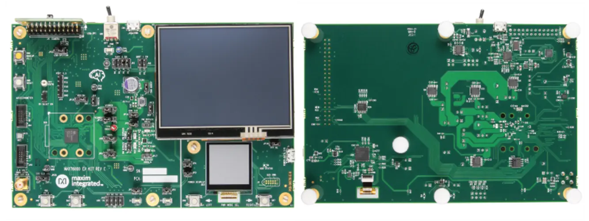

.. zephyr:board:: max78000evkit

Overview
********
The MAX78000 evaluation kit (EV kit) provides a platform for leveraging the capabilities of the MAX78000 to build
new generations of artificial intelligence (AI) devices. Onboard hardware includes a digital microphone, a gyroscope/accelerometer, parallel camera module support
and a 3.5in touch-enabled color TFT display. A secondary display is driven by a power accumulator for tracking
device power consumption over time. Uncommitted GPIO as well as analog inputs are readily accessible through
0.1in pin headers. Primary system power as well as UART access is provided by a USB Micro-B connector. A USB
to SPI bridge provides rapid access to onboard memory, allowing large networks or images to load quickly

The Zephyr port is running on the MAX78000 MCU.

Hardware
********

- MAX78000 MCU:

  - Dual-Core, Low-Power Microcontroller

    - Arm Cortex-M4 Processor with FPU up to 100MHz
    - 512KB Flash and 128KB SRAM
    - Optimized Performance with 16KB Instruction Cache
    - Optional Error Correction Code (ECC-SEC-DED) for SRAM
    - 32-Bit RISC-V Coprocessor up to 60MHz
    - Up to 52 General-Purpose I/O Pins
    - 12-Bit Parallel Camera Interface
    - One I2S Master/Slave for Digital Audio Interface

  - Neural Network Accelerator

    - Highly Optimized for Deep Convolutional Neural Networks
    - 442k 8-Bit Weight Capacity with 1,2,4,8-Bit Weights
    - Programmable Input Image Size up to 1024 x 1024 pixels
    - Programmable Network Depth up to 64 Layers
    - Programmable per Layer Network Channel Widths up to 1024 Channels
    - 1 and 2 Dimensional Convolution Processing
    - Streaming Mode
    - Flexibility to Support Other Network Types, Including MLP and Recurrent Neural Networks

  - Power Management Maximizes Operating Time for Battery Applications

    - Integrated Single-Inductor Multiple-Output (SIMO) Switch-Mode Power Supply (SMPS)
    - 2.0V to 3.6V SIMO Supply Voltage Range
    - Dynamic Voltage Scaling Minimizes Active Core Power Consumption
    - 22.2μA/MHz While Loop Execution at 3.0V from Cache (CM4 Only)
    - Selectable SRAM Retention in Low-Power Modes with Real-Time Clock (RTC) Enabled

  - Security and Integrity

    - Available Secure Boot
    - AES 128/192/256 Hardware Acceleration Engine
    - True Random Number Generator (TRNG) Seed Generator

Supported Features
==================

The ``max78000evkit/max78000/m4`` board target supports the following interfaces:

+-----------+------------+-------------------------------------+
| Interface | Controller | Driver/Component                    |
+===========+============+=====================================+
| NVIC      | on-chip    | nested vector interrupt controller  |
+-----------+------------+-------------------------------------+
| SYSTICK   | on-chip    | systick                             |
+-----------+------------+-------------------------------------+
| CLOCK     | on-chip    | clock and reset control             |
+-----------+------------+-------------------------------------+
| GPIO      | on-chip    | gpio                                |
+-----------+------------+-------------------------------------+
| UART      | on-chip    | serial                              |
+-----------+------------+-------------------------------------+
| TRNG      | on-chip    | entropy                             |
+-----------+------------+-------------------------------------+
| I2C       | on-chip    | i2c                                 |
+-----------+------------+-------------------------------------+
| DMA       | on-chip    | dma controller                      |
+-----------+------------+-------------------------------------+
| Watchdog  | on-chip    | watchdog                            |
+-----------+------------+-------------------------------------+
| SPI       | on-chip    | spi                                 |
+-----------+------------+-------------------------------------+
| ADC       | on-chip    | adc                                 |
+-----------+------------+-------------------------------------+
| Flash     | on-chip    | flash                               |
+-----------+------------+-------------------------------------+
| Timer     | on-chip    | pwm                                 |
+-----------+------------+-------------------------------------+
| RTC       | on-chip    | real time clock                     |
+-----------+------------+-------------------------------------+
| Timer     | on-chip    | counter                             |
+-----------+------------+-------------------------------------+
| W1        | on-chip    | one wire master                     |
+--------------------------------------------------------------+

Connections and IOs
===================

+-----------+-------------------+-------------------+----------------------------------------------------------------------------------------------+
| Name      | Name              | Settings          | Description                                                                                  |
+===========+===================+===================+==============================================================================================+
| JP1       | LED1 EN           | +---------------+ |  +-----------------------------------------------------------------------------------------+ |
|           |                   | | 1-2           | |  | Enables auxiliary LED1                                                                  | |
|           |                   | +---------------+ |  +-----------------------------------------------------------------------------------------+ |
|           |                   | | Open          | |  | Disables auxiliary LED1                                                                 | |
|           |                   | +---------------+ |  +-----------------------------------------------------------------------------------------+ |
|           |                   |                   |                                                                                              |
+-----------+-------------------+-------------------+----------------------------------------------------------------------------------------------+
| JP2       | LED2 EN           | +---------------+ |  +-----------------------------------------------------------------------------------------+ |
|           |                   | | 1-2           | |  | Enables auxiliary LED2                                                                  | |
|           |                   | +---------------+ |  +-----------------------------------------------------------------------------------------+ |
|           |                   | | Open          | |  | Disables auxiliary LED2                                                                 | |
|           |                   | +---------------+ |  +-----------------------------------------------------------------------------------------+ |
|           |                   |                   |                                                                                              |
+-----------+-------------------+-------------------+----------------------------------------------------------------------------------------------+
| JP3       | TRIG1             | +---------------+ |  +-----------------------------------------------------------------------------------------+ |
|           |                   | | 1-2           | |  | Enables power monitor event trigger 1                                                   | |
|           |                   | +---------------+ |  +-----------------------------------------------------------------------------------------+ |
|           |                   | | Open          | |  | Disables power monitor event trigger 1                                                  | |
|           |                   | +---------------+ |  +-----------------------------------------------------------------------------------------+ |
|           |                   |                   |                                                                                              |
+-----------+-------------------+-------------------+----------------------------------------------------------------------------------------------+
| JP4       | TRIG2             | +---------------+ |  +-----------------------------------------------------------------------------------------+ |
|           |                   | | 1-2           | |  | Enables power monitor event trigger 2                                                   | |
|           |                   | +---------------+ |  +-----------------------------------------------------------------------------------------+ |
|           |                   | | Open          | |  | Disables power monitor event trigger 2                                                  | |
|           |                   | +---------------+ |  +-----------------------------------------------------------------------------------------+ |
|           |                   |                   |                                                                                              |
+-----------+-------------------+-------------------+----------------------------------------------------------------------------------------------+
| JP5       | VREGI             | +---------------+ |  +-----------------------------------------------------------------------------------------+ |
|           |                   | | 1-2           | |  | Enables 3V3 VREGI power                                                                 | |
|           |                   | +---------------+ |  +-----------------------------------------------------------------------------------------+ |
|           |                   | | Open          | |  | Disables 3V3 VREGI power                                                                | |
|           |                   | +---------------+ |  +-----------------------------------------------------------------------------------------+ |
|           |                   |                   |                                                                                              |
+-----------+-------------------+-------------------+----------------------------------------------------------------------------------------------+
| JP6       | VREGIA            | +---------------+ |  +-----------------------------------------------------------------------------------------+ |
|           |                   | | 1-2           | |  | Enables 3V3 VREGIA power                                                                | |
|           |                   | +---------------+ |  +-----------------------------------------------------------------------------------------+ |
|           |                   | | Open          | |  | Disables 3V3 VREGIA power                                                               | |
|           |                   | +---------------+ |  +-----------------------------------------------------------------------------------------+ |
|           |                   |                   |                                                                                              |
+-----------+-------------------+-------------------+----------------------------------------------------------------------------------------------+
| JP7       | CNN BOOST         | +---------------+ |  +-----------------------------------------------------------------------------------------+ |
|           |                   | | 1-2           | |  | Enables 1V1 boost LDO power                                                             | |
|           |                   | +---------------+ |  +-----------------------------------------------------------------------------------------+ |
|           |                   | | Open          | |  | Disables 1V1 boost LDO power                                                            | |
|           |                   | +---------------+ |  +-----------------------------------------------------------------------------------------+ |
|           |                   |                   |                                                                                              |
+-----------+-------------------+-------------------+----------------------------------------------------------------------------------------------+
| JP8       | VDDA              | +---------------+ |  +-----------------------------------------------------------------------------------------+ |
|           |                   | | 1-2           | |  | Internal SIMO powers VDDA                                                               | |
|           |                   | +---------------+ |  +-----------------------------------------------------------------------------------------+ |
|           |                   | | 2-3           | |  | External LDO powers VDDA                                                                | |
|           |                   | +---------------+ |  +-----------------------------------------------------------------------------------------+ |
|           |                   |                   |                                                                                              |
+-----------+-------------------+-------------------+----------------------------------------------------------------------------------------------+
| JP9       | VDDIO             | +---------------+ |  +-----------------------------------------------------------------------------------------+ |
|           |                   | | 1-2           | |  | Internal SIMO powers VDDIO                                                              | |
|           |                   | +---------------+ |  +-----------------------------------------------------------------------------------------+ |
|           |                   | | 2-3           | |  | External LDO powers VDDIO                                                               | |
|           |                   | +---------------+ |  +-----------------------------------------------------------------------------------------+ |
|           |                   |                   |                                                                                              |
+-----------+-------------------+-------------------+----------------------------------------------------------------------------------------------+
| JP10      | VDDIOH            | +---------------+ |  +-----------------------------------------------------------------------------------------+ |
|           |                   | | 1-2           | |  | DUT LDO powers VDDIOH                                                                   | |
|           |                   | +---------------+ |  +-----------------------------------------------------------------------------------------+ |
|           |                   | | 2-3           | |  | AUX LDO powers VDDIOH                                                                   | |
|           |                   | +---------------+ |  +-----------------------------------------------------------------------------------------+ |
|           |                   |                   |                                                                                              |
+-----------+-------------------+-------------------+----------------------------------------------------------------------------------------------+
| JP11      | VCOREB            | +---------------+ |  +-----------------------------------------------------------------------------------------+ |
|           |                   | | 1-2           | |  | Internal SIMO powers VCOREB                                                             | |
|           |                   | +---------------+ |  +-----------------------------------------------------------------------------------------+ |
|           |                   | | 2-3           | |  | External LDO powers VCOREB                                                              | |
|           |                   | +---------------+ |  +-----------------------------------------------------------------------------------------+ |
|           |                   |                   |                                                                                              |
+-----------+-------------------+-------------------+----------------------------------------------------------------------------------------------+
| JP12      | VCOREA            | +---------------+ |  +-----------------------------------------------------------------------------------------+ |
|           |                   | | 1-2           | |  | Internal SIMO powers VCOREA                                                             | |
|           |                   | +---------------+ |  +-----------------------------------------------------------------------------------------+ |
|           |                   | | 2-3           | |  | External LDO powers VCOREA                                                              | |
|           |                   | +---------------+ |  +-----------------------------------------------------------------------------------------+ |
|           |                   |                   |                                                                                              |
+-----------+-------------------+-------------------+----------------------------------------------------------------------------------------------+
| JP13      | VREGI PM BYPASS   | +---------------+ |  +-----------------------------------------------------------------------------------------+ |
|           |                   | | 1-2           | |  | Bypasses power monitor shunt                                                            | |
|           |                   | +---------------+ |  +-----------------------------------------------------------------------------------------+ |
|           |                   | | Open          | |  | Enables power monitoring using power accumulator                                        | |
|           |                   | +---------------+ |  +-----------------------------------------------------------------------------------------+ |
|           |                   |                   |                                                                                              |
+-----------+-------------------+-------------------+----------------------------------------------------------------------------------------------+
| JP14      | CNN 1V1           | +---------------+ |  +-----------------------------------------------------------------------------------------+ |
|           |                   | | 1-2           | |  | Connects 1V1 boost LDO to VCOREA                                                        | |
|           |                   | +---------------+ |  +-----------------------------------------------------------------------------------------+ |
|           |                   | | Open          | |  | Disables 1V1 boost LDO                                                                  | |
|           |                   | +---------------+ |  +-----------------------------------------------------------------------------------------+ |
|           |                   |                   |                                                                                              |
+-----------+-------------------+-------------------+----------------------------------------------------------------------------------------------+
| JP15      | VCOREA PM BYPASS  | +---------------+ |  +-----------------------------------------------------------------------------------------+ |
|           |                   | | 1-2           | |  | Bypasses power monitor shunt                                                            | |
|           |                   | +---------------+ |  +-----------------------------------------------------------------------------------------+ |
|           |                   | | Open          | |  | Enables power monitoring using power accumulator                                        | |
|           |                   | +---------------+ |  +-----------------------------------------------------------------------------------------+ |
|           |                   |                   |                                                                                              |
+-----------+-------------------+-------------------+----------------------------------------------------------------------------------------------+
| JP16      | VCOREB PM BYPASS  | +---------------+ |  +-----------------------------------------------------------------------------------------+ |
|           |                   | | 1-2           | |  | Bypasses power monitor shunt                                                            | |
|           |                   | +---------------+ |  +-----------------------------------------------------------------------------------------+ |
|           |                   | | Open          | |  | Enables power monitoring using power accumulator                                        | |
|           |                   | +---------------+ |  +-----------------------------------------------------------------------------------------+ |
|           |                   |                   |                                                                                              |
+-----------+-------------------+-------------------+----------------------------------------------------------------------------------------------+
| JP17      | VREG_A PM BYPASS  | +---------------+ |  +-----------------------------------------------------------------------------------------+ |
|           |                   | | 1-2           | |  | Bypasses power monitor shunt                                                            | |
|           |                   | +---------------+ |  +-----------------------------------------------------------------------------------------+ |
|           |                   | | Open          | |  | Enables power monitoring using power accumulator                                        | |
|           |                   | +---------------+ |  +-----------------------------------------------------------------------------------------+ |
|           |                   |                   |                                                                                              |
+-----------+-------------------+-------------------+----------------------------------------------------------------------------------------------+
| JP18      | RESET EN          | +---------------+ |  +-----------------------------------------------------------------------------------------+ |
|           |                   | | 1-2           | |  | Enables RV JTAG adapter to perform full system reset                                    | |
|           |                   | +---------------+ |  +-----------------------------------------------------------------------------------------+ |
|           |                   | | Open          | |  | Disables system reset by RV JTAG adapter                                                | |
|           |                   | +---------------+ |  +-----------------------------------------------------------------------------------------+ |
|           |                   |                   |                                                                                              |
+-----------+-------------------+-------------------+----------------------------------------------------------------------------------------------+
| JP19      | TFT BL            | +---------------+ |  +-----------------------------------------------------------------------------------------+ |
|           |                   | | 1-2           | |  | Enables main TFT screen backlight                                                       | |
|           |                   | +---------------+ |  +-----------------------------------------------------------------------------------------+ |
|           |                   | | Open          | |  | Disables main TFT screen backlight                                                      | |
|           |                   | +---------------+ |  +-----------------------------------------------------------------------------------------+ |
|           |                   |                   |                                                                                              |
+-----------+-------------------+-------------------+----------------------------------------------------------------------------------------------+
| JP20      | I2S CLK SEL       | +---------------+ |  +-----------------------------------------------------------------------------------------+ |
|           |                   | | 1-2           | |  | Onboard 12.288MHz oscillator drives I2S clock                                           | |
|           |                   | +---------------+ |  +-----------------------------------------------------------------------------------------+ |
|           |                   | | 2-3           | |  | External 1V8 CMOS LEVEL source drives I2S clock                                         | |
|           |                   | +---------------+ |  +-----------------------------------------------------------------------------------------+ |
|           |                   |                   |                                                                                              |
+-----------+-------------------+-------------------+----------------------------------------------------------------------------------------------+
| JP21      | DUT I             | +---------------+ |  +-----------------------------------------------------------------------------------------+ |
|           |                   | | 1-2           | |  | DUT 3V3 total current monitor point                                                     | |
|           |                   | +---------------+ |  +-----------------------------------------------------------------------------------------+ |
|           |                   | | Open          | |  | Open to insert current meter                                                            | |
|           |                   | +---------------+ |  +-----------------------------------------------------------------------------------------+ |
|           |                   |                   |                                                                                              |
+-----------+-------------------+-------------------+----------------------------------------------------------------------------------------------+
| JP22      | USB-SPI/CAM       | +---------------+ |  +-----------------------------------------------------------------------------------------+ |
|           |                   | | 1-2           | |  | Enables USB-SPI bridge                                                                  | |
|           |                   | +---------------+ |  +-----------------------------------------------------------------------------------------+ |
|           |                   | | 2-3           | |  | Enables camera                                                                          | |
|           |                   | +---------------+ |  +-----------------------------------------------------------------------------------------+ |
|           |                   |                   |                                                                                              |
+-----------+-------------------+-------------------+----------------------------------------------------------------------------------------------+
| JH1       | UART 0 EN         | +---------------+ |  +-----------------------------------------------------------------------------------------+ |
|           |                   | | 1-2, 3-4      | |  | Enables USB-UART0 bridge, software flow control                                         | |
|           |                   | +---------------+ |  +-----------------------------------------------------------------------------------------+ |
|           |                   | | All Open      | |  | Disables USB-UART0 bridge, allows reuse of port pins                                    | |
|           |                   | +---------------+ |  +-----------------------------------------------------------------------------------------+ |
|           |                   |                   |                                                                                              |
+-----------+-------------------+-------------------+----------------------------------------------------------------------------------------------+
| JH2       | UART 1 EN         | +---------------+ |  +-----------------------------------------------------------------------------------------+ |
|           |                   | |All installed  | |  | Enables USB-UART1 bridge                                                                | |
|           |                   | +---------------+ |  +-----------------------------------------------------------------------------------------+ |
|           |                   | | All Open      | |  | Disables USB-UART1 bridge, allows reuse of port pins                                    | |
|           |                   | +---------------+ |  +-----------------------------------------------------------------------------------------+ |
|           |                   |                   |                                                                                              |
+-----------+-------------------+-------------------+----------------------------------------------------------------------------------------------+

Programming and Debugging
*************************

Flashing
========

The MAX78000 MCU can be flashed by connecting an external debug probe to the
SWD port. SWD debug can be accessed through the Cortex 10-pin connector, JH5.
Logic levels are fixed to VDDIO (1.8V).

Once the debug probe is connected to your host computer, then you can simply run the
``west flash`` command to write a firmware image into flash.

.. note::

   This board uses OpenOCD as the default debug interface. You can also use
   a Segger J-Link with Segger's native tooling by overriding the runner,
   appending ``--runner jlink`` to your ``west`` command(s). The J-Link should
   be connected to the standard 2*5 pin debug connector (JH5) using an
   appropriate adapter board and cable.

Debugging
=========

Please refer to the `Flashing`_ section and run the ``west debug`` command
instead of ``west flash``.

References
**********

- `MAX78000EVKIT web page`_

.. _MAX78000EVKIT web page:
   https://www.analog.com/en/resources/evaluation-hardware-and-software/evaluation-boards-kits/max78000evkit.html
