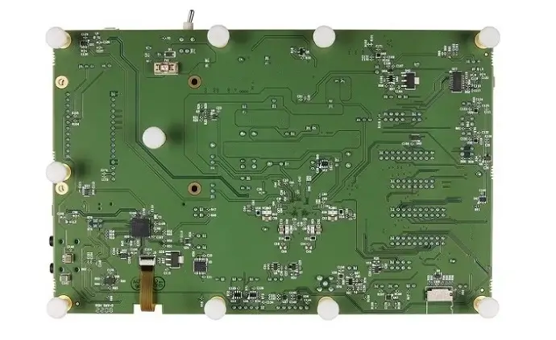

.. zephyr:board:: max78002evkit

Overview
********
The MAX78002 evaluation kit (EV kit) provides a platform and tools for leveraging device capabilities to build new
generations of artificial intelligence (AI) products.

The kit provides optimal versatility with a modular peripheral architecture, allowing a variety of input and output
devices to be remotely located. DVP and CSI cameras, I2S audio peripherals, digital microphones, and analog sensors
are supported, while a pair of industry-standard QWIIC connectors supports a large and growing array of aftermarket
development boards. An onboard stereo audio codec offers line-level audio input and output, and tactile input is
provided by a touch-enabled 2.4in TFT display. The MAX78002 energy consumption is tracked by a power accumulator,
with four channels of formatted results presented on a secondary TFT display. All device GPIOs are accessible on
0.1in pin headers. A standard coaxial power jack serves as power input, using the included 5V, 3A wall-mount
adapter. Two USB connectors provide serial access to the MAX78002, one directly and the other through a USB to UART
bridge. A third USB connector allows access to the MAX78002 energy consumption data. Rounding out the features, a
microSD connector provides the capability for inexpensive highdensity portable data storage.

The Zephyr port is running on the MAX78002 MCU.

.. image:: img/max78002evkit.webp
   :align: center
   :alt: MAX78002 EVKIT Front

Hardware
********

- MAX78002 MCU:

  - Dual-Core, Low-Power Microcontroller

    - Arm Cortex-M4 Processor with FPU up to 120MHz
    - 2.5MB Flash, 64KB ROM, and 384KB SRAM
    - Optimized Performance with 16KB Instruction Cache
    - Optional Error Correction Code (ECC SEC-DED) for SRAM
    - 32-Bit RISC-V Coprocessor up to 60MHz
    - Up to 60 General-Purpose I/O Pins
    - MIPI Camera Serial Interface 2 (MIPI CSI-2) Controller V2.1
    - Support for Two Data Lanes
    - 12-Bit Parallel Camera Interface
    - I2S Controller/Target for Digital Audio Interface
    - Secure Digital Interface Supports SD 3.0/SDIO 3.0/eMMC 4.51

  - Convolutional Neural Network (CNN) Accelerator

    - Highly Optimized for Deep CNNs
    - 2 Million 8-Bit Weight Capacity with 1-, 2-, 4-, and 8-bit Weights
    - 1.3MB CNN Data Memory
    - Programmable Input Image Size up to 2048 x 2048 Pixels
    - Programmable Network Depth up to 128 Layers
    - Programmable per Layer Network Channel Widths up to 1024 Channels
    - 1- and 2-Dimensional Convolution Processing
    - Capable of Processing VGA Images at 30fps

  - Power Management for Extending Battery Life

    - Integrated Single-Inductor Multiple-Output (SIMO) Switch-Mode Power Supply (SMPS)
    - 2.85V to 3.6V Supply Voltage Range
    - Support of Optional External Auxiliary CNN Power Supply
    - Dynamic Voltage Scaling Minimizes Active Core Power Consumption
    - 23.9μA/MHz While Loop Execution at 3.3V from Cache (CM4 only)
    - Selectable SRAM Retention in Low-Power Modes with Real-Time Clock (RTC) Enabled

  - Security and Integrity

    - Available Secure Boot
    - AES 128/192/256 Hardware Acceleration Engine
    - True Random Number Generator (TRNG) Seed Generator

- External devices connected to the MAX78002 EVKIT:

  - Color TFT Display
  - Audio Stereo Codec Interface
  - Digital Microphone
  - A 8Mb QSPI ram

Supported Features
==================

The ``max78002evkit/max78002/m4`` board target supports the following interfaces:

+-----------+------------+-------------------------------------+
| Interface | Controller | Driver/Component                    |
+===========+============+=====================================+
| NVIC      | on-chip    | nested vector interrupt controller  |
+-----------+------------+-------------------------------------+
| SYSTICK   | on-chip    | systick                             |
+-----------+------------+-------------------------------------+
| CLOCK     | on-chip    | clock and reset control             |
+-----------+------------+-------------------------------------+
| GPIO      | on-chip    | gpio                                |
+-----------+------------+-------------------------------------+
| UART      | on-chip    | serial                              |
+-----------+------------+-------------------------------------+
| TRNG      | on-chip    | entropy                             |
+-----------+------------+-------------------------------------+
| I2C       | on-chip    | i2c                                 |
+-----------+------------+-------------------------------------+
| DMA       | on-chip    | dma controller                      |
+-----------+------------+-------------------------------------+
| Watchdog  | on-chip    | watchdog                            |
+-----------+------------+-------------------------------------+
| SPI       | on-chip    | spi                                 |
+-----------+------------+-------------------------------------+
| ADC       | on-chip    | adc                                 |
+-----------+------------+-------------------------------------+
| Timer     | on-chip    | counter                             |
+-----------+------------+-------------------------------------+
| PWM       | on-chip    | pwm                                 |
+-----------+------------+-------------------------------------+
| W1        | on-chip    | one wire master                     |
+-----------+------------+-------------------------------------+
| Flash     | on-chip    | flash                               |
+-----------+------------+-------------------------------------+

Connections and IOs
===================

+-----------+-------------------+---------------+--------------------------------------------------------------------------------------------------+
| Name      | Name              | Settings      | Description                                                                                      |
+===========+===================+===============+==================================================================================================+
| JP1       | 3V3 MON           | +-----------+ |  +-----------------------------------------------------------------------------------------+     |
|           |                   | | 1-2       | |  | Normal operation in conjunction with JP3 jumpered 1-2                                   |     |
|           |                   | +-----------+ |  +-----------------------------------------------------------------------------------------+     |
|           |                   | | Open      | |  | Test access point for current measurement                                               |     |
|           |                   | +-----------+ |  +-----------------------------------------------------------------------------------------+     |
|           |                   |               |                                                                                                  |
+-----------+-------------------+---------------+--------------------------------------------------------------------------------------------------+
| JP2       | 3V3 SW PM BYPASS  | +-----------+ |  +-----------------------------------------------------------------------------------------+     |
|           |                   | | 1-2       | |  | Power monitor shunts for main 3.3 V system power are bypassed                           |     |
|           |                   | +-----------+ |  +-----------------------------------------------------------------------------------------+     |
|           |                   | | Open      | |  | Main 3.3V input routes through shunts for power accumulator measurements                |     |
|           |                   | +-----------+ |  +-----------------------------------------------------------------------------------------+     |
|           |                   |               |                                                                                                  |
+-----------+-------------------+---------------+--------------------------------------------------------------------------------------------------+
| JP3       | CNN MON           | +-----------+ |  +-----------------------------------------------------------------------------------------+     |
|           |                   | | 1-2       | |  | Normal operation in conjunction with JP6 jumpered 1-2                                   |     |
|           |                   | +-----------+ |  +-----------------------------------------------------------------------------------------+     |
|           |                   | | Open      | |  | Test access point for current measurement of U4's share of VCOREA and CNN loads         |     |
|           |                   | +-----------+ |  +-----------------------------------------------------------------------------------------+     |
|           |                   |               |                                                                                                  |
+-----------+-------------------+---------------+--------------------------------------------------------------------------------------------------+
| JP4       | VCOREA PM BYPASS  | +-----------+ |  +-----------------------------------------------------------------------------------------+     |
|           |                   | | 1-2       | |  | Power monitor shunts for U4's share of VCOREA + CNN loads are bypassed                  |     |
|           |                   | +-----------+ |  +-----------------------------------------------------------------------------------------+     |
|           |                   | | Open      | |  | VCOREA + CNN loads route through shunts for power accumulator                           |     |
|           |                   | +-----------+ |  +-----------------------------------------------------------------------------------------+     |
|           |                   |               |                                                                                                  |
+-----------+-------------------+---------------+--------------------------------------------------------------------------------------------------+
| JP5       | VCOREB PM BYPASS  | +-----------+ |  +-----------------------------------------------------------------------------------------+     |
|           |                   | | 1-2       | |  | Power monitor shunts for VCOREB are bypassed                                            |     |
|           |                   | +-----------+ |  +-----------------------------------------------------------------------------------------+     |
|           |                   | | Open      | |  | VCOREB power routes through shunts for power accumulator                                |     |
|           |                   | +-----------+ |  +-----------------------------------------------------------------------------------------+     |
|           |                   |               |                                                                                                  |
+-----------+-------------------+---------------+--------------------------------------------------------------------------------------------------+
| JP6       | VREGO_A PM BYPASS | +-----------+ |  +-----------------------------------------------------------------------------------------+     |
|           |                   | | 1-2       | |  | Power monitor shunts for VREGO_A are bypassed                                           |     |
|           |                   | +-----------+ |  +-----------------------------------------------------------------------------------------+     |
|           |                   | | Open      | |  | VREGO_A power routes through shunts for power accumulator                               |     |
|           |                   | +-----------+ |  +-----------------------------------------------------------------------------------------+     |
|           |                   |               |                                                                                                  |
+-----------+-------------------+---------------+--------------------------------------------------------------------------------------------------+
| JP7       | VBAT              | +-----------+ |  +-----------------------------------------------------------------------------------------+     |
|           |                   | | 1-2       | |  | Enables 3V3 VBAT power                                                                  |     |
|           |                   | +-----------+ |  +-----------------------------------------------------------------------------------------+     |
|           |                   | | Open      | |  | Disables 3V3 VBAT power                                                                 |     |
|           |                   | +-----------+ |  +-----------------------------------------------------------------------------------------+     |
|           |                   |               |                                                                                                  |
+-----------+-------------------+---------------+--------------------------------------------------------------------------------------------------+
| JP8       | VREGI             | +-----------+ |  +-----------------------------------------------------------------------------------------+     |
|           |                   | | 1-2       | |  | Enables 3V3 VREGI power                                                                 |     |
|           |                   | +-----------+ |  +-----------------------------------------------------------------------------------------+     |
|           |                   | | Open      | |  | Disables 3V3 VREGI power                                                                |     |
|           |                   | +-----------+ |  +-----------------------------------------------------------------------------------------+     |
|           |                   |               |                                                                                                  |
+-----------+-------------------+---------------+--------------------------------------------------------------------------------------------------+
| JP9       | VREGI/VBAT        | +-----------+ |  +-----------------------------------------------------------------------------------------+     |
|           |                   | | 2-1       | |  | Onboard 3V3_PM supplies VREGI/VBAT                                                      |     |
|           |                   | +-----------+ |  +-----------------------------------------------------------------------------------------+     |
|           |                   | | 2-3       | |  | External source at TP10 supplies VREGI/VBAT                                             |     |
|           |                   | +-----------+ |  +-----------------------------------------------------------------------------------------+     |
|           |                   |               |                                                                                                  |
+-----------+-------------------+---------------+--------------------------------------------------------------------------------------------------+
| JP10      | VDDIOH            | +-----------+ |  +-----------------------------------------------------------------------------------------+     |
|           |                   | | 2-1       | |  | Onboard 3V3_PM supplies VDDIOH                                                          |     |
|           |                   | +-----------+ |  +-----------------------------------------------------------------------------------------+     |
|           |                   | | 2-3       | |  | Onboard 3V3_SW supplies VDDIOH                                                          |     |
|           |                   | +-----------+ |  +-----------------------------------------------------------------------------------------+     |
|           |                   |               |                                                                                                  |
+-----------+-------------------+---------------+--------------------------------------------------------------------------------------------------+
| JP11      | VDDA              | +-----------+ |  +-----------------------------------------------------------------------------------------+     |
|           |                   | | 1-2       | |  | VREGO_A_PM powers VDDA                                                                  |     |
|           |                   | +-----------+ |  +-----------------------------------------------------------------------------------------+     |
|           |                   | | Open      | |  | VDDA may be powered using TP6                                                           |     |
|           |                   | +-----------+ |  +-----------------------------------------------------------------------------------------+     |
|           |                   |               |                                                                                                  |
+-----------+-------------------+---------------+--------------------------------------------------------------------------------------------------+
| JP12      | VDDIO             | +-----------+ |  +-----------------------------------------------------------------------------------------+     |
|           |                   | | 1-2       | |  | VREGO_A_PM powers VDDIO                                                                 |     |
|           |                   | +-----------+ |  +-----------------------------------------------------------------------------------------+     |
|           |                   | | Open      | |  | VDDIO may be powered using TP7                                                          |     |
|           |                   | +-----------+ |  +-----------------------------------------------------------------------------------------+     |
|           |                   |               |                                                                                                  |
+-----------+-------------------+---------------+--------------------------------------------------------------------------------------------------+
| JP13      | VCOREB            | +-----------+ |  +-----------------------------------------------------------------------------------------+     |
|           |                   | | 1-2       | |  | VREGO_B powers VCOREB                                                                   |     |
|           |                   | +-----------+ |  +-----------------------------------------------------------------------------------------+     |
|           |                   | | Open      | |  | VCOREB may be powered using TP8                                                         |     |
|           |                   | +-----------+ |  +-----------------------------------------------------------------------------------------+     |
|           |                   |               |                                                                                                  |
+-----------+-------------------+---------------+--------------------------------------------------------------------------------------------------+
| JP14      | VCOREA            | +-----------+ |  +-----------------------------------------------------------------------------------------+     |
|           |                   | | 1-2       | |  | VREGO_C ties to net VCOREA                                                              |     |
|           |                   | +-----------+ |  +-----------------------------------------------------------------------------------------+     |
|           |                   | | Open      | |  | Net VCOREA may be powered using TP9; JP17 may also be used as a current test point      |     |
|           |                   | +-----------+ |  +-----------------------------------------------------------------------------------------+     |
|           |                   |               |                                                                                                  |
+-----------+-------------------+---------------+--------------------------------------------------------------------------------------------------+
| JP15      | VREF              | +-----------+ |  +-----------------------------------------------------------------------------------------+     |
|           |                   | | 1-2       | |  | DUT ADC VREF is supplied by precision external reference                                |     |
|           |                   | +-----------+ |  +-----------------------------------------------------------------------------------------+     |
|           |                   | | Open      | |  | External ADC VREF disabled; ref voltage may be injected at JP18.1                       |     |
|           |                   | +-----------+ |  +-----------------------------------------------------------------------------------------+     |
|           |                   |               |                                                                                                  |
+-----------+-------------------+---------------+--------------------------------------------------------------------------------------------------+
| JP16      | I2C1 SDA          | +-----------+ |  +-----------------------------------------------------------------------------------------+     |
|           |                   | | 1-2       | |  | I2C1 DATA pullup                                                                        |     |
|           |                   | +-----------+ |  +-----------------------------------------------------------------------------------------+     |
|           |                   | | Open      | |  | Close this jumper as needed to assure proper termination                                |     |
|           |                   | +-----------+ |  +-----------------------------------------------------------------------------------------+     |
|           |                   |               |                                                                                                  |
+-----------+-------------------+---------------+--------------------------------------------------------------------------------------------------+
| JP17      | I2C1 SCL          | +-----------+ |  +-----------------------------------------------------------------------------------------+     |
|           |                   | | 1-2       | |  | I2C1 CLOCK pullup                                                                       |     |
|           |                   | +-----------+ |  +-----------------------------------------------------------------------------------------+     |
|           |                   | | Open      | |  | Close this jumper as needed to assure proper termination                                |     |
|           |                   | +-----------+ |  +-----------------------------------------------------------------------------------------+     |
|           |                   |               |                                                                                                  |
+-----------+-------------------+---------------+--------------------------------------------------------------------------------------------------+
| JP18      | TRIG1             | +-----------+ |  +-----------------------------------------------------------------------------------------+     |
|           |                   | | 1-2       | |  | PWR accumulator trigger signal 1 ties to port 1.6                                       |     |
|           |                   | +-----------+ |  +-----------------------------------------------------------------------------------------+     |
|           |                   | | Open      | |  | TRIG1 is disabled, so DVP camera PCIF_D10 may be used instead                           |     |
|           |                   | +-----------+ |  +-----------------------------------------------------------------------------------------+     |
|           |                   |               |                                                                                                  |
+-----------+-------------------+---------------+--------------------------------------------------------------------------------------------------+
| JP19      | TRIG2             | +-----------+ |  +-----------------------------------------------------------------------------------------+     |
|           |                   | | 1-2       | |  | PWR accumulator trigger signal 2 ties to port 1.7                                       |     |
|           |                   | +-----------+ |  +-----------------------------------------------------------------------------------------+     |
|           |                   | | Open      | |  | TRIG2 is disabled, so DVP camera PCIF_D11 may be used instead                           |     |
|           |                   | +-----------+ |  +-----------------------------------------------------------------------------------------+     |
|           |                   |               |                                                                                                  |
+-----------+-------------------+---------------+--------------------------------------------------------------------------------------------------+
| JP20      | UART0 EN          | +-----------+ |  +-----------------------------------------------------------------------------------------+     |
|           |                   | | Closed    | |  | USB-UART bridge connected to DUT UART0 (RTS and CTS are supported)                      |     |
|           |                   | +-----------+ |  +-----------------------------------------------------------------------------------------+     |
|           |                   | | Open      | |  | USB-UART bridge disconnected from DUT UART0                                             |     |
|           |                   | +-----------+ |  +-----------------------------------------------------------------------------------------+     |
|           |                   |               |                                                                                                  |
+-----------+-------------------+---------------+--------------------------------------------------------------------------------------------------+
| JP21      | I2C0_SDA          | +-----------+ |  +-----------------------------------------------------------------------------------------+     |
|           |                   | | 1-2       | |  | I2C0 DATA pull-up                                                                       |     |
|           |                   | +-----------+ |  +-----------------------------------------------------------------------------------------+     |
|           |                   | | Open      | |  | Close this jumper as needed to assure proper termination                                |     |
|           |                   | +-----------+ |  +-----------------------------------------------------------------------------------------+     |
|           |                   |               |                                                                                                  |
+-----------+-------------------+---------------+--------------------------------------------------------------------------------------------------+
| JP22      | I2C0_SCL          | +-----------+ |  +-----------------------------------------------------------------------------------------+     |
|           |                   | | 1-2       | |  | I2C0 CLOCK pull-up                                                                      |     |
|           |                   | +-----------+ |  +-----------------------------------------------------------------------------------------+     |
|           |                   | | Open      | |  | Close this jumper as needed to assure proper termination                                |     |
|           |                   | +-----------+ |  +-----------------------------------------------------------------------------------------+     |
|           |                   |               |                                                                                                  |
+-----------+-------------------+---------------+--------------------------------------------------------------------------------------------------+
| JP23      | UART1 EN          | +-----------+ |  +-----------------------------------------------------------------------------------------+     |
|           |                   | | Closed    | |  | USB-UART bridge connected to DUT UART1 (no HW flow control)                             |     |
|           |                   | +-----------+ |  +-----------------------------------------------------------------------------------------+     |
|           |                   | | Open      | |  | USB-UART bridge disconnected from DUT UART1                                             |     |
|           |                   | +-----------+ |  +-----------------------------------------------------------------------------------------+     |
|           |                   |               |                                                                                                  |
+-----------+-------------------+---------------+--------------------------------------------------------------------------------------------------+
| JP24      | EXT I2C0 EN       | +-----------+ |  +-----------------------------------------------------------------------------------------+     |
|           |                   | | 1-2       | |  | QWIIC interface for I2C0 enabled by default                                             |     |
|           |                   | +-----------+ |  +-----------------------------------------------------------------------------------------+     |
|           |                   | | Open      | |  | Open this jumper to place the QWIIC level translator into a high-Z state                |     |
|           |                   | +-----------+ |  +-----------------------------------------------------------------------------------------+     |
|           |                   |               |                                                                                                  |
+-----------+-------------------+---------------+--------------------------------------------------------------------------------------------------+
| JP25      | PB1 PU            | +-----------+ |  +-----------------------------------------------------------------------------------------+     |
|           |                   | | 1-2       | |  | 100kΩ pull-up enabled for pushbutton mode, port 2.6                                     |     |
|           |                   | +-----------+ |  +-----------------------------------------------------------------------------------------+     |
|           |                   | | Open      | |  | Pull-up disabled, allowing port pin to be repurposed (this port shared with AIN6)       |     |
|           |                   | +-----------+ |  +-----------------------------------------------------------------------------------------+     |
|           |                   |               |                                                                                                  |
+-----------+-------------------+---------------+--------------------------------------------------------------------------------------------------+
| JP26      | PB2 PU            | +-----------+ |  +-----------------------------------------------------------------------------------------+     |
|           |                   | | 1-2       | |  | 100kΩ pull-up enabled for pushbutton mode, port 2.7                                     |     |
|           |                   | +-----------+ |  +-----------------------------------------------------------------------------------------+     |
|           |                   | | Open      | |  | Pull-up disabled, allowing port pin to be repurposed (this port shared with AIN7)       |     |
|           |                   | +-----------+ |  +-----------------------------------------------------------------------------------------+     |
|           |                   |               |                                                                                                  |
+-----------+-------------------+---------------+--------------------------------------------------------------------------------------------------+
| JP27      | I2C2 SDA          | +-----------+ |  +-----------------------------------------------------------------------------------------+     |
|           |                   | | 1-2       | |  | I2C2 DATA pull-up                                                                       |     |
|           |                   | +-----------+ |  +-----------------------------------------------------------------------------------------+     |
|           |                   | | Open      | |  | Close this jumper as needed to assure proper termination                                |     |
|           |                   | +-----------+ |  +-----------------------------------------------------------------------------------------+     |
|           |                   |               |                                                                                                  |
+-----------+-------------------+---------------+--------------------------------------------------------------------------------------------------+
| JP28      | I2C2 SCL          | +-----------+ |  +-----------------------------------------------------------------------------------------+     |
|           |                   | | 1-2       | |  | I2C2 CLOCK pull-up                                                                      |     |
|           |                   | +-----------+ |  +-----------------------------------------------------------------------------------------+     |
|           |                   | | Open      | |  | Close this jumper as needed to assure proper termination                                |     |
|           |                   | +-----------+ |  +-----------------------------------------------------------------------------------------+     |
|           |                   |               |                                                                                                  |
+-----------+-------------------+---------------+--------------------------------------------------------------------------------------------------+
| JP29      | VDDB              | +-----------+ |  +-----------------------------------------------------------------------------------------+     |
|           |                   | | 2-1       | |  | DUT USB XCVR VDDB powered from VBUS regulated with dedicated 3.3V LDO                   |     |
|           |                   | +-----------+ |  +-----------------------------------------------------------------------------------------+     |
|           |                   | | 2-3       | |  | USB XCVR VDDB powered full time by system 3V3_PM                                        |     |
|           |                   | +-----------+ |  +-----------------------------------------------------------------------------------------+     |
|           |                   |               |                                                                                                  |
+-----------+-------------------+---------------+--------------------------------------------------------------------------------------------------+
| JP30      | EXT I2C2 EN       | +-----------+ |  +-----------------------------------------------------------------------------------------+     |
|           |                   | | 1-2       | |  | QWIIC interface for I2C2 enabled by default                                             |     |
|           |                   | +-----------+ |  +-----------------------------------------------------------------------------------------+     |
|           |                   | | Open      | |  | Open this jumper to place the QWIIC level translator into a high-Z state                |     |
|           |                   | +-----------+ |  +-----------------------------------------------------------------------------------------+     |
|           |                   |               |                                                                                                  |
+-----------+-------------------+---------------+--------------------------------------------------------------------------------------------------+
| JP31      | L/R SEL           | +-----------+ |  +-----------------------------------------------------------------------------------------+     |
|           |                   | | 1-2       | |  | MIC ON R CH, I2S microphone data stream                                                 |     |
|           |                   | +-----------+ |  +-----------------------------------------------------------------------------------------+     |
|           |                   | | Open      | |  | MIC ON L CH, I2S microphone data stream                                                 |     |
|           |                   | +-----------+ |  +-----------------------------------------------------------------------------------------+     |
|           |                   |               |                                                                                                  |
+-----------+-------------------+---------------+--------------------------------------------------------------------------------------------------+
| JP32      | MIC-I2S I/O       | +-----------+ |  +-----------------------------------------------------------------------------------------+     |
|           |                   | | 1-2       | |  | External I2S data from I2S I/O header connected to I2S SDI.                             |     |
|           |                   | +-----------+ |  +-----------------------------------------------------------------------------------------+     |
|           |                   | | Open      | |  | External MIC data from I2S MIC header connected to I2S SDI                              |     |
|           |                   | +-----------+ |  +-----------------------------------------------------------------------------------------+     |
|           |                   |               |                                                                                                  |
+-----------+-------------------+---------------+--------------------------------------------------------------------------------------------------+
| JP33      | MIC-I2S/CODEC     | +-----------+ |  +-----------------------------------------------------------------------------------------+     |
|           |                   | | 1-2       | |  | Onboard CODEC data connects to I2S SDI                                                  |     |
|           |                   | +-----------+ |  +-----------------------------------------------------------------------------------------+     |
|           |                   | | Open      | |  | External I2S data (mic or slave I2S) from header connects to I2S SDI                    |     |
|           |                   | +-----------+ |  +-----------------------------------------------------------------------------------------+     |
|           |                   |               |                                                                                                  |
+-----------+-------------------+---------------+--------------------------------------------------------------------------------------------------+
| JP34      | I2S VDD           | +-----------+ |  +-----------------------------------------------------------------------------------------+     |
|           |                   | | 2-1       | |  | External MIC and DATA I2S interface headers run at 1.8V                                 |     |
|           |                   | +-----------+ |  +-----------------------------------------------------------------------------------------+     |
|           |                   | | 2-3       | |  | External MIC and DATA I2S interface headers run at 3.3V                                 |     |
|           |                   | +-----------+ |  +-----------------------------------------------------------------------------------------+     |
|           |                   |               |                                                                                                  |
+-----------+-------------------+---------------+--------------------------------------------------------------------------------------------------+
| JP35      | I2C1 SDA          | +-----------+ |  +-----------------------------------------------------------------------------------------+     |
|           |                   | | 1-2       | |  | I2C1 DATA pull-up                                                                       |     |
|           |                   | +-----------+ |  +-----------------------------------------------------------------------------------------+     |
|           |                   | | Open      | |  | Close this jumper as needed to assure proper termination                                |     |
|           |                   | +-----------+ |  +-----------------------------------------------------------------------------------------+     |
|           |                   |               |                                                                                                  |
+-----------+-------------------+---------------+--------------------------------------------------------------------------------------------------+
| JP36      | I2C1 SCL          | +-----------+ |  +-----------------------------------------------------------------------------------------+     |
|           |                   | | 1-2       | |  | I2C1 CLOCK pull-up                                                                      |     |
|           |                   | +-----------+ |  +-----------------------------------------------------------------------------------------+     |
|           |                   | | Open      | |  | Close this jumper as needed to assure proper termination                                |     |
|           |                   | +-----------+ |  +-----------------------------------------------------------------------------------------+     |
|           |                   |               |                                                                                                  |
+-----------+-------------------+---------------+--------------------------------------------------------------------------------------------------+
| JP37      | I2S CK SEL        | +-----------+ |  +-----------------------------------------------------------------------------------------+     |
|           |                   | | 1-2       | |  | I2S master clock sourced from SMA connector J6                                          |     |
|           |                   | +-----------+ |  +-----------------------------------------------------------------------------------------+     |
|           |                   | | Open      | |  | I2S master clock sourced from onboard crystal oscillator                                |     |
|           |                   | +-----------+ |  +-----------------------------------------------------------------------------------------+     |
|           |                   |               |                                                                                                  |
+-----------+-------------------+---------------+--------------------------------------------------------------------------------------------------+
| JP38      | DVP CAM PWR       | +-----------+ |  +-----------------------------------------------------------------------------------------+     |
|           |                   | | 2-1       | |  | Sets state of DVP camera PWDN input; default is OFF for OVM7692                         |     |
|           |                   | +-----------+ |  +-----------------------------------------------------------------------------------------+     |
|           |                   | | 2-3       | |  | Sets state of DVP camera PWDN input; 2-3 will power up OVM7692                          |     |
|           |                   | +-----------+ |  +-----------------------------------------------------------------------------------------+     |
|           |                   |               |                                                                                                  |
+-----------+-------------------+---------------+--------------------------------------------------------------------------------------------------+
| JP39      | SW CAM PWUP       | +-----------+ |  +-----------------------------------------------------------------------------------------+     |
|           |                   | | 1-2       | |  | Camera reset and power up under port pin control                                        |     |
|           |                   | +-----------+ |  +-----------------------------------------------------------------------------------------+     |
|           |                   | | Open      | |  | Digilent P5C camera powered down, JP39 can over ride this condition                     |     |
|           |                   | +-----------+ |  +-----------------------------------------------------------------------------------------+     |
|           |                   |               |                                                                                                  |
+-----------+-------------------+---------------+--------------------------------------------------------------------------------------------------+
| JP40      | HW PWUP / SW PWUP | +-----------+ |  +-----------------------------------------------------------------------------------------+     |
|           |                   | | 1-2       | |  | Camera will reset and power up as soon as 3.3V reaches a valid level                    |     |
|           |                   | +-----------+ |  +-----------------------------------------------------------------------------------------+     |
|           |                   | | Open      | |  | Camera reset and power up under port pin control if JP39 is installed; else, camera off |     |
|           |                   | +-----------+ |  +-----------------------------------------------------------------------------------------+     |
|           |                   |               |                                                                                                  |
+-----------+-------------------+---------------+--------------------------------------------------------------------------------------------------+
| JP41      | CSI CAM I2C EN    | +-----------+ |  +-----------------------------------------------------------------------------------------+     |
|           |                   | | 1-2       | |  | CSI camera Digilent P5C I2C connects to I2C1 for register setup                         |     |
|           |                   | +-----------+ |  +-----------------------------------------------------------------------------------------+     |
|           |                   | | Open      | |  | Level translator and I2C PU are in high-Z state; I2C1 disconnected from P5C registers   |     |
|           |                   | +-----------+ |  +-----------------------------------------------------------------------------------------+     |
|           |                   |               |                                                                                                  |
+-----------+-------------------+---------------+--------------------------------------------------------------------------------------------------+
| JP42      | TFT DC            | +-----------+ |  +-----------------------------------------------------------------------------------------+     |
|           |                   | | 1-2       | |  | TFT data/command select connects to port 2.2                                            |     |
|           |                   | +-----------+ |  +-----------------------------------------------------------------------------------------+     |
|           |                   | | Open      | |  | Pull jumper if using AIN2                                                               |     |
|           |                   | +-----------+ |  +-----------------------------------------------------------------------------------------+     |
|           |                   |               |                                                                                                  |
+-----------+-------------------+---------------+--------------------------------------------------------------------------------------------------+
| JP43      | TFT CS            | +-----------+ |  +-----------------------------------------------------------------------------------------+     |
|           |                   | | 2-1       | |  | TFT CS driven by port 0.3, shared with UART0 RTS                                        |     |
|           |                   | +-----------+ |  +-----------------------------------------------------------------------------------------+     |
|           |                   | | 2-3       | |  | TFT CS driven by port 1.7, shared with DVP DATA 11 and TRIG2                            |     |
|           |                   | +-----------+ |  +-----------------------------------------------------------------------------------------+     |
|           |                   |               |                                                                                                  |
+-----------+-------------------+---------------+--------------------------------------------------------------------------------------------------+
| JP44      | LED1 EN           | +-----------+ |  +-----------------------------------------------------------------------------------------+     |
|           |                   | | 1-2       | |  | LED0 illuminates when port 2.4 is high                                                  |     |
|           |                   | +-----------+ |  +-----------------------------------------------------------------------------------------+     |
|           |                   | | Open      | |  | Pull jumper if using AIN4                                                               |     |
|           |                   | +-----------+ |  +-----------------------------------------------------------------------------------------+     |
|           |                   |               |                                                                                                  |
+-----------+-------------------+---------------+--------------------------------------------------------------------------------------------------+
| JP45      | LED2 EN           | +-----------+ |  +-----------------------------------------------------------------------------------------+     |
|           |                   | | 1-2       | |  | LED1 illuminates when port 2.5 is high                                                  |     |
|           |                   | +-----------+ |  +-----------------------------------------------------------------------------------------+     |
|           |                   | | Open      | |  | Pull jumper if using AIN5                                                               |     |
|           |                   | +-----------+ |  +-----------------------------------------------------------------------------------------+     |
|           |                   |               |                                                                                                  |
+-----------+-------------------+---------------+--------------------------------------------------------------------------------------------------+

Programming and Debugging
*************************

Flashing
========

The MAX78002 MCU can be flashed by connecting an external debug probe to the
SWD port. SWD debug can be accessed through the Cortex 10-pin connector, JH8.
Logic levels are fixed to VDDIO (1.8V).

Once the debug probe is connected to your host computer, then you can simply run the
``west flash`` command to write a firmware image into flash.

.. note::

   This board uses OpenOCD as the default debug interface. You can also use
   a Segger J-Link with Segger's native tooling by overriding the runner,
   appending ``--runner jlink`` to your ``west`` command(s). The J-Link should
   be connected to the standard 2*5 pin debug connector (JH8) using an
   appropriate adapter board and cable.

Debugging
=========

Please refer to the `Flashing`_ section and run the ``west debug`` command
instead of ``west flash``.

References
**********

- `MAX78002EVKIT web page`_

.. _MAX78002EVKIT web page:
   https://www.analog.com/en/resources/evaluation-hardware-and-software/evaluation-boards-kits/max78002evkit.html
