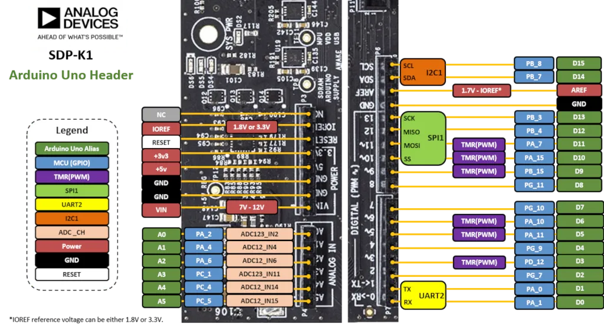
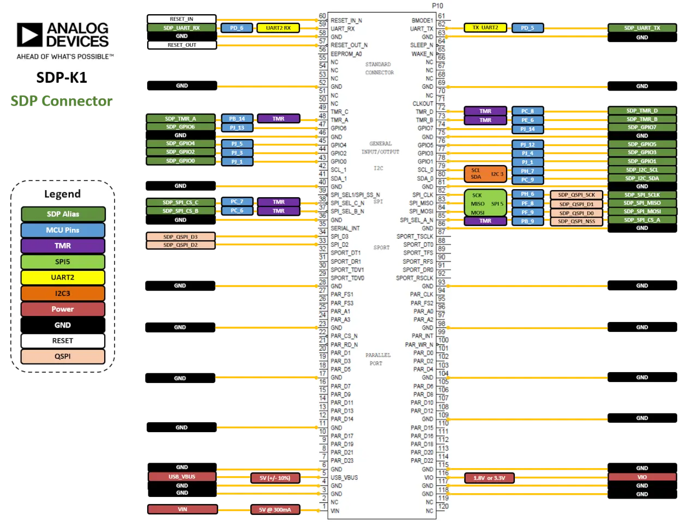

.. zephyr:board:: adi_sdp_k1

Overview
********

The EVAL-SDP-CK1Z (SDP-K1) controller board is a system demonstration platform
(SDP) from Analog Devices designed to connect to evaluation shields containing
ADI components.

- STM32 microcontroller in BGA216 package
- USB 2.0 device with USB-C connector
- USB debug interface supporting CMSIS-DAP through a NXP Freescale
  microcontroller
- Flexible board power supply
    - USB VBUS 5 V max. 500 mA
    - 5.5mm DC power jack 7 - 12 V min. 300 mA
    - VIN from Arduino* compatible connectors
    - VIN from 120-pin connector 5 V min. 300 mA
- 3 color LEDs (green, orange, red) and 1 status LED
- One push-buttons: RESET
- 16MB SDRAM
- Arduino UNO and 120-pin SDP connectors

More information about the board can be found on the `ADI SDP-K1 website`_.

Hardware
********

ADI SDP-K1 provides the following hardware components:

- STM32F469NIH6 in BGA216 package
- ARM |reg| 32-bit Cortex |reg| -M4 CPU with FPU
- 180 MHz max CPU frequency
- VDD of 1.8 V or 3.3 V
- 2 MB Flash
- 384 KB SRAM
- GPIO with external interrupt capability
- LCD parallel interface, 8080/6800 modes
- LCD TFT controller supporting up to XGA resolution
- MIPI |reg|  DSI host controller supporting up to 720p 30Hz resolution
- 3x12-bit ADC with 24 channels
- 2x12-bit D/A converters
- RTC
- Advanced-control Timer
- General Purpose Timers (17)
- Watchdog Timers (2)
- USART/UART (8)
- I2C (3)
- SPI (6)
- 1xSAI (serial audio interface)
- SDIO
- 2xCAN
- USB 2.0 OTG FS with on-chip PHY
- USB 2.0 OTG HS/FS with dedicated DMA, on-chip full-speed PHY and ULPI
- 10/100 Ethernet MAC with dedicated DMA
- 8- to 14-bit parallel camera
- CRC calculation unit
- True random number generator
- DMA Controller

More information about STM32F469NI can be found here:
       - `STM32F469NI product page`_
       - `STM32F469 reference manual`_

Supported Features
==================

.. zephyr:board-supported-hw::

Pin Mapping
===========

For more details please refer to `EVAL-SDP-CK1Z User Guide`_.

Arduino UNO headers
-------------------

   ADI SDP-K1 (Credit: Analog Devices, Inc.)

120-pin SDP connector
---------------------

   ADI SDP-K1 (Credit: Analog Devices, Inc.)

Default Zephyr Peripheral Mapping:
----------------------------------

- UART_5 TX/RX : P2 (DAPLink USB-C)
- UART_5 TX/RX : P8 (DAPLink two position through hole)
- LED1 : DS6 (Red)
- LED2 : DS5 (Orange)
- LED3 : DS4 (Green)
- LED4 : DS4 (Status)

Programming and Debugging
*************************

.. zephyr:board-supported-runners::

The ADI SDP-K1 be programmed over USB using the DAPLink firmware running on an
embedded NXP Freescale microcontroller or a 10-pin ``DEBUG`` header connected
to a STLINK debugger.

DAPLink exposes a storage device, as well as USB HID and CDC Endpoints, to the
host. For more details please refer to the `Official DAPLink website`_.

Flashing
========

Flashing an application with a STLINK debugger
----------------------------------------------

First, connect the STLINK debugger to your host computer using the Micro-USB port.
Then attach the debugger to the 10-pin ``DEBUG`` header on the SDP-K1. Finally
connect the SDP-K1 to your host computer using the USB-C port.

Run a serial host program to connect with your board:

.. code-block:: console

   $ minicom -D /dev/serial/by-id/usb-ARM_DAPLink_CMSIS-DAP_<...>

Here is an example for the :zephyr:code-sample:`hello_world` application.

.. zephyr-app-commands::
   :zephyr-app: samples/hello_world
   :board: adi_sdp_k1
   :goals: build flash

You should see the following message on the console:

.. code-block:: console

   Hello World! adi_sdp_k1

Debugging
=========

.. _ADI SDP-K1 website:
   https://www.analog.com/en/design-center/evaluation-hardware-and-software/evaluation-boards-kits/sdp-k1.html

.. _EVAL-SDP-CK1Z User Guide:
   https://www.analog.com/media/en/technical-documentation/user-guides/EVAL-SDP-CK1Z-UG-1539.pdf

.. _STM32F469NI product page:
   https://www.st.com/en/microcontrollers/stm32f469ni.html

.. _STM32F469 reference manual:
   https://www.st.com/resource/en/reference_manual/dm00127514.pdf

.. _Official DAPLink website:
   https://daplink.io/
