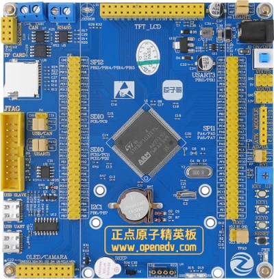

.. zephyr:board:: elite_dnf103

Overview
********

The STM32F103 Elite development board from ALIENTEK is built around an
STM32F103ZET6 ARM Cortex-M3 microcontroller. It provides a broad set of
on-board peripherals for evaluation and prototyping:

- STM32F103ZET6 MCU (72 MHz Cortex-M3, 512 KB Flash, 64 KB SRAM)
- 8 MHz high-speed external crystal and 32.768 kHz low-speed crystal
- 16 Mbit (2 MiB) SPI NOR Flash (NM25Q128)
- 256-byte I2C EEPROM (AT24C02)
- Two user LEDs (PB5 and PE5, active low)
- Three user buttons: WK_UP (PA0), KEY0 (PE4) and KEY1 (PE3)
- Buzzer (PB8, active high)
- ADC input (PA0) and DAC output (PA4) headers
- 3x USART, 2x I2C, 3x SPI, CAN and USB 2.0 full-speed interfaces
- SWD/JTAG debug header

More information about the board can be found at the `ALIENTEK website`_.

Hardware
********

The STM32F103ZET6 SoC provides the following hardware features:

- Core: ARM 32-bit Cortex-M3 CPU, up to 72 MHz
- Memories: 512 KB Flash and 64 KB SRAM
- Clock sources:

  - 4 to 16 MHz high-speed external crystal
  - 32 kHz low-speed external crystal for RTC
  - Internal 8 MHz factory-trimmed RC
  - Internal 40 kHz RC

- Up to 112 fast I/Os
- 3x 12-bit ADC with up to 21 channels
- 2x 12-bit DAC
- Timers:

  - 4x general-purpose 16-bit
  - 2x advanced-control 16-bit
  - 2x basic 16-bit
  - 2x watchdog (independent and window)
  - SysTick

- Communication interfaces:

  - 3x USART and 2x UART
  - 2x I2C
  - 3x SPI
  - CAN 2.0B
  - USB 2.0 full-speed
  - SDIO

- 12-channel DMA controller
- RTC, CRC calculation unit and 96-bit unique ID
- Debug: SWD and JTAG

Supported Features
==================

.. zephyr:board-supported-hw::

Connections and IOs
===================

Default Zephyr Peripheral Mapping:
----------------------------------

- USART1_TX : PA9
- USART1_RX : PA10
- USART2_TX : PA2
- USART2_RX : PA3
- USART3_TX : PB10
- USART3_RX : PB11
- I2C1_SCL  : PB6
- I2C1_SDA  : PB7
- SPI2_SCK  : PB13
- SPI2_MISO : PB14
- SPI2_MOSI : PB15
- SPI2_CS (NM25Q128) : PB12
- USB_DM : PA11
- USB_DP : PA12
- CAN_TX : PA12 (shared with USB_DP, disabled by default)
- CAN_RX : PA11 (shared with USB_DM, disabled by default)
- LED0 : PB5
- LED1 : PE5
- KEY0 : PE4
- KEY1 : PE3
- WK_UP : PA0
- BEEP : PB8

System Clock
------------

The system clock is driven by the PLL at 72 MHz, sourced from the 8 MHz
high-speed external crystal.

Serial Port
-----------

The Zephyr console output is assigned to USART1 (PA9/PA10). Default settings
are 115200 8N1.

Programming and Debugging
*************************

.. zephyr:board-supported-runners::

Flashing
========

The board is programmed through a CMSIS-DAP (DAPLink) probe connected to the
SWD header. The OpenOCD runner configuration is provided in
``boards/alientek/elite_dnf103/support/openocd.cfg``.

Build and flash an application in the usual way. Here is an example for the
:zephyr:code-sample:`hello_world` application:

.. zephyr-app-commands::
   :zephyr-app: samples/hello_world
   :board: elite_dnf103
   :goals: build flash

You should see the following message on the console:

.. code-block:: console

   Hello World! arm

Debugging
=========

You can debug an application in the usual way. Here is an example for the
:zephyr:code-sample:`hello_world` application:

.. zephyr-app-commands::
   :zephyr-app: samples/hello_world
   :board: elite_dnf103
   :maybe-skip-config:
   :goals: debug

References
**********

.. _ALIENTEK website:
   https://www.alientek.com/
