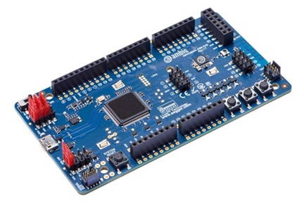

.. _apollo3_evb:

Ambiq Apollo3 Blue EVB
######################

Apollo3 Blue EVB is a board by Ambiq featuring their ultra-low power Apollo3 Blue SoC.

Hardware
********

- Apollo3 Blue SoC with up to 96 MHz operating frequency
- ARM® Cortex® M4F core
- 16 kB 2-way Associative/Direct-Mapped Cache per core
- Up to 1 MB of flash memory for code/data
- Up to 384 KB of low leakage / low power RAM for code/data
- Integrated Bluetooth 5 Low-energy controller

For more information about the Apollo3 Blue SoC and Apollo3 Blue EVB board:

- `Apollo3 Blue Website`_
- `Apollo3 Blue Datasheet`_
- `Apollo3 Blue EVB Website`_

Supported Features
==================

The Apollo3 Blue EVB board configuration supports the following hardware features:

+-----------+------------+-------------------------------------+
| Interface | Controller | Driver/Component                    |
+===========+============+=====================================+
| MPU       | on-chip    | memory protection unit              |
+-----------+------------+-------------------------------------+
| NVIC      | on-chip    | nested vector interrupt controller  |
+-----------+------------+-------------------------------------+
| SYSTICK   | on-chip    | systick                             |
+-----------+------------+-------------------------------------+
| STIMER    | on-chip    | stimer                              |
+-----------+------------+-------------------------------------+
| GPIO      | on-chip    | gpio                                |
+-----------+------------+-------------------------------------+
| UART      | on-chip    | serial                              |
+-----------+------------+-------------------------------------+
| WDT       | on-chip    | watchdog                            |
+-----------+------------+-------------------------------------+
| RADIO     | on-chip    | bluetooth                           |
+-----------+------------+-------------------------------------+

The default configuration can be found in the defconfig file:
``boards/arm/apollo3_evb/apollo3_evb_defconfig``.

Programming and Debugging
=========================

Flashing an application
-----------------------

Connect your device to your host computer using the JLINK USB port.
The sample application :ref:`hello_world` is used for this example.
Build the Zephyr kernel and application, then flash it to the device:

.. zephyr-app-commands::
   :zephyr-app: samples/hello_world
   :board: apollo3_evb
   :goals: flash

.. note::
   `west flash` requires `SEGGER J-Link software`_ and `pylink`_ Python module
   to be installed on you host computer.

Open a serial terminal (minicom, putty, etc.) with the following settings:

- Speed: 115200
- Data: 8 bits
- Parity: None
- Stop bits: 1

Reset the board and you should be able to see on the corresponding Serial Port
the following message:

.. code-block:: console

   Hello World! apollo3_evb

.. _Apollo3 Blue Website:
   https://ambiq.com/apollo3-blue/

.. _Apollo3 Blue Datasheet:
   https://contentportal.ambiq.com/documents/20123/388390/Apollo3-Blue-SoC-Datasheet.pdf

.. _Apollo3 Blue EVB Website:
   https://www.ambiq.top/en/apollo3-blue-soc-eval-board

.. _SEGGER J-Link software:
   https://www.segger.com/downloads/jlink

.. _pylink:
   https://github.com/Square/pylink
