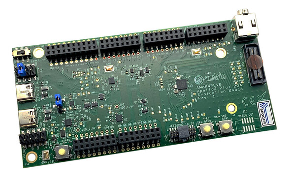

.. _apollo4p_evb:

Ambiq Apollo4P EVB
##################

Apollo4P EVB is a board by Ambiq featuring their ultra-low power Apollo4 Plus SoC.

Hardware
********

- Apollo4 Plus SoC with upto 192 MHz operating frequency
- ARM® Cortex® M4F core
- 64 kB 2-way Associative/Direct-Mapped Cache per core
- Up to 2 MB of non-volatile memory (NVM) for code/data
- Up to 2.75 MB of low leakage / low power RAM for code/data
- 384 kB Tightly Coupled RAM
- 384 kB Extended RAM

For more information about the Apollo4 Plus SoC and Apollo4P EVB board:

- `Apollo4 Plus Website`_
- `Apollo4 Plus Datasheet`_
- `Apollo4P EVB Website`_

Supported Features
==================

The Apollo4P EVB board configuration supports the following hardware features:

+-----------+------------+-------------------------------------+
| Interface | Controller | Driver/Component                    |
+===========+============+=====================================+
| MPU       | on-chip    | memory protection unit              |
+-----------+------------+-------------------------------------+
| NVIC      | on-chip    | nested vector interrupt controller  |
+-----------+------------+-------------------------------------+
| SYSTICK   | on-chip    | systick                             |
+-----------+------------+-------------------------------------+
| STIMER    | on-chip    | stimer                              |
+-----------+------------+-------------------------------------+
| GPIO      | on-chip    | gpio                                |
+-----------+------------+-------------------------------------+
| UART      | on-chip    | serial                              |
+-----------+------------+-------------------------------------+
| WDT       | on-chip    | watchdog                            |
+-----------+------------+-------------------------------------+
| SPI(M)    | on-chip    | spi                                 |
+-----------+------------+-------------------------------------+
| I2C(M)    | on-chip    | i2c                                 |
+-----------+------------+-------------------------------------+

The default configuration can be found in
:zephyr_file:`boards/ambiq/apollo4p_evb/apollo4p_evb_defconfig`

Programming and Debugging
=========================

Flashing an application
-----------------------

Connect your device to your host computer using the JLINK USB port.
The sample application :ref:`hello_world` is used for this example.
Build the Zephyr kernel and application, then flash it to the device:

.. zephyr-app-commands::
   :zephyr-app: samples/hello_world
   :board: apollo4p_evb
   :goals: flash

.. note::
   `west flash` requires `SEGGER J-Link software`_ and `pylink`_ Python module
   to be installed on you host computer.

Open a serial terminal (minicom, putty, etc.) with the following settings:

- Speed: 115200
- Data: 8 bits
- Parity: None
- Stop bits: 1

Reset the board and you should be able to see on the corresponding Serial Port
the following message:

.. code-block:: console

   Hello World! apollo4p_evb

.. _Apollo4 Plus Website:
   https://ambiq.com/apollo4-plus/

.. _Apollo4 Plus Datasheet:
   https://contentportal.ambiq.com/documents/20123/388415/Apollo4-Plus-SoC-Datasheet.pdf

.. _Apollo4P EVB Website:
   https://www.ambiq.top/en/apollo4-plus-soc-eval-board

.. _SEGGER J-Link software:
   https://www.segger.com/downloads/jlink

.. _pylink:
   https://github.com/Square/pylink
