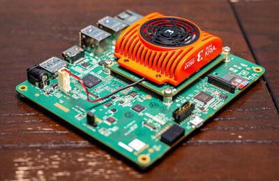

.. _kv260_r5:

Xilinx KV260 Development Board RPU Cortex-R5
############################################

Overview
********
This configuration provides support for the RPU, real-time processing unit on Xilinx
KV260 development board, it can operate as following:

* Two independent R5 cores with their own TCMs (tightly coupled memories)
* Or as a single dual lock step unit with double the TCM size.

This processing unit is based on an ARM Cortex-R5 CPU, it also enables the following devices:

* ARM PL-390 Generic Interrupt Controller
* Xilinx Zynq TTC (Cadence TTC)
* Xilinx Zynq UART

Hardware
********
Supported Features
==================

The following hardware features are supported:

+--------------+------------+----------------------+
| Interface    | Controller | Driver/Component     |
+==============+============+======================+
| GIC          | on-chip    | generic interrupt    |
|              |            | controller           |
+--------------+------------+----------------------+
| TTC          | on-chip    | system timer         |
+--------------+------------+----------------------+
| UART         | on-chip    | serial port          |
+--------------+------------+----------------------+

The kernel currently does not support other hardware features on this platform.

Devices
========
System Timer
------------

This board configuration uses a system timer tick frequency of 1000 Hz.

Serial Port
-----------

This board configuration uses a single serial communication channel with the
on-chip UART1.

Memories
--------

Although Flash, DDR and OCM memory regions are defined in the DTS file,
all the code plus data of the application will be loaded in the sram0 region,
which points to the DDR memory. The ocm0 memory area is currently available
for usage, although nothing is placed there by default.

Known Problems or Limitations
==============================

The following platform features are unsupported:

* Dual-redundant Core Lock-step (DCLS) execution is not supported yet.
* Only the first core of the R5 subsystem is supported.
* Xilinx Zynq TTC driver does not support tickless mode operation.
* The Cortex-R5 and the Cortex-A53 shares the same UART controller, more details below.

Programming and Debugging
*************************

Currently the best way to run this sample is by loading it through remoteproc
from the APU, running Linux, to the RPU, assuming the target board has a compatible
Linux kernel.
Users can make use of Xilinx's pre-built Petalinux reference images as a starting point to enable
remoteproc support, it is based around 5.15 Xilinx maintained kernel, as described here:

https://xilinx-wiki.atlassian.net/wiki/spaces/A/pages/1641152513/Kria+K26+SOM#PetaLinux

The other option is to use the reference image from the openAMP project, the link
below points, betweem the options, to the kv260 target:

https://github.com/OpenAMP/openamp-ci-builds/releases/tag/v2022.12

Select the option ``xilinx-kv260.tar.gz``, and just decompress it to the target rootfs
partition of user's SD card:

.. code-block:: console

        $ sudo mount /dev/<user-sd> /media/rootfs
        $ sudo tar -C /media/rootfs -xzf xilinx-kv260.tar.gz
        $ sudo umount /media/rootfs

Your SD file may be ready for use, just plug it to the slot located in the board.

After getting the Linux image running on the target board, build a Zephyr application,
such as the hello world sample shown below:

.. zephyr-app-commands::
   :zephyr-app: samples/hello_world
   :host-os: unix
   :board: kv260_r5
   :goals: build

Due to a hardware limitation, both Linux and Zephyr share the same UART
controller, meaning when the Zephyr application is started it will takeover the
console from Linux.

To avoid this limitation when accessing the Linux shell, the best approach is to
connect to the board using ``ssh`` over the network (not using the FTDI
USB interface on the board), with the dev board and the host computer
connected to the same network.

Assuming you are using the default ``petalinux`` user from the Xilinx
reference image , open a terminal on the host machine and ssh into the
development board with the board's IP address (found via ``ifconfig``):

.. code-block:: console

        $ ssh petalinux@<board-ip-address>

The initial password should be ``petalinux``. On another terminal deploy
the Zephyr application ``.elf`` file using utility like the ``scp`` or ``rsync``,
for example:

.. code-block:: console

        $ scp /path/to/zephyr_app_elf_file  petalinux@<board-ip-address>:/home/petalinux

After that move the file to ``/lib/firmware`` directory, then you be able to start the firmware
on the desired RPU via remoteproc with:

.. code-block:: console

        $ sudo -i # You need to operate the remoteproc as root
        $ echo zephyr.elf > /sys/class/remoteproc/remoteproc0/firmware
        $ echo start > /sys/class/remoteproc/remoteproc0/state

With another terminal connected to UART1 on the host machine
(available via one of the tty ports with the on-board FTDI chip),
you should see the Zephyr application running:

.. code-block:: console

        *** Booting Zephyr OS build v3.4.0  ***
        Hello World kv260_r5!

References
**********

1. ARMv7-A and ARMv7-R Architecture Reference Manual (ARM DDI 0406C ID051414)
2. Cortex-R5 and Cortex-R5F Technical Reference Manual (ARM DDI 0460C ID021511)
3. Zynq UltraScale+ Device Technical Reference Manual (UG1085)
4. Kria KV260 Vision AI Starter Kit User Guide (UG1089)
