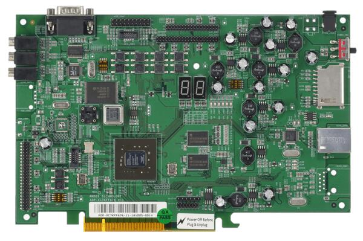
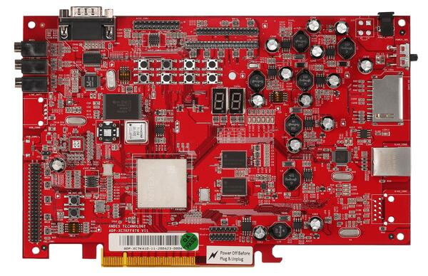
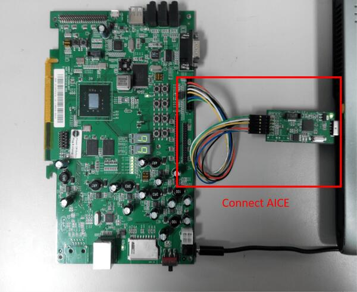

.. _adp_xc7k_ae350:

Andes ADP-XC7K AE350
####################

Overview
********

ADP-XC7K AE350 board is for AndeShape AE350 platform on ADP-XC7K series
FPGA-based development boards.

ADP-XC7K series are FPGA-based development and prototyping boards for evaluation of
variety of AndesCore processors and AndeShape SoC platform IPs.
AE350 is a RISC-V platform which can integrate AndesCore CPUs with a collection
of fundamental peripheral IPs.

1st figure shows the green PCB is ADP-XC7K160 and 2nd figure shows the red PCB is ADP-XC7K410.

More information can be found on `ADP-XC7K160/410`_ and `AndeShape AE350`_ websites.

Hardware
********

The ADP-XC7K AE350 platform integrates 1 ~ 4 cores 32/64-bit 60MHz RISC-V CPUs, DSP,
1GB RAM, Cache, SPI flash memory, ethernet controller and other peripherals.

The ADP-XC7K AE350 platform provides following hardware components:

- 1 ~ 4 cores 32/64-bit 60MHz AndeStar v5 RISC-V CPUs
- 1GB on-board SDRAM
- 2MB SPI flash memory (1MB can be used for XIP)
- UART
- I2C
- SPI
- GPIO
- PWM
- DMA
- 10/100 Ethernet RJ45 port
- LCD module connector
- 16KB I2C EEPROM
- SD memory card slot
- MIC-in, Line-in, and Line-out with AC97 audio codec

Supported Features
==================

The ``adp_xc7k/ae350`` board configuration supports the following hardware features:

+----------------+------------+----------------------+
| Interface      | Controller | Driver/Component     |
+================+============+======================+
| PLIC           | on-chip    | interrupt_controller |
+----------------+------------+----------------------+
| RISC-V Machine | on-chip    | timer                |
| Timer          |            |                      |
+----------------+------------+----------------------+
| GPIO           | on-chip    | gpio                 |
+----------------+------------+----------------------+
| UART           | on-chip    | serial               |
+----------------+------------+----------------------+
| COUNTER        | on-chip    | counter              |
+----------------+------------+----------------------+
| SPI            | on-chip    | spi                  |
+----------------+------------+----------------------+
| I2C            | on-chip    | i2c                  |
+----------------+------------+----------------------+
| EEPROM         | on-chip    | eeprom               |
+----------------+------------+----------------------+
| FLASH          | on-chip    | flash                |
+----------------+------------+----------------------+
| HWINFO         | on-chip    | syscon               |
+----------------+------------+----------------------+
| MAILBOX        | on-chip    | mbox                 |
+----------------+------------+----------------------+
| DMA            | on-chip    | dma                  |
+----------------+------------+----------------------+
| WATCHDOG       | on-chip    | wdt                  |
+----------------+------------+----------------------+

Other hardware features are not supported yet.

Connections and IOs
===================

The ADP-XC7K AE350 platform has 1 GPIO controller. It providing 32 bits of IO.
It is responsible for pin input/output, pull-up, etc.

Mapping from GPIO controller to the ADP-XC7K board pins:

+--------------------+--------------------+
| GPIO controller    | Usage / Board pins |
+====================+====================+
| **Push Buttons**   |                    |
+--------------------+--------------------+
| GPIO.0             | SW1                |
+--------------------+--------------------+
| GPIO.1             | SW2                |
+--------------------+--------------------+
| GPIO.2             | SW3                |
+--------------------+--------------------+
| GPIO.3             | SW4                |
+--------------------+--------------------+
| GPIO.4             | SW5                |
+--------------------+--------------------+
| GPIO.5             | SW6                |
+--------------------+--------------------+
| GPIO.6             | SW7                |
+--------------------+--------------------+
| **7-Segment LED1** |                    |
+--------------------+--------------------+
| GPIO.16            | 7SEG1.A            |
+--------------------+--------------------+
| GPIO.17            | 7SEG1.B            |
+--------------------+--------------------+
| GPIO.18            | 7SEG1.C            |
+--------------------+--------------------+
| GPIO.19            | 7SEG1.D            |
+--------------------+--------------------+
| GPIO.20            | 7SEG1.E            |
+--------------------+--------------------+
| GPIO.21            | 7SEG1.F            |
+--------------------+--------------------+
| GPIO.22            | 7SEG1.G            |
+--------------------+--------------------+
| GPIO.23            | 7SEG1.DP           |
+--------------------+--------------------+
| **7-Segment LED2** |                    |
+--------------------+--------------------+
| GPIO.24            | 7SEG2.A            |
+--------------------+--------------------+
| GPIO.25            | 7SEG2.B            |
+--------------------+--------------------+
| GPIO.26            | 7SEG2.C            |
+--------------------+--------------------+
| GPIO.27            | 7SEG2.D            |
+--------------------+--------------------+
| GPIO.28            | 7SEG2.E            |
+--------------------+--------------------+
| GPIO.29            | 7SEG2.F            |
+--------------------+--------------------+
| GPIO.30            | 7SEG2.G            |
+--------------------+--------------------+
| GPIO.31            | 7SEG2.DP           |
+--------------------+--------------------+
| **GPIO pins**      |                    |
+--------------------+--------------------+
| GPIO.7             | IDE_CON1.4         |
+--------------------+--------------------+
| GPIO.8             | IDE_CON1.6         |
+--------------------+--------------------+
| GPIO.9             | IDE_CON1.8         |
+--------------------+--------------------+
| GPIO.10            | IDE_CON1.10        |
+--------------------+--------------------+
| GPIO.11            | IDE_CON1.11        |
+--------------------+--------------------+
| GPIO.12            | IDE_CON1.12        |
+--------------------+--------------------+
| GPIO.13            | IDE_CON1.13        |
+--------------------+--------------------+
| GPIO.14            | IDE_CON1.14        |
+--------------------+--------------------+
| GPIO.15            | IDE_CON1.15        |
+--------------------+--------------------+

Other peripheral mapping are listed below:

+-------------+---------------------------------+
| Peripherals | Usage / Board pins              |
+=============+=================================+
| SPI_1       | internal connected to SPI Flash |
+-------------+---------------------------------+
| SPI_2_CS    | IDE_CON1.37                     |
+-------------+---------------------------------+
| SPI_2_MOSI  | IDE_CON1.36                     |
+-------------+---------------------------------+
| SPI_2_MISO  | IDE_CON1.38                     |
+-------------+---------------------------------+
| SPI_2_SCLK  | IDE_CON1.35                     |
+-------------+---------------------------------+
| I2C_SDA     | J27.1                           |
+-------------+---------------------------------+
| I2C_SCL     | J27.2                           |
+-------------+---------------------------------+

System Clock
------------

The ADP-XC7K AE350 platform has 60MHz core clock.

Serial Port
-----------

The ADP-XC7K AE350 platform has 2 UARTs.
The Zephyr console output is by default assigned to UART2 and the default
settings are 115200 8N1.

Programming and debugging
*************************

For debugging zephyr applications or burning them into a flash, you will need to
connect Andes ICE from host computer to ADP-XC7K board and execute the
Andes ICE management software, ICEman, on this host computer.

Connecting Andes ICE (AICE)
===========================

AICE is used for flashing and debugging the board. Please connect AICE to both
ADP-XC7K board and the host computer as shown in the figure.

More information can be found on `AICE-MINI+`_, `AICE-MICRO`_ website

Building
========

You can build applications in the usual way. Here is an example for
the :ref:`hello_world` application.

.. zephyr-app-commands::
   :zephyr-app: samples/hello_world
   :board: adp_xc7k/ae350
   :goals: build

Flashing
========

Before flashing, you have to download ICEman (``ice.zip``) from the
`Andes Development Kit`_.
If you want to use XIP mode (``CONFIG_XIP=y``), you also need to download
the flash burner (``flash.zip``).

At first, you should run ICEman when flashing and debugging program.

.. code-block:: console

   # Enable execute file permission of ICEman
   chmod a+x ./ICEman

   # Running the ICEman server
   sudo ./ICEman -Z v5

.. note::

   To run ICEman commands as a normal user, you will need to install the
   :file:`70-ndsusb-v1.rules` udev rules file (usually by placing it in
   :file:`/etc/udev/rules.d`, then unplugging and plugging the
   AICE adapter in again via USB.).

If ``CONFIG_XIP=n``, you can load the program (``zephyr.elf``) into RAM directly
and execute it.

.. code-block:: console

   # Check the ICEman server is running
   # Load the program into RAM and execute it
   riscv64-zephyr-elf-gdb build/zephyr/zephyr.elf
   (gdb) target remote :1111
   (gdb) monitor reset halt
   (gdb) load
   (gdb) quit

If ``CONFIG_XIP=y``, you need to burn the program (``zephyr.bin``) into flash memory
and execute it.

.. code-block:: console

   # Check the ICEman server is running
   # Burn the program into flash and execute it
   <FLASH>/bin/target_burn_frontend \
       -P 4444 --unlock --verify --image=build/zephyr/zephyr.bin \
       --algorithm-bin=<FLASH>/target_bin/target_SPI_v5_[32|64].bin

   # Note:
   #   1. Assume the flash burner is downloaded to <FLASH> directory
   #   2. For algorithm-bin file, use target_SPI_v5_32.bin in RV32 platform and
   #      use target_SPI_v5_64.bin in RV64 platform

Open a serial terminal with the following settings:

- Speed: 115200
- Data: 8 bits
- Parity: None
- Stop bits: 1

you should see the following message in the terminal:

.. code-block:: console

   ***** Booting Zephyr OS v2.4.0 *****
   Hello World! adp_xc7k

Debugging
=========

.. code-block:: console

   # Check the ICEman server is running
   # Load and debug program
   ./riscv64-zephyr-elf-gdb build/zephyr/zephyr.elf
   (gdb) target remote :1111
   (gdb) monitor reset halt
   (gdb) load

If ``CONFIG_XIP=y``, please follow the flashing section to burn the program into
flash memory first.
Then, you can use GDB to debug program by above commands but do NOT execute ``load``
command since the program has been placed in the flash memory.

References
**********

.. target-notes::

.. _ADP-XC7K160/410: http://www.andestech.com/en/products-solutions/andeshape-platforms/adp-xc7k160-410/

.. _AndeShape AE350: http://www.andestech.com/en/products-solutions/andeshape-platforms/ae350-axi-based-platform-pre-integrated-with-n25f-nx25f-a25-ax25/

.. _AICE-MINI+: http://www.andestech.com/en/products-solutions/andeshape-platforms/aice-mini-plus/

.. _AICE-MICRO: http://www.andestech.com/en/products-solutions/andeshape-platforms/aice-micro/

.. _Andes Development Kit: https://github.com/andestech/Andes-Development-Kit/releases
