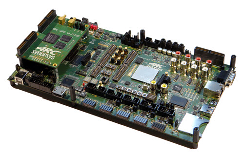

.. _axs:

DesignWare(R) ARC(R) AXS Software Development platform
######################################################

Overview
********

The DesignWare(R) ARC(R) Software Development Platforms are a mainboard
with a CPU card that provide complete, standalone platforms for software
development, debugging, and profiling. Synopsys currently has two Software
Development Platforms available: AXS101 and AXS103. currently, only AXS103
is supported in zephyr.

For details about the board, see: `DesignWare ARC Software Development Platforms
<https://www.synopsys.com/dw/ipdir.php?ds=arc-software-development-platform>`_

Hardware
********

For hardware feature details, refer to :

- `DesignWare ARC AXC003 CPU Card Datasheet
  <https://www.synopsys.com/dw/doc.php/ds/cc/arc_axc003_cpu_card.pdf>`_
- `DesignWare ARC AXS103 Software Development Platform Datasheet
  <https://www.synopsys.com/dw/doc.php/ds/cc/arc_axs103_sdp.pdf>`_

Programming and Debugging
*************************

Required Hardware and Software
==============================

To use Zephyr RTOS applications on the AXS Software Development platform,
a few additional pieces of hardware are required.

* A micro USB cable provides USB-JTAG debug and USB-UART communication
  to the board

* A universal switching power adaptor (110-240V
  AC to 12V DC), provided in the package, provides power to the board.

* :ref:`The Zephyr SDK <zephyr_sdk>`

* Terminal emulator software for use with the USB-UART. Suggestion:
  `Putty Website`_.

* (optional) A collection of Pmods, Arduino modules, or Mikro modules.
  See `Digilent Pmod Modules`_ or develop your custom interfaces to attach
  to the Pmod connector.

Set up the AXS Software Development platform
============================================

To run Zephyr application on AXS Software Development platform,
you need to setup the board correctly.

* Connect the digilent USB cable from your host to the board.

* Connect the 12V DC power supply to your board

Building Sample Applications
==============================

You can try many of the :ref:`sample applications and demos
<samples-and-demos>`.  We'll use :ref:`hello_world`, found in
:zephyr_file:`samples/hello_world` as an example.

Configuring
-----------

You may need to write a prj_arc.conf file if the sample doesn't have one.
Next, you can use the menuconfig rule to configure the target. By specifying
``axs`` as the board configuration, you can select the AXS Software
Development platform support for Zephyr.

.. zephyr-app-commands::
   :board: axs
   :zephyr-app: samples/hello_world
   :goals: menuconfig

Building
--------

You can build an application in the usual way.  Refer to
:ref:`build_an_application` for more details. Here is an example for
:ref:`hello_world`.

.. zephyr-app-commands::
   :board: axs
   :zephyr-app: samples/hello_world
   :maybe-skip-config:
   :goals: build

Connecting Serial Output
========================

In the default configuration, Zephyr's AXS Software Development platform
images support serial output via the USB-UART on the board.
To enable serial output:

* Open a serial port emulator (i.e. on Linux minicom, putty, screen, etc)

* Specify the tty driver name, for example, on Linux this may be
  :file:`/dev/ttyUSB0`

* Set the communication settings to:

========= =====
Parameter Value
========= =====
Baud:     115200
Data:     8 bits
Parity:    None
Stopbits:  1
========= =====

Debugging
==========

Using the latest version of Zephyr SDK(>=0.9), you can debug and flash AXS
Software Development platform directly.

One option is to build and debug the application using the usual
Zephyr build system commands.

.. zephyr-app-commands::
   :board: axs
   :app: <my app>
   :goals: debug

At this point you can do your normal debug session. Set breakpoints and then
:kbd:`c` to continue into the program.

The other option is to launch a debug server, as follows.

.. zephyr-app-commands::
   :board: axs
   :app: <my app>
   :goals: debugserver

Then connect to the debug server at the AXS Software Development platform from
a second console, from the build directory containing the output :file:`zephyr.elf`.

.. code-block:: console

   $ cd <my app>
   $ $ZEPHYR_SDK_INSTALL_DIR/arc-zephyr-elf/bin/arc-zephyr-elf-gdb zephyr.elf
   (gdb) target remote localhost:3333
   (gdb) load
   (gdb) b main
   (gdb) c

Flashing
========

If you just want to download the application to the AXS Software Development
platform's DDR and run, you can do so in the usual way.

.. zephyr-app-commands::
   :board: axs
   :app: <my app>
   :goals: flash

This command with help of openocd to load the application elf file to
AXS Software Development platform, but it will load the application and immediately
run. If power is removed, the application will be lost since it wasn't written to flash.

Most of the time you will not be flashing your program but will instead debug
it using openocd and gdb. The program can be download via the USB cable into
the code and data memories.

References
**********

.. target-notes::

.. _DesignWare ARC Software Development Platforms:
   https://www.synopsys.com/dw/ipdir.php?ds=arc-software-development-platform

.. _Putty website:
   http://www.putty.org

.. _Digilent Pmod Modules:
   http://store.digilentinc.com/pmod-modules
