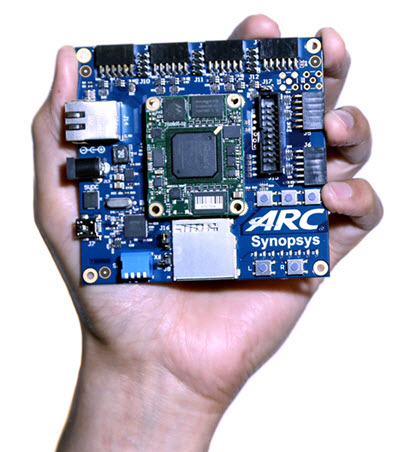

.. _em_starterkit:

DesignWare(R) ARC(R) EM Starter Kit
###################################

Overview
********

The DesignWare(R) ARC(R) EM Starter Kit is a low-cost, versatile solution
enabling rapid software development and software debugging, and profiling
for the ARC EM Family of processors. The EM Family includes the EM4, EM6,
EM5D, EM7D, EM9D, and EM11D cores. The Zephyr RTOS can be used with the
EM Starter Kit.

The ARC EM Starter Kit consists of a hardware platform, including pre-installed
FPGA images of different ARC EM processor configurations with peripherals.
Documentation for this board can be found at the following URL:
https://www.embarc.org.

See also this URL for details about the board:
https://www.synopsys.com/dw/ipdir.php?ds=arc_em_starter_kit

The lastest version of EM Starter Kit is 2.3, developer can upgrade from
2.0/2.1/2.2 to 2.3 using latest firmware.
The default configuration for EM Starter Kit boards can be found in
:file:`boards/arc/em_starterkit/em_starterkit_defconfig`.

The default SOC for this board is the EM9D. This configuration is a Harvard
Architecture, with a separate instruction bus and data bus. Instruction memory
is called ICCM and data memory is called DCCM. The configuration file for EM9D
is found in :file:`arch/arc/soc/em9d/Kconfig.defconfig`.

If you have a larger program, you can select the EM7D or EM11D, which gives
access to 128KB DRAM with i-cache and d-cache. The configuration file for EM7D
is found in :file:`arch/arc/soc/em7d/Kconfig.defconfig` and EM11D is found in
:file:`arch/arc/soc/em11d/Kconfig.defconfig`.

.. note::

   EM7D has secureshield feature, which is not supported in Zephyr currently.

Hardware
********
Board Layout
============

The ARC EM Starter Kit main board has 6 Pmod connectors. These can be configured
to support attachment of GPIO, I2C, UART or SPI devices.

The board also has a 16MB SPI-FLASH and an SDCard for storage. There are 9 LEDs,
3 buttons, and 4 dip switches that can be used with GPIO.

The Xilinx Spartan(R)-6 LX150 FPGA can auto-load one of 3 FPGA SOC bit files
which have the EM7D, EM9D, or EM11D SOC.

Documentation and general information for the board can be found at the
`embARC-website`_, which also includes some free sample software.

Supported Features
==================

The Zephyr kernel supports multiple hardware features on the EM Starter Kit
through the use of device drivers.

The EM Starter Kit supports 6 Digilent Pmod(TM) Interfaces, which enables the
use of a large variety of pluggable modules for storage, communications,
sensors, displays, etc. With the Pmod interface, you can prototype your
applications using the Zephyr RTOS.

The table below shows which drivers are supported and which functionality can be
found on which architectures:

+-----------+------------+-----+-------+-----------------------+
| Interface | Controller |EM9D | EM11D | Driver/Component      |
+===========+============+=====+=======+=======================+
| INT       | on-chip    | Y   | Y     | interrupt_controller  |
+-----------+------------+-----+-------+-----------------------+
| UART      | usb +      | Y   | Y     | serial port-polling;  |
|           | 2 Pmods    |     |       | serial port-interrupt |
+-----------+------------+-----+-------+-----------------------+
| SPI       | 2 Pmods    | Y   | Y     | spi                   |
+-----------+------------+-----+-------+-----------------------+
| ADC       | n/a        | N   | N     | adc (can add via Pmod)|
+-----------+------------+-----+-------+-----------------------+
| I2C       | 2 Pmods    | Y   | Y     | i2c                   |
+-----------+------------+-----+-------+-----------------------+
| GPIO      | 6 Pmods    | Y   | Y     | gpio                  |
+-----------+------------+-----+-------+-----------------------+
| PWM       | n/a        | N   | N     | pwm                   |
+-----------+------------+-----+-------+-----------------------+

The board has 3 (debounced and interrupting) buttons for use with GPIO, 4 dip
switches, 9 LEDs, SDCard on SPI, and a 16MB SPI-Flash memory.

The SPI-Flash also holds 3 (or 4) separate FPGA CPU bit files, selectable via
dip switch.

The SPI-Flash is also programmed with a bootloader. The booloader can copy a
program image from SPI-Flash into executable memory.  Zephyr initialization will
copy the initialized data section to the data memory if CONFIG_XIP is used.

Programming and Debugging
*************************

Required Hardware and Software
==============================

To use Zephyr RTOS applications on the EM Starter Kit board, a few additional
pieces of hardware are required.

* USB Cable (delivered as part of the ARC EM Starter Kit)

* The USB cable provides power to the board; however, if the board is to run
  standalone, the universal switching power adaptor (110-240V AC to 5V DC),
  provided in the package, can be used to power the board.

* :ref:`The Zephyr SDK <zephyr_sdk>`

* Terminal emulator software for use with the USB-UART. Suggestion:
  http://www.putty.org.

* (optional) A collection of Pmods.
  See http://store.digilentinc.com/pmod-modules or develop your
  custom interfaces to attach to the Pmod connector.

Building Sample Applications
==============================

You can try many of the sample applications or tests, but let us discuss
the one called :ref:`hello_world`.
It is found in :file:`$ZEPHYR_BASE/samples/hello_world`.

You may need to write a prj_arc.conf file if the sample doesn't have one.
Next, you can use the make menuconfig rule to configure the target. By
providing the argument "BOARD=em_starterkit", you can select the ARC
EM Starter Kit board support for Zephyr.

.. code-block:: console

   $ make menuconfig BOARD=em_starterkit

On this board you will also need to consider the "ARC SoC Selection" and set
it either to EM9D or EM11D. To boot up the EM9D on the board, all dip
switches should be UP except for switch 1. Other configuration choices
are made in the normal way. To boot up the EM11D on the board,
all dip switches should be UP except for switch 2. Next press the button
above the letter C in the "ARC" logo on the silkscreen.

To build the application, execute make:

.. code-block:: console

   $ make BOARD=em_starterkit

Connecting Serial Output
=========================

In the default configuration, Zephyr's EM Starter Kit images support serial output
via the UART1 on the board.  To enable serial output:

On your development environment, you will need to:

* Open a serial port emulator (i.e. on Linux minicom, putty, screen, etc)
* Specify the tty driver name, for example, on Linux this may be :file:`/dev/ttyUSB1`
* Set the communication settings to:

========= =====
Parameter Value
========= =====
Baud:     115200
Data:     8 bits
Parity:    None
Stopbits:  1
========= =====

Using the latest version of Zephyr SDK(>=0.9), you can debug and flash
EM Starterkit directly.

Boot up the SOC by pressing the "C" button. Be sure the digilent cable
is attached from your host to the EM Starter Kit board.

Debugging
==========

Build and debug the application with the following commands:

.. code-block:: console

   $ cd <my app>
   $ make BOARD=em_starterkit debug

At this point you can do your normal debug session. Set breakpoints and then
'c' to continue into the program.

Launch the debug server on the emsk:

.. code-block:: console

   $ make BOARD=em_starterkit debugserver

Connect to the debug server at the emsk from a second console:

.. code-block:: console

   $ cd <my app>
   $ $ZEPHYR_SDK_INSTALL_DIR/sysroots/x86_64-pokysdk-linux/usr/bin/arc-zephyr-elf/arc-zephyr-elf-gdb outdir/em_starterkit/zephyr.elf
   (gdb) target remote localhost:3333
   (gdb) load
   (gdb) b main
   (gdb) c

Flashing
========

If you just want to download the application to the emsk's CCM or DDR and run,
you can also use this command to achieve this.

.. code-block:: console

   $ make BOARD=em_starterkit flash

This command still use openocd and gdb to load application elf file to emsk,
but it will load application and then run immediately. If power is lost,
the application will also lost due to power loss.

Most of the time you will not be flashing your program but will instead
debug it using openocd and gdb. The program can be download via the USB
cable into the code and data memories.

When you are ready to deploy the program so that it boots up automatically
on reset or power-up, you can follow the steps to place the program on
SPI-FLASH.

For instructions on how to write your program to SPI-FLASH,
refer to the documentation on the ARC EM Starter Kit at the
`embARC-website`_, which includes instructions for how to place an
executable image onto the SPI-FLASH in such a way that it is understood
by the bootloader.

Release Notes
*************

The following is a list of TODO items:

* :jira:`ZEP-1153`: Zephyr needs i-cache API (all targets)
* :jira:`ZEP-713`: Zephyr ARC port doesn't yet support nested regular interrupts.
* pinmux driver: Possibly it can be written to configure PMods too.

References
**********

.. _embARC-website: https://www.embarc.org

.. _emstarterkit-website: https://www.synopsys.com/dw/ipdir.php?ds=arc_em_starter_kit

.. _digilent-website: http://store.digilentinc.com

.. _putty-website: http://www.putty.org
