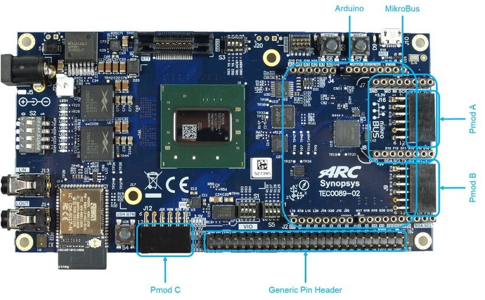

.. _emsdp:

DesignWare(R) ARC(R) EM Software Development Platform
#####################################################

Overview
********

The DesignWare® ARC® EM Software Development Platform (SDP) is a flexible platform
for rapid software development on ARC EM processor-based subsystems. It is intended
to accelerate software development and debug of ARC EM processors and subsystems for
a wide range of ultra-low power embedded applications such as IoT, sensor fusion,
and voice applications.

For details about the board, see: `DesignWare ARC EM Software Development Platform
(EM SDP) <https://www.synopsys.com/dw/ipdir.php?ds=arc-em-software-development-platform>`__

Hardware
********

The EM Software Development Platform supports different core configurations, such as EM4,
EM5D, EM6, EM7D, EM9D, EM9D+ESP, EM11D, the default core configuration is EM11D. Use
:option:`CONFIG_SOC_EMSDP_EM4`, :option:`CONFIG_SOC_EMSDP_EM5D`,
:option:`CONFIG_SOC_EMSDP_EM6`, :option:`CONFIG_SOC_EMSDP_EM7D`,
:option:`CONFIG_SOC_EMSDP_EM7D_ESP`, :option:`CONFIG_SOC_EMSDP_EM9D` or
:option:`CONFIG_SOC_EMSDP_EM11D` to select different core configuration.

The following table shows the hardware features supported for different core configuration:

+-----------+-----+-----+------+------+----------+------+-------+
| Features  | EM4 | EM6 | EM5D | EM7D | EM7D_ESP | EM9D | EM11D |
+===========+=====+=====+======+======+==========+======+=======+
| Caches    | N   | Y   | N    | Y    | Y        | N    | Y     |
+-----------+-----+-----+------+------+----------+------+-------+
| DSP       | N   | N   | Y    | Y    | Y        | Y    | Y     |
+-----------+-----+-----+------+------+----------+------+-------+
| XY Memory | N   | N   | N    | N    | N        | Y    | Y     |
+-----------+-----+-----+------+------+----------+------+-------+
| Secure    | N   | N   | N    | N    | Y        | N    | N     |
+-----------+-----+-----+------+------+----------+------+-------+

For hardware feature details, refer to : `ARC EM Software Development Platform
<https://embarc.org/embarc_osp/doc/build/html/board/emsdp.html>`__

Programming and Debugging
*************************

Required Hardware and Software
==============================

To use Zephyr RTOS applications on the EM Software Development Platform board,
a few additional pieces of hardware are required.

* A micro USB cable to connect the computer.

* A universal switching power adaptor (110-240V AC to 12 DC),
  provided in the package, which used to power the board.

* :ref:`The Zephyr SDK <zephyr_sdk>`

* Terminal emulator software for use with the USB-UART. Suggestion:
  `Putty Website`_.

* (optional) A collection of Pmods, Arduino modules, or Mikro modules.
  See `Digilent Pmod Modules`_ or develop your custom interfaces to attach
  to the Pmod connector.

Set up the EM Software Development Platform
===========================================

To run Zephyr application on EM Software Development Platform, you need to
setup the board correctly.

* Connect the 12V DC power supply to your board.

* Connect the digilent usb cable from your host to the board.

Set up Zephyr Software
======================

Building Sample Applications
==============================

You can try many of the sample applications or tests, but let us discuss
the one called :ref:`hello_world`.
It is found in :zephyr_file:`samples/hello_world`.

Configuring
-----------

You may need to write a prj_arc.conf file if the sample doesn't have one.
Next, you can use the menuconfig rule to configure the target. By specifying
``emsdp`` as the board configuration, you can select the ARC EM Software
Development Platform board support for Zephyr.

.. zephyr-app-commands::
   :board: emsdp
   :zephyr-app: samples/hello_world
   :goals: menuconfig

Building
--------

You can build an application in the usual way.  Refer to
:ref:`build_an_application` for more details. Here is an example for
:ref:`hello_world`.

.. zephyr-app-commands::
   :board: emsdp
   :zephyr-app: samples/hello_world
   :maybe-skip-config:
   :goals: build

Connecting Serial Output
=========================

In the default configuration, Zephyr's EM Software Development Platform images
support serial output via the USB-UART on the board. To enable serial output:

* Open a serial port emulator (i.e. on Linux minicom, putty, screen, etc)

* Specify the tty driver name, for example, on Linux this may be
  :file:`/dev/ttyUSB0`

* Set the communication settings to:

========= =====
Parameter Value
========= =====
Baud:     115200
Data:     8 bits
Parity:    None
Stopbits:  1
========= =====

Debugging
==========

Using the latest version of Zephyr SDK(>=0.9), you can debug and flash IoT
Development Kit directly.

One option is to build and debug the application using the usual
Zephyr build system commands.

.. zephyr-app-commands::
   :board: emsdp
   :app: <my app>
   :goals: debug

At this point you can do your normal debug session. Set breakpoints and then
'c' to continue into the program.

The other option is to launch a debug server, as follows.

.. zephyr-app-commands::
   :board: emsdp
   :app: <my app>
   :goals: debugserver

Then connect to the debug server at the EM Software Development Platform from a
second console, from the build directory containing the output :file:`zephyr.elf`.

.. code-block:: console

   $ cd <my app>
   $ $ZEPHYR_SDK_INSTALL_DIR/sysroots/x86_64-pokysdk-linux/usr/bin/ \
      arc-zephyr-elf/arc-zephyr-elf-gdb zephyr.elf
   (gdb) target remote localhost:3333
   (gdb) load
   (gdb) b main
   (gdb) c

Flashing
========

If you just want to download the application to the EM Software Development
Platform's CCM and run, you can do so in the usual way.

.. zephyr-app-commands::
   :board: emsdp
   :app: <my app>
   :goals: flash

This command still uses openocd and gdb to load the application elf file to EM
Software Development Platform, but it will load the application and immediately run.
If power is removed, the application will be lost since it wasn't written to flash.

Most of the time you will not be flashing your program but will instead debug
it using openocd and gdb. The program can be download via the USB cable into
the code and data memories.

References
**********

.. target-notes::

.. _Digilent Pmod Modules:
   http://store.digilentinc.com/pmod-modules

.. _Putty website:
   http://www.putty.org
