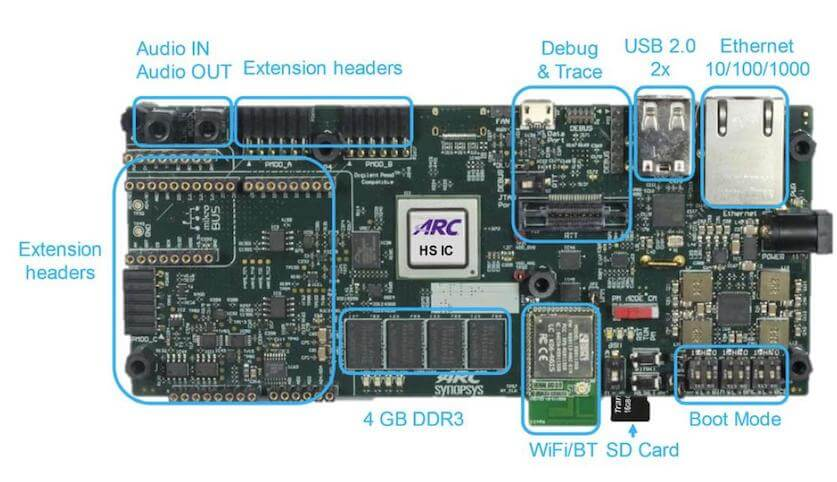
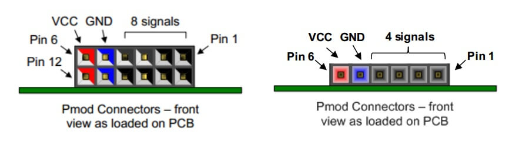
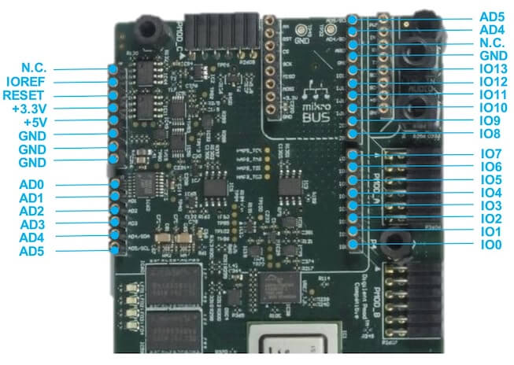

.. _hsdk:

DesignWare(R) ARC(R) HS Development Kit
########################################

Overview
********

The DesignWare(R) ARC(R) HS Development Kit is a ready-to-use platform for
rapid software development on the ARC HS3x family of processors. It supports
single- and multi-core ARC HS34, HS36 and HS38 processors and offers a wide
range of interfaces including Ethernet, WiFi, Bluetooth, USB, SDIO, I2C, SPI,
UART, I2S, ADC, PWM and GPIO. A Vivante GPU is also contained in the ARC
Development System SoC. This allows developers to build and debug complex
software on a comprehensive hardware platform

For details about the board, see: `ARC HS Development Kit
(HSDK) <https://www.synopsys.com/dw/ipdir.php?ds=arc-hs-development-kit>`__

Hardware
********

The ARC HSDK has 24 general GPIOs, which divided into 8 groups named from GPIO_SEL_0 to GPIO_SEL_7.
Each sel can configured for different functions, such as: GPIO, UART, SPI, I2C and PWM. We can program
CREG_GPIO_MUX register to do configuration for each sel. Tables below show the bit definition for
CREG_GPIO_MUX register and the details configuration for each pin.

+--------+-------------+---------+--------------+---------------------------------+
| Bit    | Name        | Access  | Reset value  | Description                     |
+--------+-------------+---------+--------------+---------------------------------+
| 2:0    | GPIO_SEL_0  | RW      | 0x0*         | GPIO mux select for gpio[3:0]   |
+--------+-------------+---------+--------------+---------------------------------+
| 5:3    | GPIO_SEL_1  | RW      | 0x0*         | GPIO mux select for gpio[7:4]   |
+--------+-------------+---------+--------------+---------------------------------+
| 8:6    | GPIO_SEL_2  | RW      | 0x0*         | GPIO mux select for gpio[11:8]  |
+--------+-------------+---------+--------------+---------------------------------+
| 11:9   | GPIO_SEL_3  | RW      | 0x0*         | GPIO mux select for gpio[15:12] |
+--------+-------------+---------+--------------+---------------------------------+
| 14:12  | GPIO_SEL_4  | RW      | 0x0*         | GPIO mux select for gpio[17:16] |
+--------+-------------+---------+--------------+---------------------------------+
| 17:15  | GPIO_SEL_5  | RW      | 0x0*         | GPIO mux select for gpio[19:18] |
+--------+-------------+---------+--------------+---------------------------------+
| 20:18  | GPIO_SEL_6  | RW      | 0x0*         | GPIO mux select for gpio[21:20] |
+--------+-------------+---------+--------------+---------------------------------+
| 23:21  | GPIO_SEL_7  | RW      | 0x0*         | GPIO mux select for gpio[23:22] |
+--------+-------------+---------+--------------+---------------------------------+

+------+-----------+----------+-----------+------------+----------+-----------+-------------+-----------+-------------+
| SELS | GPIO PINS | FUN0     | FUN1      | FUN2       | FUN3     | FUN4      | FUN5        | FUN6      | FUN7        |
+------+-----------+----------+-----------+------------+----------+-----------+-------------+-----------+-------------+
| SEL0 | 0         | gpio[0]  | uart0_cts | spi1_cs[0] | gpio[0]  | gpio[0]   | pwm_ch[6]   | pwm_ch[6] | pwm_ch[1]   |
|      +-----------+----------+-----------+------------+----------+-----------+-------------+-----------+-------------+
|      | 1         | gpio[1]  | uart0_txd | spi1_mosi  | gpio[1]  | pwm_ch[0] | gpio[1]     | pwm_ch[0] | pwm_ch[0]   |
|      +-----------+----------+-----------+------------+----------+-----------+-------------+-----------+-------------+
|      | 2         | gpio[2]  | uart0_rxd | spi1 _miso | i2c1_scl | gpio[2]   | gpio[2]     | gpio[2]   | gpio[2]     |
|      +-----------+----------+-----------+------------+----------+-----------+-------------+-----------+-------------+
|      | 3         | gpio[3]  | uart0_rts | spi1_clk   | i2c1_sda | gpio[3]   | gpio[3]     | gpio[3]   | gpio[3]     |
+------+-----------+----------+-----------+------------+----------+-----------+-------------+-----------+-------------+
| SEL1 | 4         | gpio[4]  | uart1_cts | spi2_cs[0] | gpio[4]  | gpio[4]   | pwm_ch[4]   | pwm_ch[4] | pwm_ch[3]   |
|      +-----------+----------+-----------+------------+----------+-----------+-------------+-----------+-------------+
|      | 5         | gpio[5]  | uart1_txd | spi2_mosi  | gpio[5]  | pwm_ch[2] | gpio[5]     | pwm_ch[2] | pwm_ch[2]   |
|      +-----------+----------+-----------+------------+----------+-----------+-------------+-----------+-------------+
|      | 6         | gpio[6]  | uart1_rxd | spi2_miso  | i2c2_scl | gpio[6]   | gpio[6]     | gpio[6]   | gpio[6]     |
|      +-----------+----------+-----------+------------+----------+-----------+-------------+-----------+-------------+
|      | 7         | gpio[7]  | uart1_rts | spi2_clk   | i2c2_sda | gpio[7]   | gpio[7]     | gpio[7]   | gpio[7]     |
+------+-----------+----------+-----------+------------+----------+-----------+-------------+-----------+-------------+
| SEL2 | 8         | gpio[8]  | uart2_cts | spi1_cs[1] | gpio[8]  | gpio[8]   | pwm_ch[2]   | pwm_ch[2] | pwm_ch[5]   |
|      +-----------+----------+-----------+------------+----------+-----------+-------------+-----------+-------------+
|      | 9         | gpio[9]  | uart2_txd | spi1_mosi  | gpio[9]  | pwm_ch[4] | gpio[9]     | pwm_ch[4] | pwm_ch[4]   |
|      +-----------+----------+-----------+------------+----------+-----------+-------------+-----------+-------------+
|      | 10        | gpio[10] | uart2_rxd | spi1_miso  | i2c1_scl | gpio[10]  | gpio[10]    | gpio[10]  | gpio[10]    |
|      +-----------+----------+-----------+------------+----------+-----------+-------------+-----------+-------------+
|      | 11        | gpio[11] | uart2_rts | spi1_clk   | i2c1_sda | gpio[11]  | gpio[11]    | gpio[11]  | gpio[11]    |
+------+-----------+----------+-----------+------------+----------+-----------+-------------+-----------+-------------+
| SEL3 | 12        | gpio[12] | uart0_cts | spi2_cs[1] | gpio[12] | gpio[12]  | pwm_ch[0]   | pwm_ch[0] | pwm_ch[7]   |
|      +-----------+----------+-----------+------------+----------+-----------+-------------+-----------+-------------+
|      | 13        | gpio[13] | uart0_txd | spi2_mosi  | gpio[13] | pwm_ch[6] | gpio[13]    | pwm_ch[6] | pwm_ch[6]   |
|      +-----------+----------+-----------+------------+----------+-----------+-------------+-----------+-------------+
|      | 14        | gpio[14] | uart0_rxd | spi2_miso  | i2c2_scl | gpio[14]  | gpio[14]    | gpio[14]  | gpio[14]    |
|      +-----------+----------+-----------+------------+----------+-----------+-------------+-----------+-------------+
|      | 15        | gpio[15] | uart0_rts | spi2_clk   | i2c2_sda | gpio[15]  | gpio[15]    | gpio[15]  | gpio[15]    |
+------+-----------+----------+-----------+------------+----------+-----------+-------------+-----------+-------------+
| SEL4 | 16        | gpio[16] | uart1_txd | spi1_cs[2] | i2c1_scl | gpio[16]  | pwm_fault_0 | gpio[16]  | pwm_fault_0 |
|      +-----------+----------+-----------+------------+----------+-----------+-------------+-----------+-------------+
|      | 17        | gpio[17] | uart1_rxd | spi1_mosi  | i2c1_sda | pwm_ch[0] | pwm_ch[0]   | pwm_ch[5] | pwm_ch[5]   |
+------+-----------+----------+-----------+------------+----------+-----------+-------------+-----------+-------------+
| SEL5 | 18        | gpio[18] | uart2_txd | spi1_miso  | i2c2_scl | gpio[18]  | gpio[18]    | gpio[18]  | gpio[18]    |
|      +-----------+----------+-----------+------------+----------+-----------+-------------+-----------+-------------+
|      | 19        | gpio[19] | uart2_rxd | spi1_clk   | i2c2_sda | gpio[19]  | gpio[19]    | gpio[19]  | gpio[19]    |
+------+-----------+----------+-----------+------------+----------+-----------+-------------+-----------+-------------+
| SEL6 | 20        | gpio[20] | uart0_txd | spi2_cs[2] | i2c1_scl | gpio[20]  | pwm_fault_1 | gpio[20]  | pwm_fault_1 |
|      +-----------+----------+-----------+------------+----------+-----------+-------------+-----------+-------------+
|      | 21        | gpio[21] | uart0_rxd | spi2_mosi  | i2c1_sda | pwm_ch[6] | pwm_ch[6]   | pwm_ch[3] | pwm_ch[3]   |
+------+-----------+----------+-----------+------------+----------+-----------+-------------+-----------+-------------+
| SEL7 | 22        | gpio[22] | uart2_txd | spi2_miso  | i2c2_scl | gpio[22]  | gpio[22]    | gpio[22]  | gpio[22]    |
|      +-----------+----------+-----------+------------+----------+-----------+-------------+-----------+-------------+
|      | 23        | gpio[23] | uart2_rxd | spi2_clk   | i2c2_sda | gpio[23]  | gpio[23]    | gpio[23]  | gpio[23]    |
+------+-----------+----------+-----------+------------+----------+-----------+-------------+-----------+-------------+

Digilent Pmod
=============

The ARC HSDK features two 12-pin Pmod connectors Pmod_A and Pmod_B and one 6-pin Pmod connector Pmod_C.
The functionality of the Pmod connectors is programmable and includes GPIO, UART, SPI, I2C and PWM.
The location of the pins on the Pmod connectors is shown in Figure below. Detailed pin descriptions
depending on the pin multiplexer settings are provided in the subsequent sections.

Pmod_A Connector
----------------

Table below lists the pin assignment of valid protocols that can be multiplexed on the Pmod_A
connector. The GPIO column is the default assignment after Reset.

+------+-----------+------------+-------------+-----------+------------+-----------+
| Pin  | GPIO      | UART       | SPI         | I2C       | PWM_1      | PWM_2     |
+------+-----------+------------+-------------+-----------+------------+-----------+
| A1   | gpio[8]   | uart2_cts  | spi1_cs[1]  | gpio[8]   | gpio[8]    | pwm_ch[2] |
+------+-----------+------------+-------------+-----------+------------+-----------+
| A2   | gpio[9]   | uart2_txd  | spi1_mosi   | gpio[9]   | pwm_ch[4]  | gpio[9]   |
+------+-----------+------------+-------------+-----------+------------+-----------+
| A3   | gpio[10]  | uart2_rxd  | spi1_miso   | i2c1_scl  | gpio[10]   | gpio[10]  |
+------+-----------+------------+-------------+-----------+------------+-----------+
| A4   | gpio[11]  | uart2_rts  | spi1_clk    | i2c1_sda  | gpio[11]   | gpio[11]  |
+------+-----------+------------+-------------+-----------+------------+-----------+
| A5   | GND       | GND        | GND         | GND       | GND        | GND       |
+------+-----------+------------+-------------+-----------+------------+-----------+
| A6   | 3V3       | 3V3        | 3V3         | 3V3       | 3V3        | 3V3       |
+------+-----------+------------+-------------+-----------+------------+-----------+
| A7   | gpio[20]  | gpio[20]   | gpio[20]    | gpio[20]  | gpio[20]   | gpio[20]  |
+------+-----------+------------+-------------+-----------+------------+-----------+
| A8   | gpio[21]  | gpio[21]   | gpio[21]    | gpio[21]  | gpio[21]   | gpio[21]  |
+------+-----------+------------+-------------+-----------+------------+-----------+
| A9   | n.c.      | n.c.       | n.c.        | n.c.      | n.c.       | n.c.      |
+------+-----------+------------+-------------+-----------+------------+-----------+
| A10  | n.c.      | n.c.       | n.c.        | n.c.      | n.c.       | n.c.      |
+------+-----------+------------+-------------+-----------+------------+-----------+
| A11  | GND       | GND        | GND         | GND       | GND        | GND       |
+------+-----------+------------+-------------+-----------+------------+-----------+
| A12  | 3V3       | 3V3        | 3V3         | 3V3       | 3V3        | 3V3       |
+------+-----------+------------+-------------+-----------+------------+-----------+

Pmod_B Connector
----------------

Table below lists the pin assignment of valid protocols that can be multiplexed on the Pmod_B
connector. The GPIO column is the default assignment after Reset.

+------+-----------+------------+-------------+-----------+------------+-----------+
| Pin  | GPIO      | UART       | SPI         | I2C       | PWM_1      | PWM_2     |
+------+-----------+------------+-------------+-----------+------------+-----------+
| B1   | gpio[12]  | uart0_cts  | spi2_cs[1]  | gpio[12]  | gpio[12]   | pwm_ch[0] |
+------+-----------+------------+-------------+-----------+------------+-----------+
| B2   | gpio[13]  | uart0_txd  | spi2_mosi   | gpio[13]  | pwm_ch[6]  | gpio[13]  |
+------+-----------+------------+-------------+-----------+------------+-----------+
| B3   | gpio[14]  | uart0_rxd  | spi2_miso   | i2c2_scl  | gpio[14]   | gpio[14]  |
+------+-----------+------------+-------------+-----------+------------+-----------+
| B4   | gpio[15]  | uart0_rts  | spi2_clk    | i2c2_sda  | gpio[15]   | gpio[15]  |
+------+-----------+------------+-------------+-----------+------------+-----------+
| B5   | GND       | GND        | GND         | GND       | GND        | GND       |
+------+-----------+------------+-------------+-----------+------------+-----------+
| B6   | 3V3       | 3V3        | 3V3         | 3V3       | 3V3        | 3V3       |
+------+-----------+------------+-------------+-----------+------------+-----------+
| B7   | gpio[22]  | gpio[22]   | gpio[22]    | gpio[22]  | gpio[22]   | gpio[22]  |
+------+-----------+------------+-------------+-----------+------------+-----------+
| B8   | gpio[23]  | gpio[23]   | gpio[23]    | gpio[23]  | gpio[23]   | gpio[23]  |
+------+-----------+------------+-------------+-----------+------------+-----------+
| B9   | n.c.      | n.c.       | n.c.        | n.c.      | n.c.       | n.c.      |
+------+-----------+------------+-------------+-----------+------------+-----------+
| B10  | n.c.      | n.c.       | n.c.        | n.c.      | n.c.       | n.c.      |
+------+-----------+------------+-------------+-----------+------------+-----------+
| B11  | GND       | GND        | GND         | GND       | GND        | GND       |
+------+-----------+------------+-------------+-----------+------------+-----------+
| B12  | 3V3       | 3V3        | 3V3         | 3V3       | 3V3        | 3V3       |
+------+-----------+------------+-------------+-----------+------------+-----------+

Pmod_C Connector
----------------

Table below lists the pin assignment of valid protocols that can be multiplexed on the Pmod_C
connector. The GPIO column is the default assignment after Reset.

+------+-----------+------------+-------------+-----------+-----------+
| Pin  | GPIO      | UART       | SPI         | I2C       | PWM       |
+------+-----------+------------+-------------+-----------+-----------+
| C1   | gpio[16]  | uart1_txd  | spi1_cs[2]  | i2c1_scl  | gpio[16]  |
+------+-----------+------------+-------------+-----------+-----------+
| C2   | gpio[17]  | uart1_rxd  | spi1_mosi   | i2c1_sda  | pwm_ch[0] |
+------+-----------+------------+-------------+-----------+-----------+
| C3   | gpio[18]  | uart2_txd  | spi1_miso   | i2c2_scl  | gpio[18]  |
+------+-----------+------------+-------------+-----------+-----------+
| C4   | gpio[19]  | uart2_rxd  | spi1_clk    | i2c2_sda  | gpio[19]  |
+------+-----------+------------+-------------+-----------+-----------+
| C5   | GND       | GND        | GND         | GND       | GND       |
+------+-----------+------------+-------------+-----------+-----------+
| C6   | 3V3       | 3V3        | 3V3         | 3V3       | 3V3       |
+------+-----------+------------+-------------+-----------+-----------+

Mikrobus
========

The ARC HSDK features a set of MikroBUS headers. Figure below shows the relevant function assignments,
fully compatible with the MikroBUS standard. Table below shows the pin assignment on the I/O Multiplexer.

.. image:: ./mikrobus_header.jpg
   :width: 442px
   :align: center
   :alt: mikrobus header

+-------+-----------------+------+-----------+
| Pin   | I/O             | Pin  | I/O       |
+-------+-----------------+------+-----------+
| AN    | ADC VIN6*       | PWM  | pwm_ch[0] |
+-------+-----------------+------+-----------+
| RST   | GPX_Port0_bit1  | INT  | gpio[16]  |
+-------+-----------------+------+-----------+
| CS    | spi2_cs[1]      | RX   | uart2_rxd |
+-------+-----------------+------+-----------+
| SCK   | spi2_clk        | TX   | uart2_txd |
+-------+-----------------+------+-----------+
| MISO  | spi2_miso       | SCL  | i2c2_scl  |
+-------+-----------------+------+-----------+
| MOSI  | spi2_mosi       | SDA  | i2c2_sda  |
+-------+-----------------+------+-----------+

.. note::
    ADC VIN6 is available through the on-board ADC and is
    read though SPI0 using SPI chip select 1.

Arduino
=======

The ARC HSDK provides an Arduino shield interface. Figure below shows the relevant
function assignments. The Arduino shield interface is compatible with the Arduino UNO
R3 with the following exceptions: 5 Volt shields are not supported, the IOREF voltage on
the ARC HSDK board is fixed to 3V3. Note that the ICSP header is also not available. Most
shields do not require this ICSP header as the SPI master interface on this ICSP header
is also available on the IO10 to IO13 pins.

Table below shows the pin assignment on the I/O Multiplexer. Multiplexing is controlled by software
using the CREG_GPIO_MUX register (see Pinmux ). After a reset, all ports are configured as GPIO inputs.

+-------+------------+-----------------+------------+
| Pin   | I/O-1      | I/O-2           | I/O-3      |
+-------+------------+-----------------+------------+
| AD0   | ADC VIN0*  | GPX_port0_bit2  | -          |
+-------+------------+-----------------+------------+
| AD1   | ADC VIN1*  | GPX_port0_bit3  | -          |
+-------+------------+-----------------+------------+
| AD2   | ADC VIN2*  | GPX_port0_bit4  | -          |
+-------+------------+-----------------+------------+
| AD3   | ADC VIN3*  | GPX_port0_bit5  | -          |
+-------+------------+-----------------+------------+
| AD4   | ADC VIN4*  | gpio[18]        | i2c2_sda   |
+-------+------------+-----------------+------------+
| AD5   | ADC VIN5*  | gpio[19]        | i2c2_scl   |
+-------+------------+-----------------+------------+
| IO0   | gpio[23]   | uart2_rxd       | -          |
+-------+------------+-----------------+------------+
| IO1   | gpio[22]   | uart2_txd       | -          |
+-------+------------+-----------------+------------+
| IO2   | gpio[16]   | -               | -          |
+-------+------------+-----------------+------------+
| IO3   | gpio[17]   | pwm_ch[5]       | -          |
+-------+------------+-----------------+------------+
| IO4   | gpio[11]   | -               |            |
+-------+------------+-----------------+------------+
| IO5   | gpio[9]    | pwm_ch[4]       | -          |
+-------+------------+-----------------+------------+
| IO6   | gpio[21]   | pwm_ch[3]       | -          |
+-------+------------+-----------------+------------+
| IO7   | gpio[20]   | -               | -          |
+-------+------------+-----------------+------------+
| IO8   | gpio[10]   | -               | -          |
+-------+------------+-----------------+------------+
| IO9   | gpio[8]    | pwm_ch[2]       | -          |
+-------+------------+-----------------+------------+
| IO10  | gpio[12]   | pwm_ch[0]       | spi2_cs[1] |
+-------+------------+-----------------+------------+
| IO11  | gpio[13]   | pwm_ch[6]       | spi2_mosi  |
+-------+------------+-----------------+------------+
| IO12  | gpio[14]   | -               | spi2_miso  |
+-------+------------+-----------------+------------+
| IO13  | gpio[15]   | -               | spi2_clk   |
+-------+------------+-----------------+------------+

For hardware feature details, refer to : `Designware HS Development Kit website
<https://www.synopsys.com/dw/ipdir.php?ds=arc-hs-development-kit>`__.

Programming and Debugging
*************************

Required Hardware and Software
==============================

To use Zephyr RTOS applications on the HS Development Kit board, a few
additional pieces of hardware are required.

* A micro USB cable provides USB-JTAG debug and USB-UART communication
  to the board

* A universal switching power adaptor (110-240V
  AC to 12V DC), provided in the package, provides power to the board.

* :ref:`The Zephyr SDK <zephyr_sdk>`

* Terminal emulator software for use with the USB-UART. Suggestion:
  `Putty Website`_.

* (optional) A collection of Pmods, Arduino modules, or Mikro modules.
  See `Digilent Pmod Modules`_ or develop your custom interfaces to attach
  to the Pmod connector.

Set up the ARC HS Development Kit
==================================

To run Zephyr application on IoT Development Kit, you need to
set up the board correctly.

* Connect the digilent USB cable from your host to the board.

* Connect the 12V DC power supply to your board

Set up Zephyr Software
======================

Building Sample Applications
==============================

You can try many of the :ref:`sample applications and demos
<samples-and-demos>`.  We'll use :ref:`hello_world`, found in
:zephyr_file:`samples/hello_world` as an example.

Configuring
-----------

You may need to write a prj_arc.conf file if the sample doesn't have one.
Next, you can use the menuconfig rule to configure the target. By specifying
``hsdk`` as the board configuration, you can select the ARC HS Development
Kit board support for Zephyr.

.. zephyr-app-commands::
   :board: hsdk
   :zephyr-app: samples/hello_world
   :goals: menuconfig

Building
--------

You can build an application in the usual way.  Refer to
:ref:`build_an_application` for more details. Here is an example for
:ref:`hello_world`.

.. zephyr-app-commands::
   :board: hsdk
   :zephyr-app: samples/hello_world
   :maybe-skip-config:
   :goals: build

Connecting Serial Output
=========================

In the default configuration, Zephyr's HS Development Kit images support
serial output via the USB-UART on the board.  To enable serial output:

* Open a serial port emulator (i.e. on Linux minicom, putty, screen, etc)

* Specify the tty driver name, for example, on Linux this may be
  :file:`/dev/ttyUSB0`

* Set the communication settings to:

========= =====
Parameter Value
========= =====
Baud:     115200
Data:     8 bits
Parity:    None
Stopbits:  1
========= =====

Debugging
==========

Using the latest version of Zephyr SDK(>=0.10), you can debug and
flash (run) HS Development Kit directly.

One option is to build and debug the application using the usual
Zephyr build system commands.

.. zephyr-app-commands::
   :board: hsdk
   :app: <my app>
   :goals: debug

At this point you can do your normal debug session. Set breakpoints and then
:kbd:`c` to continue into the program.

The other option is to launch a debug server, as follows.

.. zephyr-app-commands::
   :board: hsdk
   :app: <my app>
   :goals: debugserver

Then connect to the debug server at the HS Development Kit from a second
console, from the build directory containing the output :file:`zephyr.elf`.

.. code-block:: console

   $ cd <my app>
   $ $ZEPHYR_SDK_INSTALL_DIR/arc-zephyr-elf/arc-zephyr-elf-gdb zephyr.elf
   (gdb) target remote localhost:3333
   (gdb) load
   (gdb) b main
   (gdb) c

Flashing
========

If you just want to download the application to the HS Development Kit's DDR
and run, you can do so in the usual way.

.. zephyr-app-commands::
   :board: hsdk
   :app: <my app>
   :goals: flash

This command still uses openocd and gdb to load the application elf file to
HS Development Kit, but it will load the application and immediately run. If
power is removed, the application will be lost since it wasn't written to flash.

Most of the time you will not be flashing your program but will instead debug
it using openocd and gdb. The program can be download via the USB cable into
the code and data memories.

The HS Development Kit also supports flashing the Zephyr application
with the U-Boot bootloader, a powerful and flexible tool for loading
an executable from different sources and running it on the target platform.

The U-Boot implementation for the HS Development Kit was further extended with
additional functionality that allows users to better manage the broad
configurability of the HS Development Kit

When you are ready to deploy the program so that it boots up automatically on
reset or power-up, you can follow the steps to place the program on SD card.

For details, see: `Uboot-HSDK-Command-Reference
<https://github.com/foss-for-synopsys-dwc-arc-processors/linux/wiki/Uboot-HSDK-Command-Reference#launching-baremetal-application-on-hsdk>`__

Release Notes
*************

References
**********

.. _embARC website: https://www.embarc.org

.. _Designware HS Development Kit website: https://www.synopsys.com/dw/ipdir.php?ds=arc-hs-development-kit

.. _Digilent Pmod Modules: http://store.digilentinc.com/pmod-modules

.. _Putty website: http://www.putty.org

