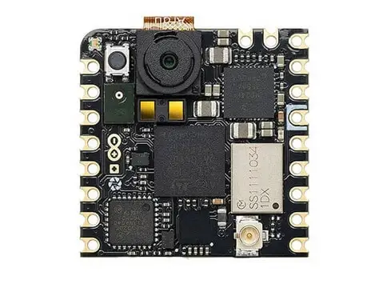

.. _arduino_nicla_vision_board:

Arduino Nicla Vision
####################

Overview
********

Arduino Nicla Vision is a development board by Arduino based on the
STM32H747GAII, a dual core ARM Cortex-M7 + Cortex-M4 MCU, with 2MBytes of Flash
memory and 1MB SRAM.

The board features:

- RGB LED
- Reset Boot button
- USB device
- Murata Type 1DX Bluetooth + WiFi module (CYW4343W based)
- GC2145 2 Megapixel Camera Sensor
- SE050C2HQ1 Crypto IC
- MP34DT06JTR Omnidirectional Microphone
- VL53L1CBV0FY ToF Sensor
- LSM6DSOXTR Gyro+Accelerometer Sensor

More information about the board, including the datasheet, pinout and
schematics, can be found at the `Arduino Nicla Vision website`_.

More information about STM32H747GAII6 can be found here:

- `STM32H747XI on www.st.com`_
- `STM32H747xx reference manual`_
- `STM32H747xx datasheet`_

Supported Features
==================

The current Zephyr ``arduino_nicla_vision/stm32h747xx/m7`` board configuration supports the
following hardware features:

+-----------+------------+-------------------------------------+
| Interface | Controller | Driver/Component                    |
+===========+============+=====================================+
| NVIC      | on-chip    | nested vector interrupt controller  |
+-----------+------------+-------------------------------------+
| UART      | on-chip    | serial port-polling;                |
|           |            | serial port-interrupt               |
+-----------+------------+-------------------------------------+
| PINMUX    | on-chip    | pinmux                              |
+-----------+------------+-------------------------------------+
| GPIO      | on-chip    | gpio                                |
+-----------+------------+-------------------------------------+
| FLASH     | on-chip    | flash memory                        |
+-----------+------------+-------------------------------------+
| RNG       | on-chip    | True Random number generator        |
+-----------+------------+-------------------------------------+
| I2C       | on-chip    | i2c                                 |
+-----------+------------+-------------------------------------+
| SPI       | on-chip    | spi                                 |
+-----------+------------+-------------------------------------+
| DCMI      | on-chip    | Parallel Camera interface           |
+-----------+------------+-------------------------------------+
| IPM       | on-chip    | virtual mailbox based on HSEM       |
+-----------+------------+-------------------------------------+
| RADIO     | Murata 1DX | WiFi and Bluetooth module           |
+-----------+------------+-------------------------------------+

And the ``arduino_nicla_vision/stm32h747xx/m4`` has the following
support from Zephyr:

+-----------+------------+-------------------------------------+
| Interface | Controller | Driver/Component                    |
+===========+============+=====================================+
| NVIC      | on-chip    | nested vector interrupt controller  |
+-----------+------------+-------------------------------------+
| UART      | on-chip    | serial port-polling;                |
|           |            | serial port-interrupt               |
+-----------+------------+-------------------------------------+
| PINMUX    | on-chip    | pinmux                              |
+-----------+------------+-------------------------------------+
| GPIO      | on-chip    | gpio                                |
+-----------+------------+-------------------------------------+

Other hardware features are not yet supported on Zephyr port.

Fetch Binary Blobs
******************

The board Bluetooth/WiFi module requires fetching some binary blob files, to do
that run the command:

.. code-block:: console

   west blobs fetch hal_infineon

.. note:: Only Bluetooth functionality is currently supported.

Resources sharing
=================

The dual core nature of STM32H747 SoC requires sharing HW resources between the
two cores. This is done in 3 ways:

- **Compilation**: Clock configuration is only accessible to M7 core. M4 core only
  has access to bus clock activation and deactivation.
- **Static pre-compilation assignment**: Peripherals such as a UART are assigned in
  devicetree before compilation. The user must ensure peripherals are not assigned
  to both cores at the same time.
- **Run time protection**: Interrupt-controller and GPIO configurations could be
  accessed by both cores at run time. Accesses are protected by a hardware semaphore
  to avoid potential concurrent access issues.

Programming and Debugging
*************************

Applications for the ``arduino_nicla_vision`` board should be built per core target,
using either ``arduino_nicla_vision/stm32h747xx/m7`` or ``arduino_nicla_vision/stm32h747xx/m4`` as the target.

See :ref:`build_an_application` for more information about application builds.

Flashing
========

This board can be flashed either using dfu-util, or with an external debugging
probe, such as a J-Link or Black Magic Probe, connected to the on board MIPI-10
SWD port marked as "JTAG".

.. note::

   The board ships with a custom Arduino bootloader programmed in the first
   flash page that can be triggered by double clicking the ``RST`` button. This
   bootloader is USB-DFU compatible and supports programming both the internal
   and external flash and is the one used by ``west flash`` by default.

First, connect the Arduino Nicla Vision board to your host computer using the USB
port to prepare it for flashing. Double click the ``RST`` button to put the
board into the Arduino Bootloader mode. Then build and flash your application.

Here is an example for the :zephyr:code-sample:`hello_world` application.

.. zephyr-app-commands::
   :zephyr-app: samples/hello_world
   :board: arduino_nicla_vision/stm32h747xx/m7
   :goals: build flash

Run a serial host program to connect with your board:

.. code-block:: console

   $ minicom -D /dev/ttyACM0

You should see the following message on the console:

.. code-block:: console

   Hello World! arduino_nicla_vision

Similarly, you can build and flash samples on the M4 target.

Here is an example for the :zephyr:code-sample:`blinky` application on M4 core.

.. zephyr-app-commands::
   :zephyr-app: samples/basic/blinky
   :board: arduino_nicla_vision/stm32h747xx/m4
   :goals: build flash

Debugging
=========

Debugging is supported by using ``west debug`` with an external probe such as a
J-Link or Black Magic Probe, connected to the on board through the edge eslov pins
as "SWD". For example::

  west debug -r jlink

.. _Arduino Nicla Vision website:
   https://docs.arduino.cc/hardware/nicla-vision/

.. _Arduino Nicla Vision User Manual:
   https://docs.arduino.cc/tutorials/nicla-vision/user-manual/

.. _STM32H747XI on www.st.com:
   https://www.st.com/content/st_com/en/products/microcontrollers-microprocessors/stm32-32-bit-arm-cortex-mcus/stm32-high-performance-mcus/stm32h7-series/stm32h747-757/stm32h747xi.html

.. _STM32H747xx reference manual:
   https://www.st.com/resource/en/reference_manual/dm00176879.pdf

.. _STM32H747xx datasheet:
   https://www.st.com/resource/en/datasheet/stm32h747xi.pdf

.. _dfu-util:
   http://dfu-util.sourceforge.net/build.html
