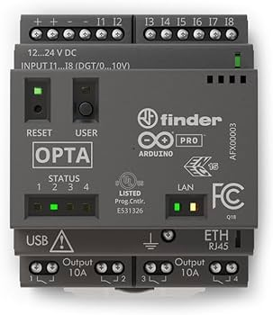

.. _arduino_opta_m4_board:

Arduino OPTA
############

Overview
********

The Arduino™ Opta® is a secure micro Programmable Logic Controller (PLC)
with Industrial Internet of Things (IoT) capabilities.

Developed in partnership with Finder®, this device supports both the Arduino
programming language and standard IEC-61131-3 PLC programming languages,
such as Ladder Diagram (LD), Sequential Function Chart (SFC),
Function Block Diagram (FBD), Structured Text (ST), and Instruction List (IL),
making it an ideal device for automation engineers.

For Zephyr RTOS, both cores are supported. It is also possible to run only on
the M4 making the M7 run the PLC tasks while the M4 core under Zephyr acts as
a coprocessor.

Additionally, the device features:

- Ethernet compliant with IEEE802.3-2002
- 16MB QSPI Flash
- 4 x green color status LEDs
- 1 x green or red led over the reset push-button
- 1 x blue led over the user push-button (Opta Advanced only)
- 1 x user push-button
- 1 x reset push-button accessible via pinhole
- 8 x analog inputs
- 4 x isolated relay outputs

More information about the board can be found at the `ARDUINO-OPTA website`_.
More information about STM32H747XIH6 can be found here:

- `STM32H747XI on www.st.com`_
- `STM32H747xx reference manual`_
- `STM32H747xx datasheet`_

Supported Features
==================

The ``arduino_opta/stm32h747xx/m7`` board target
supports the following hardware features:

+-----------+------------+-------------------------------------+
| Interface | Controller | Driver/Component                    |
+===========+============+=====================================+
| NVIC      | on-chip    | nested vector interrupt controller  |
+-----------+------------+-------------------------------------+
| PINMUX    | on-chip    | pinmux                              |
+-----------+------------+-------------------------------------+
| GPIO      | on-chip    | gpio                                |
+-----------+------------+-------------------------------------+
| FLASH     | on-chip    | flash memory                        |
+-----------+------------+-------------------------------------+
| RNG       | on-chip    | True Random number generator        |
+-----------+------------+-------------------------------------+
| IPM       | on-chip    | virtual mailbox based on HSEM       |
+-----------+------------+-------------------------------------+
| USB       | on-board   | usb-fs                              |
+-----------+------------+-------------------------------------+
| ETHERNET  | on-board   | eth                                 |
+-----------+------------+-------------------------------------+

The ``arduino_opta/stm32h747xx/m4`` board target
supports the following hardware features:

+-----------+------------+-------------------------------------+
| Interface | Controller | Driver/Component                    |
+===========+============+=====================================+
| NVIC      | on-chip    | nested vector interrupt controller  |
+-----------+------------+-------------------------------------+
| PINMUX    | on-chip    | pinmux                              |
+-----------+------------+-------------------------------------+
| GPIO      | on-chip    | gpio                                |
+-----------+------------+-------------------------------------+
| FLASH     | on-chip    | flash memory                        |
+-----------+------------+-------------------------------------+
| RNG       | on-chip    | True Random number generator        |
+-----------+------------+-------------------------------------+
| IPM       | on-chip    | virtual mailbox based on HSEM       |
+-----------+------------+-------------------------------------+

Other hardware features are not yet supported on Zephyr porting.

The default configuration per core can be found in the defconfig files:
:zephyr_file:`boards/arduino/opta/arduino_opta_stm32h747xx_m4_defconfig` and
:zephyr_file:`boards/arduino/opta/arduino_opta_stm32h747xx_m7_defconfig`.

Pin Mapping
===========

Both the M7 and M4 cores have access to the 9 GPIO controllers. These
controllers are responsible for pin muxing, input/output, pull-up, etc.

For more details please refer to `ARDUINO-OPTA website`_.

Default Zephyr Peripheral Mapping
---------------------------------

- Status LED1: PI0
- Status LED2: PI1
- Status LED3: PI3
- Status LED4: PH15
- Green "reset" LED: PH12
- Red "reset" LED: PH11
- Blue LED: PE5
- User button: PE4
- Input 1 : PA0
- Input 2 : PC2
- Input 3 : PF12
- Input 4 : PB0
- Input 5 : PF10
- Input 6 : PF8
- Input 7 : PF6
- Input 8 : PF4
- Relay 1: PI6
- Relay 2: PI5
- Relay 3: PI7
- Relay 4: PI4

System Clock
============

The STM32H747I System Clock can be driven by an internal or external oscillator,
as well as by the main PLL clock. By default, the CPU2 (Cortex-M4) System clock
is driven at 240MHz. PLL clock is fed by a 25MHz high speed external clock. The
M7 clock is driven at 400MHz.

Resources sharing
=================

The dual core nature of STM32H747 SoC requires sharing HW resources between the
two cores. This is done in 3 ways:

- **Compilation**: Clock configuration is only accessible to M7 core. M4 core only
  has access to bus clock activation and deactivation.
- **Static pre-compilation assignment**: Peripherals such as a UART are assigned in
  devicetree before compilation. The user must ensure peripherals are not assigned
  to both cores at the same time.
- **Run time protection**: Interrupt-controller and GPIO configurations could be
  accessed by both cores at run time. Accesses are protected by a hardware semaphore
  to avoid potential concurrent access issues.

Programming and Debugging
*************************

Applications for the ``arduino_opta`` use the regular Zephyr build commands.
See :ref:`build_an_application` for more information about application builds.

Flashing
========

Flashing operation will depend on the target to be flashed and the SoC
option bytes configuration. The OPTA has a DFU capable bootloader which
can be accessed by connecting the device to the USB, and then pressing
the RESET button shortly twice, the RESET-LED on the board will fade
indicating the board is in bootloader mode.

By default:

  - CPU1 (Cortex-M7) boot address is set to 0x08040000
  - CPU2 (Cortex-M4) boot address is set to 0x08180000

Zephyr flash configuration has been set to be compatible with the
"Flash split: 1.5MB M7 + 0.5MB M4" option in the Arduino IDE. The flash is
partitioned as follows:

  - 0x08000000-0x0803FFFF (256k) Arduino MCUboot-derived bootloader
  - 0x08040000-0x080FFFFF (768k) M7 application
  - 0x08180000-0x081FFFFF (512k) M4 application

Flashing an application to ARDUINO OPTA M7
------------------------------------------

First, connect the device to your host computer using
the USB port to prepare it for flashing. Then build and flash your application.

Here is an example for the :zephyr:code-sample:`blinky` application on M7 core.

.. zephyr-app-commands::
   :zephyr-app: samples/basic/blinky
   :board: arduino_opta/stm32h747xx/m7
   :goals: build flash

Flashing an application to ARDUINO OPTA M4
------------------------------------------

First, connect the device to your host computer using
the USB port to prepare it for flashing. Then build and flash your application.

Here is an example for the :zephyr:code-sample:`blinky` application on M4 core.

.. zephyr-app-commands::
   :zephyr-app: samples/basic/blinky
   :board: arduino_opta/stm32h747xx/m4
   :goals: build flash

Starting the application on the ARDUINO OPTA M4
-----------------------------------------------

If you also flashed an application to M7 the M4 processor is started at boot.
If not you will need to start the processor from an Arduino sketch.

Make sure the option bytes are set to prevent the M4 from auto-starting, and
that the M7 side starts the M4 at the correct Flash address.

This can be done by selecting in the Arduino IDE's "Tools" / "Flash Split"
menu the "1.5MB M7 + 0.5MB M4" option, and loading a sketch that contains
at least the following code:

 .. code-block:: cpp

    #include <RPC.h>

    void setup() {
        RPC.begin();
    }

    void loop() { }

Debugging
=========

The debug port does not have an easy access but it is possible to open the
case and solder a standard 10-pin SWD connector to the board. After that
both flashing and debugging are available via ST-LINK (M7 core only).

.. _ARDUINO-OPTA website:
   https://docs.arduino.cc/hardware/opta

.. _STM32H747XI on www.st.com:
   https://www.st.com/content/st_com/en/products/microcontrollers-microprocessors/stm32-32-bit-arm-cortex-mcus/stm32-high-performance-mcus/stm32h7-series/stm32h747-757/stm32h747xi.html

.. _STM32H747xx reference manual:
   https://www.st.com/resource/en/reference_manual/dm00176879.pdf

.. _STM32H747xx datasheet:
   https://www.st.com/resource/en/datasheet/stm32h747xi.pdf
