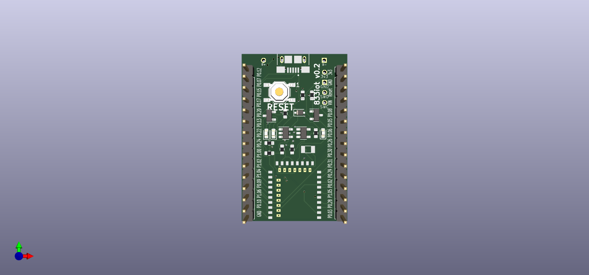

.. _833iot:

833iot
######

Overview
********

A cheap E73-2G4M08S1E (nRF52833 SOC) based low-power IOT board with a target price of $6. Boasting low-power wireless such as BLE, 802.15.4 and Zigbee. Thus enable tinkerers/hobbyists to access a cheap low-power solution to deploy into their diy IOT/smart-home projects.

It features:
* micro-USB connector
* lipo battery charger
* one user LED onboard

     833iot

More information about the board can be found at the
`833iot website`_.

Hardware
********

The ``_833iot`` has two external oscillators. The frequency of
the slow clock is 32.768 kHz. The frequency of the main clock
is 32 MHz.

Supported Features
==================

The 833iot board configuration supports the following
hardware features:

+-----------+------------+----------------------+
| Interface | Controller | Driver/Component     |
+===========+============+======================+
| ADC       | on-chip    | adc                  |
+-----------+------------+----------------------+
| CLOCK     | on-chip    | clock_control        |
+-----------+------------+----------------------+
| FLASH     | on-chip    | flash                |
+-----------+------------+----------------------+
| GPIO      | on-chip    | gpio                 |
+-----------+------------+----------------------+
| I2C(M)    | on-chip    | i2c                  |
+-----------+------------+----------------------+
| MPU       | on-chip    | arch/arm             |
+-----------+------------+----------------------+
| NVIC      | on-chip    | arch/arm             |
+-----------+------------+----------------------+
| PWM       | on-chip    | pwm                  |
+-----------+------------+----------------------+
| RADIO     | on-chip    | Bluetooth,           |
|           |            | ieee802154           |
+-----------+------------+----------------------+
| RTC       | on-chip    | system clock         |
+-----------+------------+----------------------+
| RTT       | Segger     | console              |
+-----------+------------+----------------------+
| SPI(M/S)  | on-chip    | spi                  |
+-----------+------------+----------------------+
| UART      | on-chip    | serial               |
+-----------+------------+----------------------+
| USB       | on-chip    | usb                  |
+-----------+------------+----------------------+
| WDT       | on-chip    | watchdog             |
+-----------+------------+----------------------+

Other hardware features have not been enabled yet for this board.
See `Nordic Semiconductor Infocenter`_
for a complete list of nRF52833 SOC hardware features.

Connections and IOs
===================

LED
---

* LED0 (yellow) = P0.25

Push buttons
------------

* RESET   = SW2 = P0.18

Programming and Debugging
*************************

Applications for the ``883iot`` board configuration can be built,
flashed, and debugged in the usual way. See :ref:`build_an_application` and
:ref:`application_run` for more details on building and running.

Flashing
========

Follow the instructions in the :ref:`nordic_segger` page to install
and configure all the necessary software. Further information can be
found in :ref:`nordic_segger_flashing`. Then build and flash
applications as usual (see :ref:`build_an_application` and
:ref:`application_run` for more details).

Here is an example for the :ref:`hello_world` application.

First, run your favorite terminal program to listen for output.

.. code-block:: console

   $ minicom -D <tty_device> -b 115200

Replace :code:`<tty_device>` with the port where the board nRF52 DK
can be found. For example, under Linux, :code:`/dev/ttyACM0`.

Then build and flash the application in the usual way.

.. zephyr-app-commands::
   :zephyr-app: samples/hello_world
   :board: 883iot
   :goals: build flash
   
Debugging
=========

The ``nrf52840dongle_nrf52840`` board does not have an on-board J-Link debug IC
as some nRF5x development boards, however, instructions from the
:ref:`nordic_segger` page also apply to this board, with the additional step
of connecting an external debugger.

Testing the LEDs and buttons on the nRF52840 Dongle
***************************************************

Use this sample to test that the buttons (switches) and LEDs on
the board are working properly with Zephyr:

* :ref:`blinky-sample`

You can build and program the examples to make sure Zephyr is running correctly
on your board.

References
**********

.. target-notes::

.. _833iot website: https://simplycreate.online/833iot
.. _Nordic Semiconductor Infocenter: https://infocenter.nordicsemi.com
.. _J-Link Software and documentation pack: https://www.segger.com/jlink-software.html
.. _nRF52833 Product Specification: https://infocenter.nordicsemi.com/pdf/nRF52833_OPS_v0.7.pdf
