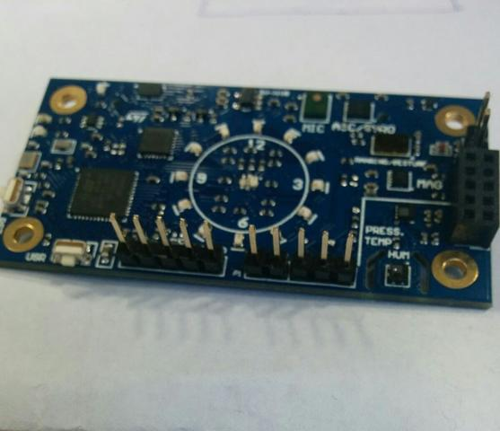

.. _96b_argonkey:

96Boards Argonkey
#################

Overview
********

96Boards Argonkey board is based on the ST Microelectronics STM32F412CG
Cortex M4 CPU. Zephyr applications use the 96b_argonkey configuration
to run on these boards.

This board acts as a sensor hub platform for all 96Boards compliant
family products. It can also be used as a standalone board.

     96Boards Argonkey

Hardware
********

96Boards Argonkey provides the following hardware components:

- STM32F412CG in UFQFPN48 package
- ARM |reg| 32-bit Cortex |reg|-M4 CPU with FPU
- 100 MHz max CPU frequency
- 1.8V work voltage
- 1024 KB Flash
- 256 KB SRAM
- On board sensors:

  - Humidity: STMicro HTS221
  - Temperature/Pressure: STMicro LPS22HB
  - ALS: Intersil ISL29034
  - Proximity: STMicro VL53L0X
  - Acclerometer/Gyroscope: STMicro LSM6DSL
  - Geomagnetic: STMicro LIS2MDL
  - AMR Hall sensor: MRMS501A
  - Microphone: STMicro MP34DT05

- 2 User LEDs
- 16 General purpose LEDs
- GPIO with external interrupt capability
- UART
- I2C (3)
- SPI (1)
- I2S (1)

Supported Features
==================

The Zephyr 96b_argonkey board configuration supports the following hardware
features:

+-----------+------------+-------------------------------------+
| Interface | Controller | Driver/Component                    |
+===========+============+=====================================+
| NVIC      | on-chip    | nested vector interrupt controller  |
+-----------+------------+-------------------------------------+
| SYSTICK   | on-chip    | system clock                        |
+-----------+------------+-------------------------------------+
| UART      | on-chip    | serial port                         |
+-----------+------------+-------------------------------------+
| GPIO      | on-chip    | gpio                                |
+-----------+------------+-------------------------------------+
| PINMUX    | on-chip    | pinmux                              |
+-----------+------------+-------------------------------------+
| FLASH     | on-chip    | flash                               |
+-----------+------------+-------------------------------------+
| SPI       | on-chip    | spi                                 |
+-----------+------------+-------------------------------------+
| I2C       | on-chip    | i2c                                 |
+-----------+------------+-------------------------------------+

The default board configuration can be found in the defconfig file:

        ``boards/arm/96b_argonkey/96b_argonkey_defconfig``

Connections and IOs
===================

LED
---

- LED1 / User1 LED = PB2
- LED2 / User2 LED = PC13

Push buttons
------------

- BUTTON = RST (BT1)
- BUTTON = USR (BT2)

System Clock
============

96Boards Argonkey can be driven by an internal oscillator as well as the main
PLL clock. In default board configuration, the 16MHz external oscillator is
used to drive the main PLL clock to generate a System Clock (SYSCLK) at 84MHz.
On the bus side, AHB and APB2 clock runs at 84MHz, while APB1 runs at 42MHz.

Serial Port
===========

On 96Boards Argonkey, Zephyr console output is assigned to USART1.
Default settings are 115200 8N1.

I2C
---

96Boards Argonkey board has up to 3 I2Cs. The default I2C mapping is:

- I2C1_SCL  : PB6
- I2C1_SDA  : PB7
- I2C2_SCL  : PB10
- I2C2_SDA  : PB9
- I2C3_SCL  : PA8
- I2C3_SCL  : PB4

I2C3 goes to the P2 connector and can be used to attach external sensors.
It goes to 100kbit maximum.

SPI
---
96Boards Argonkey board has 2 SPIs. SPI1 is used in slave mode as the communication
bus with the AP. SPI2 is used in master mode to control the LSM6DSL sensor.
The default SPI mapping is:

- SPI1_NSS  : PA4
- SPI1_SCK  : PA5
- SPI1_MISO : PA6
- SPI1_MOSI : PA7
- SPI2_NSS  : PB12
- SPI2_SCK  : PB13
- SPI2_MISO : PB14
- SPI2_MOSI : PB15

Programming and Debugging
*************************

Building
========

Here is an example for building the :ref:`hello_world` application.

.. zephyr-app-commands::
   :zephyr-app: samples/hello_world
   :board: 96b_argonkey
   :goals: build

Flashing
========

96Boards Argonkey can be flashed by two methods, one using the ROM
bootloader and another using the SWD debug port (which requires additional
hardware).

Using ROM bootloader:
---------------------

Using SWD debugger:
-------------------

Debugging
=========

References
**********
