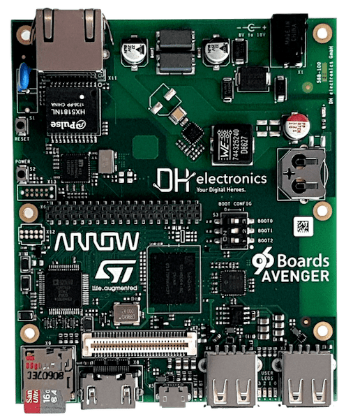

.. _96b_avenger96:

96Boards Avenger96
##################

Overview
********

96Boards Avenger96 board is based on ST Microelectronics STM32MP157A
multi-core processor, composed of a dual Cortex®-A7 and a single Cortex®-M4
core. Zephyr OS is ported to run on the Cortex®-M4 core.

- Board features:

  - PMIC: STPMIC1A
  - RAM: 1024 Mbyte @ 533MHz
  - Storage:

    - eMMC: v4.51: 8 Gbyte
    - QSPI: 2Mbyte
    - EEPROM: 128 byte
    - microSD Socket: UHS-1 v3.01
  - Ethernet: 10/100/1000 Mbit/s, IEEE 802.3 Compliant
  - Wireless:

    - WiFi: 5 GHz & 2.4GHz IEEE 802.11a/b/g/n/ac
    - Bluetooth: v4.2 (BR/EDR/BLE)
  - USB:

    - Host - 2x type A, 2.0 high-speed
    - OTG: - 1x type micro-AB, 2.0 high-speed
  - HDMI: WXGA (1366x768)@ 60 fps, HDMI 1.4
  - Connectors:

    - 40-Pin Low Speed Header
    - 60-Pin High Speed Header
  - LEDs:

    - 4x Green user LEDs
    - 1x Blue Bluetooth LED
    - 1x Yellow WiFi LED
    - 1x Red power supply LED

More information about the board can be found at the
`96Boards website`_.

Hardware
********

The STM32MP157A SoC provides the following hardware capabilities:

- Core:

  - 32-bit dual-core Arm® Cortex®-A7

    - L1 32-Kbyte I / 32-Kbyte D for each core
    - 256-Kbyte unified level 2 cache
    - Arm® NEON™

  - 32-bit Arm® Cortex®-M4 with FPU/MPU

    - Up to 209 MHz (Up to 703 CoreMark®)

- Memories:

  - External DDR memory up to 1 Gbyte.
  - 708 Kbytes of internal SRAM: 256 KB of AXI SYSRAM + 384 KB of AHB SRAM +
    64 KB of AHB SRAM in backup domain.
  - Dual mode Quad-SPI memory interface
  - Flexible external memory controller with up to 16-bit data bus

- Clock management:

  - Internal oscillators: 64 MHz HSI oscillator, 4 MHz CSI oscillator, 32 kHz
    LSI oscillator
  - External oscillators: 8-48 MHz HSE oscillator, 32.768 kHz LSE oscillator
  - 6 × PLLs with fractional mode

- General-purpose input/outputs:

  - Up to 176 I/O ports with interrupt capability

- Interconnect matrix

- 3 DMA controllers

- Communication peripherals:

  - 6 × I2C FM+ (1 Mbit/s, SMBus/PMBus)
  - 4 × UART + 4 × USART (12.5 Mbit/s, ISO7816 interface, LIN, IrDA, SPI slave)
  - 6 × SPI (50 Mbit/s, including 3 with full duplex I2S audio class accuracy)
  - 4 × SAI (stereo audio: I2S, PDM, SPDIF Tx)
  - SPDIF Rx with 4 inputs
  - HDMI-CEC interface
  - MDIO Slave interface
  - 3 × SDMMC up to 8-bit (SD / e•MMC™ / SDIO)
  - 2 × CAN controllers supporting CAN FD protocol, TTCAN capability
  - 2 × USB 2.0 high-speed Host+ 1 × USB 2.0 full-speed OTG simultaneously
  - 10/100M or Gigabit Ethernet GMAC (IEEE 1588v2 hardware, MII/RMII/GMII/RGMI)
  - 8- to 14-bit camera interface up to 140 Mbyte/s
  - 6 analog peripherals
  - 2 × ADCs with 16-bit max. resolution.
  - 1 × temperature sensor
  - 2 × 12-bit D/A converters (1 MHz)
  - 1 × digital filters for sigma delta modulator (DFSDM) with 8 channels/6
    filters
  - Internal or external ADC/DAC reference VREF+

- Graphics:

  - 3D GPU: Vivante® - OpenGL® ES 2.0
  - LCD-TFT controller, up to 24-bit // RGB888, up to WXGA (1366 × 768) @60 fps
  - MIPI® DSI 2 data lanes up to 1 GHz each

- Timers:

  - 2 × 32-bit timers with up to 4 IC/OC/PWM or pulse counter and quadrature
    (incremental) encoder input
  - 2 × 16-bit advanced motor control timers
  - 10 × 16-bit general-purpose timers (including 2 basic timers without PWM)
  - 5 × 16-bit low-power timers
  - RTC with sub-second accuracy and hardware calendar
  - 2 × 4 Cortex®-A7 system timers (secure, non-secure, virtual, hypervisor)
  - 1 × SysTick Cortex®-M4 timer

- Hardware acceleration:

  - HASH (MD5, SHA-1, SHA224, SHA256), HMAC
  - 2 × true random number generator (3 oscillators each)
  - 2 × CRC calculation unit

- Debug mode:

  - Arm® CoreSight™ trace and debug: SWD and JTAG interfaces
  - 8-Kbyte embedded trace buffer
  - 3072-bit fuses including 96-bit unique ID, up to 1184-bit available for user

More information about STM32P157A can be found here:

- `STM32MP157A on www.st.com`_
- `STM32MP157A reference manual`_

Supported Features
==================

The Zephyr 96b_avenger96 board configuration supports the following hardware
features:

+-----------+------------+-------------------------------------+
| Interface | Controller | Driver/Component                    |
+===========+============+=====================================+
| NVIC      | on-chip    | nested vector interrupt controller  |
+-----------+------------+-------------------------------------+
| GPIO      | on-chip    | gpio                                |
+-----------+------------+-------------------------------------+
| UART      | on-chip    | serial port-polling;                |
|           |            | serial port-interrupt               |
+-----------+------------+-------------------------------------+
| PINMUX    | on-chip    | pinmux                              |
+-----------+------------+-------------------------------------+

The default configuration can be found in the defconfig file:
``boards/arm/96b_avenger96/96b_avenger96_defconfig``

Connections and IOs
===================

96Boards Avenger96 Board schematic is available here:
`Avenger96 board schematics`_.

Default Zephyr Peripheral Mapping:
----------------------------------

- UART_7 TX/RX/RTS/CTS : PE8/PE7/PE9/PE10 (UART console)
- UART_4 TX/RX : PD1/PB2

System Clock
------------

The Cortex®-M4 Core is configured to run at a 209 MHz clock speed. This value
must match the configured mlhclk_ck frequency.

Serial Port
-----------

96Boards Avenger96 board has 3 U(S)ARTs. The Zephyr console output is assigned
by default to the RAM console to be dumped by the Linux Remoteproc Framework
on Cortex®-A7 core. Alternatively, Zephyr console output can be assigned to
UART7 which is disabled by default. UART console can be enabled through
board's devicetree and 96b_avenger96_defconfig board file (or prj.conf
project files), and will disable existing RAM console output. Default UART
console settings are 115200 8N1.

Programming and Debugging
*************************

The STM32MP157A doesn't have QSPI flash for the Cortex®-M4  and it needs to be
started by the Cortex®-A7 core. The Cortex®-A7 core is responsible to load the
Cortex®-M4 binary application into the RAM, and get the Cortex®-M4 out of reset.
The Cortex®-A7 can perform these steps at bootloader level or after the Linux
system has booted.

The Cortex®-M4 can use up to 2 different RAMs. The program pointer starts at
address 0x00000000 (RETRAM), the vector table should be loaded at this address
These are the memory mappings for Cortex®-A7 and Cortex®-M4:

+------------+-----------------------+------------------------+----------------+
| Region     | Cortex®-A7            | Cortex®-M4             | Size           |
+============+=======================+========================+================+
| RETRAM     | 0x38000000-0x3800FFFF | 0x00000000-0x0000FFFF  | 64KB           |
+------------+-----------------------+------------------------+----------------+
| MCUSRAM    | 0x10000000-0x1005FFFF | 0x10000000-0x1005FFFF  | 384KB          |
+------------+-----------------------+------------------------+----------------+
| DDR        | 0xC0000000-0xFFFFFFFF |                        | up to 1 GB     |
+------------+-----------------------+------------------------+----------------+

Refer to `stm32mp157 boot Cortex-M4 firmware`_ wiki page for instruction
to load and start the Cortex-M4 firmware.

Debugging
=========

You can debug an application using OpenOCD and GDB. The Solution proposed below
is based on the Linux STM32MP1 SDK OpenOCD and is available only for a Linux
environment. The firmware must first be loaded by the Cortex®-A7. Developer
then attaches the debugger to the running Zephyr using OpenOCD.

Prerequisite
------------
install `stm32mp1 developer package`_.

1) start OpenOCD in a dedicated terminal

   - Start up the  sdk environment::

      source <SDK installation directory>/environment-setup-cortexa7hf-neon-vfpv4-openstlinux_weston-linux-gnueabi

   - Start OpenOCD::

      ${OECORE_NATIVE_SYSROOT}/usr/bin/openocd -s ${OECORE_NATIVE_SYSROOT}/usr/share/openocd/scripts -f board/stm32mp15x_ev1_jlink_jtag.cfg

2) run gdb in Zephyr environment

   .. code-block:: console

      # On Linux
      cd $ZEPHYR_BASE/samples/hello_world
      mkdir -p build && cd build

      # Use cmake to configure a Ninja-based build system:
      cmake -GNinja -DBOARD=96b_avenger96 ..

      # Now run ninja on the generated build system:
      ninja debug

.. _96Boards website:
   https://www.96boards.org/product/avenger96/

.. _STM32MP157A on www.st.com:
   https://www.st.com/content/st_com/en/products/microcontrollers-microprocessors/stm32-arm-cortex-mpus/stm32mp1-series/stm32mp157/stm32mp157a.html

.. _STM32MP157A reference manual:
   https://www.st.com/resource/en/reference_manual/DM00327659.pdf

.. _Avenger96 board schematics:
   https://www.96boards.org/documentation/consumer/avenger96/hardware-docs/files/avenger96-schematics.pdf

.. _stm32mp1 developer package:
   https://wiki.st.com/stm32mpu/index.php/STM32MP1_Developer_Package#Installing_the_SDK

.. _stm32mp157 boot Cortex-M4 firmware:
   https://wiki.st.com/stm32mpu/index.php/Linux_remoteproc_framework_overview#How_to_use_the_framework
