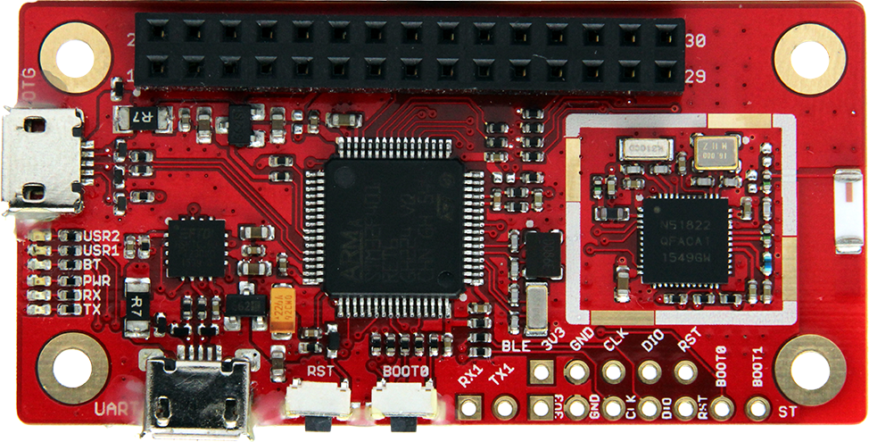

.. _96b_carbon_board:

96Boards Carbon
###############

Overview
********

Zephyr applications use the 96b_carbon configuration to run on the 96Boards
Carbon hardware. It is based on the STMicroelectronics STM32F401RET Cortex-M4
CPU and also contains a nRF51832 chip connected over SPI for BLE connectivity.

     96Boards Carbon

Hardware
********

96Boards Carbon provides the following hardware components:

- STM32F401RET6 in LQFP64 package
- ARM®32-bit Cortex®-M4 CPU with FPU
- 84 MHz max CPU frequency
- VDD from 1.7 V to 3.6 V
- 512 KB Flash
- 96 KB SRAM
- GPIO with external interrupt capability
- 12-bit ADC with 16 channels
- RTC
- Advanced-control Timer
- General Purpose Timers (7)
- Watchdog Timers (2)
- USART/UART (4)
- I2C (3)
- SPI (3)
- SDIO
- USB 2.0 OTG FS
- DMA Controller
- Bluetooth LE over SPI, provided by nRF51832

More information about STM32F401RE can be found here:
       - `STM32F401RE on www.st.com`_
       - `STM32F401 reference manual`_

Supported Features
==================

The Zephyr 96b_carbon board configuration supports the following hardware
features:

+-----------+------------+-------------------------------------+
| Interface | Controller | Driver/Component                    |
+===========+============+=====================================+
| NVIC      | on-chip    | nested vector interrupt controller  |
+-----------+------------+-------------------------------------+
| SYSTICK   | on-chip    | system clock                        |
+-----------+------------+-------------------------------------+
| UART      | on-chip    | serial port                         |
+-----------+------------+-------------------------------------+
| GPIO      | on-chip    | gpio                                |
+-----------+------------+-------------------------------------+
| PINMUX    | on-chip    | pinmux                              |
+-----------+------------+-------------------------------------+
| FLASH     | on-chip    | flash                               |
+-----------+------------+-------------------------------------+
| SPI       | on-chip    | spi                                 |
+-----------+------------+-------------------------------------+

More details about the board can be found at `96Boards website`_.

The default configuration can be found in the defconfig file:

        ``boards/arm/96b_carbon/96b_carbon_defconfig``

Pin Mapping
===========

LED
---

- LED1 / User1 LED = PD2
- LED2 / User2 LED = PA15
- LED3 / BT LED = PB5
- LED4 / Power LED = VCC

Push buttons
------------

- BUTTON = BOOT0 (SW1)
- BUTTON = RST

External Connectors
-------------------

Low Speed Header

+--------+-------------+----------------------+
| PIN #  | Signal Name | STM32F401 Functions  |
+========+=============+======================+
| 1      | UART2_CTS   | PA0                  |
+--------+-------------+----------------------+
| 3      | UART2_TX    | PA2                  |
+--------+-------------+----------------------+
| 5      | UART2_RX    | PA3                  |
+--------+-------------+----------------------+
| 7      | UART2_RTS   | PA1                  |
+--------+-------------+----------------------+
| 9      | GND         | GND                  |
+--------+-------------+----------------------+
| 11     | USB5V       | USB5V                |
+--------+-------------+----------------------+
| 13     | AIN12       | PC2                  |
+--------+-------------+----------------------+
| 15     | AIN14       | PC4                  |
+--------+-------------+----------------------+
| 17     | UART6_TX    | PC6                  |
+--------+-------------+----------------------+
| 19     | GPIO        | PC8                  |
+--------+-------------+----------------------+
| 21     | I2C1_SCL    | PB6                  |
+--------+-------------+----------------------+
| 23     | I2C1_SCA    | PB7                  |
+--------+-------------+----------------------+
| 25     | I2C2_SCA    | PB3                  |
+--------+-------------+----------------------+
| 27     | I2C2_SCL    | PB10                 |
+--------+-------------+----------------------+
| 29     | RST_BTN     | RST_BTN              |
+--------+-------------+----------------------+

+--------+-------------+----------------------+
| PIN #  | Signal Name | STM32F401 Functions  |
+========+=============+======================+
| 2      | SPI2_SS     | PB12                 |
+--------+-------------+----------------------+
| 4      | SPI2_MOSI   | PB15                 |
+--------+-------------+----------------------+
| 6      | SPI2_MISO   | PB14                 |
+--------+-------------+----------------------+
| 8      | SPI2_SCK    | PB13                 |
+--------+-------------+----------------------+
| 10     | GND         | GND                  |
+--------+-------------+----------------------+
| 12     | VCC2        | VCC2                 |
+--------+-------------+----------------------+
| 14     | AIN13       | PC3                  |
+--------+-------------+----------------------+
| 16     | AIN15       | PC5                  |
+--------+-------------+----------------------+
| 18     | UART6_RX    | PC7                  |
+--------+-------------+----------------------+
| 20     | GPIO        | PC9                  |
+--------+-------------+----------------------+
| 22     | I2C1_SCL    | PB8                  |
+--------+-------------+----------------------+
| 24     | I2C1_SDA    | PB9                  |
+--------+-------------+----------------------+
| 26     | AIN10       | PC0                  |
+--------+-------------+----------------------+
| 28     | AIN11       | PC1                  |
+--------+-------------+----------------------+
| 30     | NC          | NC                   |
+--------+-------------+----------------------+

System Clock
============

STM32F4 has two external oscillators. The frequency of the slow clock is
32.768 kHz. The frequency of the main clock is 16 MHz.

Flashing Zephyr onto 96Boards Carbon
************************************

There are 2 main entry points for flashing STM32F4X SoCs, one using the ROM
bootloader, and another by using the SWD debug port (which requires additional
hardware). Flashing using the ROM bootloader requires a special activation
pattern, which can be triggered by using the BOOT0 pin. The ROM bootloader
supports flashing via USB (DFU), UART, I2C and SPI. You can read more about
how to enable and use the ROM bootloader by checking the application
note `AN2606`_, page 109.

Installing dfu-util
===================

It is recommended to use at least v0.8 of `dfu-util`_. The package available in
debian/ubuntu can be quite old, so you might have to build dfu-util from source.

Flashing an Application to 96Boards Carbon
------------------------------------------

The sample application :ref:`hello_world` is being used in this tutorial:

.. code-block:: console

   $<zephyr_root_path>/samples/hello_world

To build the Zephyr kernel and application, enter:

.. code-block:: console

   $ cd <zephyr_root_path>
   $ source zephyr-env.sh
   $ cd $ZEPHYR_BASE/samples/hello_world/
   $ make BOARD=96b_carbon

Connect the micro-USB cable to the USB OTG Carbon port and to your computer.
The board should power ON. Force the board into DFU mode by keeping the BOOT0
switch pressed while pressing and releasing the RST switch.

Confirm that the board is in DFU mode:

.. code-block:: console

   $ sudo dfu-util -l
   dfu-util 0.8
   Copyright 2005-2009 Weston Schmidt, Harald Welte and OpenMoko Inc.
   Copyright 2010-2014 Tormod Volden and Stefan Schmidt
   This program is Free Software and has ABSOLUTELY NO WARRANTY
   Please report bugs to dfu-util@lists.gnumonks.org
   Found DFU: [0483:df11] ver=2200, devnum=15, cfg=1, intf=0, alt=3, name="@Device Feature/0xFFFF0000/01*004 e", serial="3574364C3034"
   Found DFU: [0483:df11] ver=2200, devnum=15, cfg=1, intf=0, alt=2, name="@OTP Memory /0x1FFF7800/01*512 e,01*016 e", serial="3574364C3034"
   Found DFU: [0483:df11] ver=2200, devnum=15, cfg=1, intf=0, alt=1, name="@Option Bytes /0x1FFFC000/01*016 e", serial="3574364C3034"
   Found DFU: [0483:df11] ver=2200, devnum=15, cfg=1, intf=0, alt=0, name="@Internal Flash /0x08000000/04*016Kg,01*064Kg,03*128Kg", serial="3574364C3034"
   Found Runtime: [05ac:8290] ver=0104, devnum=2, cfg=1, intf=5, alt=0, name="UNKNOWN", serial="UNKNOWN"

You should see following confirmation on your Linux host:

.. code-block:: console

   $ dmesg
   usb 1-2.1: new full-speed USB device number 14 using xhci_hcd
   usb 1-2.1: New USB device found, idVendor=0483, idProduct=df11
   usb 1-2.1: New USB device strings: Mfr=1, Product=2, SerialNumber=3
   usb 1-2.1: Product: STM32 BOOTLOADER
   usb 1-2.1: Manufacturer: STMicroelectronics
   usb 1-2.1: SerialNumber: 3574364C3034

Flash a new application to the board:

.. code-block:: console

   $ sudo dfu-util -d [0483:df11] -a 0 -D outdir/96b_carbon/zephyr.bin -s 0x08000000

Connect the micro-USB cable to the USB UART (FTDI) port and to your computer.
Run your favorite terminal program to listen for output.

.. code-block:: console

   $ minicom -D <tty_device> -b 115200

Replace :code:`<tty_device>` with the port where the board 96Boards Carbon
can be found. For example, under Linux, :code:`/dev/ttyUSB0`.
The ``-b`` option sets baud rate ignoring the value from config.

Press the Reset button and you should see the the following message in your
terminal:

.. code-block:: console

   Hello World! arm

.. _dfu-util:
   http://dfu-util.sourceforge.net/build.html

.. _AN2606:
   http://www.st.com/content/ccc/resource/technical/document/application_note/b9/9b/16/3a/12/1e/40/0c/CD00167594.pdf/files/CD00167594.pdf/jcr:content/translations/en.CD00167594.pdf

.. _96Boards website:
   http://www.96boards.org/documentation

.. _STM32F401RE on www.st.com:
   http://www.st.com/en/microcontrollers/stm32f401re.html

.. _STM32F401 reference manual:
   http://www.st.com/resource/en/reference_manual/dm00096844.pdf
