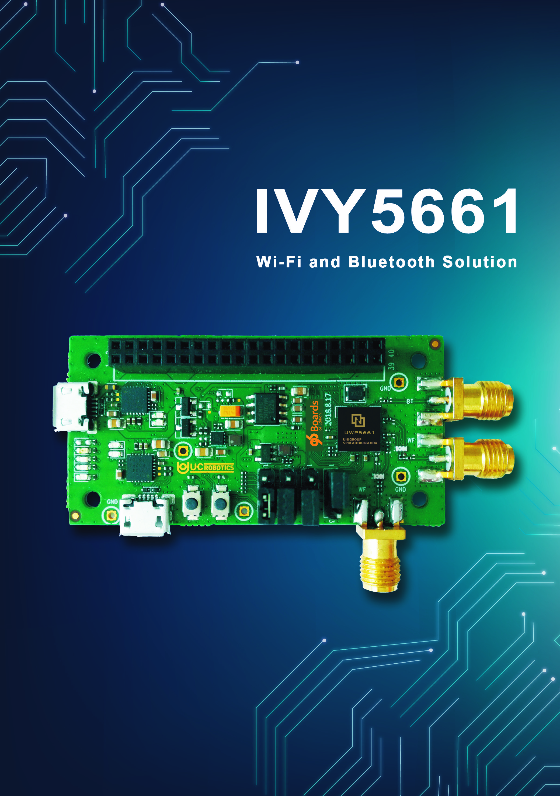

.. _96b_ivy5661:

96Boards IVY5661
################

Overview
********

96Boards IVY5661 board is based on the Unisoc uwp5661 soc chip. Zephyr
applications use the 96b_ivy5661 configuration to run on these boards.

     96Boards IVY5661

This board support Wi-Fi 802.11ac 2x2 dual band and Bluetooth 5 with
high power mode. It can be used by intelligent household, IP camera,
Wi-Fi repeater, and other networking applications.

Hardware
********

96Boards IVY5661 provides the following hardware components:

- Unisoc UWP5661 in 28nm package
- ARM |reg| 32-bit Cortex |reg|-M4 Dual Core CPU
- 416 MHz max CPU frequency
- 4MB Flash
- 640KB SRAM
- IEEE802.11ac 2x2 Wi-Fi
- Bluetooth 5
- 4 User LEDs
- Reset and User button
- GPIO with external interrupt capability
- UART (2)
- I2C (1)
- SPI (1)
- I2S (1)

Supported Features
==================

The Zephyr 96b_ivy5661 board configuration supports the following hardware
features:

+-----------+------------+-------------------------------------+
| Interface | Controller | Driver/Component                    |
+===========+============+=====================================+
| NVIC      | on-chip    | nested vector interrupt controller  |
+-----------+------------+-------------------------------------+
| SYSTICK   | on-chip    | system clock                        |
+-----------+------------+-------------------------------------+
| UART      | on-chip    | serial port                         |
+-----------+------------+-------------------------------------+
| GPIO      | on-chip    | gpio                                |
+-----------+------------+-------------------------------------+
| PINMUX    | on-chip    | pinmux                              |
+-----------+------------+-------------------------------------+
| FLASH     | on-chip    | flash                               |
+-----------+------------+-------------------------------------+
| I2C       | on-chip    | i2c                                 |
+-----------+------------+-------------------------------------+

The default board configuration can be found in the defconfig file:
``boards/arm/96b_ivy5661/96b_ivy5661_defconfig``

Connections and IOs
===================

LED
---

- LED1 / User1 LED = PA1
- LED2 / User2 LED = PA3
- LED3 / User3 LED = PA2
- LED4 / User4 LED = PA4

Push buttons
------------

- BUTTON = RST (SW1)
- BUTTON = USR (SW2)

System Clock
============

96Boards IVY5661 can be driven by an internal oscillator as well as the main
PLL clock. By default System clock is sourced by PLL clock at 416MHz, driven
by internal oscillator.

Serial Port
===========

On 96Boards IVY5661 Zephyr console output is assigned to USART0.
Default settings are 115200 8N1.

Building
========

Here is an example for building the :ref:`hello_world` application.

.. zephyr-app-commands::
   :zephyr-app: samples/hello_world
   :board: 96b_ivy5661
   :goals: build

