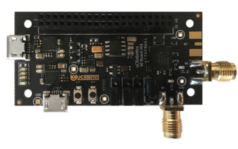

.. _96b_ivy5661:

96Boards IVY5661
################

Overview
********

96Boards `IVY5661 board`_ is based on the Unisoc uwp5661 soc. Zephyr
applications use the 96b_ivy5661 configuration to run on these boards.

     96Boards IVY5661

This board supports Wi-Fi 802.11ac 2x2 dual band and Bluetooth 5 with
high power mode. It can be used for intelligent household, IP camera,
Wi-Fi repeater, and other networking applications.

Hardware
********

96Boards IVY5661 provides the following hardware components:

- Unisoc UWP5661 in 28nm package
- ARM |reg| 32-bit Cortex |reg|-M4 Dual Core CPU
- 416 MHz max CPU frequency
- 4MB Flash
- 832KB SRAM
- IEEE802.11ac 2x2 Wi-Fi
- Bluetooth 5
- 4 User LEDs
- Reset and User button
- GPIO with external interrupt capability
- UART (2)
- I2C (1)
- SPI (1)
- I2S (1)

Supported Features
==================

The Zephyr 96b_ivy5661 board configuration supports the following hardware
features:

+-----------+------------+-------------------------------------+
| Interface | Controller | Driver/Component                    |
+===========+============+=====================================+
| NVIC      | on-chip    | nested vector interrupt controller  |
+-----------+------------+-------------------------------------+
| SYSTICK   | on-chip    | system clock                        |
+-----------+------------+-------------------------------------+
| UART      | on-chip    | serial port                         |
+-----------+------------+-------------------------------------+
| GPIO      | on-chip    | gpio                                |
+-----------+------------+-------------------------------------+
| PINMUX    | on-chip    | pinmux                              |
+-----------+------------+-------------------------------------+
| FLASH     | on-chip    | flash                               |
+-----------+------------+-------------------------------------+
| I2C       | on-chip    | i2c                                 |
+-----------+------------+-------------------------------------+
| WATCHDOG  | on-chip    | watchdog                            |
+-----------+------------+-------------------------------------+

The default board configuration can be found in the defconfig file:
``boards/arm/96b_ivy5661/96b_ivy5661_defconfig``

Connections and IOs
===================

LED
---

- LED5 / Power LED = VDD
- LED6 / User LED  = GPIOA3
- LED7 / User LED  = GPIOA1
- LED7301 / User LED  = GPIOA2

Push buttons
------------

- S4 / Reset Button = RST_N
- S1 / User Button  = GPIOA0

.. _Jumpers:

Jumpers
-------

There are several jumpers on IVY5661, which are used for switching boot mode.

+--------+--------+--------+--------+----------------+-------------------------+
| RFCTL8 | RFCTL7 | RFCTL6 | RFCTL5 |    Boot Mode   |        Description      |
+========+========+========+========+================+=========================+
|   0    |   0    |   1    |   0    | ROM boot       | Update image from UART0 |
+--------+--------+--------+--------+----------------+-------------------------+
|   0    |   0    |   0    |   1    | NOR Flash boot | XIP mode                |
+--------+--------+--------+--------+----------------+-------------------------+

System Clock
============

96Boards IVY5661 can be driven by an internal oscillator as well as the main
PLL clock. By default System clock is sourced by PLL clock at 416MHz, driven
by internal oscillator.

Serial Port
===========

On 96Boards IVY5661 Zephyr console output is assigned to UART0.
Default settings are 115200 8N1.

Programming and Debugging
*************************

Building
========

Here is an example for building the :ref:`hello_world` application.

.. zephyr-app-commands::
   :zephyr-app: samples/hello_world
   :board: 96b_ivy5661
   :goals: build

Flashing
========

96Boards IVY5661 can be flashed by two methods, one using the ROM
bootloader and another using the SWD debug port(which require
additional hardware).

96Boards IVY5661 can be flashed by two methods, one using the ROM
bootloader and another using the SWD debug port (which requires additional
hardware).

Using ROM bootloader
--------------------

1. Connect the 96Boards IVY5661 to your host computer using the
   USB port located near 40 pin expansion header.

#. Force IVY5661 to boot into ROM code mode by setting the jumpers
   as described in Jumpers_ section.

#. Reset the IVY5661 board by pressing the RST push button located
   near the jumpers.

#. Use `uwpflash`_ utility to flash the 96Boards IVY5661:

.. code-block:: console

    $ ./uwpflash -d /dev/ttyUSB0 -f zephyr.bin -a 0x2000000

.. note::
   The above command assumes that IVY5661 board is connected to
   serial port ``/dev/ttyUSB0`` of the host machine.

#. Then switch the jumpers to XIP mode as described in the Jumpers_
   section and open a serial emulator:

.. code-block:: console

   $ minicom -D /dev/ttyUSB0

#. Now press the RST button, you should see the following message on
   the console:

.. code-block:: console

   Hello World! 96b_ivy5661

Using SWD debugger
------------------

96Boards IVY5661 supports J-Link debug tool interface. It requires
4 wired connections between J-Link and IVY5661 expansion connector,
as shown below:

+-----------------+----------------------------+
| 20-pin JTAG/SWD | 40-pin expansion connector |
+=================+============================+
| 1  - VCC        |   35 - VCC                 |
+-----------------+----------------------------+
| 3  - TRST       |                            |
+-----------------+----------------------------+
| 5  - TDI        |                            |
+-----------------+----------------------------+
| 7  - TMS/SWDIO  |   33 - TMS                 |
+-----------------+----------------------------+
| 9  - TCK/SWCLK  |   34 - TCK                 |
+-----------------+----------------------------+
| 11 - RTCK       |                            |
+-----------------+----------------------------+
| 13 - TDO/SWO    |                            |
+-----------------+----------------------------+
| 15 - RESET      |                            |
+-----------------+----------------------------+
| 17 - NC         |                            |
+-----------------+----------------------------+
| 19 - NC         |                            |
+-----------------+----------------------------+
| 20 - GND        |   39 - GND                 |
+-----------------+----------------------------+

Once the connection between JLink and IVY5661 has been established,
these commands can be used to flash the binary.

.. zephyr-app-commands::
   :zephyr-app: samples/hello_world
   :board: 96b_ivy5661
   :maybe-skip-config:
   :goals: flash

Debugging
=========

You can debug applications in the usual way.

.. zephyr-app-commands::
   :zephyr-app: samples/hello_world
   :board: 96b_ivy5661
   :maybe-skip-config:
   :goals: debug

.. _IVY5661 board:
   https://www.96boards.org/documentation/iot/ivy5661/

.. _uwpflash:
   https://github.com/unisoc/uwpflash/releases/download/0.0.1/uwpflash
