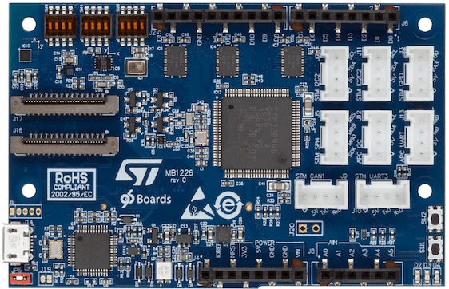

.. _96b_stm32_sensor_mez:

96Boards STM32 Sensor Mezzanine
###############################

Overview
********

96Boards STM32 Sensor Mezzanine is based on the ST Microelectronics
STM32F446VE Cortex M4 CPU.

This board acts as a mezzanine platform for all 96Boards CE compliant
boards. It can also be used as a standalone board.

     96Boards STM32 Sensor Mezzanine

Hardware
********

96Boards STM32 Sensor Mezzanine provides the following hardware components:

- STM32F446VE in LQFP100 package
- ARM |reg| 32-bit Cortex |reg|-M4 CPU with FPU
- 180 MHz max CPU frequency
- 1.8V work voltage
- 512 KB Flash
- 128 KB SRAM
- On board sensors:

  - Temperature/Pressure: STMicro LPS22HB
  - Acclerometer/Gyroscope: STMicro LSM6DS3H
  - Magnetometer: STMicro LIS3MDL
  - Microphone: STMicro MP34DT01

- 3User LEDs
- GPIO with external interrupt capability
- UART
- I2C (2)
- SPI (2)
- I2S (1)

Supported Features
==================

The Zephyr 96b_stm32_sensor_mez board configuration supports the following
hardware features:

+-----------+------------+-------------------------------------+
| Interface | Controller | Driver/Component                    |
+===========+============+=====================================+
| NVIC      | on-chip    | nested vector interrupt controller  |
+-----------+------------+-------------------------------------+
| SYSTICK   | on-chip    | system clock                        |
+-----------+------------+-------------------------------------+
| UART      | on-chip    | serial port                         |
+-----------+------------+-------------------------------------+
| GPIO      | on-chip    | gpio                                |
+-----------+------------+-------------------------------------+
| PINMUX    | on-chip    | pinmux                              |
+-----------+------------+-------------------------------------+
| FLASH     | on-chip    | flash                               |
+-----------+------------+-------------------------------------+
| SPI       | on-chip    | spi                                 |
+-----------+------------+-------------------------------------+
| I2C       | on-chip    | i2c                                 |
+-----------+------------+-------------------------------------+
| PWM       | on-chip    | pwm                                 |
+-----------+------------+-------------------------------------+
| I2S       | on-chip    | i2s                                 |
+-----------+------------+-------------------------------------+

The default board configuration can be found in the defconfig file:

        ``boards/arm/96b_stm32_sensor_mez/96b_stm32_sensor_mez_defconfig``

Connections and IOs
===================

LED
---

- LED1 / User1 LED = PD10
- LED2 / User2 LED = PD11
- LED3 / User3 LED = PD12

Push buttons
------------

- BUTTON = RST (BT1)
- BUTTON = USR (BT2)

System Clock
============

96Boards STM32 Sensor Mezzanine can be driven by an internal oscillator as
well as the main PLL clock. In default board configuration, the 16MHz external
oscillator is used to drive the main PLL clock to generate a System Clock
(SYSCLK) at 84MHz. On the bus side, AHB/APB2 clocks runs at 84MHz, while APB1
clock runs at 42MHz.

Serial Port
===========

On 96Boards STM32 Sensor Mezzanine, Zephyr console output is assigned to UART4
exposed via on-board Micro USB connector. Default settings are 115200 8N1.

I2C
---

96Boards STM32 Sensor Mezzanine board has up to 3 I2Cs. The default I2C
mapping is:

- I2C1_SCL  : PB6
- I2C1_SDA  : PB7
- I2C2_SCL  : PB10
- I2C2_SDA  : PC12

I2C2 goes to the Groove connectors and can be used to attach external sensors.

SPI
---
96Boards STM32 Sensor Mezzanine board has 2 SPIs. SPI1 is used in slave mode
as the communication bus with the AP. SPI2 is used in master mode to control
the LSM6DS3H sensor. The default SPI mapping is:

- SPI1_NSS  : PA4
- SPI1_SCK  : PA5
- SPI1_MISO : PA6
- SPI1_MOSI : PA7
- SPI2_NSS  : PB9
- SPI2_SCK  : PD3
- SPI2_MISO : PB14
- SPI2_MOSI : PB15

PWM
---
96Boards STM32 Sensor Mezzanine board exposes 6 PWM channels on the Arduino
connector. The default PWM mapping is:

- PWM3_CH1  : PB4  : D9
- PWM3_CH3  : PC8  : D3
- PWM4_CH3  : PD14 : D6
- PWM4_CH4  : PD15 : D5
- PWM9_CH1  : PE5  : D12
- PWM9_CH2  : PE6  : D11

I2S
---

96Boards STM32 Sensor Mezzanine board exposes 1 I2S port which is connected
to the on-board ST MP34DT01 DMIC. The default I2S mapping is:

- I2S2_SD   : PC1
- I2S2_CK   : PC7

Programming and Debugging
*************************

Building
========

Here is an example for building the :ref:`hello_world` application.

.. zephyr-app-commands::
   :zephyr-app: samples/hello_world
   :board: 96b_stm32_sensor_mez
   :goals: build

Flashing
========

96Boards STM32 Sensor Mezzanine board includes an ST-LINK/V2-1 embedded
debug tool interface. This interface is supported by the openocd version
included in the Zephyr SDK.

Flashing an application to 96Boards STM32 Sensor Mezzanine
----------------------------------------------------------

Here is an example for the :ref:`hello_world` application.

Run a serial host program to connect with your 96Boards STM32 Sensor Mezzanine
board.

.. code-block:: console

   $ minicom -b 115200 -D /dev/ttyACM0

Build and flash the application:

.. zephyr-app-commands::
   :zephyr-app: samples/hello_world
   :board: 96b_stm32_sensor_mez
   :goals: build flash

You should see the following message on the console:

.. code-block:: console

   $ Hello World! 96b_stm32_sensor_mez

Debugging
=========

You can debug an application in the usual way.  Here is an example for the
:ref:`hello_world` application.

.. zephyr-app-commands::
   :zephyr-app: samples/hello_world
   :board: 96b_stm32_sensor_mez
   :maybe-skip-config:
   :goals: debug

References
**********

.. target-notes::

.. _96Boards STM32 Sensor Mezzanine website:
   https://www.96boards.org/documentation/mezzanine/stm32/

.. _STM32F446VE on www.st.com:
   http://www.st.com/en/microcontrollers/stm32f446ve.html

.. _STM32F446 reference manual:
   http://www.st.com/resource/en/reference_manual/dm00135183.pdf
