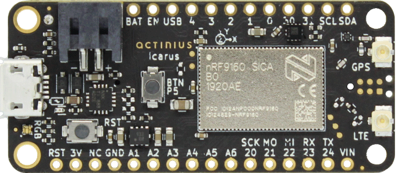
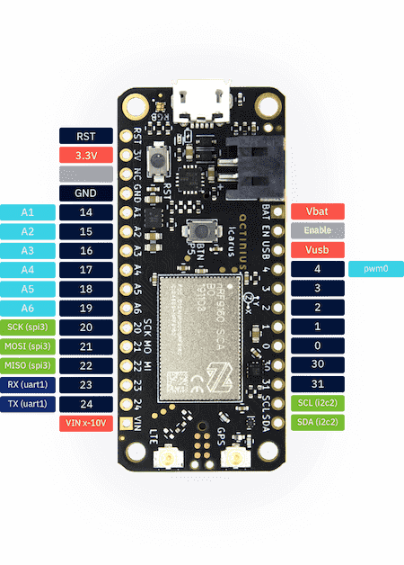
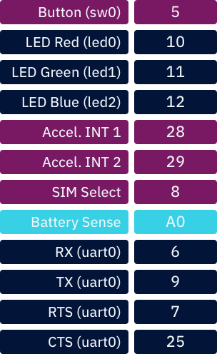

.. _actinius_icarus:

Actinius Icarus
###############

Overview
********

     Icarus IoT Dev Board (nRF9160 Feather)

The Icarus is a cost-effective cellular IoT board in Adafruit's Feather/FeatherWing
form factor. It is built around Nordic Semi's nRF9160 modem and combines
LTE-M, NB-IoT, GPS, accelerometer, USB, LiPo charger as well as
an eSIM and a nano SIM connector.

The main uController is the Nordic Semiconductor nRF9160, with
ARM Cortex-M33F CPU, ARMv8-M Security Extension and the
following devices (provided directly by Nordic):

* :abbr:`ADC (Analog to Digital Converter)`
* CLOCK
* FLASH
* :abbr:`GPIO (General Purpose Input Output)`
* :abbr:`I2C (Inter-Integrated Circuit)`
* :abbr:`MPU (Memory Protection Unit)`
* :abbr:`NVIC (Nested Vectored Interrupt Controller)`
* :abbr:`PWM (Pulse Width Modulation)`
* :abbr:`RTC (nRF RTC System Clock)`
* Segger RTT (RTT Console)
* :abbr:`SPI (Serial Peripheral Interface)`
* :abbr:`UARTE (Universal asynchronous receiver-transmitter with EasyDMA)`
* :abbr:`WDT (Watchdog Timer)`
* :abbr:`IDAU (Implementation Defined Attribution Unit)`

     Icarus IoT Dev Board w/ Pinouts

     Internal Pinouts

Hardware
********

The detailed information about the on-board hardware can be found at the `Icarus Product Website`_.

Supported Features
==================

The actinius_icarus board configuration supports the following
hardware features:

+-----------+------------+----------------------+
| Interface | Controller | Driver/Component     |
+===========+============+======================+
| ADC       | on-chip    | adc                  |
+-----------+------------+----------------------+
| CLOCK     | on-chip    | clock_control        |
+-----------+------------+----------------------+
| FLASH     | on-chip    | flash                |
+-----------+------------+----------------------+
| GPIO      | on-chip    | gpio                 |
+-----------+------------+----------------------+
| I2C(M)    | on-chip    | i2c                  |
+-----------+------------+----------------------+
| MPU       | on-chip    | arch/arm             |
+-----------+------------+----------------------+
| NVIC      | on-chip    | arch/arm             |
+-----------+------------+----------------------+
| PWM       | on-chip    | pwm                  |
+-----------+------------+----------------------+
| SPI(M/S)  | on-chip    | spi                  |
+-----------+------------+----------------------+
| SPU       | on-chip    | system protection    |
+-----------+------------+----------------------+
| UARTE     | on-chip    | serial               |
+-----------+------------+----------------------+
| ACCEL     | st         | lis2dh               |
+-----------+------------+----------------------+

SIM selection
*************

The sim choice (eSIM or nano-SIM) can be configured in Devicetree by adjusting
the ``sim`` property in the ``sim_select`` node.

Security components
===================

- Implementation Defined Attribution Unit (`IDAU`_).  The IDAU is implemented
  with the System Protection Unit and is used to define secure and non-secure
  memory maps.  By default, all of the memory space  (Flash, SRAM, and
  peripheral address space) is defined to be secure accessible only.
- Secure boot.

Building Secure/Non-Secure Zephyr applications
==============================================

The process requires the following steps:

1. Build the Secure Zephyr application using ``-DBOARD=actinius_icarus`` and
   ``CONFIG_TRUSTED_EXECUTION_SECURE=y`` in the application project configuration file.
2. Build the Non-Secure Zephyr application using ``-DBOARD=actinius_icarus_ns``.
3. Merge the two binaries together.

If you are using Segger Embedded Studio v4.18 or later, the two binaries are built, merged, and
burned automatically, unless you have disabled the feature.

When building a Secure/Non-Secure application, the Secure application will
have to set the IDAU (SPU) configuration to allow Non-Secure access to all
CPU resources utilized by the Non-Secure application firmware. SPU
configuration shall take place before jumping to the Non-Secure application.

More information can be found in the `Icarus "Get Started" Guide`_ or the
`Actinius Documentation Portal`_.

References
**********

.. target-notes::

.. _IDAU:
   https://developer.arm.com/docs/100690/latest/attribution-units-sau-and-idau

.. _Icarus Product Website:
   https://www.actinius.com/icarus

.. _Icarus "Get Started" Guide:
   https://www.actinius.com/get-started

.. _Actinius Documentation Portal:
   https://docs.actinius.com
