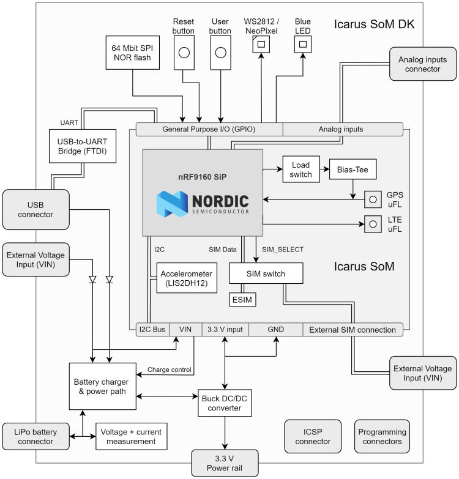

.. _actinius_icarus_som_dk:

Actinius Icarus SoM DK
######################

Overview
********

.. figure:: img/icarus-som-dk.jpg
     :width: 450px
     :align: center
     :alt: Icarus SoM DK

     Icarus SoM Development Kit (nRF9160)

The Icarus SoM DK is a single board development kit for
evaluation and development on the Icarus SoM (`Icarus SoM Docs`_).
The Icarus SoM features the nRF9160 SiP from Nordic Semiconductor,
a low-power 3-axis accelerometer and an on-board eSIM.
The development kit provides interfacing to the SoM through USB-C,
a set of user LEDs, a reset and a user button, a battery charging port,
and a external nano SIM connector.
The board is also Arduino Uno Rev3 compatible which makes
using external shields possible.

The main uController is the Nordic Semiconductor nRF9160, with
ARM Cortex-M33F CPU, ARMv8-M Security Extension and the
following devices (provided directly by Nordic):

* :abbr:`ADC (Analog to Digital Converter)`
* CLOCK
* FLASH
* :abbr:`GPIO (General Purpose Input Output)`
* :abbr:`I2C (Inter-Integrated Circuit)`
* :abbr:`MPU (Memory Protection Unit)`
* :abbr:`NVIC (Nested Vectored Interrupt Controller)`
* :abbr:`PWM (Pulse Width Modulation)`
* :abbr:`RTC (nRF RTC System Clock)`
* Segger RTT (RTT Console)
* :abbr:`SPI (Serial Peripheral Interface)`
* :abbr:`UARTE (Universal asynchronous receiver-transmitter with EasyDMA)`
* :abbr:`WDT (Watchdog Timer)`
* :abbr:`IDAU (Implementation Defined Attribution Unit)`

     Icarus SoM DK Block Diagram

Hardware
********

The detailed information about the on-board hardware can be found at the `Icarus SoM Product Website`_
and the `Icarus SoM DK Product Website`_.

Pin description
===============

External Pins available to user:

+----+-------+------------------------------------+------------------+
| #  | Label | Description                        | Device-tree node |
+====+=======+====================================+==================+
|  1 | NC    | Not Connected                      | -                |
+----+-------+------------------------------------+------------------+
|  2 | IOREF | I/O reference, connected to 3.3V   | -                |
+----+-------+------------------------------------+------------------+
|  3 | RST   | Reset of the nRF9160               | -                |
+----+-------+------------------------------------+------------------+
|  4 | 3.3V  | 3.3V Power output                  | -                |
+----+-------+------------------------------------+------------------+
|  5 | 4.4V  | Power output between Vbat and 4.4V | -                |
+----+-------+------------------------------------+------------------+
|  6 | GND   | Ground pin                         | -                |
+----+-------+------------------------------------+------------------+
|  7 | GND   | Ground pin                         | -                |
+----+-------+------------------------------------+------------------+
|  8 | VIN   | Power input pin (4.35V to 10.5V)   | -                |
+----+-------+------------------------------------+------------------+
|  9 | A2    | AIN2 / nRF9160 P0.15               | gpio0            |
+----+-------+------------------------------------+------------------+
| 10 | A3    | AIN3 / nRF9160 P0.16               | gpio0            |
+----+-------+------------------------------------+------------------+
| 11 | A4    | AIN4 / nRF9160 P0.17               | gpio0            |
+----+-------+------------------------------------+------------------+
| 12 | A5    | AIN5 / nRF9160 P0.18               | gpio0            |
+----+-------+------------------------------------+------------------+
| 13 | A6    | AIN6 / nRF9160 P0.19               | gpio0            |
+----+-------+------------------------------------+------------------+
| 14 | A7    | AIN7 / nRF9160 P0.20               | gpio0            |
+----+-------+------------------------------------+------------------+
| 15 | P4    | nRF9160 P0.04                      | gpio0            |
+----+-------+------------------------------------+------------------+
| 16 | P5    | nRF9160 P0.05                      | gpio0            |
+----+-------+------------------------------------+------------------+
| 17 | P2    | nRF9160 P0.02                      | gpio0            |
+----+-------+------------------------------------+------------------+
| 18 | P1    | nRF9160 P0.01                      | gpio0            |
+----+-------+------------------------------------+------------------+
| 19 | P23   | nRF9160 P0.23                      | gpio0            |
+----+-------+------------------------------------+------------------+
| 20 | P0    | nRF9160 P0.00                      | gpio0            |
+----+-------+------------------------------------+------------------+
| 21 | P26   | nRF9160 P0.26                      | gpio0            |
+----+-------+------------------------------------+------------------+
| 22 | P27   | nRF9160 P0.27                      | gpio0            |
+----+-------+------------------------------------+------------------+
| 23 | P30   | nRF9160 P0.30                      | gpio0            |
+----+-------+------------------------------------+------------------+
| 24 | P31   | nRF9160 P0.31                      | gpio0            |
+----+-------+------------------------------------+------------------+
| 25 | P7    | nRF9160 P0.07                      | gpio0            |
+----+-------+------------------------------------+------------------+
| 26 | P13   | nRF9160 P0.13 or NC (Jumper-dependent) | gpio0        |
+----+-------+------------------------------------+------------------+
| 27 | P14   | nRF9160 P0.14 or NC (Jumper-dependent) | gpio0        |
+----+-------+------------------------------------+------------------+
| 28 | P3    | nRF9160 P0.03                      | gpio0            |
+----+-------+------------------------------------+------------------+
| 29 | GND   | Ground pin                         | -                |
+----+-------+------------------------------------+------------------+
| 30 | AREF  | NC or AIN1 (Jumper-dependent)      | gpio0            |
+----+-------+------------------------------------+------------------+
| 31 | SDA   | I2C SDA pin                        | i2c2             |
+----+-------+------------------------------------+------------------+
| 32 | SCL   | I2C SCL pin                        | i2c2             |
+----+-------+------------------------------------+------------------+
|  - | TS    | Pin for optional battery thermistor| -                |
+----+-------+------------------------------------+------------------+
|  - | CHG   | Pin for battery charging indication| -                |
+----+-------+------------------------------------+------------------+
|  - | CE    | Pin for enabling/disabling charging| -                |
+----+-------+------------------------------------+------------------+

nRF9160 pins connected internally:

+--------------+------------------------------+---------------------+
| nRF9160 pin  | Function                     | Device-tree node    |
+==============+==============================+=====================+
| P0.03        | Blue LED                     | led0 / pwm-led0     |
+--------------+------------------------------+---------------------+
| P0.08        | NeoPixel RGB LED             | spi1                |
+--------------+------------------------------+---------------------+
| P0.12        | SIM select pin               | gpio0               |
+--------------+------------------------------+---------------------+
| P0.23        | Connected to the user button | gpio0 / button0     |
+--------------+------------------------------+---------------------+
| P0.24        | SPI NOR Flash chip select    | gpio0 / spi3        |
+--------------+------------------------------+---------------------+
| P0.28        | Accelerometer Interrupt 2    | lis2dh12-accel      |
+--------------+------------------------------+---------------------+
| P0.29        | Accelerometer Interrupt 1    | lis2dh12-accel      |
+--------------+------------------------------+---------------------+

Supported Features
==================

The actinius_icarus_som_dk board configuration supports the following
hardware features:

+-----------+------------+----------------------+
| Interface | Controller | Driver/Component     |
+===========+============+======================+
| ADC       | on-chip    | adc                  |
+-----------+------------+----------------------+
| CLOCK     | on-chip    | clock_control        |
+-----------+------------+----------------------+
| FLASH     | on-chip    | flash                |
+-----------+------------+----------------------+
| GPIO      | on-chip    | gpio                 |
+-----------+------------+----------------------+
| I2C(M)    | on-chip    | i2c                  |
+-----------+------------+----------------------+
| MPU       | on-chip    | arch/arm             |
+-----------+------------+----------------------+
| NVIC      | on-chip    | arch/arm             |
+-----------+------------+----------------------+
| PWM       | on-chip    | pwm                  |
+-----------+------------+----------------------+
| SPI(M/S)  | on-chip    | spi                  |
+-----------+------------+----------------------+
| SPU       | on-chip    | system protection    |
+-----------+------------+----------------------+
| UARTE     | on-chip    | serial               |
+-----------+------------+----------------------+
| ACCEL     | st         | lis2dh               |
+-----------+------------+----------------------+

SIM selection
*************

The sim choice (eSIM or nano-SIM) can be configured in Devicetree by adjusting
the ``sim`` property in the ``sim_select`` node.

Security components
===================

- Implementation Defined Attribution Unit (`IDAU`_).  The IDAU is implemented
  with the System Protection Unit and is used to define secure and non-secure
  memory maps.  By default, all of the memory space  (Flash, SRAM, and
  peripheral address space) is defined to be secure accessible only.
- Secure boot.

Building Secure/Non-Secure Zephyr applications
==============================================

The process requires the following steps:

1. Build the Secure Zephyr application using ``-DBOARD=actinius_icarus_som_dk``.
2. Build the Non-Secure Zephyr application using ``-DBOARD=actinius_icarus_som_dk_ns``.
3. Merge the two binaries together.

If you are using Segger Embedded Studio v4.18 or later, the two binaries are built, merged, and
burned automatically, unless you have disabled the feature.

When building a Secure/Non-Secure application, the Secure application will
have to set the IDAU (SPU) configuration to allow Non-Secure access to all
CPU resources utilized by the Non-Secure application firmware. SPU
configuration shall take place before jumping to the Non-Secure application.

More information can be found in the `Icarus SoM Product Website`_,
the `Icarus SoM DK Product Website`_ or the `Actinius Documentation Portal`_.

References
**********

.. target-notes::

.. _IDAU:
   https://developer.arm.com/docs/100690/latest/attribution-units-sau-and-idau

.. _Icarus SoM Product Website:
   https://www.actinius.com/icarus-som

.. _Icarus SoM DK Product Website:
   https://www.actinius.com/icarus-som-dk

.. _Icarus SoM Docs:
   https://docs.actinius.com/icarus-som/introduction

.. _Actinius Documentation Portal:
   https://docs.actinius.com
