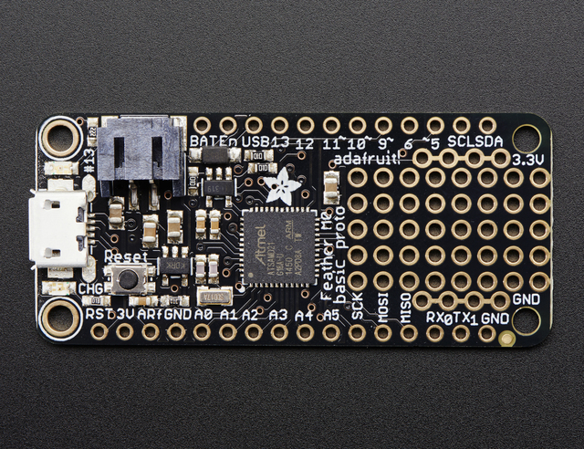

.. _adafruit_feather_m0_basic_proto:

Adafruit Feather M0 Basic Proto
###############################

Overview
********

The Adafruit Feather M0 Basic Proto is a thin, light ARM development
board with an onboard battery connector and charger for 3.7 V lithium
polymer batteries, charging status indicator and user LEDs, native USB
connector, 20 I/O pins, and a small prototyping area.

Hardware
********

- ATSAMD21G18A ARM Cortex-M0+ processor at 48 MHz
- 32.768 kHz crystal oscillator
- 256 KiB flash memory and 32 KiB of RAM
- Battery connector and charger for 3.7 V lithium polymer batteries
- Charging indicator LED
- User LED
- Reset button
- Native USB port

Supported Features
==================

The adafruit_feather_m0_basic_proto board configuration supports the
following hardware features:

+-----------+------------+------------------------------------------+
| Interface | Controller | Driver/Component                         |
+===========+============+==========================================+
| NVIC      | on-chip    | Nested vector interrupt controller       |
+-----------+------------+------------------------------------------+
| Flash     | on-chip    | Can be used with LittleFS to store files |
+-----------+------------+------------------------------------------+
| SYSTICK   | on-chip    | Systick                                  |
+-----------+------------+------------------------------------------+
| WDT       | on-chip    | Watchdog                                 |
+-----------+------------+------------------------------------------+
| GPIO      | on-chip    | I/O ports                                |
+-----------+------------+------------------------------------------+
| USART     | on-chip    | Serial port                              |
+-----------+------------+------------------------------------------+
| I2C       | on-chip    | Inter-Integrated Circuit                 |
+-----------+------------+------------------------------------------+
| SPI       | on-chip    | Serial Peripheral Interface port         |
+-----------+------------+------------------------------------------+
| USB       | on-chip    | USB device                               |
+-----------+------------+------------------------------------------+

Other hardware features are not currently supported by Zephyr.

The default configuration can be found in the Kconfig file
:zephyr_file:`boards/arm/adafruit_feather_m0_basic_proto/adafruit_feather_m0_basic_proto_defconfig`.

Connections and IOs
===================

The `Adafruit Feather M0 Basic Proto Learn site`_ has detailed
information about the board including `pinouts`_ and the `schematic`_.

System Clock
============

The SAMD21 MCU is configured to use the 32.768 kHz external oscillator
with the on-chip PLL generating the 48 MHz system clock.

Serial Port
===========

The SAMD21 MCU has 6 SERCOM based USARTs.  On the Adafruit Feather M0
Basic Proto, SERCOM0 is the Zephyr console and is available on pins 0
(RX) and 1 (TX).

I2C Port
========

The SAMD21 MCU has 6 SERCOM based USARTs.  On the Adafruit Feather M0
Basic Proto, SERCOM3 is available on pin 20 (SDA) and pin 21 (SCL).

SPI Port
========

The SAMD21 MCU has 6 SERCOM based SPIs.  On the Adafruit Feather M0
Basic Proto, SERCOM4 is available on pin 22 (MISO), pin 23 (MOSI), and
pin 24 (SCK).

USB Device Port
===============

The SAMD21 MCU has a USB device port that can be used to communicate
with a host PC.  See the :ref:`usb-samples` sample applications for
more, such as the :zephyr:code-sample:`usb-cdc-acm` sample which sets up a virtual
serial port that echos characters back to the host PC.

Programming and Debugging
*************************

The Adafruit Feather M0 Basic Proto ships with a BOSSA compatible
SAM-BA bootloader.  The bootloader can be entered by quickly tapping
the reset button twice.

Flashing
========

#. Build the Zephyr kernel and the :ref:`hello_world` sample application:

   .. zephyr-app-commands::
      :zephyr-app: samples/hello_world
      :board: adafruit_feather_m0_basic_proto
      :goals: build
      :compact:

#. Connect the Adafruit Feather M0 Basic Proto to your host computer
   using USB

#. Connect a 3.3 V USB to serial adapter to the board and to the
   host.  See the `Serial Port`_ section above for the board's pin
   connections.

#. Run your favorite terminal program to listen for output. Under Linux the
   terminal should be :code:`/dev/ttyACM0`. For example:

   .. code-block:: console

      $ minicom -D /dev/ttyACM0 -o

   The -o option tells minicom not to send the modem initialization
   string. Connection should be configured as follows:

   - Speed: 115200
   - Data: 8 bits
   - Parity: None
   - Stop bits: 1

#. Tap the reset button twice quickly to enter bootloader mode

#. Flash the image:

   .. zephyr-app-commands::
      :zephyr-app: samples/hello_world
      :board: adafruit_feather_m0_basic_proto
      :goals: flash
      :compact:

   You should see "Hello World! adafruit_feather_m0_basic_proto" in your terminal.

References
**********

.. target-notes::

.. _Adafruit Feather M0 Basic Proto Learn site:
    https://learn.adafruit.com/adafruit-feather-m0-basic-proto/

.. _pinouts:
    https://learn.adafruit.com/adafruit-feather-m0-basic-proto/pinouts

.. _schematic:
    https://learn.adafruit.com/adafruit-feather-m0-basic-proto/downloads
