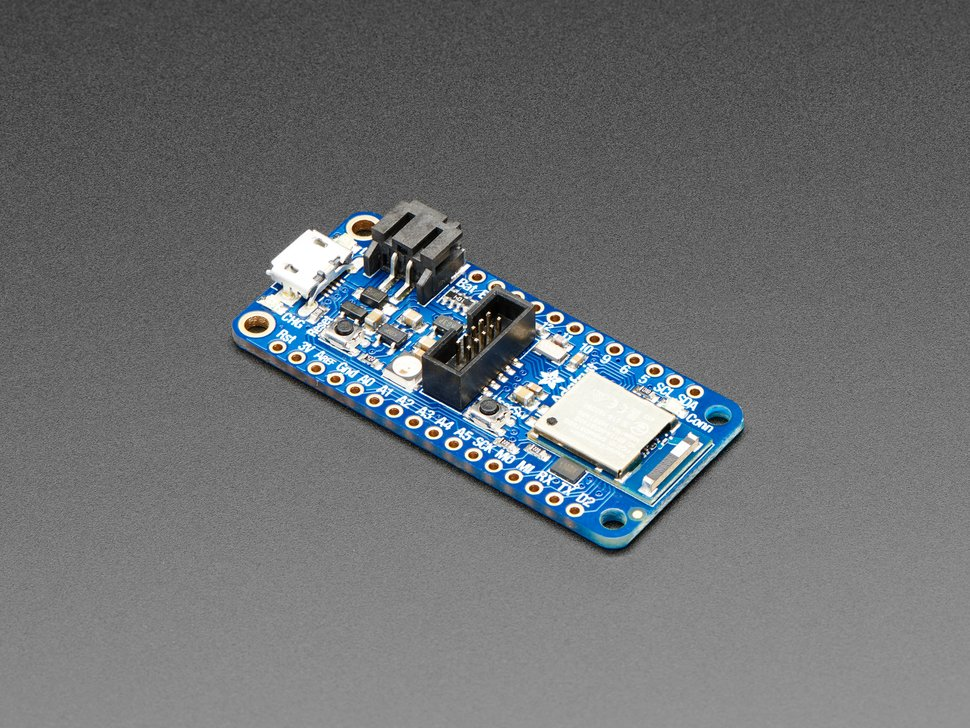

.. _adafruit_feather_nrf52840:

Adafruit Feather nRF52840 Express
#################################

Overview
********

The Adafruit Feather nRF52840 provides support for the Nordic Semiconductor
nRF52840 ARM Cortex-M4F CPU and the following devices:

* :abbr:`ADC (Analog to Digital Converter)`
* CLOCK
* FLASH
* :abbr:`GPIO (General Purpose Input Output)`
* :abbr:`I2C (Inter-Integrated Circuit)`
* :abbr:`MPU (Memory Protection Unit)`
* :abbr:`NVIC (Nested Vectored Interrupt Controller)`
* :abbr:`PWM (Pulse Width Modulation)`
* RADIO (Bluetooth Low Energy and 802.15.4)
* :abbr:`RTC (nRF RTC System Clock)`
* Segger RTT (RTT Console)
* :abbr:`SPI (Serial Peripheral Interface)`
* :abbr:`UART (Universal asynchronous receiver-transmitter)`
* :abbr:`USB (Universal Serial Bus)`
* :abbr:`WDT (Watchdog Timer)`

Hardware
********

- nRF52840 ARM Cortex-M4F processor at 64 MHz
- 1 MB flash memory and 256 KB of SRAM
- Battery connector and charger for 3.7 V lithium polymer batteries
- Charging indicator LED
- 2 User LEDs
- 1 NeoPixel LED
- Reset button
- SWD connector

Supported Features
==================

The Adafruit Feather nRF52840 board configuration supports the
following hardware features:

+-----------+------------+----------------------+
| Interface | Controller | Driver/Component     |
+===========+============+======================+
| ADC       | on-chip    | adc                  |
+-----------+------------+----------------------+
| CLOCK     | on-chip    | clock_control        |
+-----------+------------+----------------------+
| FLASH     | on-chip    | flash                |
+-----------+------------+----------------------+
| GPIO      | on-chip    | gpio                 |
+-----------+------------+----------------------+
| I2C       | on-chip    | i2c                  |
+-----------+------------+----------------------+
| MPU       | on-chip    | arch/arm             |
+-----------+------------+----------------------+
| NVIC      | on-chip    | arch/arm             |
+-----------+------------+----------------------+
| PWM       | on-chip    | pwm                  |
+-----------+------------+----------------------+
| RADIO     | on-chip    | Bluetooth,           |
|           |            | ieee802154           |
+-----------+------------+----------------------+
| RTC       | on-chip    | system clock         |
+-----------+------------+----------------------+
| SPI       | on-chip    | spi                  |
+-----------+------------+----------------------+
| UART      | on-chip    | serial               |
+-----------+------------+----------------------+
| USB       | on-chip    | usb                  |
+-----------+------------+----------------------+
| WDT       | on-chip    | watchdog             |
+-----------+------------+----------------------+

Other hardware features have not been enabled yet for this board.

Connections and IOs
===================

The `Adafruit Feather nRF52840 Express Learn site`_ has detailed
information about the board including `pinouts`_ and the `schematic`_.

LED
---

* LED0 (red) = P1.15
* LED1 (blue) = P1.10

Push buttons
------------

* SWITCH = P1.02
* RESET = P0.18

Programming and Debugging
*************************

Applications for the ``adafruit_feather_nrf52840`` board configuration
can be built and flashed in the usual way (see :ref:`build_an_application`
and :ref:`application_run` for more details).

Flashing
========

Flashing Zephyr onto the ``adafruit_feather_nrf52480`` board requires
an external programmer. The programmer is attached to the SWD header.

Build the Zephyr kernel and the :zephyr:code-sample:`blinky` sample application.

   .. zephyr-app-commands::
      :zephyr-app: samples/basic/blinky
      :board: adafruit_feather_nrf52840
      :goals: build
      :compact:

Flash the image.

   .. zephyr-app-commands::
      :zephyr-app: samples/basic/blinky
      :board: adafruit_feather_nrf52840
      :goals: flash
      :compact:

You should see the the red LED blink.

References
**********

.. target-notes::

.. _Adafruit Feather nRF52840 Express Learn site:
    https://learn.adafruit.com/introducing-the-adafruit-nrf52840-feather/

.. _pinouts:
    https://learn.adafruit.com/introducing-the-adafruit-nrf52840-feather/pinouts

.. _schematic:
    https://learn.adafruit.com/introducing-the-adafruit-nrf52840-feather/downloads
