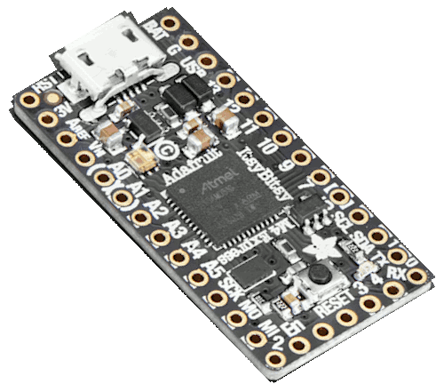

.. _adafruit_itsybitsy_m4_express:

Adafruit ItsyBitsy M4 Express
#############################

Overview
********

The Adafruit ItsyBitsy M4 express is a small (36 mm x 18 mm) ARM development
board with an onboard RGB LED, USB port, 2 MiB of SPI flash, and range of I/O
broken out onto 23 GPIO pins.

Hardware
********

- ATSAMD51G19A ARM Cortex-M4 processor at 120 MHz
- 512 KiB of flash memory and 192 KiB of RAM
- 2 MiB of SPI flash
- Internal trimmed 8 MHz oscillator
- A user LED
- An RGB DotStar LED
- Native USB port
- One reset button

Supported Features
==================

The adafruit_itsybitsy_m4_express board configuration supports the following
hardware features:

+-----------+------------+------------------------------------------+
| Interface | Controller | Driver/Component                         |
+===========+============+==========================================+
| NVIC      | on-chip    | Nested vector interrupt controller       |
+-----------+------------+------------------------------------------+
| SYSTICK   | on-chip    | systick                                  |
+-----------+------------+------------------------------------------+
| WDT       | on-chip    | Watchdog                                 |
+-----------+------------+------------------------------------------+
| GPIO      | on-chip    | I/O ports                                |
+-----------+------------+------------------------------------------+
| USART     | on-chip    | Serial ports                             |
+-----------+------------+------------------------------------------+

Other hardware features are not currently supported by Zephyr.

The default configuration can be found in the Kconfig file
:zephyr_file:`boards/arm/adafruit_itsybitsy_m4_express/adafruit_itsybitsy_m4_express_defconfig`.

Connections and IOs
===================

The `Adafruit Learning System`_ has detailed information about
the board including `pinouts`_ and the `schematic`_.

System Clock
============

The SAMD51 MCU is configured to use the 32 kHz internal oscillator
with the on-chip PLL generating the 120 MHz system clock.

Serial Port
===========

The SAMD51 MCU has 6 SERCOM based USARTs.  On the ItsyBitsy, SERCOM3 is
the Zephyr console and is available on pins 0 (RX) and 1 (TX).

Programming and Debugging
*************************

The ItsyBitsy ships with a the BOSSA compatible UF2 bootloader.  The
bootloader can be entered by quickly tapping the reset button twice.

Flashing
========

#. Build the Zephyr kernel and the :ref:`hello_world` sample application:

   .. zephyr-app-commands::
      :zephyr-app: samples/hello_world
      :board: adafruit_itsybitsy_m4_express
      :goals: build
      :compact:

#. Connect the ItsyBitsy to your host computer using USB

#. Connect a 3.3 V USB to serial adapter to the board and to the
   host.  See the `Serial Port`_ section above for the board's pin
   connections.

#. Run your favorite terminal program to listen for output. Under Linux the
   terminal should be :code:`/dev/ttyUSB0`. For example:

   .. code-block:: console

      $ minicom -D /dev/ttyUSB0 -o

   The -o option tells minicom not to send the modem initialization
   string. Connection should be configured as follows:

   - Speed: 115200
   - Data: 8 bits
   - Parity: None
   - Stop bits: 1

#. Tap the reset button twice quickly to enter bootloader mode

#. Flash the image:

   .. zephyr-app-commands::
      :zephyr-app: samples/hello_world
      :board: adafruit_itsybitsy_m4_express
      :goals: flash
      :compact:

   You should see "Hello World! arm" in your terminal.

References
**********

.. target-notes::

.. _Adafruit Learning System:
    https://learn.adafruit.com/introducing-adafruit-itsybitsy-m4

.. _pinouts:
    https://learn.adafruit.com/introducing-adafruit-itsybitsy-m4/pinouts

.. _schematic:
    https://learn.adafruit.com/introducing-adafruit-itsybitsy-m4/downloads
