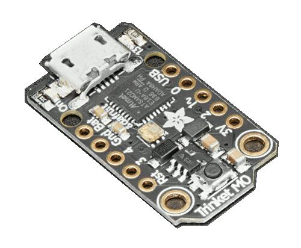

.. _adafruit_trinket_m0:

Adafruit Trinket M0
###################

Overview
********

The Adafruit Trinket M0 is a tiny (27 mm x 15 mm) ARM development
board with an onboard RGB LED, USB port, and range of I/O broken out
onto 5 pins.

Hardware
********

- ATSAMD21E18A ARM Cortex-M0+ processor at 48 MHz
- 256 KiB flash memory and 32 KiB of RAM
- Internal trimmed 8 MHz oscillator
- A user LED
- An RGB DotStar LED
- Native USB port
- One reset button

Supported Features
==================

The adafruit_trinket_m0 board configuration supports the following hardware
features:

+-----------+------------+------------------------------------------+
| Interface | Controller | Driver/Component                         |
+===========+============+==========================================+
| NVIC      | on-chip    | nested vector interrupt controller       |
+-----------+------------+------------------------------------------+
| Flash     | on-chip    | Can be used with LittleFS to store files |
+-----------+------------+------------------------------------------+
| SYSTICK   | on-chip    | systick                                  |
+-----------+------------+------------------------------------------+
| WDT       | on-chip    | Watchdog                                 |
+-----------+------------+------------------------------------------+
| GPIO      | on-chip    | I/O ports                                |
+-----------+------------+------------------------------------------+
| PWM       | on-chip    | Pulse Width Modulation                   |
+-----------+------------+------------------------------------------+
| USART     | on-chip    | Serial ports                             |
+-----------+------------+------------------------------------------+
| SPI       | on-chip    | Serial Peripheral Interface ports        |
+-----------+------------+------------------------------------------+
| USB       | on-chip    | USB device                               |
+-----------+------------+------------------------------------------+

Other hardware features are not currently supported by Zephyr.

The default configuration can be found in the Kconfig file
:zephyr_file:`boards/arm/adafruit_trinket_m0/adafruit_trinket_m0_defconfig`.

Connections and IOs
===================

The `Adafruit Trinket M0 Learn site`_ has detailed information about
the board including `pinouts`_ and the `schematic`_.

System Clock
============

The SAMD21 MCU is configured to use the 8 MHz internal oscillator
with the on-chip PLL generating the 48 MHz system clock.  The internal
APB and GCLK unit are set up in the same way as the upstream Arduino
libraries.

Serial Port
===========

The SAMD21 MCU has 6 SERCOM based USARTs.  On the Trinket, SERCOM0 is
the Zephyr console and is available on pins 3 (RX) and 4 (TX).
SERCOM2 is available on pins 2 (RX) and 0 (TX).

PWM
===

The SAMD21 MCU has 3 TCC based PWM units with up to 4 outputs each and a period
of 24 bits or 16 bits.  If :code:`CONFIG_PWM_SAM0_TCC` is enabled then LED0 is
driven by TCC0 instead of by GPIO.

SPI Port
========

The SAMD21 MCU has 6 SERCOM based SPIs.  On the Trinket, SERCOM1 is
used to drive the DotStar RGB LED.  SERCOM0 can be put into SPI mode
and used to connect to devices over pin 2 (MISO), pin 4 (MOSI), and
pin 3 (SCK).

USB Device Port
===============

The SAMD21 MCU has a USB device port that can be used to communicate
with a host PC.  See the :ref:`usb-samples` sample applications for
more, such as the :ref:`usb_cdc-acm` sample which sets up a virtual
serial port that echos characters back to the host PC.

Programming and Debugging
*************************

The Trinket M0 ships the BOSSA compatible UF2 bootloader.  The
bootloader can be entered by quickly tapping the reset button twice.

Additionally, if :code:`CONFIG_USB_CDC_ACM` is enabled then the bootloader
will be entered automatically when you run :code:`west flash`.

Flashing
========

#. Build the Zephyr kernel and the :ref:`hello_world` sample application:

   .. zephyr-app-commands::
      :zephyr-app: samples/hello_world
      :board: adafruit_trinket_m0
      :goals: build
      :compact:

#. Connect the Trinket M0 to your host computer using USB

#. Connect a 3.3 V USB to serial adapter to the board and to the
   host.  See the `Serial Port`_ section above for the board's pin
   connections.

#. Run your favorite terminal program to listen for output. Under Linux the
   terminal should be :code:`/dev/ttyACM0`. For example:

   .. code-block:: console

      $ minicom -D /dev/ttyACM0 -o

   The -o option tells minicom not to send the modem initialization
   string. Connection should be configured as follows:

   - Speed: 115200
   - Data: 8 bits
   - Parity: None
   - Stop bits: 1

#. Tap the reset button twice quickly to enter bootloader mode

#. Flash the image:

   .. zephyr-app-commands::
      :zephyr-app: samples/hello_world
      :board: adafruit_trinket_m0
      :goals: flash
      :compact:

   You should see "Hello World! arm" in your terminal.

References
**********

.. target-notes::

.. _Adafruit Trinket M0 Learn site:
    https://learn.adafruit.com/adafruit-trinket-m0-circuitpython-arduino

.. _pinouts:
    https://learn.adafruit.com/assets/49778

.. _schematic:
    https://learn.adafruit.com/assets/45723
