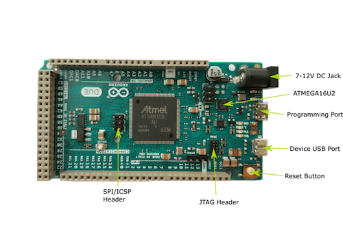

.. _arduino_due:

Arduino Due
###########

Overview
********

The arduino_due board configuration is used by Zephyr applications
that run on the Arduino Due board. It provides support for the Atmel
SAM3X8E ARM Cortex-M3 CPU and the following devices:

* Nested Vectored Interrupt Controller (NVIC)

* System Tick System Clock (SYSTICK)

* Serial Port over USB (ATMEL_SAM3)

More information about the board can be found at the `Arduino Due website`_.
The `Atmel SAM3X8E Datasheet`_ has the information and the datasheet about
the processor.

.. note::
   This configuration is not supported by Arduino.

Hardware
********
Supported Features
==================

The arduino_due board configuration supports the following hardware features:

+-----------+------------+----------------------+
| Interface | Controller | Driver/Component     |
+===========+============+======================+
| NVIC      | on-chip    | nested vectored      |
|           |            | interrupt controller |
+-----------+------------+----------------------+
| SYSTICK   | on-chip    | system clock         |
+-----------+------------+----------------------+
| UART      | on-chip    | serial port          |
+-----------+------------+----------------------+
| GPIO      | on-chip    | gpio                 |
+-----------+------------+----------------------+
| I2C       | on-chip    | i2c                  |
+-----------+------------+----------------------+

Other hardware features are not currently supported by the Zephyr kernel.
See `Arduino Due website`_ and `Atmel SAM3X8E Datasheet`_ for a complete
list of Arduino Due board hardware features.

The default configuration can be found in the Kconfig
:file:`boards/arm/arduino_due/arduino_due_defconfig`.

.. note::
   For I2C, pull-up resistors are required for using SCL1 and SDA1 (near IO13).

Interrupt Controller
====================

There are 15 fixed exceptions including exceptions 12 (debug monitor) and 15
(SYSTICK) that behave more as interrupts than exceptions. In addition, there can
be a variable number of IRQs. Exceptions 7-10 and 13 are reserved. They don't
need handlers.

A Cortex-M3/4-based board uses vectored exceptions. This means each exception
calls a handler directly from the vector table.

Handlers are provided for exceptions 1-6, 11-12, and 14-15.  The table here
identifies the handlers used for each exception.

+------+------------+----------------+-----------------------+
| Exc# | Name       | Remarks        | Used by Zephyr Kernel |
+======+============+================+=======================+
| 1    | Reset      |                | system initialization |
+------+------------+----------------+-----------------------+
| 2    | NMI        |                | system fatal error    |
+------+------------+----------------+-----------------------+
| 3    | Hard fault |                | system fatal error    |
+------+------------+----------------+-----------------------+
| 4    | MemManage  | MPU fault      | system fatal error    |
+------+------------+----------------+-----------------------+
| 5    | Bus        |                | system fatal error    |
+------+------------+----------------+-----------------------+
| 6    | Usage      | undefined      | system fatal error    |
|      | fault      | instruction,   |                       |
|      |            | or switch      |                       |
|      |            | attempt to ARM |                       |
|      |            | mode           |                       |
+------+------------+----------------+-----------------------+
| 11   | SVC        |                | context switch and    |
|      |            |                | software interrupts   |
+------+------------+----------------+-----------------------+
| 12   | Debug      |                | system fatal error    |
|      | monitor    |                |                       |
+------+------------+----------------+-----------------------+
| 14   | PendSV     |                | context switch        |
+------+------------+----------------+-----------------------+
| 15   | SYSTICK    |                | system clock          |
+------+------------+----------------+-----------------------+

.. note::
   After a reset, all exceptions have a priority of 0. Interrupts cannot run
   at priority 0 for the interrupt locking mechanism and exception handling
   to function properly.

System Clock
============

Arduino Due has two external oscillators/resonators. The slow clock is
32.768 kHz, and the main clock is 12 MHz. The processor can set up PLL to drive
the master clock, which can be set as high as 84 MHz.

Serial Port
===========

The Atmel SAM3X8E processor has a single UART that is used by the SAM-BA
bootloader. This UART has only two wires for RX/TX and does not have flow
control (CTS/RTS) or FIFO. The RX/TX pins are connected to the ATmega16U2,
which provides USB-to-TTL serial function. The Zephyr console output, by
default, is utilizing this controller.

Programming and Debugging
*************************

Flashing
========

BOSSA Tool
----------

Flashing the Zephyr kernel onto Arduino Due requires the `bossa tool`_.

There are GUI and command line versions of the bossa tool. The following
section provides the steps to build the command line version. Please
refer to the bossa tool's README file on how to build the GUI version.

To build the bossa tool, follow these steps:

#. Checkout the bossa tool's code from the repository.

   .. code-block:: console

     $ git clone https://github.com/shumatech/BOSSA.git
     $ cd BOSSA

#. Checkout the arduino branch. The code on the master branch does not
   work with Arduino Due.

   .. code-block:: console

     $ git checkout arduino

#. Build the command line version of the bossa tool.

   .. code-block:: console

     $ make bin/bossac

#. The resulting binary is available at :file:`bin/bossac`.

Flashing an Application to Arduino Due
--------------------------------------

The sample application :ref:`hello_world` will be used in this tutorial, which can
be found in :file:`$ZEPHYR_BASE/samples/hello_world`.

#. To build the Zephyr kernel, enter:

   .. code-block:: console

      $ cd $ZEPHYR_BASE
      $ make -C samples/hello_world BOARD=arduino_due

#. Connect the Arduino Due to your host computer using the programming port.

#. Press the Erase button for more than 220 ms.

#. Press the Reset button so the board will boot into the SAM-BA bootloader.

#. To flash the kernel onto Arduino Due, assuming the bossa tool already
   exists. Using the command line version of bossa, enter:

   .. code-block:: console

      $ bossac -p <tty_device> -e -w -v -b outdir/arduino_due/zephyr.bin

   Where :code:`<tty_device>` is where the Arduino Due can be found. For
   example, under Linux, :code:`<tty_device>` should be :code:`ttyACM0`.
   Note that the path :file:`/dev/` is omitted.

#. Run your favorite terminal program to listen for output. For example, under
   Linux, the terminal should be :code:`/dev/ttyACM0`. For example:

   .. code-block:: console

      $ minicom -D /dev/ttyACM0 -o

   The -o option tells minicom not to send the modem initialization
   string.

#. Press the Reset button and you should see "Hello World!" in your terminal.

.. note::
   Make sure your terminal program is closed before flashing the binary image,
   or it will interfere with the flashing process.

References
**********

.. _Arduino Due website: https://www.arduino.cc/en/Main/ArduinoBoardDue

.. _Atmel SAM3X8E Datasheet: http://www.atmel.com/devices/sam3x8e.aspx

.. _bossa tool: https://github.com/shumatech/BOSSA

.. _bossa arduino branch: https://github.com/shumatech/BOSSA/tree/arduino
