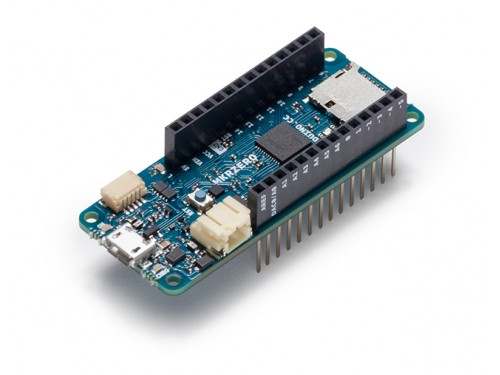
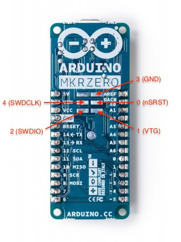

..
  Copyright (c) 2018 Madani Lainani.
  SPDX-License-Identifier: Apache-2.0

.. _arduino_mkrzero:

Arduino MKRZero
###############

Overview
********

The Arduino MKRZero is built around Atmel’s SAMD21 MCU, which features a 32-bit
ARM Cortex M0+ core. The same MCU powers a couple of already supported boards
such as the Arduino/Genuino Zero or the Adafruit Feather M0 Basic Proto.

Hardware
********

- ATSAMD21G18A ARM Cortex-M0+ processor at 48 MHz
- 32.768 kHz crystal oscillator
- 256 KiB flash memory and 32 KiB of RAM
- 1 user LED
- One reset button
- Native USB port

Supported Features
==================

The arduino_mkrzero board configuration supports the following hardware
features:

+-----------+------------+--------------------------------------+
| Interface | Controller | Driver/Component                     |
+===========+============+======================================+
| NVIC      | on-chip    | nested vector interrupt controller   |
+-----------+------------+--------------------------------------+
| Flash     | on-chip    | Can be used with NFFS to store files |
+-----------+------------+--------------------------------------+
| SYSTICK   | on-chip    | systick                              |
+-----------+------------+--------------------------------------+
| WDT       | on-chip    | Watchdog                             |
+-----------+------------+--------------------------------------+
| GPIO      | on-chip    | I/O ports                            |
+-----------+------------+--------------------------------------+
| USART     | on-chip    | Serial ports                         |
+-----------+------------+--------------------------------------+
| I2C       | on-chip    | I2C ports (experimental)             |
+-----------+------------+--------------------------------------+
| EIC       | on-chip    | External Interrupt Controller        |
+-----------+------------+--------------------------------------+

Other hardware features are not currently supported by Zephyr. Note that the
driver for the SPI port is implemented for the SAMD21 but has not been tested as
part of this board's porting effort (SERCOM1 would be configured as the SPI
port).

The default configuration can be found in the Kconfig
:file:`boards/arm/arduino_mkrzero/arduino_mkrzero_defconfig`.

Connections and IOs
===================

The `Arduino store`_ has detailed information about board
connections. Download the `Arduino MKRZero Schematic`_ for more detail.

System Clock
============

The SAMD21 MCU is configured to use the 32.768 kHz external oscillator
with the on-chip PLL generating the 48 MHz system clock.  The internal
APB and GCLK unit are set up in the same way as the upstream Arduino
libraries.

Serial Port
===========

The SAMD21 MCU has 6 SERCOM peripherals, each configurable to operate as either:

- USART
- SPI
- I2C

SERCOM5 is configured as Arduino MKRZero's unique UART interface.

I2C Port
========

SERCOM0 is configured as Arduino MKRZero's unique I2C interface.

EIC
===

The External Interrupt Controller peripheral allows I/O pins to be configured as
interrupt lines. It is enabled from the GPIO driver configuration menu. The
interrupt -to- I/O pin mapping depends on both the MCU device variant pin count
and the peripheral signals multiplexing to the I/O pins for the considered
board. On Atmel SAMD21G for instance, both PA00 and PA16 can be assigned to
external interrupt 0. On the Arduino MKRZero, which is based on this device
variant, PA00 is used for another purpose which leaves the user with PA16 as the
only choice for this particular external interrupt. The value 16 would thus need
to be configured for external interrupt 0. Below is the mapping table for the
Arduino MKRZero. Also note that, unlike for other peripherals, the pin
multiplexing is performed by the GPIO driver as part of the I/O pin
configuration, that is, no code is needed in pinmux.c.

+--------+------------+------------+---------+
| EXTINT | MKRZero Pin| PORT Group | I/O Pin |
+========+============+============+=========+
| 0      |  MOSI      | PORTA      | 16      |
+--------+------------+------------+---------+
| 1      |  SCK       | PORTA      | 17      |
+--------+------------+------------+---------+
| 2      |  A1        | PORTB      | 2       |
+--------+------------+------------+---------+
| 3      |  A2        | PORTB      | 3       |
+--------+------------+------------+---------+
| 4      |  D6        | PORTA      | 20      |
+--------+------------+------------+---------+
| 5      |  D7        | PORTA      | 21      |
+--------+------------+------------+---------+
| 6      |  D0        | PORTA      | 22      |
+--------+------------+------------+---------+
| 7      |  D1        | PORTA      | 23      |
+--------+------------+------------+---------+
| 10     |  D4        | PORTB      | 10      |
+--------+------------+------------+---------+
| 11     |  D5        | PORTB      | 11      |
+--------+------------+------------+---------+

Programming and Debugging
*************************

The board is programmed and debugged with the `Atmel-ICE`_ development tool and
OpenOCD. The board comes **without** the required connector which has thus to be
soldered. It is a 6-pin double row (3 + 3) straight mouting angle SMT connector
with a 2.54mm (0.1") pitch. The numbers in the picture below correspond to the
`Atmel-ICE`_ 10-lead squid cable numbers.

Flashing
========

#. Build the Zephyr kernel and the :ref:`hello_world` sample application:

   .. zephyr-app-commands::
      :zephyr-app: samples/hello_world
      :board: arduino_mkrzero
      :goals: build
      :compact:

#. Connect a `USB to UART cable`_ (3.3V TTL logic level) to the board's RX and TX pins to
   access the console.

#. Connect the `Atmel-ICE`_ programmer using the 10-lead squid cable as described
   in the previous section.

#. Power on the Arduino MKRZero by connecting it to your host computer using the
   USB port for instance.

#. Run your favorite terminal program to listen for output. Under Linux the
   terminal should be :code:`/dev/ttyACM0`. For example:

   .. code-block:: console

      $ minicom -D /dev/ttyACM0 -o

   The -o option tells minicom not to send the modem initialization
   string. Connection should be configured as follows:

   - Speed: 115200
   - Data: 8 bits
   - Parity: None
   - Stop bits: 1

#. To flash an image:

   .. zephyr-app-commands::
      :zephyr-app: samples/hello_world
      :board: arduino_mkrzero
      :goals: flash
      :compact:

   You should see "Hello World! arm" in your terminal.

References
**********

.. target-notes::

.. _Arduino Store:
    https://store.arduino.cc/arduino-mkrzero

.. _Arduino MKRZero Schematic:
    https://www.arduino.cc/en/uploads/Main/ArduinoMKRZero-schematic.pdf

.. _Atmel-ICE:
    https://www.microchip.com/Developmenttools/ProductDetails/ATATMEL-ICE

.. _USB to UART Cable:
    https://www.ftdichip.com/Support/Documents/DataSheets/Cables/DS_TTL-232R_RPi.pdf
