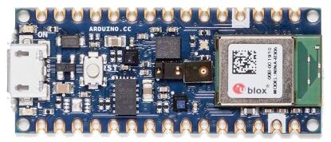

.. _arduino_nano_33_ble:

Arduino Nano 33 BLE (Sense)
#################################

Overview
********

The Arduino Nano 33 BLE is designed around Nordic Semiconductor's
nRF52840 ARM Cortex-M4F CPU. Arduino sells 2 variants of the board, the
plain `BLE`_ type and the `BLE Sense`_ type. The "Sense" variant is distinguished by
the inclusion of more sensors, but otherwise both variants are the same.

The Sense variant of the board

Hardware
********

Supported Features
==================

The package is configured to support the following hardware:

+-----------+------------+----------------------+
| Interface | Controller | Driver/Component     |
+===========+============+======================+
| ADC       | on-chip    | adc                  |
+-----------+------------+----------------------+
| CLOCK     | on-chip    | clock_control        |
+-----------+------------+----------------------+
| FLASH     | on-chip    | flash                |
+-----------+------------+----------------------+
| GPIO      | on-chip    | gpio                 |
+-----------+------------+----------------------+
| I2C0      | on-chip    | i2c                  |
+-----------+------------+----------------------+
| I2C1      | on-chip    | i2c                  |
+-----------+------------+----------------------+
| MPU       | on-chip    | arch/arm             |
+-----------+------------+----------------------+
| NVIC      | on-chip    | arch/arm             |
+-----------+------------+----------------------+
| PWM       | on-chip    | pwm                  |
+-----------+------------+----------------------+
| RADIO     | on-chip    | Bluetooth,           |
|           |            | ieee802154           |
+-----------+------------+----------------------+
| RTC       | on-chip    | system clock         |
+-----------+------------+----------------------+
| SPI       | on-chip    | spi                  |
+-----------+------------+----------------------+
| UART      | on-chip    | serial               |
+-----------+------------+----------------------+
| USB       | on-chip    | usb                  |
+-----------+------------+----------------------+
| WDT       | on-chip    | watchdog             |
+-----------+------------+----------------------+

Other hardware features have not been enabled yet for this board.

Notably, this includes the PDM (microphone) interface.

Connections and IOs
===================

The `schematic`_ will tell you everything
you need to know about the pins.

The I2C pull-ups are enabled by setting pin P1.00 high. This is automatically
done at system init. The pin is specified in the ``zephyr,user`` Devicetree node
as ``pull-up-gpios``.

Programming and Debugging
*************************

This board requires the Arduino variant of bossac. You will not
be able to flash with the bossac included with the zephyr-sdk, or
using shumatech's mainline build.

You can get this variant of bossac with one of two ways:

#. Building the binary from the `Arduino source tree <https://github.com/arduino/BOSSA/tree/nrf>`_
#. Downloading the Arduino IDE

   #. Install the board support package within the IDE
   #. Change your IDE preferences to provide verbose logging
   #. Build and flash a sample application, and read the logs to figure out where Arduino stored bossac.
   #. In most Linux based systems the path is ``$HOME/.arduino15/packages/arduino/tools/bossac/1.9.1-arduino2/bossac``.

Once you have a path to bossac, you can pass it as an argument to west:

.. code-block:: bash

   west flash --bossac="<path to the arduino version of bossac>"

For example

.. code-block:: bash

    west flash --bossac=$HOME/.arduino15/packages/arduino/tools/bossac/1.9.1-arduino2/bossac

On Windows you need to use the :file:`bossac.exe` from the `Arduino IDE`_
You will also need to specify the COM port using the --bossac-port argument:

.. code-block:: bash

    west flash --bossac=%USERPROFILE%\AppData\Local\Arduino15\packages\arduino\tools\bossac\1.9.1-arduino2\bossac.exe --bossac-port="COMx"

Flashing
========

Attach the board to your computer using the USB cable, and then

   .. zephyr-app-commands::
      :zephyr-app: samples/basic/blinky
      :board: arduino_nano_33_ble
      :goals: build
      :compact:

Double-tap the RESET button on your board. Your board should disconnect, reconnect,
and there should be a pulsing orange LED near the USB port.

Then, you can flash the image using the above script.

You should see the the red LED blink.

Debugging
=========

You can debug an application on the board with a debug adapter that supports
CMSIS-DAP. This board has the SWD connector for debugging but exposes it as
a test pad pattern (not a connector) on the back side of the PCB. So, It needs
bit of difficult soldering. At a minimum, SWDIO and SWCLK need soldering (As
shown in the picture). GND, 3.3V, and RESET are also available in the DIP
connector, therefore it may be easier to connect using the DIP connector
instead of soldering to them.

.. image:: img/nano_33_ble_swd.jpg
     :align: center
     :alt: Nano 33 BLE SWD connecting

After connecting the debug adapter, you can debug it the usual way.
Type the following command will start debugging.

.. zephyr-app-commands::
   :zephyr-app: samples/basic/blinky
   :board: arduino_nano_33_ble
   :maybe-skip-config:
   :goals: debug

Debugging with TRACE32 (GDB Front-End)
======================================

Lauterbach provides `GDB Debug version TRACE32 for Arduino Nano 33 BLE`_.
That license ties to Arduino Nano 33 BLE hardware serial number,
it also works with the ZephyrRTOS.

Follow the instruction of the tutorial for Arduino
`Lauterbach TRACE32 GDB Front-End Debugger for Nano 33 BLE`
to install the TRACE32.

After installing the TRACE32, You should set the environmental variable ``T32_DIR``.
If you installed TRACE32 into the home directory, run the following command.
(It is a good idea to put in the login script.)

.. code-block:: bash

    export T32_DIR="~/T32Arduino"

The TRACE32 is `TRACE32 as GDB Front-End`_ version.
Required to run the GDB server before launching TRACE32 with the following command.

.. zephyr-app-commands::
   :zephyr-app: samples/basic/blinky
   :board: arduino_nano_33_ble
   :goals: debugserver
   :compact:

Execute the following command after launching the GDB server to run the TRACE32
and connect the GDB server.

.. code-block:: bash

    west debug --runner=trace32 -- gdbRemote=:3333

The TRACE32 script handles arguments after the ``--`` sign.
You can set the following options.

========== ========== ==================================================================
      Name Required?  Description
---------- ---------- ------------------------------------------------------------------
 gdbRemote  Required  | Set the GDB server address or device file of the serial port.
                      | It can take <hostname>:<port> or <devicename>.
                      | e.g.) ``gdbRemote=localhost:3333``, ``gdbRemote=/dev/ttyACM0``
  terminal  Optional  | Set the device file of the serial port connected to the target console.
                      | e.g.) ``terminal=/dev/ttyACM1``
userScript  Optional  | Set user script that runs after system script execute done.
                      | e.g.) ``userScript="./user.cmm"``
========== ========== ==================================================================

References
**********

.. target-notes::

.. _BLE:
    https://store.arduino.cc/products/arduino-nano-33-ble

.. _BLE SENSE:
    https://store.arduino.cc/products/arduino-nano-33-ble-sense

.. _pinouts:
    https://learn.adafruit.com/introducing-the-adafruit-nrf52840-feather/pinouts

.. _schematic:
    https://content.arduino.cc/assets/NANO33BLE_V2.0_sch.pdf

.. _GDB Debug version TRACE32 for Arduino Nano 33 BLE:
    https://www.lauterbach.com/frames.html?register_arduino.php

.. _Lauterbach TRACE32 GDB Front-End Debugger for Nano 33 BLE:
    https://docs.arduino.cc/tutorials/nano-33-ble-sense/trace-32

.. _TRACE32 as GDB Front-End:
    https://www2.lauterbach.com/pdf/frontend_gdb.pdf

.. _Arduino IDE:
	https://www.arduino.cc/en/Main/Software
