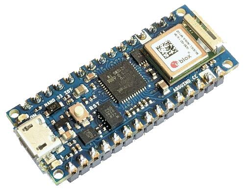

.. _arduino_nano_33_iot:

Arduino Nano 33 IOT
###################

Overview
********

The Arduino Nano 33 IOT is a a small form factor development board with USB,
Wifi, Bluetooth, a 6 axis IMU, and secure element.

Hardware
********

- ATSAMD21G18A ARM Cortex-M0+ processor at 48 MHz
- 256 KiB flash memory and 32 KiB of RAM
- One user LED
- One reset button
- Native USB port
- Wifi and Bluetooth via a u-blox NINA-W102
- ATECC608A secure element
- LSM6DS3 six axis accelerometer and gyro

Supported Features
==================

The arduino_nano_33_iot board configuration supports the following hardware
features:

+-----------+------------+------------------------------------------+
| Interface | Controller | Driver/Component                         |
+===========+============+==========================================+
| ADC       | on-chip    | Analog to digital converter              |
+-----------+------------+------------------------------------------+
| COUNTER   | on-chip    | Pulse counter                            |
+-----------+------------+------------------------------------------+
| DMA       | on-chip    | Direct memory access unit                |
+-----------+------------+------------------------------------------+
| Flash     | on-chip    | Can be used with LittleFS to store files |
+-----------+------------+------------------------------------------+
| GPIO      | on-chip    | I/O ports                                |
+-----------+------------+------------------------------------------+
| HWINFO    | on-chip    | Hardware info and serial number          |
+-----------+------------+------------------------------------------+
| NVIC      | on-chip    | nested vector interrupt controller       |
+-----------+------------+------------------------------------------+
| PWM       | on-chip    | Pulse Width Modulation                   |
+-----------+------------+------------------------------------------+
| SPI       | on-chip    | Serial Peripheral Interface ports        |
+-----------+------------+------------------------------------------+
| SYSTICK   | on-chip    | systick                                  |
+-----------+------------+------------------------------------------+
| USART     | on-chip    | Serial ports                             |
+-----------+------------+------------------------------------------+
| USB       | on-chip    | USB device                               |
+-----------+------------+------------------------------------------+
| WDT       | on-chip    | Watchdog                                 |
+-----------+------------+------------------------------------------+

Other hardware features are not currently supported by Zephyr.

The default configuration can be found in the Kconfig
:zephyr_file:`boards/arm/arduino_nano_33_iot/arduino_nano_33_iot_defconfig`.

Connections and IOs
===================

The `Arduino store`_ has detailed information about board
connections. Download the `schematic`_ for more detail.

System Clock
============

The SAMD21 MCU is configured to use the 8 MHz internal oscillator
with the on-chip PLL generating the 48 MHz system clock.  The internal
APB and GCLK unit are set up in the same way as the upstream Arduino
libraries.

Serial Port
===========

The SAMD21 MCU has 6 SERCOM based USARTs. SERCOM5 is available on pins 1 and 2.

PWM
===

The SAMD21 MCU has 3 TCC based PWM units with up to 4 outputs each and a period
of 24 bits or 16 bits.  If :code:`CONFIG_PWM_SAM0_TCC` is enabled then LED0 is
driven by TCC2 instead of by GPIO.

SPI Port
========

The SAMD21 MCU has 6 SERCOM based SPIs.  SERCOM1 is available on pins 1, 14,
and 15.

USB Device Port
===============

The SAMD21 MCU has a USB device port that can be used to communicate
with a host PC.  See the :ref:`usb-samples` sample applications for
more, such as the :zephyr:code-sample:`usb-cdc-acm` sample which sets up a virtual
serial port that echos characters back to the host PC.

Programming and Debugging
*************************

The Nano 33 IOT ships the BOSSA compatible UF2 bootloader.  The
bootloader can be entered by quickly tapping the reset button twice.

Additionally, if :code:`CONFIG_USB_CDC_ACM` is enabled then the bootloader
will be entered automatically when you run :code:`west flash`.

Flashing
========

#. Build the Zephyr kernel and the :ref:`hello_world` sample application:

   .. zephyr-app-commands::
      :zephyr-app: samples/hello_world
      :board: arduino_nano_33_iot
      :goals: build
      :compact:

#. Connect the Nano 33 IOT to your host computer using USB

#. Connect a 3.3 V USB to serial adapter to the board and to the
   host.  See the `Serial Port`_ section above for the board's pin
   connections.

#. Run your favorite terminal program to listen for output. Under Linux the
   terminal should be :code:`/dev/ttyACM0`. For example:

   .. code-block:: console

      $ minicom -D /dev/ttyACM0 -o

   The -o option tells minicom not to send the modem initialization
   string. Connection should be configured as follows:

   - Speed: 115200
   - Data: 8 bits
   - Parity: None
   - Stop bits: 1

#. Tap the reset button twice quickly to enter bootloader mode

#. Flash the image:

   .. zephyr-app-commands::
      :zephyr-app: samples/hello_world
      :board: arduino_nano_33_iot
      :goals: flash
      :compact:

   You should see "Hello World! arduino_nano_33_iot" in your terminal.

References
**********

.. target-notes::

.. _Arduino Store:
    https://store.arduino.cc/arduino-nano-33-iot

.. _schematic:
    https://content.arduino.cc/assets/NANO33IoTV2.0_sch.pdf
