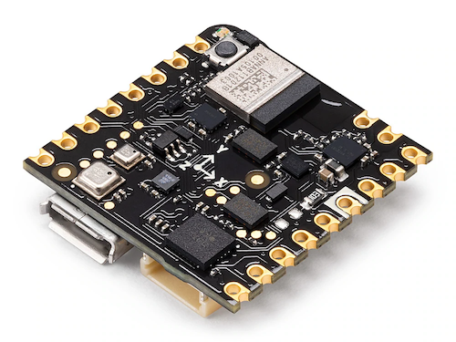
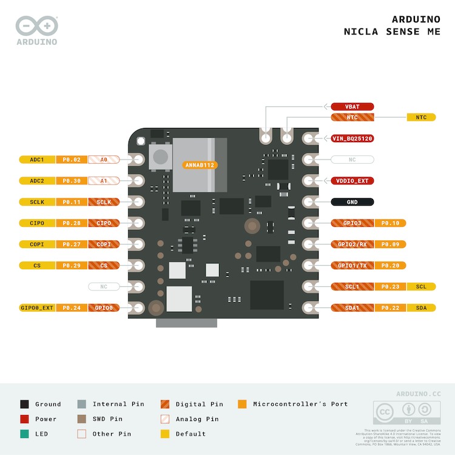

.. _arduino_nicla_sense_me:

Arduino Nicla Sense ME
######################

Overview
********
The `Arduino Nicla Sense ME`_ is designed around Nordic Semiconductor's
nrf52832 ARM Cortex-M4F CPU. The board houses 4 low power industrial grade sensors
that can measure rotation, acceleration, pressure, humidity, temperature, air quality
and CO2 levels.

   Arduino Nicla Sense ME (Credit: Arduino)

Hardware
********

- nRF52832 ARM Cortex-M4 processor at 64 MHz
- 512 kB flash memory, 64 kB SRAM
- Bluetooth Low Energy
- Micro USB (USB-B)
- JST 3-pin 1.2 mm pitch battery connector
- 10 Digital I/O pins
- 2 Analog input pins
- 12 PWM pins
- One reset button
- RGB LED (I2C)
- On board sensors:

  - Accelerometer/Gyroscope: Bosch BHI260AP
  - Gas/Pressure/Temperature/Humidity: Bosch BME688
  - Geomagnetic: Bosch BMM150
  - Digital Pressure: Bosch BMP390

Supported Features
==================

+-----------+------------+----------------------+
| Interface | Controller | Driver/Component     |
+===========+============+======================+
| ADC       | on-chip    | adc                  |
+-----------+------------+----------------------+
| CLOCK     | on-chip    | clock_control        |
+-----------+------------+----------------------+
| FLASH     | on-chip    | flash                |
+-----------+------------+----------------------+
| GPIO      | on-chip    | gpio                 |
+-----------+------------+----------------------+
| I2C(M/S)  | on-chip    | i2c                  |
+-----------+------------+----------------------+
| MPU       | on-chip    | arch/arm             |
+-----------+------------+----------------------+
| NVIC      | on-chip    | arch/arm             |
+-----------+------------+----------------------+
| PWM       | on-chip    | pwm                  |
+-----------+------------+----------------------+
| RADIO     | on-chip    | Bluetooth Low Energy |
+-----------+------------+----------------------+
| RTC       | on-chip    | system clock         |
+-----------+------------+----------------------+
| SPI(M/S)  | on-chip    | spi                  |
+-----------+------------+----------------------+
| UART      | on-chip    | serial               |
+-----------+------------+----------------------+
| WDT       | on-chip    | watchdog             |
+-----------+------------+----------------------+

Connections and IOs
===================

Available pins:
---------------

   Arduino Nicla Sense ME pinout (Credit: Arduino)

For more details please refer to the `datasheet`_, `full pinout`_ and the `schematics`_.

Programming and Debugging
*************************

Applications for the ``arduino_nicla_sense_me`` board configuration can be built and
flashed in the usual way (see :ref:`build_an_application` and
:ref:`application_run` for more details).

Flashing
========

First, connect the Arduino Nicla Sense ME board to your host computer using
the USB port to prepare it for flashing. Then build and flash your application.

Here is an example for the :ref:`hello_world` application.

.. zephyr-app-commands::
   :zephyr-app: samples/hello_world
   :board: arduino_nicla_sense_me
   :goals: build flash

Run a serial host program to connect with your board:

.. code-block:: console

   $ minicom -D /dev/ttyACM0

You should see the following message on the console:

.. code-block:: console

   Hello World! arduino_nicla_sense_me

Debugging
=========

You can debug an application in the usual way.  Here is an example for the
:ref:`hello_world` application.

.. zephyr-app-commands::
   :zephyr-app: samples/hello_world
   :board: arduino_nicla_sense_me
   :goals: debug

References
**********

.. target-notes::

.. _Arduino Nicla Sense ME:
    https://docs.arduino.cc/hardware/nicla-sense-me

.. _datasheet:
   https://docs.arduino.cc/resources/datasheets/ABX00050-datasheet.pdf

.. _full pinout:
    https://docs.arduino.cc/static/60a076271ab009f7be1a7984fa14cf32/ABX00050-full-pinout.pdf

.. _schematics:
    https://docs.arduino.cc/static/aa5abe05aeec6f8b5fe6f3f605a986b5/ABX00050-schematics.pdf
