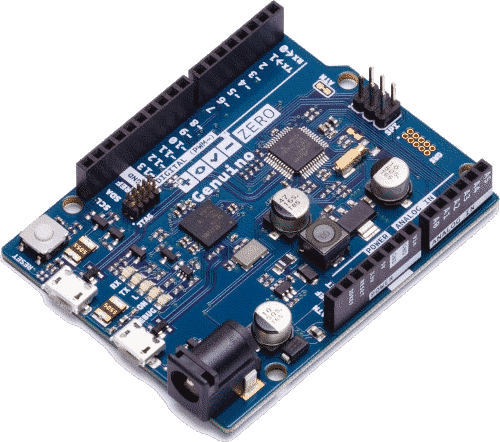

.. _arduino_zero:

Arduino/Genuino Zero
####################

Overview
********

The Arduino Zero is a maker-friendly development board with
Atmel’s Embedded Debugger (EDBG), which provides a full
debug interface without the need for additional hardware.

Hardware
********

- ATSAMD21G18A ARM Cortex-M0+ processor at 48 MHz
- 32.768 kHz crystal oscillator
- 256 KiB flash memory and 32 KiB of RAM
- 3 user LEDs
- One reset button
- On-board USB based EDBG unit with serial console
- Native USB port

Supported Features
==================

The arduino_zero board configuration supports the following hardware
features:

+-----------+------------+--------------------------------------+
| Interface | Controller | Driver/Component                     |
+===========+============+======================================+
| NVIC      | on-chip    | nested vector interrupt controller   |
+-----------+------------+--------------------------------------+
| Flash     | on-chip    | Can be used with NFFS to store files |
+-----------+------------+--------------------------------------+
| SYSTICK   | on-chip    | systick                              |
+-----------+------------+--------------------------------------+
| WDT       | on-chip    | Watchdog                             |
+-----------+------------+--------------------------------------+
| GPIO      | on-chip    | I/O ports                            |
+-----------+------------+--------------------------------------+
| USART     | on-chip    | Serial ports                         |
+-----------+------------+--------------------------------------+
| SPI       | on-chip    | Serial Peripheral Interface ports    |
+-----------+------------+--------------------------------------+
| USB       | on-chip    | USB device                           |
+-----------+------------+--------------------------------------+

Other hardware features are not currently supported by Zephyr.

The default configuration can be found in the Kconfig
:file:`boards/arm/arduino_zero/arduino_zero_defconfig`.

Connections and IOs
===================

The `Arduino store`_ has detailed information about board
connections. Download the `Arduino Zero Schematic`_ for more detail.

System Clock
============

The SAMD21 MCU is configured to use the 32.768 kHz external oscillator
with the on-chip PLL generating the 48 MHz system clock.  The internal
APB and GCLK unit are set up in the same way as the upstream Arduino
libraries.

Serial Port
===========

The SAMD21 MCU has 6 SERCOM based USARTs. One of the USARTs
(SERCOM5) is connected to the onboard Atmel Embedded Debugger (EDBG).
SERCOM0 is available on the D0/D1 pins.

SPI Port
========

The SAMD21 MCU has 6 SERCOM based SPIs.  On the Arduino Zero, SERCOM4
is available on the 6 pin connector at the edge of the board.

USB Device Port
===============

The SAMD21 MCU has a USB device port that can be used to communicate
with a host PC.  See the :ref:`usb-samples` sample applications for
more, such as the :ref:`usb_cdc-acm` sample which sets up a virtual
serial port that echos characters back to the host PC.

Programming and Debugging
*************************

The Arduino Zero comes with a Atmel Embedded Debugger (EDBG).  This
provides a debug interface to the SAMD21 chip and is supported by
OpenOCD.

Flashing
========

#. Build the Zephyr kernel and the :ref:`hello_world` sample application:

   .. zephyr-app-commands::
      :zephyr-app: samples/hello_world
      :board: arduino_zero
      :goals: build
      :compact:

#. Connect the Arduino Zero to your host computer using the USB debug
   port.

#. Run your favorite terminal program to listen for output. Under Linux the
   terminal should be :code:`/dev/ttyACM0`. For example:

   .. code-block:: console

      $ minicom -D /dev/ttyACM0 -o

   The -o option tells minicom not to send the modem initialization
   string. Connection should be configured as follows:

   - Speed: 115200
   - Data: 8 bits
   - Parity: None
   - Stop bits: 1

#. To flash an image:

   .. zephyr-app-commands::
      :zephyr-app: samples/hello_world
      :board: arduino_zero
      :goals: flash
      :compact:

   You should see "Hello World! arm" in your terminal.

References
**********

.. target-notes::

.. _Arduino Store:
    https://store.arduino.cc/genuino-zero

.. _Arduino Zero Schematic:
    https://www.arduino.cc/en/uploads/Main/Zero_V1.0.pdf
