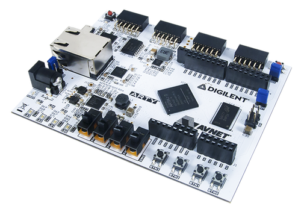

.. _arty:

Digilent Arty
#############

Overview
********

The `Digilent Arty`_ is a line of FPGA-based development boards aimed for makers
and hobbyists. The Arty is available in several configurations, each with a
different Xilinx FPGA (Spartan-7, Artix-7, or Zynq-7000 series).

Each board is equipped with on-board JTAG for FPGA programming and debugging,
LEDs, switches, buttons, DDR3 RAM, and QSPI flash for storing the FPGA
bitstream.

   Digilent Arty A7-35 (Credit: Digilent Inc)

The Spartan-7 and Artix-7 based Arty board do not contain a CPU, but require a
so-called soft processor to be instantiated within the FPGA in order to run
Zephyr. The Zynq-7000 based Arty boards are not yet supported by Zephyr.

ARM Cortex-M1 DesignStart FPGA
******************************

One such soft processor design is the Cortex-M1 `ARM DesignStart FPGA`_ Xilinx
edition reference design from ARM. This design targets the Spartan-7 or Artix-7
based Arty boards. Zephyr only supports the Artix-7 based boards for now.

For more information about the ARM Cortex-M1 DesignStart FPGA, see the following
websites:

- `Technical Resources for DesignStart FPGA`_
- `Technical Resources for DesignStart FPGA on Xilinx`_
- `ARM DesignStart FPGA Xilinx FAQs`_

Supported Features
==================

The ``arty_a7_arm_designstart_m1`` board configuration supports the following
hardware features:

+-----------+------------+-------------------------------------+
| Interface | Controller | Driver/Component                    |
+===========+============+=====================================+
| NVIC      | on-chip    | nested vector interrupt controller  |
+-----------+------------+-------------------------------------+
| SYSTICK   | on-chip    | systick                             |
+-----------+------------+-------------------------------------+
| GPIO      | on-chip    | gpio, non-interrupt                 |
+-----------+------------+-------------------------------------+
| UART      | on-chip    | serial port-polling;                |
|           |            | serial port-interrupt               |
+-----------+------------+-------------------------------------+

The default configuration can be found in the defconfig file:
:file:`boards/arm/arty/arty_a7_arm_designstart_m1_defconfig`. Other hardware
features are not currently supported by the port.

System Clock
============

The reference design is configured to use the 100 MHz external oscillator on the
board as CPU system clock.

Serial Port
===========

The reference design contains one Xilinx UART Lite. This UART is configured as
console and is accessible through the on-board JTAG adapter via USB connector
``J10``.

Connecting the Debug Probes
===========================

Two different debug probes are needed in order to program the board; the
on-board Digilent JTAG connected to the FPGA, and an external Serial Wire Debug
(SWD) capable debug probe connected to the ARM Cortex-M1 CPU.

The on-board JTAG is used for configuring and debugging the Xilinx FPGA
itself. It is available on USB connector ``J10``.

The external SWD debug probe can be connected to connector ``J4`` (``nSRST`` on
``IO39``, ``SWDIO`` on ``IO40``, and ``SWCLK`` on ``IO41``).

Programming and Debugging
*************************

First, configure the FPGA with the reference design FPGA bitstream using Xilinx
Vivado as described in the ARM Cortex-M1 DesignStart FPGA Xilinx edition user
guide (available as part of the reference design download from `Technical
Resources for DesignStart FPGA on Xilinx`_).

Another option for configuring the FPGA with the reference design bitstream is
to use the :ref:`openocd-debug-host-tools`:

.. code-block:: console

   openocd -f board/arty_s7.cfg -c "init;\
        pld load 0 m1_for_arty_a7_reference.bit;\
        shutdown"

Next, build and flash applications as usual (see :ref:`build_an_application` and
:ref:`application_run` for more details).

Configuring a Console
=====================

The UART console is available via the on-board JTAG on USB connector
``J10``. The on-board JTAG will enumerate as two USB serial ports. The UART is
typically available on the second serial port.

Use the following settings with your serial terminal of choice (minicom, putty,
etc.):

- Speed: 115200
- Data: 8 bits
- Parity: None
- Stop bits: 1

Flashing
========

Here is an example for the :ref:`hello_world` application.

.. zephyr-app-commands::
   :zephyr-app: samples/hello_world
   :board: arty_a7_arm_designstart_m1
   :goals: flash

After flashing, you should see message similar to the following in the terminal:

.. code-block:: console

   *** Booting Zephyr OS build zephyr-v2.3.99  ***
   Hello World! arty_a7_arm_designstart_m1

Note, however, that the application was not persisted in flash memory by the
above steps. It was merely written to internal block RAM in the FPGA. It will
revert to the application stored in the block RAM within the FPGA bitstream
the next time the FPGA is configured.

The steps to persist the application within the FPGA bitstream are covered by
the ARM Cortex-M1 DesignStart FPGA Xilinx edition user guide. If the
:option:`CONFIG_BUILD_OUTPUT_BIN` is enabled and the `SiFive elf2hex`_ package
is available, the build system will automatically generate a Verilog memory hex
dump :file:`zephyr.mem` file suitable for initialising the block RAM using
`Xilinx Vivado`_.

Debugging
=========

Here is an example for the :ref:`hello_world` application.

.. zephyr-app-commands::
   :zephyr-app: samples/hello_world
   :board: arty_a7_arm_designstart_m1
   :goals: debug

Step through the application in your debugger, and you should see a message
similar to the following in the terminal:

.. code-block:: console

   *** Booting Zephyr OS build zephyr-v2.3.99  ***
   Hello World! arty_a7_arm_designstart_m1

.. _Digilent Arty:
   https://store.digilentinc.com/arty

.. _ARM DesignStart FPGA:
   https://www.arm.com/resources/designstart/designstart-fpga

.. _Technical Resources for DesignStart FPGA:
   https://developer.arm.com/ip-products/designstart/fpga

.. _Technical Resources for DesignStart FPGA on Xilinx:
   https://developer.arm.com/ip-products/designstart/fpga/fpga-xilinx

.. _ARM DesignStart FPGA Xilinx FAQs:
   https://developer.arm.com/ip-products/designstart/fpga/fpga-xilinx-faqs

.. _SiFive elf2hex:
   https://github.com/sifive/elf2hex

.. _Xilinx Vivado:
   https://www.xilinx.com/products/design-tools/vivado.html
